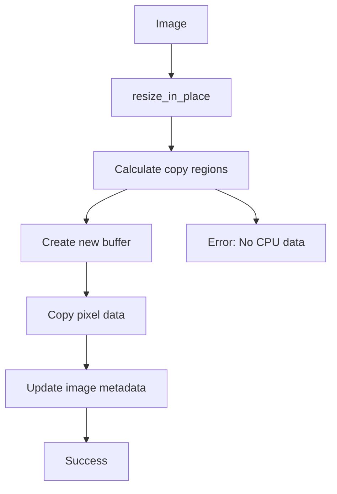

+++
title = "#19410 Add `resize_in_place` to `Image`"
date = "2025-05-31T00:00:00"
draft = false
template = "pull_request_page.html"
in_search_index = true

[taxonomies]
list_display = ["show"]

[extra]
current_language = "en"
available_languages = {"en" = { name = "English", url = "/pull_request/bevy/2025-05/pr-19410-en-20250531" }, "zh-cn" = { name = "中文", url = "/pull_request/bevy/2025-05/pr-19410-zh-cn-20250531" }}
labels = ["C-Feature", "A-Rendering", "C-Performance"]
+++

## Title: Add `resize_in_place` to `Image`

## Basic Information
- **Title**: Add `resize_in_place` to `Image`
- **PR Link**: https://github.com/bevyengine/bevy/pull/19410
- **Author**: rparrett
- **Status**: MERGED
- **Labels**: C-Feature, A-Rendering, C-Performance, S-Ready-For-Final-Review
- **Created**: 2025-05-28T14:02:02Z
- **Merged**: 2025-05-31T22:15:39Z
- **Merged By**: alice-i-cecile

## The Story of This Pull Request

### The Problem and Context
The font atlas system in Bevy creates a new 512x512 texture atlas each time one fills up. With large font sizes and many glyphs, this causes glyphs to spread across multiple textures, reducing rendering efficiency. Batching performance suffers when text draws require switching between multiple textures. The existing `AtlasAllocator` supports growing atlases, but Bevy lacked a way to resize textures while preserving pixel data. The `Image::resize()` method only pads or truncates image data with zeros, destroying existing content.

### The Solution Approach
We added a `resize_in_place()` method to the `Image` type that preserves existing pixel data when resizing. The implementation copies valid pixel regions from the original image to a new buffer, anchoring content at the top-left corner. New areas are filled with zeros (typically transparent pixels). The method supports both 2D textures and texture arrays (3D).

### The Implementation
The core implementation calculates copy regions based on minimum dimensions between old and new sizes. It handles texture stride calculations and copies pixel rows layer-by-layer:

```rust
pub fn resize_in_place(&mut self, new_size: Extent3d) -> Result<(), ResizeError> {
    let old_size = self.texture_descriptor.size;
    let pixel_size = self.texture_descriptor.format.pixel_size();
    let byte_len = self.texture_descriptor.format.pixel_size() * new_size.volume();

    let Some(ref mut data) = self.data else {
        return Err(ResizeError::ImageWithoutData);
    };

    let mut new: Vec<u8> = vec![0; byte_len];

    // Calculate copy dimensions
    let copy_width = old_size.width.min(new_size.width) as usize;
    let copy_height = old_size.height.min(new_size.height) as usize;
    let copy_depth = old_size
        .depth_or_array_layers
        .min(new_size.depth_or_array_layers) as usize;

    // Stride calculations
    let old_row_stride = old_size.width as usize * pixel_size;
    let old_layer_stride = old_size.height as usize * old_row_stride;
    let new_row_stride = new_size.width as usize * pixel_size;
    let new_layer_stride = new_size.height as usize * new_row_stride;

    // Copy pixel data
    for z in 0..copy_depth {
        for y in 0..copy_height {
            let old_offset = z * old_layer_stride + y * old_row_stride;
            let new_offset = z * new_layer_stride + y * new_row_stride;
            let old_range = (old_offset)..(old_offset + copy_width * pixel_size);
            let new_range = (new_offset)..(new_offset + copy_width * pixel_size);
            new[new_range].copy_from_slice(&data[old_range]);
        }
    }

    self.data = Some(new);
    self.texture_descriptor.size = new_size;
    Ok(())
}
```

### Technical Insights
Key aspects:
1. **Memory Safety**: Explicitly handles texture format pixel sizes to prevent buffer overflows
2. **Efficiency**: Copies contiguous memory ranges instead of pixel-by-pixel
3. **Error Handling**: Introduces `ResizeError::ImageWithoutData` for images without CPU-side data
4. **API Design**: Complements existing `resize()` method with clear documentation about their different use cases

### The Impact
This enables efficient font atlas resizing without recreating textures. For a 512x512 RGBA texture, resizing avoids re-uploading 1MB of texture data to the GPU. The change also benefits other systems needing to preserve pixel data during resizing operations. Two comprehensive tests validate functionality for both 2D and 3D textures across grow/shrink operations.

## Visual Representation



## Key Files Changed

### `crates/bevy_image/src/image.rs` (+225/-0)

**Purpose**: Implement `resize_in_place` functionality with tests

**Key Changes**:
1. New method implementation:
```rust
/// Resizes the image to the new size, keeping the pixel data intact, anchored at the top-left.
/// When growing, the new space is filled with 0. When shrinking, the image is clipped.
///
/// For faster resizing when keeping pixel data intact is not important, use [`Image::resize`].
pub fn resize_in_place(&mut self, new_size: Extent3d) -> Result<(), ResizeError> {
    // Implementation as shown above
}
```

2. New error type:
```rust
#[derive(Error, Debug)]
pub enum ResizeError {
    #[error("resize method requires cpu-side image data but none was present")]
    ImageWithoutData,
}
```

3. Comprehensive test cases:
```rust
#[test]
fn resize_in_place_2d_grow_and_shrink() {
    // Tests 2D texture resizing with pattern validation
}

#[test]
fn resize_in_place_array_grow_and_shrink() {
    // Tests 3D texture array resizing
}
```

## Further Reading
- [Bevy Texture Atlas Documentation](https://docs.rs/bevy/latest/bevy/render/texture/struct.TextureAtlas.html)
- [WGPU Texture Concepts](https://wgpu.rs/wgpu/texture/index.html)
- [Texture Resizing Techniques](https://github.com/gfx-rs/wgpu/wiki/Texture-Resizing-Tradeoffs)