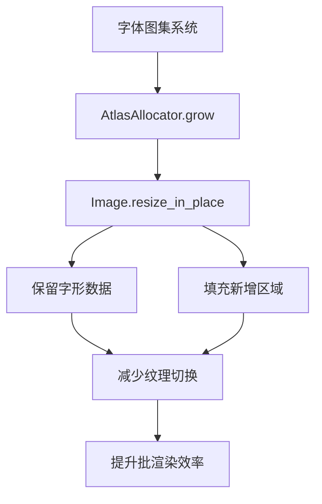

+++
title = "#19410 Add `resize_in_place` to `Image"
date = "2025-05-31T00:00:00"
draft = false
template = "pull_request_page.html"
in_search_index = false

[extra]
current_language = "zh-cn"
available_languages = {"en" = { name = "English", url = "/pull_request/bevy/2025-05/pr-19410-en-20250531" }, "zh-cn" = { name = "中文", url = "/pull_request/bevy/2025-05/pr-19410-zh-cn-20250531" }}
+++

# 分析报告：Add `resize_in_place` to `Image` (PR #19410)

## 基本信息
- **标题**: Add `resize_in_place` to `Image`
- **PR链接**: https://github.com/bevyengine/bevy/pull/19410
- **作者**: rparrett
- **状态**: 已合并
- **标签**: C-Feature, A-Rendering, C-Performance, S-Ready-For-Final-Review
- **创建时间**: 2025-05-28T14:02:02Z
- **合并时间**: 2025-05-31T22:15:39Z
- **合并人**: alice-i-cecile

## 问题与背景
当前Bevy的字体图集(font atlas)系统存在性能瓶颈：每当一个512×512的图集填满时，系统会创建全新的图集。当处理大字体或大量字形时，这会导致字形分散在多个图集中。这种分散增加了渲染批次(render batches)，降低了渲染效率。虽然`AtlasAllocator`支持图集增长，但现有`Image::resize`方法会破坏像素数据，无法满足保留字形信息的需求。

核心问题：缺少在保留现有像素数据的前提下调整图像尺寸的方法。

## 解决方案
实现了新的`Image::resize_in_place`方法，其特点：
1. 保留原始像素数据，仅扩展或裁剪图像边界
2. 新增区域填充0值（透明黑色）
3. 支持2D和3D/数组纹理
4. 包含明确的错误处理（当图像无CPU端数据时）

## 实现细节
### 核心算法
方法计算新旧尺寸重叠区域，逐层逐行复制像素数据：
```rust
pub fn resize_in_place(&mut self, new_size: Extent3d) -> Result<(), ResizeError> {
    // 计算像素尺寸和所需缓冲区大小
    let pixel_size = self.texture_descriptor.format.pixel_size();
    let byte_len = pixel_size * new_size.volume();
    
    // 创建新缓冲区并初始化为0
    let mut new: Vec<u8> = vec![0; byte_len];
    
    // 计算可复制的区域（取新旧尺寸最小值）
    let copy_width = old_size.width.min(new_size.width) as usize;
    let copy_height = old_size.height.min(new_size.height) as usize;
    
    // 计算行列跨距
    let old_row_stride = old_size.width as usize * pixel_size;
    let new_row_stride = new_size.width as usize * pixel_size;
    
    // 逐行复制重叠区域
    for y in 0..copy_height {
        let old_offset = y * old_row_stride;
        let new_offset = y * new_row_stride;
        let range = ..(copy_width * pixel_size);
        new[new_offset..][range].copy_from_slice(&data[old_offset..][range]);
    }
    
    // 更新图像数据和尺寸元数据
    self.data = Some(new);
    self.texture_descriptor.size = new_size;
    Ok(())
}
```

### 错误处理
新增`ResizeError`枚举，明确处理无数据情况：
```rust
#[derive(Error, Debug)]
pub enum ResizeError {
    #[error("resize method requires cpu-side image data but none was present")]
    ImageWithoutData,
}
```

## 测试验证
添加了两个全面测试用例：

1. **2D图像测试** (`resize_in_place_2d_grow_and_shrink`):
   - 验证增长时保留原始像素
   - 验证新增区域填充0
   - 验证缩小后超界像素访问报错

2. **数组纹理测试** (`resize_in_place_array_grow_and_shrink`):
   - 验证多层纹理的深度维度调整
   - 测试层增加/减少时的数据保留
   - 验证跨层像素访问边界

测试使用模式化数据并断言具体像素值：
```rust
// 设置测试像素
image.set_color_at(1, 0, Color::BLUE).unwrap();

// 调整尺寸后验证
assert_eq!(
    image.get_color_at(1, 0).unwrap(),
    Color::BLUE
);
```

## 性能考量
1. **内存效率**：避免创建临时副本，直接操作现有缓冲区
2. **算法复杂度**：O(n)复杂度，仅复制重叠区域
3. **填充优化**：使用`vec![0; byte_len]`比手动填充更高效

## 影响与改进
1. **字体渲染优化**：为动态调整字体图集打下基础，减少纹理切换
2. **API扩展**：提供`resize`和`resize_in_place`两种场景化方法
3. **文档完善**：明确方法差异和使用场景：
   ```rust
   /// If you need to keep pixel data intact, use [`Image::resize_in_place`]
   pub fn resize(&mut self, size: Extent3d) { ... }
   ```

## 替代方案考虑
作者评估过替代方案：
1. 增大初始图集尺寸 - 可能造成内存浪费
2. 使尺寸可配置 - 缺乏动态性
3. 基于设备限制调整 - 实现复杂且不通用

`resize_in_place`提供了最灵活的解决方案。

## 关键文件变更
### `crates/bevy_image/src/image.rs`
1. 新增`resize_in_place`方法实现
2. 添加`ResizeError`错误类型
3. 增加两个全面测试用例
4. 更新`resize`文档指向新方法

```diff
+ pub fn resize_in_place(&mut self, new_size: Extent3d) -> Result<(), ResizeError> {
+     // 实现细节...
+ }
+
+ #[derive(Error, Debug)]
+ pub enum ResizeError {
+     #[error("resize method requires cpu-side image data but none was present")]
+     ImageWithoutData,
+ }
+
+ #[test]
+ fn resize_in_place_2d_grow_and_shrink() {
+     // 测试逻辑...
+ }
```

## 图示关系


## 延伸阅读
1. [Bevy渲染管线架构](https://bevyengine.org/learn/book/introduction/)
2. [纹理图集优化技术](https://www.gamedeveloper.com/programming/improving-sprite-batching-with-texture-atlases)
3. [Rust的Vec内存布局](https://doc.rust-lang.org/std/vec/struct.Vec.html#guarantees)