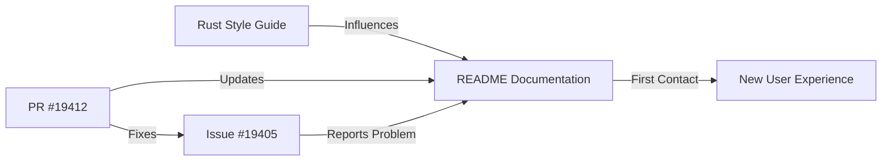

+++
title = "#19412 Update example in README to have proper Rusty formatting"
date = "2025-05-28T00:00:00"
draft = false
template = "pull_request_page.html"
in_search_index = true

[taxonomies]
list_display = ["show"]

[extra]
current_language = "en"
available_languages = {"en" = { name = "English", url = "/pull_request/bevy/2025-05/pr-19412-en-20250528" }, "zh-cn" = { name = "中文", url = "/pull_request/bevy/2025-05/pr-19412-zh-cn-20250528" }}
labels = ["C-Docs", "D-Trivial"]
+++

# Analysis of PR #19412: Update example in README to have proper Rusty formatting

## Basic Information
- **Title**: Update example in README to have proper Rusty formatting
- **PR Link**: https://github.com/bevyengine/bevy/pull/19412
- **Author**: FlippinBerger
- **Status**: MERGED
- **Labels**: C-Docs, D-Trivial, S-Ready-For-Final-Review
- **Created**: 2025-05-28T17:17:56Z
- **Merged**: 2025-05-28T19:06:06Z
- **Merged By**: alice-i-cecile

## Description Translation
Fixes #19405

## The Story of This Pull Request

The issue began with a minor formatting inconsistency in Bevy's README documentation. When new developers visit the repository, the README serves as their first introduction to both the engine and its coding standards. The initial example code snippet contained a formatting issue where a space was missing between the function signature and opening brace in the `main()` function definition:

```rust
fn main(){
```

This violated Rust's official style guidelines as defined in the Rust Style Guide (also enforced by rustfmt), which requires a space before the opening brace of function definitions. While syntactically correct and functionally identical, this formatting oversight created two problems:

1. **First impressions**: New users copying this example might adopt non-standard formatting in their own projects
2. **Consistency**: Bevy's examples should demonstrate idiomatic Rust practices

The solution was straightforward but important: add the missing space to align with standard Rust formatting conventions. The developer implemented a minimal change to the README.md file, modifying just one line:

```rust
fn main() {
```

This change ensures that:
- The example complies with Rust's style conventions
- New users see properly formatted code from their first interaction
- Bevy presents itself as a project that values code quality and consistency

The fix addresses issue #19405, which specifically pointed out this formatting inconsistency. The change was trivial to implement but maintains Bevy's professional presentation. For projects like Bevy that target both game developers and Rust enthusiasts, maintaining proper code examples in documentation helps establish credibility and lowers the barrier to entry.

## Visual Representation



## Key Files Changed

### `README.md`
**Change Description**: Corrected formatting in code example to match Rust style conventions  
**Why**: To present idiomatic Rust examples to new users and maintain consistency with Rust style guidelines  

**Code Change**:
```diff
diff --git a/README.md b/README.md
index be1bcf6bfec92..1daeadda5d3d7 100644
--- a/README.md
+++ b/README.md
@@ -75,7 +75,7 @@ To draw a window with standard functionality enabled, use:
 ```rust
 use bevy::prelude::*;
 
-fn main(){
+fn main() {
   App::new()
     .add_plugins(DefaultPlugins)
     .run();
```

**Relation to PR Purpose**: This single-character change implements the entire purpose of the PR - fixing the formatting inconsistency in the README example

## Further Reading
1. [The Rust Style Guide](https://doc.rust-lang.org/1.75.0/style-guide/)
2. [rustfmt - Rust's official code formatter](https://github.com/rust-lang/rustfmt)
3. [Bevy's Contribution Guidelines](https://github.com/bevyengine/bevy/blob/main/CONTRIBUTING.md)
4. [Effective Rust Documentation Practices](https://doc.rust-lang.org/rustdoc/how-to-write-documentation.html)