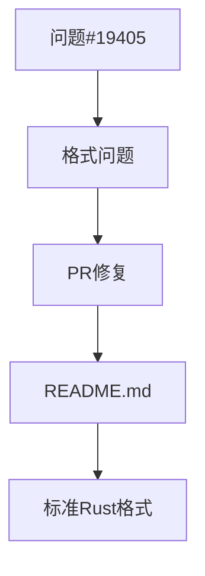

+++
title = "#19412 Update example in README to have proper Rusty formatting"
date = "2025-05-28T00:00:00"
draft = false
template = "pull_request_page.html"
in_search_index = false

[extra]
current_language = "zh-cn"
available_languages = {"en" = { name = "English", url = "/pull_request/bevy/2025-05/pr-19412-en-20250528" }, "zh-cn" = { name = "中文", url = "/pull_request/bevy/2025-05/pr-19412-zh-cn-20250528" }}
+++

# PR #19412: Update example in README to have proper Rusty formatting

## Basic Information
- **标题**: Update example in README to have proper Rusty formatting
- **PR链接**: https://github.com/bevyengine/bevy/pull/19412
- **作者**: FlippinBerger
- **状态**: 已合并
- **标签**: C-Docs, D-Trivial, S-Ready-For-Final-Review
- **创建时间**: 2025-05-28T17:17:56Z
- **合并时间**: 2025-05-28T19:06:06Z
- **合并者**: alice-i-cecile

## 描述翻译
修复 #19405

## 本次PR的技术分析

### 问题与背景
在Bevy引擎的README文档中，存在一个代码格式问题。示例代码中的`main`函数声明缺少Rust标准格式要求的空格：
```rust
fn main(){
```
这种格式不符合Rust的惯用风格(idiomatic style)，可能给新用户带来困惑。问题#19405专门报告了这个问题。对于开源项目，文档中的代码示例代表项目质量，格式一致性对用户体验至关重要。

### 解决方案
PR采用直接修复方式：在`main`函数名和参数括号之间添加空格，并在左花括号前添加空格。修改后符合标准Rust格式：
```rust
fn main() {
```
这种修改：
1. 严格遵循Rust官方风格指南
2. 保持与项目其他文档的一致性
3. 避免用户复制粘贴时引入格式问题

### 实现细节
修改仅涉及README.md文件的单行变更：
```diff
- fn main(){
+ fn main() {
```
这个微小但重要的改动：
1. 修复了函数声明的格式问题
2. 保持了示例的功能不变
3. 提高了代码示例的可读性

### 技术影响
- **用户体验**：新用户首次接触项目时看到的代码示例符合Rust标准
- **贡献引导**：展示了项目对代码质量的重视
- **维护成本**：零运行时影响，纯文档改进
- **社区规范**：强化了项目遵循Rust最佳实践的印象

## 可视化表示


## 关键文件变更

### README.md
**变更说明**：修复代码示例中的函数声明格式问题，使其符合Rust标准风格。

**代码变更**：
```diff
# File: README.md
# Before:
use bevy::prelude::*;

fn main(){
  App::new()
    .add_plugins(DefaultPlugins)
    .run();
}

# After:
use bevy::prelude::*;

fn main() {
  App::new()
    .add_plugins(DefaultPlugins)
    .run();
}
```

**关联性**：这是PR的唯一变更，直接解决问题#19405中报告的具体问题。

## 延伸阅读
1. [Rust风格指南](https://doc.rust-lang.org/1.0.0/style/style/naming/README.html)
2. [Bevy贡献指南](https://github.com/bevyengine/bevy/blob/main/CONTRIBUTING.md)
3. [Rust API指南](https://rust-lang.github.io/api-guidelines/naming.html)

## 完整代码差异
```diff
diff --git a/README.md b/README.md
index be1bcf6bfec92..1daeadda5d3d7 100644
--- a/README.md
+++ b/README.md
@@ -75,7 +75,7 @@ To draw a window with standard functionality enabled, use:
 ```rust
 use bevy::prelude::*;
 
-fn main(){
+fn main() {
   App::new()
     .add_plugins(DefaultPlugins)
     .run();
```