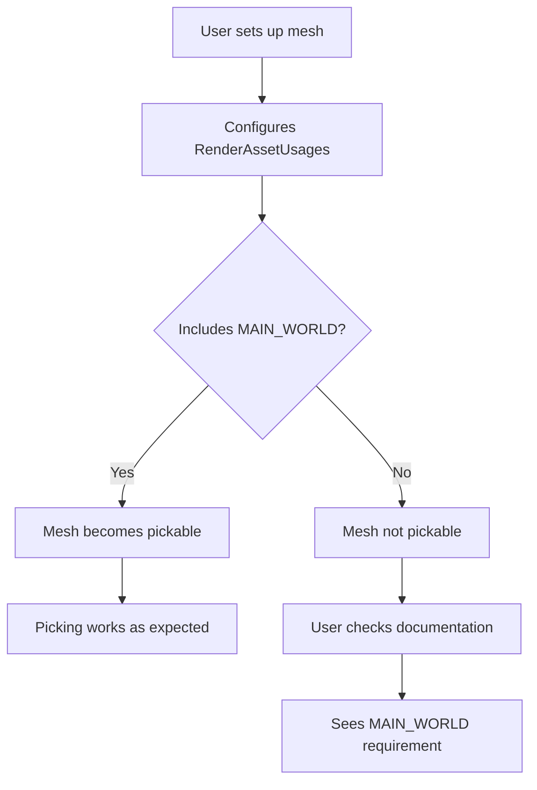

+++
title = "#19413 Updating mesh_picking doc to include RenderAssetUsages"
date = "2025-05-29T00:00:00"
draft = false
template = "pull_request_page.html"
in_search_index = true

[taxonomies]
list_display = ["show"]

[extra]
current_language = "en"
available_languages = {"en" = { name = "English", url = "/pull_request/bevy/2025-05/pr-19413-en-20250529" }, "zh-cn" = { name = "中文", url = "/pull_request/bevy/2025-05/pr-19413-zh-cn-20250529" }}
labels = ["C-Docs", "D-Trivial", "A-Picking"]
+++

### Updating mesh_picking doc to include RenderAssetUsages

## Basic Information
- **Title**: Updating mesh_picking doc to include RenderAssetUsages
- **PR Link**: https://github.com/bevyengine/bevy/pull/19413
- **Author**: andristarr
- **Status**: MERGED
- **Labels**: C-Docs, D-Trivial, S-Ready-For-Final-Review, A-Picking
- **Created**: 2025-05-28T18:07:47Z
- **Merged**: 2025-05-29T19:04:05Z
- **Merged By**: alice-i-cecile

## Description Translation
# Objective
Fixes #19102 

Updating mesh_picking doc stating that MAIN_WORLD  RenderAssetUsages needs to be on the mesh to be picked.

## The Story of This Pull Request

The PR addresses a documentation gap in Bevy's mesh picking system. Previously, the documentation stated that all meshes were pickable by default, with individual entities opting out using `Pickable::IGNORE`. However, this was incomplete - meshes also require specific `RenderAssetUsages` configuration to be pickable.

This omission caused confusion, as demonstrated in issue #19102 where users encountered unexpected behavior when meshes weren't configured with `RenderAssetUsages::MAIN_WORLD`. The PR's author identified that the documentation needed clarification about this dependency.

The solution was straightforward: update the documentation comment to explicitly state that meshes require `RenderAssetUsages::MAIN_WORLD` to be pickable. The change modifies just two lines in the module-level documentation but provides critical information for correct usage of the picking system.

The implementation maintains Bevy's documentation conventions while adding the missing technical requirement. By specifying that meshes need `MAIN_WORLD` usage, the documentation now accurately reflects the actual system requirements and helps users avoid configuration mistakes.

This change improves the developer experience by preventing confusion when setting up pickable meshes. The clarification helps users understand why a mesh might not be pickable even when the entity has the proper components.

## Visual Representation



## Key Files Changed

### `crates/bevy_picking/src/mesh_picking/mod.rs`
This file contains the module-level documentation for Bevy's mesh picking backend. The changes clarify the requirements for meshes to be pickable.

**Before:**
```rust
//! By default, all meshes are pickable. Picking can be disabled for individual entities
//! by adding [`Pickable::IGNORE`].
```

**After:**
```rust
//! By default, all meshes that have [`bevy_asset::RenderAssetUsages::MAIN_WORLD`] are pickable.
//! Picking can be disabled for individual entities by adding [`Pickable::IGNORE`].
```

The update adds the explicit requirement that meshes must have `RenderAssetUsages::MAIN_WORLD` to be pickable, which resolves the documentation gap.

## Further Reading
1. [RenderAssetUsages documentation](https://docs.rs/bevy/latest/bevy/asset/enum.RenderAssetUsages.html)
2. [Original issue #19102](https://github.com/bevyengine/bevy/issues/19102)
3. [Bevy picking system overview](https://github.com/bevyengine/bevy/tree/main/crates/bevy_picking#readme)

## Full Code Diff
```diff
diff --git a/crates/bevy_picking/src/mesh_picking/mod.rs b/crates/bevy_picking/src/mesh_picking/mod.rs
index fe08976eb8f27..8e6a16690cfdb 100644
--- a/crates/bevy_picking/src/mesh_picking/mod.rs
+++ b/crates/bevy_picking/src/mesh_picking/mod.rs
@@ -1,7 +1,7 @@
 //! A [mesh ray casting](ray_cast) backend for [`bevy_picking`](crate).
 //!
-//! By default, all meshes are pickable. Picking can be disabled for individual entities
-//! by adding [`Pickable::IGNORE`].
+//! By default, all meshes that have [`bevy_asset::RenderAssetUsages::MAIN_WORLD`] are pickable.
+//! Picking can be disabled for individual entities by adding [`Pickable::IGNORE`].
 //!
 //! To make mesh picking entirely opt-in, set [`MeshPickingSettings::require_markers`]
 //! to `true` and add [`MeshPickingCamera`] and [`Pickable`] components to the desired camera and
```