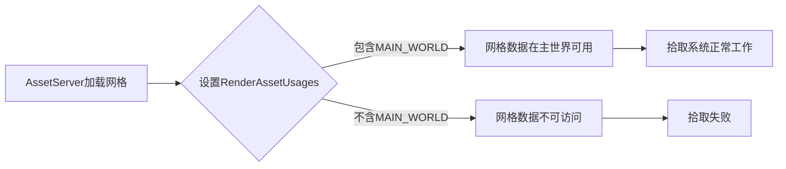

+++
title = "#19413 Updating mesh_picking doc to include RenderAssetUsages"
date = "2025-05-29T00:00:00"
draft = false
template = "pull_request_page.html"
in_search_index = false

[extra]
current_language = "zh-cn"
available_languages = {"en" = { name = "English", url = "/pull_request/bevy/2025-05/pr-19413-en-20250529" }, "zh-cn" = { name = "中文", url = "/pull_request/bevy/2025-05/pr-19413-zh-cn-20250529" }}
labels = ["C-Docs", "D-Trivial", "A-Picking"]
+++

# Updating mesh_picking doc to include RenderAssetUsages

## Basic Information
- **Title**: Updating mesh_picking doc to include RenderAssetUsages
- **PR Link**: https://github.com/bevyengine/bevy/pull/19413
- **Author**: andristarr
- **Status**: MERGED
- **Labels**: C-Docs, D-Trivial, S-Ready-For-Final-Review, A-Picking
- **Created**: 2025-05-28T18:07:47Z
- **Merged**: 2025-05-29T19:04:05Z
- **Merged By**: alice-i-cecile

## Description Translation
**目标**  
修复 #19102  

更新 mesh_picking 文档，说明网格需要设置 MAIN_WORLD RenderAssetUsages 才能被拾取。

## The Story of This Pull Request

### 问题背景
在 Bevy 的拾取(picking)系统中，用户报告了一个文档问题(#19102)。原始文档声明"默认所有网格都可拾取"，但这在引入 `RenderAssetUsages` 后不再准确。`RenderAssetUsages` 是 Bevy 的资源管理机制，控制资源在不同环境（主世界/渲染世界）中的可用性。`MAIN_WORLD` 标志决定网格数据是否在主世界可用，而网格拾取需要访问主世界中的网格数据。文档未反映此要求，导致用户困惑。

### 解决方案
本 PR 采用最直接的方法：更新模块级文档注释，明确说明 `RenderAssetUsages::MAIN_WORLD` 是网格可拾取的必要条件。此方案无需代码逻辑变更，仅修正文档准确性。考虑过添加完整示例但被否决，因核心问题是基础要求未声明，非使用示例缺失。

### 技术实现
修改聚焦于 `mesh_picking/mod.rs` 的文档注释。关键变更是将笼统的"所有网格"声明替换为明确的技术要求，指出 `RenderAssetUsages::MAIN_WORLD` 的必要性。同时保留原有关于 `Pickable::IGNORE` 和 `MeshPickingSettings` 的说明，确保文档完整性。

### 技术要点
`RenderAssetUsages` 是资源生命周期管理的关键机制：
- `MAIN_WORLD`：资源在主世界可用（CPU端）
- `RENDER_WORLD`：资源仅在渲染世界可用（GPU端）
网格拾取需要访问CPU端的几何数据，因此必须设置 `MAIN_WORLD` 标志。此变更帮助用户理解资源可见性规则，避免因配置不当导致拾取失效。

### 影响
此文档更新：
1. 修复了过时的技术声明
2. 明确系统依赖关系
3. 减少用户配置错误
4. 保持向后兼容（仅文档变更）

## Visual Representation



## Key Files Changed

### `crates/bevy_picking/src/mesh_picking/mod.rs`
**变更说明**：更新模块文档，明确声明 `RenderAssetUsages::MAIN_WORLD` 是网格可拾取的必要条件。

**代码变更**：
```rust
// Before:
//! By default, all meshes are pickable. Picking can be disabled for individual entities
//! by adding [`Pickable::IGNORE`].

// After:
//! By default, all meshes that have [`bevy_asset::RenderAssetUsages::MAIN_WORLD`] are pickable.
//! Picking can be disabled for individual entities by adding [`Pickable::IGNORE`].
```

## Further Reading
1. [RenderAssetUsages 文档](https://docs.rs/bevy/latest/bevy/asset/enum.RenderAssetUsages.html)
2. [Bevy 资源管理指南](https://bevyengine.org/learn/book/introduction/resources/)
3. [原始问题报告 #19102](https://github.com/bevyengine/bevy/issues/19102)