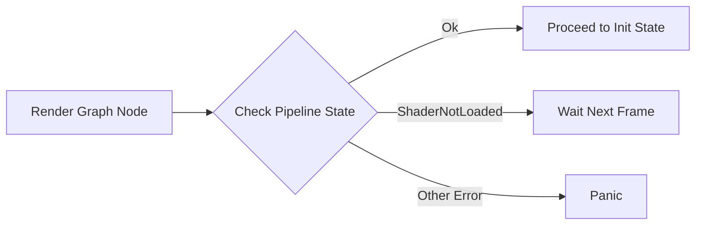

+++
title = "#19420 Fix the game of life example panicking if the pipeline shader isn't ready on the first frame"
date = "2025-05-29T00:00:00"
draft = false
template = "pull_request_page.html"
in_search_index = true

[taxonomies]
list_display = ["show"]

[extra]
current_language = "en"
available_languages = {"en" = { name = "English", url = "/pull_request/bevy/2025-05/pr-19420-en-20250529" }, "zh-cn" = { name = "中文", url = "/pull_request/bevy/2025-05/pr-19420-zh-cn-20250529" }}
labels = ["D-Trivial", "A-Rendering", "A-Assets"]
+++

## Title  
Fix the game of life example panicking if the pipeline shader isn't ready on the first frame  

## Basic Information  
- **Title**: Fix the game of life example panicking if the pipeline shader isn't ready on the first frame  
- **PR Link**: https://github.com/bevyengine/bevy/pull/19420  
- **Author**: andriyDev  
- **Status**: MERGED  
- **Labels**: D-Trivial, A-Rendering, A-Assets, S-Ready-For-Final-Review  
- **Created**: 2025-05-29T01:21:11Z  
- **Merged**: 2025-05-29T11:51:08Z  
- **Merged By**: mockersf  

## Description Translation  
# Objective  

- Due to recent changes related to #19024, the `compute_shader_game_of_life` example panics on some machines especially on Linux.  
- This is due to us switching more shaders to embedded shaders - this means the compute shader in this example takes more than one frame to load.  
- The panic in the example occurs if the shader fails to load by the first frame (since the pipeline considers that an error).  

## Solution  

- Make the example do nothing if the shader isn't loaded yet. This has the effect of waiting for the shader to load.  

## Testing  

- Tested the example on my Linux laptop.  

## The Story of This Pull Request  

### Problem Context  
Recent changes in Bevy's asset loading (#19024) transitioned more shaders to embedded assets. While this improves overall asset management, it introduced a race condition in the `compute_shader_game_of_life` example. On some systems (particularly Linux), the compute shader now requires multiple frames to load. The example's pipeline initialization code treated any first-frame loading failure as a fatal error, causing a panic when the shader wasn't ready immediately.  

### Solution Approach  
The fix needed to:  
1. Distinguish between temporary shader-loading delays and actual errors  
2. Maintain existing error handling for permanent failures  
3. Avoid complicating the example's core logic  

The simplest solution was to add a new case to the pipeline state handler that explicitly handles the `ShaderNotLoaded` scenario by no-oping, effectively extending the initialization period until the asset loads.  

### Implementation  
The implementation modifies the state machine in `GameOfLifeNode`'s render graph node. Previously, the code would panic on any pipeline error during initialization. The fix adds explicit handling for `ShaderNotLoaded` errors:  

```rust  
// File: examples/shader/compute_shader_game_of_life.rs  
// Before:  
match pipeline_cache.get_compute_pipeline_state(self.init_pipeline) {  
    CachedPipelineState::Ok(_) => {  
        self.state = GameOfLifeState::Init;  
    }  
    CachedPipelineState::Err(err) => {  
        panic!("Initializing assets/{SHADER_ASSET_PATH}:\n{err}")  
    }  
}  

// After:  
match pipeline_cache.get_compute_pipeline_state(self.init_pipeline) {  
    CachedPipelineState::Ok(_) => {  
        self.state = GameOfLifeState::Init;  
    }  
    // New case handles temporary loading state  
    CachedPipelineState::Err(PipelineCacheError::ShaderNotLoaded(_)) => {}  
    CachedPipelineState::Err(err) => {  
        panic!("Initializing assets/{SHADER_ASSET_PATH}:\n{err}")  
    }  
}  
```  

The key change is the new match arm that catches `PipelineCacheError::ShaderNotLoaded` errors. This case performs no action, leaving the state machine in its current state. The render graph will re-execute the node on subsequent frames, retrying the pipeline check until the shader loads successfully or encounters a non-recoverable error.  

### Technical Insights  
The solution leverages Bevy's existing pipeline state management:  
- `CachedPipelineState::Err` variants now have distinct handling  
- `ShaderNotLoaded` is treated as a temporary state rather than failure  
- All other errors still trigger panics (e.g., compilation errors)  
- The change preserves existing state transition logic  

This approach maintains the example's simplicity while fixing the race condition. The solution is localized to the initialization phase and doesn't affect the core Conway's Game of Life simulation logic.  

### Impact  
- Eliminates first-frame panics on systems with slower asset loading  
- Maintains existing error handling for actual shader problems  
- Requires only 2 lines of non-intrusive code changes  
- Preserves example behavior once shader loads  
- Fixes user experience for an important Bevy showcase example  

The change demonstrates proper handling of asynchronous asset loading in Bevy's render graph system, providing a reference pattern for similar cases.  

## Visual Representation  


## Key Files Changed  

### examples/shader/compute_shader_game_of_life.rs  
**Purpose**: Fix first-frame panic when shader loading takes >1 frame  

**Change Summary**: Added explicit handling for `ShaderNotLoaded` pipeline error  

**Code Change**:  
```rust  
@@ -229,6 +229,8 @@ impl render_graph::Node for GameOfLifeNode {  
                     CachedPipelineState::Ok(_) => {  
                         self.state = GameOfLifeState::Init;  
                     }  
+                    // If the shader hasn't loaded yet, just wait.  
+                    CachedPipelineState::Err(PipelineCacheError::ShaderNotLoaded(_)) => {}  
                     CachedPipelineState::Err(err) => {  
                         panic!("Initializing assets/{SHADER_ASSET_PATH}:\n{err}")  
                     }  
```  

## Further Reading  
1. [Bevy Render Graph Documentation](https://bevyengine.org/learn/book/getting-started/rendering/#render-graph)  
2. [Bevy Asset System](https://bevyengine.org/learn/book/getting-started/assets/)  
3. Related PR: [#19024 - Switch more shaders to use embedded assets](https://github.com/bevyengine/bevy/pull/19024)  
4. [PipelineCache API Reference](https://docs.rs/bevy/latest/bevy/render/render_resource/struct.PipelineCache.html)