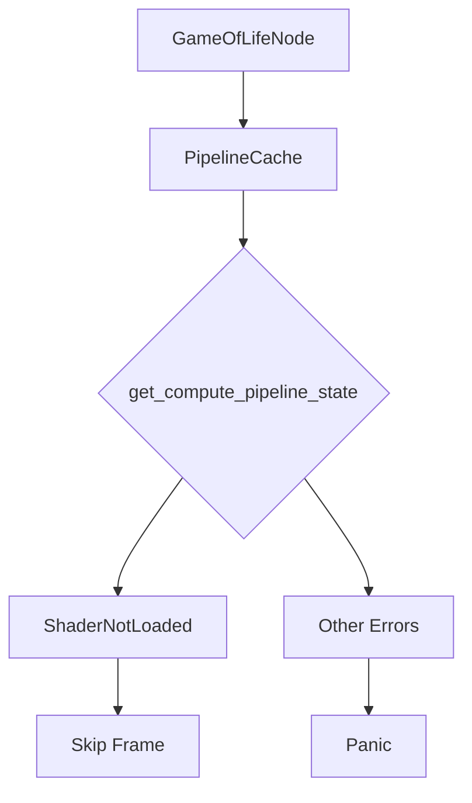

+++
title = "#19420 Fix the game of life example panicking if the pipeline shader isn't ready on the first frame"
date = "2025-05-29T00:00:00"
draft = false
template = "pull_request_page.html"
in_search_index = false

[extra]
current_language = "zh-cn"
available_languages = {"en" = { name = "English", url = "/pull_request/bevy/2025-05/pr-19420-en-20250529" }, "zh-cn" = { name = "中文", url = "/pull_request/bevy/2025-05/pr-19420-zh-cn-20250529" }}
+++

## 基本资料
- **标题**: Fix the game of life example panicking if the pipeline shader isn't ready on the first frame
- **PR链接**: https://github.com/bevyengine/bevy/pull/19420
- **作者**: andriyDev
- **状态**: 已合并
- **标签**: D-Trivial, A-Rendering, A-Assets, S-Ready-For-Final-Review
- **创建时间**: 2025-05-29T01:21:11Z
- **合并时间**: 2025-05-29T11:51:08Z
- **合并者**: mockersf

## 描述翻译
### 目标
- 由于最近 #19024 的相关变更，`compute_shader_game_of_life` 示例在某些机器上（特别是Linux）会出现panic
- 这是因为我们将更多着色器切换为嵌入式着色器 - 这意味着该示例中的计算着色器需要超过一帧的时间加载
- 如果着色器在第一帧未能加载完成（因为pipeline将其视为错误），示例就会panic

### 解决方案
- 让示例在着色器尚未加载完成时不执行任何操作。这样做的效果是等待着色器加载完成

### 测试
- 在Linux笔记本电脑上测试了该示例

## 变更分析

### 问题背景
该PR解决了`compute_shader_game_of_life`示例在特定条件下panic的问题。根本原因来自#19024的变更：当更多着色器转为嵌入式着色器后，计算着色器加载时间延长，可能超过单帧时长。原实现中，如果着色器未在第一帧完成加载，pipeline会将其视为错误并触发panic。这在Linux环境下尤为明显，因不同硬件/驱动组合可能导致加载时间差异。

### 解决方案设计
解决方案采用保守而有效的策略：当检测到着色器仍在加载时，跳过当前帧的计算操作。这种设计：
1. 保持现有状态机结构不变
2. 仅添加特定错误类型的处理分支
3. 避免引入复杂的状态跟踪或超时机制
4. 符合Bevy资源加载的异步特性

核心思想是区分临时性加载延迟（可恢复）与真正的编译错误（需panic）。对于`ShaderNotLoaded`这种暂时性状态，只需等待下一帧重试即可。

### 具体实现
变更集中在状态机的错误处理分支，增加了对`ShaderNotLoaded`错误的显式处理：

```rust
// File: examples/shader/compute_shader_game_of_life.rs
// 修改前
match pipeline_cache.get_compute_pipeline_state(pipeline_id) {
    CachedPipelineState::Ok(_) => {
        self.state = GameOfLifeState::Init;
    }
    CachedPipelineState::Err(err) => {
        panic!("Initializing assets/{SHADER_ASSET_PATH}:\n{err}")
    }
}

// 修改后
match pipeline_cache.get_compute_pipeline_state(pipeline_id) {
    CachedPipelineState::Ok(_) => {
        self.state = GameOfLifeState::Init;
    }
    // 新增处理分支
    CachedPipelineState::Err(PipelineCacheError::ShaderNotLoaded(_)) => {}
    CachedPipelineState::Err(err) => {
        panic!("Initializing assets/{SHADER_ASSET_PATH}:\n{err}")
    }
}
```

关键变更：
1. 新增匹配分支 `CachedPipelineState::Err(PipelineCacheError::ShaderNotLoaded(_)) => {}`
2. 该分支为空操作，相当于跳过当前帧
3. 保留其他错误类型的panic行为，确保真正的编译错误仍能被捕获

### 技术影响
1. **稳定性提升**：消除特定硬件上的启动panic
2. **向后兼容**：不改变现有API或核心逻辑
3. **资源加载**：正确处理异步加载的中间状态
4. **错误处理**：区分临时加载延迟与真实错误
5. **示例健壮性**：演示了生产环境中应有的错误处理模式

### 潜在改进方向
1. 可考虑添加日志输出，记录跳帧等待事件
2. 未来可扩展为进度提示UI（针对长时间加载）
3. 在更复杂的场景中，可能需要实现超时机制

## 关键文件变更
### examples/shader/compute_shader_game_of_life.rs
**变更描述**：在计算着色器状态检查中增加着色器加载中的处理分支  
**相关代码**：
```rust
match pipeline_cache.get_compute_pipeline_state(pipeline_id) {
    CachedPipelineState::Ok(_) => {
        self.state = GameOfLifeState::Init;
    }
    // 新增处理分支：等待着色器加载
    CachedPipelineState::Err(PipelineCacheError::ShaderNotLoaded(_)) => {}
    CachedPipelineState::Err(err) => {
        panic!("Initializing assets/{SHADER_ASSET_PATH}:\n{err}")
    }
}
```

## 组件关系


## 延伸阅读
1. [Bevy 异步资源加载文档](https://bevyengine.org/learn/book/assets/)
2. [PipelineCache 工作原理](https://docs.rs/bevy/latest/bevy/render/render_resource/struct.PipelineCache.html)
3. [错误处理最佳实践](https://doc.rust-lang.org/book/ch09-00-error-handling.html)
4. [原始PR #19024](https://github.com/bevyengine/bevy/pull/19024)