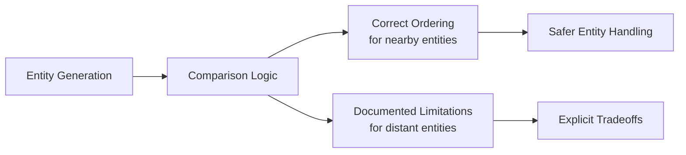

+++
title = "#19421 `EntityGeneration` ordering"
date = "2025-05-29T00:00:00"
draft = false
template = "pull_request_page.html"
in_search_index = true

[taxonomies]
list_display = ["show"]

[extra]
current_language = "en"
available_languages = {"en" = { name = "English", url = "/pull_request/bevy/2025-05/pr-19421-en-20250529" }, "zh-cn" = { name = "中文", url = "/pull_request/bevy/2025-05/pr-19421-zh-cn-20250529" }}
labels = ["D-Trivial", "A-ECS", "C-Usability", "X-Contentious"]
+++

## EntityGeneration Ordering Fix: Ensuring Correct Generation Comparisons

### Basic Information
- **Title**: `EntityGeneration` ordering
- **PR Link**: https://github.com/bevyengine/bevy/pull/19421
- **Author**: ElliottjPierce
- **Status**: MERGED
- **Labels**: D-Trivial, A-ECS, C-Usability, S-Ready-For-Final-Review, X-Contentious
- **Created**: 2025-05-29T01:53:44Z
- **Merged**: 2025-05-29T06:07:46Z
- **Merged By**: alice-i-cecile

### Description Translation
# Objective

Recently the `u32` `Entity::generation` was replaced with the new `EntityGeneration` in #19121.
This made meanings a lot more clear, and prevented accidental misuse.

One common misuse was assuming that `u32`s that were greater than others came after those others. 
Wrapping makes this assumption false.
When `EntityGeneration` was created, it retained the `u32` ordering, which was useless at best and wrong at worst.
This pr fixes the ordering implementation, so new generations are greater than older generations. 

Some users were already accounting for this ordering issue (which was still present in 0.16 and before) by manually accessing the `u32` representation. This made migrating difficult for avian physics; see [here](https://discord.com/channels/691052431525675048/749335865876021248/1377431569228103780).

I am generally of the opinion that this type should be kept opaque to prevent accidental misuse. 
As we find issues like this, the functionality should be added to `EntityGeneration` directly.

## Solution

Fix the ordering implementation through `Ord`.

Alternatively, we could keep `Ord` the same and make a `cmp_age` method, but I think this is better, even though sorting entity ids may be *marginally* slower now (but more correct). This is a tradeoff.

## Testing

I improved documentation for aliasing and ordering, adding some doc tests.

### The Story of This Pull Request

#### The Problem and Context
When the `EntityGeneration` type was introduced in #19121 to replace the raw `u32` generation value, it inherited the standard integer ordering implementation. This caused an issue because entity generations wrap around after reaching `u32::MAX`, meaning a newer generation could have a lower numeric value than an older generation. The existing `Ord` implementation incorrectly sorted these wrapped generations, leading to logical errors when comparing entity ages.

This became problematic for users like the avian physics team who relied on correct generation ordering. They had implemented workarounds by directly accessing the raw `u32` value, which complicated migration to the new `EntityGeneration` type. The core issue was that the type's ordering didn't match its semantic meaning - newer generations should always compare as greater than older ones, regardless of integer wrapping.

#### The Solution Approach
The solution modifies the `Ord` implementation for `EntityGeneration` to correctly handle wrapping behavior. Instead of direct integer comparison, it uses wrapping subtraction and compares the result against a threshold value (`1 << 31`). This ensures that:
1. Newer generations are always greater than older ones
2. Comparisons work correctly across generation boundaries
3. The type remains opaque without exposing internal representation

The alternative approach of adding a separate `cmp_age` method was considered but rejected to maintain idiomatic Rust comparison behavior. The tradeoff is a slight performance cost for more correct ordering semantics.

#### The Implementation
The key changes remove the automatic `Ord` derivation and implement custom comparison logic:
```rust
// Before:
#[derive(Clone, Copy, PartialEq, Eq, PartialOrd, Ord, Hash, Debug, Display)]
struct EntityGeneration(u32);

// After:
#[derive(Clone, Copy, PartialEq, Eq, Hash, Debug, Display)]
struct EntityGeneration(u32);

impl PartialOrd for EntityGeneration {
    fn partial_cmp(&self, other: &Self) -> Option<core::cmp::Ordering> {
        Some(self.cmp(other))
    }
}

impl Ord for EntityGeneration {
    fn cmp(&self, other: &Self) -> core::cmp::Ordering {
        let diff = self.0.wrapping_sub(other.0);
        (1u32 << 31).cmp(&diff)
    }
}
```
The implementation calculates the wrapped difference between generations, then compares it against half the `u32` range. If the difference exceeds this threshold, it indicates a wrap-around scenario where the ordering needs to be inverted.

#### Technical Insights
The solution leverages wrapping arithmetic to handle generation overflows:
```rust
// Example: Comparing generation 0 (old) with generation u32::MAX (new)
let old = EntityGeneration(0);
let new = EntityGeneration(u32::MAX);

// Wrapping subtraction: 0 - u32::MAX wraps to 1
// Threshold comparison: (1 << 31) = 2147483648, which is > 1
// Therefore: new > old (correct ordering)
```
The approach correctly handles generations within ±2³¹ of each other, which covers the typical case where entities coexist in the same world. For generations farther apart, ordering may be incorrect due to fundamental limitations of 32-bit wrapping, but this is documented as an accepted tradeoff.

#### The Impact
These changes ensure:
1. Correct ordering of entity generations in common scenarios
2. Elimination of error-prone workarounds accessing raw u32 values
3. Clear documentation of edge case behavior
4. Maintained type opacity to prevent future misuse

The solution maintains Bevy's principle of providing safe, misuse-resistant APIs while handling the practical reality of generation wrapping. The documentation improvements help users understand both the guarantees and limitations of entity generation comparisons.

### Visual Representation


### Key Files Changed
#### `crates/bevy_ecs/src/entity/mod.rs` (+68/-2)
Changes focus on:
1. Implementing custom comparison logic for EntityGeneration
2. Adding comprehensive documentation about ordering semantics
3. Clarifying aliasing behavior in Entity docs

**Documentation improvements**:
```rust
// Added ordering explanation and examples
/// # Ordering
///
/// [`EntityGeneration`] implements [`Ord`].
/// Generations that are later will be [`Greater`](core::cmp::Ordering::Greater) than earlier ones.
///
/// ```
/// # use bevy_ecs::entity::EntityGeneration;
/// assert!(EntityGeneration::FIRST < EntityGeneration::FIRST.after_versions(400));
/// let (aliased, did_alias) = EntityGeneration::FIRST.after_versions(400).after_versions_and_could_alias(u32::MAX);
/// assert!(did_alias);
/// assert!(EntityGeneration::FIRST < aliased);
/// ```
```

**Aliasing clarification**:
```rust
// Added to Entity docs
/// # Aliasing
///
/// Once an entity is despawned, it ceases to exist.
/// However, its [`Entity`] id is still present, and may still be contained in some data.
/// This becomes problematic because it is possible for a later entity to be spawned at the exact same id!
/// If this happens, which is rare but very possible, it will be logged.
```

### Further Reading
1. [Generational Indices Guide](https://lucassardois.medium.com/generational-indices-guide-8e3c5f7fd594) - Explains the pattern behind entity generations
2. [Original Discord Discussion](https://discord.com/channels/691052431525675048/749335865876021248/1377431569228103780) - User impact analysis
3. [Rust Wrapping Arithmetic](https://doc.rust-lang.org/std/num/struct.Wrapping.html) - Underlying mechanism used in the solution