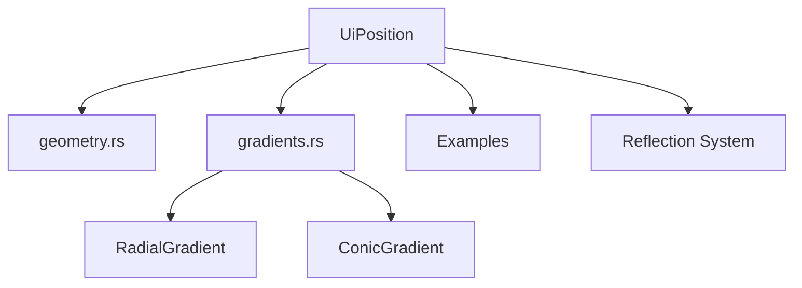

+++
title = "#19422 Rename Position to UiPosition in bevy_ui"
date = "2025-05-29T00:00:00"
draft = false
template = "pull_request_page.html"
in_search_index = true

[taxonomies]
list_display = ["show"]

[extra]
current_language = "en"
available_languages = {"en" = { name = "English", url = "/pull_request/bevy/2025-05/pr-19422-en-20250529" }, "zh-cn" = { name = "中文", url = "/pull_request/bevy/2025-05/pr-19422-zh-cn-20250529" }}
labels = ["D-Trivial", "A-UI", "C-Usability", "X-Contentious"]
+++

# Pull Request Analysis: Rename Position to UiPosition in bevy_ui

## Basic Information
- **Title**: Rename Position to UiPosition in bevy_ui
- **PR Link**: https://github.com/bevyengine/bevy/pull/19422
- **Author**: Zeophlite
- **Status**: MERGED
- **Labels**: D-Trivial, A-UI, C-Usability, S-Ready-For-Final-Review, X-Contentious
- **Created**: 2025-05-29T02:32:21Z
- **Merged**: 2025-05-29T15:11:44Z
- **Merged By**: alice-i-cecile

## Description Translation
# Objective

- Fixes #19418

## Solution

- Rename Position to UiPosition in bevy_ui

## Testing

- `cargo build`
- `cargo run --example gradients`
- `cargo run --example stacked_gradients`

## The Story of This Pull Request

### The Problem and Context
The PR addresses a naming conflict in Bevy's UI system. The `Position` struct in `bevy_ui` was causing ambiguity because `bevy_core` also has a `Position` component. This collision created potential confusion and compilation issues when both modules were used together. The conflict manifested specifically in issue #19418, where users couldn't disambiguate between the two `Position` types. This is particularly problematic in Rust where type names must be unique within a scope or explicitly disambiguated.

### The Solution Approach
The solution implemented a straightforward but impactful change: renaming `Position` to `UiPosition` throughout the UI system. This approach maintains identical functionality while eliminating the naming conflict. The choice of `UiPosition` clearly signals the type's domain (UI-specific positioning) and follows Bevy's naming conventions for UI components. No alternative solutions were considered since renaming was the most direct way to resolve the collision without introducing breaking changes to public APIs beyond what's acceptable in an ongoing development cycle.

### The Implementation
The implementation required systematic updates across multiple files. The core change occurred in `geometry.rs` where the struct definition was renamed:

```rust
// Before:
pub struct Position {
    pub anchor: Vec2,
    pub x: Val,
    pub y: Val,
}

// After:
pub struct UiPosition {
    pub anchor: Vec2,
    pub x: Val,
    pub y: Val,
}
```

All associated implementations (`Default`, `From` conversions) and constant definitions (like `CENTER`, `TOP_LEFT`) were similarly updated to use `UiPosition`. The changes propagated to dependent modules:

1. **Gradient systems** in `gradients.rs` were updated to use `UiPosition` for gradient positioning:
```rust
// RadialGradient before:
pub struct RadialGradient {
    pub position: Position,
    // ...
}

// RadialGradient after:
pub struct RadialGradient {
    pub position: UiPosition,
    // ...
}
```

2. **Reflection registration** in `lib.rs` was updated to maintain type information:
```rust
// Before:
.register_type::<Position>()

// After:
.register_type::<UiPosition>()
```

3. **Example code** was updated to use the new naming:
```rust
// Before:
(Position::TOP_LEFT, "TOP_LEFT")

// After:
(UiPosition::TOP_LEFT, "TOP_LEFT")
```

4. **Documentation** in release notes was updated to reflect the change:
```markdown
// Before:
`Position` type

// After:
`UiPosition` type
```

### Technical Insights
The change demonstrates important Rust ecosystem practices:
1. **Type disambiguation**: Using module-specific prefixes (`Ui` in this case) avoids collisions in large codebases
2. **Refactoring safety**: The use of constants (like `UiPosition::CENTER`) minimized errors during renaming
3. **API stability**: Maintaining identical struct fields and methods preserved existing functionality
4. **Documentation hygiene**: Updating release notes ensures accurate references for users

The `X-Contentious` label suggests there might have been discussion about the naming choice, but `UiPosition` was ultimately selected for clarity and consistency with Bevy's UI naming conventions.

### The Impact
This change resolves the immediate naming conflict (#19418) and improves long-term code maintainability:
1. Eliminates compilation errors when using both `bevy_ui` and `bevy_core`
2. Provides clearer context for the type's purpose through its name
3. Maintains full backward compatibility within the UI system's behavior
4. Sets a precedent for domain-specific naming in Bevy's module system

The minimal diff (+30/-30 lines) demonstrates how a focused, mechanical change can solve a concrete technical problem without introducing side effects.

## Visual Representation



## Key Files Changed

1. `crates/bevy_ui/src/geometry.rs` (+5/-5)
   - Renamed `Position` struct to `UiPosition` and updated all implementations
   ```rust
   // Before:
   pub struct Position { ... }
   impl Default for Position { ... }
   
   // After:
   pub struct UiPosition { ... }
   impl Default for UiPosition { ... }
   ```

2. `crates/bevy_ui/src/gradients.rs` (+7/-7)
   - Updated gradient structs to use `UiPosition`
   ```rust
   // Before:
   pub struct RadialGradient {
       pub position: Position,
   }
   
   // After:
   pub struct RadialGradient {
       pub position: UiPosition,
   }
   ```

3. `examples/testbed/ui.rs` (+9/-9)
   - Updated example to use `UiPosition` constants
   ```rust
   // Before:
   (Position::TOP_LEFT, "TOP_LEFT")
   
   // After:
   (UiPosition::TOP_LEFT, "TOP_LEFT")
   ```

4. `examples/ui/gradients.rs` (+2/-2)
   - Updated gradient examples
   ```rust
   // Before:
   position: Position::CENTER
   
   // After:
   position: UiPosition::CENTER
   ```

5. `examples/ui/stacked_gradients.rs` (+2/-2)
   - Updated stacked gradients example
   ```rust
   // Before:
   position: Position::TOP.at_x(Val::Percent(5.))
   
   // After:
   position: UiPosition::TOP.at_x(Val::Percent(5.))
   ```

## Further Reading
1. Rust naming conventions: [Rust API Guidelines](https://rust-lang.github.io/api-guidelines/naming.html)
2. Bevy UI system: [Bevy UI Documentation](https://docs.rs/bevy_ui/latest/bevy_ui/)
3. Namespace conflicts: [Rust Reference - Name Resolution](https://doc.rust-lang.org/reference/names.html)
4. Refactoring techniques: [Working Effectively with Legacy Code](https://www.oreilly.com/library/view/working-effectively-with/0131177052/)