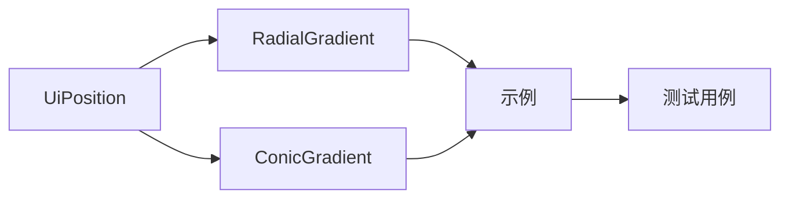

+++
title = "#19422 Rename Position to UiPosition in bevy_ui"
date = "2025-05-29T00:00:00"
draft = false
template = "pull_request_page.html"
in_search_index = false

[extra]
current_language = "zh-cn"
available_languages = {"en" = { name = "English", url = "/pull_request/bevy/2025-05/pr-19422-en-20250529" }, "zh-cn" = { name = "中文", url = "/pull_request/bevy/2025-05/pr-19422-zh-cn-20250529" }}
+++

# 重命名 bevy_ui 中的 Position 为 UiPosition

## 基本信息
- **标题**: Rename Position to UiPosition in bevy_ui
- **PR 链接**: https://github.com/bevyengine/bevy/pull/19422
- **作者**: Zeophlite
- **状态**: 已合并
- **标签**: D-Trivial, A-UI, C-Usability, S-Ready-For-Final-Review, X-Contentious
- **创建时间**: 2025-05-29T02:32:21Z
- **合并时间**: 2025-05-29T15:11:44Z
- **合并者**: alice-i-cecile

## 描述翻译
### 目标
- 修复 #19418

### 解决方案
- 将 bevy_ui 中的 Position 重命名为 UiPosition

### 测试
- `cargo build`
- `cargo run --example gradients`
- `cargo run --example stacked_gradients`

## PR 技术分析

### 问题背景
在 Bevy 引擎的 UI 模块中，`Position` 结构体名称与 `bevy_core_pipeline::tonemapping::Position` 发生命名冲突（问题 #19418）。这种冲突会导致开发者在使用这两个模块时产生歧义，特别是在同时导入 UI 和渲染管线的场景中。命名冲突是 Rust 项目中常见的问题，需要通过明确的命名空间或类型重命名来解决。

### 解决方案
PR 采用了最直接的解决方案：将 `bevy_ui` 中的 `Position` 类型重命名为 `UiPosition`。这种处理方式：
1. 保持了向后兼容的语义（类型功能不变）
2. 通过添加 `Ui` 前缀明确了类型所属的模块
3. 避免了更复杂的解决方案（如引入模块别名）

修改范围包括：
1. 结构体定义和实现
2. 相关方法签名
3. 示例代码中的使用点
4. 类型注册
5. 文档更新

### 具体实现
核心修改在 `geometry.rs` 中完成类型重命名：

```rust
// 文件: crates/bevy_ui/src/geometry.rs
// 修改前:
pub struct Position {
    pub anchor: Vec2,
    pub x: Val,
    pub y: Val,
}

// 修改后:
pub struct UiPosition {
    pub anchor: Vec2,
    pub x: Val,
    pub y: Val,
}
```

相关 trait 实现同步更新：

```rust
// 修改前:
impl Default for Position { ... }
impl Position { ... }

// 修改后:
impl Default for UiPosition { ... }
impl UiPosition { ... }
```

梯度系统同步更新类型引用：

```rust
// 文件: crates/bevy_ui/src/gradients.rs
// 修改前:
use crate::{Position, Val};
pub struct RadialGradient {
    pub position: Position,
}

// 修改后:
use crate::{UiPosition, Val};
pub struct RadialGradient {
    pub position: UiPosition,
}
```

示例代码更新所有使用点：

```rust
// 文件: examples/testbed/ui.rs
// 修改前:
(Position::TOP_LEFT, "TOP_LEFT")

// 修改后:
(UiPosition::TOP_LEFT, "TOP_LEFT")
```

### 技术影响
1. **解决命名冲突**：彻底消除与渲染管线 Position 类型的歧义
2. **API 清晰度**：`UiPosition` 更明确地表示其 UI 定位的用途
3. **向后兼容**：保持原有功能不变，仅修改类型名称
4. **文档一致性**：更新了 release notes 中的相关说明

### 潜在考量
1. **破坏性变更**：重命名公共类型属于破坏性变更，需要主版本更新
2. **迁移成本**：用户项目需要更新所有 `Position` 引用为 `UiPosition`
3. **名称选择**：`UiPosition` 比 `Position2D` 等替代名称更符合 Bevy 的命名惯例

## 关键文件变更

### crates/bevy_ui/src/geometry.rs
- 将 `Position` 重命名为 `UiPosition`
- 更新所有相关实现和转换 trait

```diff
- pub struct Position {
+ pub struct UiPosition {
```

### crates/bevy_ui/src/gradients.rs
- 更新梯度类型的 position 字段类型
- 修正构造函数和方法签名

```diff
- pub position: Position,
+ pub position: UiPosition,
```

### examples/testbed/ui.rs
- 更新测试用例中的位置常量引用

```diff
- (Position::TOP_LEFT, "TOP_LEFT"),
+ (UiPosition::TOP_LEFT, "TOP_LEFT"),
```

### release-content/release-notes/ui_gradients.md
- 更新文档中的类型引用

```diff
- `Position` type
+ `UiPosition` type
```

## 组件关系



## 延伸阅读
1. [Rust 命名规范](https://rust-lang.github.io/api-guidelines/naming.html)
2. [Bevy UI 系统文档](https://docs.rs/bevy_ui/latest/bevy_ui/)
3. [语义化版本控制](https://semver.org/)