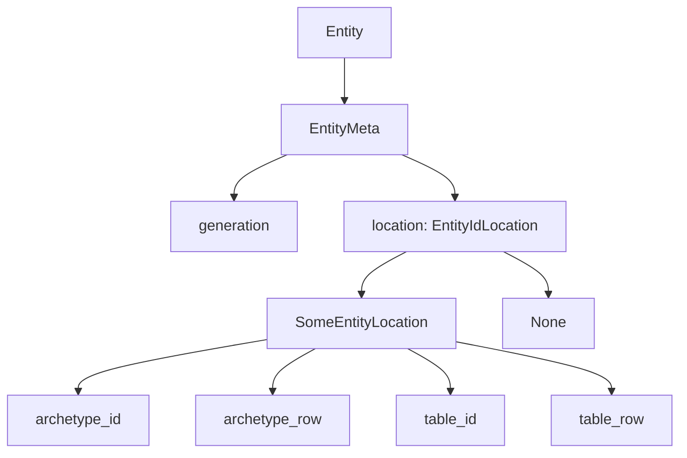

+++
title = "#19433 Remove invalid entity locations"
date = "2025-05-31T00:00:00"
draft = false
template = "pull_request_page.html"
in_search_index = true

[taxonomies]
list_display = ["show"]

[extra]
current_language = "en"
available_languages = {"en" = { name = "English", url = "/pull_request/bevy/2025-05/pr-19433-en-20250531" }, "zh-cn" = { name = "中文", url = "/pull_request/bevy/2025-05/pr-19433-zh-cn-20250531" }}
labels = ["A-ECS", "C-Code-Quality", "D-Straightforward"]
+++

### Title
Remove invalid entity locations

## Basic Information
- **Title**: Remove invalid entity locations
- **PR Link**: https://github.com/bevyengine/bevy/pull/19433
- **Author**: ElliottjPierce
- **Status**: MERGED
- **Labels**: A-ECS, C-Code-Quality, S-Ready-For-Final-Review, X-Uncontroversial, D-Straightforward
- **Created**: 2025-05-29T17:48:30Z
- **Merged**: 2025-05-31T16:54:11Z
- **Merged By**: alice-i-cecile

## Description Translation
# Objective

This is the first step of #19430 and is a follow up for #19132.

Now that `ArchetypeRow` has a niche, we can use `Option` instead of needing `INVALID` everywhere.

This was especially concerning since `INVALID` *really was valid!*

Using options here made the code clearer and more data-driven. 

## Solution

Replace all uses of `INVALID` entity locations (and archetype/table rows) with `None`.

## Testing

CI

## The Story of This Pull Request

This PR addresses a fundamental issue in Bevy's ECS implementation regarding how entity locations were represented. Previously, the system used a special `INVALID` constant to mark entities without valid archetype/table locations. This approach had two main problems: 

First, the `INVALID` constant was technically a valid bit pattern that could be misinterpreted as a real location. This created subtle risks where code might accidentally treat invalid entities as valid. Second, using a sentinel value made the code less explicit about state transitions between valid and invalid entity states.

The solution became possible after #19132 introduced niche optimization for `ArchetypeRow`. With this optimization, `Option<EntityLocation>` now has the same memory footprint as the original `EntityLocation` struct. This allows replacing the `INVALID` pattern with proper `Option` semantics without memory overhead.

The core change replaces all `EntityLocation` fields with `EntityIdLocation` (an alias for `Option<EntityLocation>`). This affects several key areas:

1. **Entity storage**: The `Entities` component storage now tracks locations as `Option<EntityLocation>` instead of using `EntityLocation::INVALID`
2. **Location checks**: All `archetype_id == ArchetypeId::INVALID` checks become `.is_none()` checks
3. **Location access**: Methods like `Entities::get()` now return `Option<EntityLocation>` instead of sometimes returning `INVALID`
4. **Despawn handling**: Despawned entities are now explicitly represented as `None` rather than a magic value

The migration required updating over 20 locations across bundle handling, entity spawning, and world management. For example:

```rust
// Before
if location.archetype_id == ArchetypeId::INVALID { ... }

// After
if location.is_none() { ... }
```

A key insight was recognizing that entity IDs can exist without locations (reserved IDs, pending commands) while still being distinct from entities with valid locations in empty archetypes. The `Option` type cleanly represents this distinction.

The changes also improved API clarity:
- Added `Entities::get_id_location()` to explicitly retrieve the optional location
- Maintained `Entities::get()` for backward compatibility with existing call patterns
- Updated documentation to explain the meaning of `None` locations

## Visual Representation



## Key Files Changed

### `crates/bevy_ecs/src/entity/mod.rs`
Refactored entity location storage to use `Option<EntityLocation>`:
```rust
// Before:
struct EntityMeta {
    location: EntityLocation,
}

// After:
type EntityIdLocation = Option<EntityLocation>;
struct EntityMeta {
    location: EntityIdLocation,
}
```
- Added `get_id_location()` method to retrieve optional location
- Updated `free()` to return `Option<EntityIdLocation>`
- Modified `flush()` to work with `&mut EntityIdLocation`

### `crates/bevy_ecs/src/world/entity_ref.rs`
Updated entity access to use `Option` checks:
```rust
// Before:
fn assert_not_despawned(&self) {
    if self.location.archetype_id == ArchetypeId::INVALID {
        self.panic_despawned();
    }
}

// After:
fn assert_not_despawned(&self) {
    if self.location.is_none() {
        self.panic_despawned()
    }
}
```
- Changed `EntityWorldMut` to store `location: EntityIdLocation`
- Updated all location accessors to handle `Option` semantics

### `crates/bevy_ecs/src/bundle.rs`
Updated location setters to wrap values in `Some`:
```rust
// Before:
entities.set(swapped_entity.index(), EntityLocation { ... });

// After:
entities.set(swapped_entity.index(), Some(EntityLocation { ... }));
```

### `crates/bevy_ecs/src/world/mod.rs`
Updated entity spawning logic:
```rust
// Before:
self.entities.set(entity.index(), location);

// After:
self.entities.set(entity.index(), Some(location));
```

### `release-content/migration-guides/entities_apis.md`
Added migration notes for API changes:
```markdown
`Entities::flush` now also asks for metadata about the flush operation...
`EntityIdLocation` is an alias for `Option<EntityLocation>`...
```

## Further Reading
1. [Rust Option Type Documentation](https://doc.rust-lang.org/std/option/)
2. [Niche Optimization in Rust](https://rust-lang.github.io/unsafe-code-guidelines/layout/enums.html#niche-optimizations)
3. [Bevy ECS Architecture](https://bevyengine.org/learn/book/plugins/ecs/)