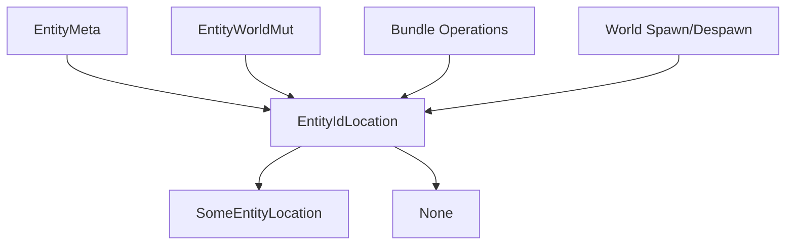

+++
title = "#19433 Remove invalid entity locations"
date = "2025-05-31T00:00:00"
draft = false
template = "pull_request_page.html"
in_search_index = false

[extra]
current_language = "zh-cn"
available_languages = {"en" = { name = "English", url = "/pull_request/bevy/2025-05/pr-19433-en-20250531" }, "zh-cn" = { name = "中文", url = "/pull_request/bevy/2025-05/pr-19433-zh-cn-20250531" }}
labels = ["A-ECS", "C-Code-Quality", "D-Straightforward"]
+++

# PR #19433: Remove invalid entity locations 技术分析报告

## Basic Information
- **Title**: Remove invalid entity locations
- **PR Link**: https://github.com/bevyengine/bevy/pull/19433
- **Author**: ElliottjPierce
- **Status**: MERGED
- **Labels**: A-ECS, C-Code-Quality, S-Ready-For-Final-Review, X-Uncontroversial, D-Straightforward
- **Created**: 2025-05-29T17:48:30Z
- **Merged**: 2025-05-31T16:54:11Z
- **Merged By**: alice-i-cecile

## Description Translation
### 目标
这是 #19430 的第一步，也是 #19132 的后续工作。

现在 `ArchetypeRow` 有 niche 优化，我们可以使用 `Option` 替代到处使用 `INVALID` 的方式。

这尤其重要，因为 `INVALID` 实际上曾经是有效的！

在此处使用 option 使代码更清晰且更数据驱动。

### 解决方案
将所有 `INVALID` 实体位置（以及 archetype/table rows）替换为 `None`。

### 测试
CI

## The Story of This Pull Request

### 问题背景
在 Bevy 的 ECS 实现中，实体位置使用特殊常量 `INVALID` 表示无效位置。但 `INVALID` 本质上是一个有效的整数值，这可能导致概念混淆。具体问题包括：

1. `INVALID` 常量（如 `ArchetypeId::INVALID`）实际上是有效的内存地址
2. 使用具体值表示无效状态不够清晰
3. 在 #19132 中 `ArchetypeRow` 引入了 niche 优化，为使用 `Option` 提供了性能基础

### 解决方案方法
核心方案是用 `Option<EntityLocation>`（定义为 `EntityIdLocation`）替代 `INVALID` 常量：
- 有效位置表示为 `Some(location)`
- 无效位置表示为 `None`

这种方法提供：
- 更清晰的语义区分
- 类型安全的无效状态表示
- 与 Rust 标准实践保持一致
- 保持相同内存布局（得益于 niche 优化）

### 实现细节
#### 1. 定义 EntityIdLocation 类型
```rust
// crates/bevy_ecs/src/entity/mod.rs
pub type EntityIdLocation = Option<EntityLocation>;
```

#### 2. 修改 EntityMeta 结构
```rust
// Before:
struct EntityMeta {
    pub location: EntityLocation,
}

// After:
struct EntityMeta {
    location: EntityIdLocation, // 现在是 Option<EntityLocation>
}
```

#### 3. 重构位置访问方法
```rust
// 新增方法获取 Option<EntityLocation>
#[inline]
pub fn get_id_location(&self, entity: Entity) -> Option<EntityIdLocation> {
    self.meta
        .get(entity.index() as usize)
        .filter(|meta| meta.generation == entity.generation)
        .map(|meta| meta.location)
}

// 保持现有接口但修改实现
#[inline]
pub fn get(&self, entity: Entity) -> Option<EntityLocation> {
    self.get_id_location(entity).flatten()
}
```

#### 4. 更新位置设置逻辑
所有设置位置的地方改为使用 `Some(location)`：
```rust
// crates/bevy_ecs/src/bundle.rs
// Before:
entities.set(entity.index(), EntityLocation { ... });

// After:
entities.set(entity.index(), Some(EntityLocation { ... }));
```

#### 5. 修改无效位置表示
```rust
// crates/bevy_ecs/src/entity/mod.rs
// Before:
location.archetype_id = ArchetypeId::INVALID;

// After:
*location = None;
```

#### 6. 更新 EntityWorldMut
```rust
// crates/bevy_ecs/src/world/entity_ref.rs
// Before:
pub struct EntityWorldMut<'w> {
    location: EntityLocation,
}

// After:
pub struct EntityWorldMut<'w> {
    location: EntityIdLocation, // Option<EntityLocation>
}
```

### 技术洞察
1. **Niche 优化利用**：得益于 `ArchetypeRow` 的 niche 优化，`Option<EntityLocation>` 的内存布局与原始 `EntityLocation` 相同
2. **概念澄清**：明确区分了三种状态：
   - 有效存在的实体 (`Some(location)`)
   - 已销毁的实体 (`None`)
   - 保留但未初始化的实体 ID (`None`)
3. **安全边界**：通过类型系统强制处理位置可能不存在的情况

### 影响
1. **代码清晰性**：使用 `Option` 使无效状态处理更明确
2. **错误预防**：消除 `INVALID` 可能被误用为有效位置的风险
3. **API 改进**：
   - 新增 `get_id_location()` 方法提供更精确的位置信息
   - 保持 `get()` 方法兼容现有使用
4. **迁移路径**：添加了迁移指南帮助用户适应 API 变更

## Visual Representation


## Key Files Changed

### 1. `crates/bevy_ecs/src/entity/mod.rs` (+36/-35)
**修改原因**：核心实体位置存储和访问逻辑重构

**关键变更**：
```rust
// 定义新类型替代 INVALID
pub type EntityIdLocation = Option<EntityLocation>;

// 修改位置获取方法
#[inline]
pub fn get_id_location(&self, entity: Entity) -> Option<EntityIdLocation> {
    self.meta
        .get(entity.index() as usize)
        .filter(|meta| meta.generation == entity.generation)
        .map(|meta| meta.location)
}

// 修改 free 方法签名
pub fn free(&mut self, entity: Entity) -> Option<EntityIdLocation> {
    // ...
}
```

### 2. `crates/bevy_ecs/src/world/entity_ref.rs` (+73/-83)
**修改原因**：更新实体操作 API 使用新的位置表示

**关键变更**：
```rust
// 修改位置检查逻辑
#[track_caller]
pub(crate) fn assert_not_despawned(&self) {
    if self.location.is_none() {
        self.panic_despawned()
    }
}

// 更新位置访问
pub fn location(&self) -> EntityLocation {
    match self.location {
        Some(loc) => loc,
        None => self.panic_despawned(),
    }
}
```

### 3. `crates/bevy_ecs/src/bundle.rs` (+14/-14)
**修改原因**：确保 bundle 操作正确使用新位置表示

**关键变更**：
```rust
// 所有位置设置更新为 Some(...)
entities.set(
    swapped_entity.index(),
    Some(EntityLocation { // 添加 Some 包装
        archetype_id: swapped_location.archetype_id,
        archetype_row: location.archetype_row,
        table_id: swapped_location.table_id,
        table_row: swapped_location.table_row,
    }),
);
```

### 4. `crates/bevy_ecs/src/world/mod.rs` (+8/-9)
**修改原因**：更新 world 级别的实体操作

**关键变更**：
```rust
// 生成实体时设置位置
let location = unsafe { archetype.allocate(entity, table_row) };
self.entities.set(entity.index(), Some(location)); // 添加 Some
```

### 5. `release-content/migration-guides/entities_apis.md` (+17/-0)
**修改原因**：提供 API 变更的迁移指南

**关键内容**：
```markdown
`Entities::flush` now also asks for metadata about the flush operation...
Additionally, flush now gives `&mut EntityIdLocation` instead of `&mut EntityLocation` access.
`EntityIdLocation` is an alias for `Option<EntityLocation>`.
```

## Further Reading
1. [Rust Option 类型文档](https://doc.rust-lang.org/std/option/)
2. [Niche 优化解释](https://rust-lang.github.io/unsafe-code-guidelines/layout/niches.html)
3. [Bevy ECS 架构概览](https://bevyengine.org/learn/book/getting-started/ecs/)