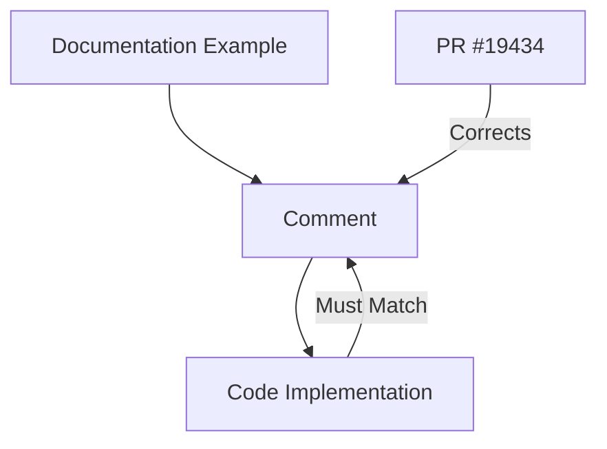

+++
title = "#19434 fix reference in example usage comments"
date = "2025-05-29T00:00:00"
draft = false
template = "pull_request_page.html"
in_search_index = true

[taxonomies]
list_display = ["show"]

[extra]
current_language = "en"
available_languages = {"en" = { name = "English", url = "/pull_request/bevy/2025-05/pr-19434-en-20250529" }, "zh-cn" = { name = "中文", url = "/pull_request/bevy/2025-05/pr-19434-zh-cn-20250529" }}
labels = ["C-Docs", "D-Trivial", "A-Utils"]
+++

# Analysis of PR #19434: fix reference in example usage comments

## Basic Information
- **Title**: fix reference in example usage comments
- **PR Link**: https://github.com/bevyengine/bevy/pull/19434
- **Author**: juxe
- **Status**: MERGED
- **Labels**: C-Docs, D-Trivial, S-Ready-For-Final-Review, A-Utils
- **Created**: 2025-05-29T18:48:32Z
- **Merged**: 2025-05-29T19:34:02Z
- **Merged By**: alice-i-cecile

## Description Translation
# Objective

- Fix a reference in the example usage comments of bevy_utils Default::default

## Solution

- Just a word change in the comments
 
## Testing

- No actual code changes to test

## The Story of This Pull Request

This pull request addresses a minor but important documentation issue in the Bevy engine's utility module. The problem was identified in the example usage comments for the `Default` trait implementation within `bevy_utils`. Specifically, the documentation contained an incorrect field reference that didn't match the actual struct definition in the example.

The issue occurred in an instructional comment meant to demonstrate how to use struct update syntax with `Default::default()`. The original comment incorrectly referenced setting `Foo::bar` to 10, while the accompanying code example clearly showed `Foo::a` being set to 10. This inconsistency could confuse developers learning how to properly initialize structs using default values in Rust.

```rust
// Original incorrect comment
/// // combined with `Default::default()`. This example sets `Foo::bar` to 10 and the remaining
```

The solution was straightforward: update the comment to reference the correct field name (`Foo::a`) that actually appears in the example code. This change ensures the documentation accurately reflects the code it's describing.

```rust
// Corrected comment
/// // combined with `Default::default()`. This example sets `Foo::a` to 10 and the remaining
```

While this change might seem trivial, accurate documentation is crucial in foundational utility modules like `bevy_utils`. Examples in core modules often serve as reference points for both new and experienced contributors. An inconsistency like this could lead to confusion about Rust's struct initialization patterns or create uncertainty about whether the example contains deeper errors.

The PR required no testing since it only modified comments. It was quickly reviewed and merged within 46 minutes of submission, with the labels C-Docs (documentation change) and D-Trivial (trivial difficulty) appropriately applied. This demonstrates Bevy's efficient handling of small but meaningful documentation improvements.

## Visual Representation



## Key Files Changed

### File: `crates/bevy_utils/src/default.rs`
- **Change**: Fixed field reference in documentation example
- **Why**: The comment incorrectly referenced `Foo::bar` while the example used `Foo::a`
- **Impact**: Improves documentation accuracy for a core utility trait

**Code Change**:
```diff
@@ -12,7 +12,7 @@
 /// }
 ///
 /// // Normally you would initialize a struct with defaults using "struct update syntax"
-/// // combined with `Default::default()`. This example sets `Foo::bar` to 10 and the remaining
+/// // combined with `Default::default()`. This example sets `Foo::a` to 10 and the remaining
 /// // values to their defaults.
 /// let foo = Foo {
 ///   a: 10,
```

## Further Reading
1. [Rust Documentation: The Default Trait](https://doc.rust-lang.org/std/default/trait.Default.html)
2. [Rust By Example: Default](https://doc.rust-lang.org/rust-by-example/default.html)
3. [Bevy Engine Contribution Guide](https://github.com/bevyengine/bevy/blob/main/CONTRIBUTING.md)
4. [Struct Update Syntax in Rust](https://doc.rust-lang.org/book/ch05-01-defining-structs.html#creating-instances-from-other-instances-with-struct-update-syntax)

## Full Code Diff
```diff
diff --git a/crates/bevy_utils/src/default.rs b/crates/bevy_utils/src/default.rs
index 5b4b9fbdf932e..0ca45d544def4 100644
--- a/crates/bevy_utils/src/default.rs
+++ b/crates/bevy_utils/src/default.rs
@@ -12,7 +12,7 @@
 /// }
 ///
 /// // Normally you would initialize a struct with defaults using "struct update syntax"
-/// // combined with `Default::default()`. This example sets `Foo::bar` to 10 and the remaining
+/// // combined with `Default::default()`. This example sets `Foo::a` to 10 and the remaining
 /// // values to their defaults.
 /// let foo = Foo {
 ///   a: 10,
```