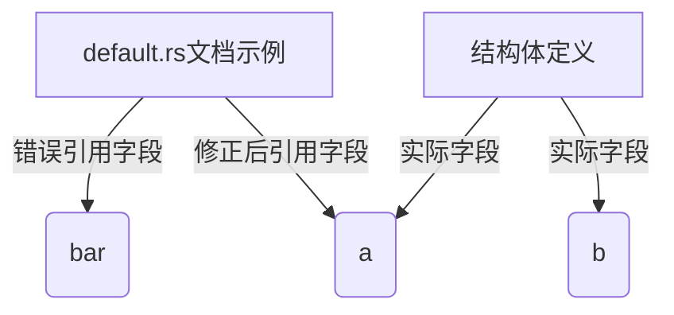

+++
title = "#19434 fix reference in example usage comments"
date = "2025-05-29T00:00:00"
draft = false
template = "pull_request_page.html"
in_search_index = false

[extra]
current_language = "zh-cn"
available_languages = {"en" = { name = "English", url = "/pull_request/bevy/2025-05/pr-19434-en-20250529" }, "zh-cn" = { name = "中文", url = "/pull_request/bevy/2025-05/pr-19434-zh-cn-20250529" }}
labels = ["C-Docs", "D-Trivial", "A-Utils"]
+++

# Pull Request #19434: fix reference in example usage comments

## Basic Information
- **Title**: fix reference in example usage comments
- **PR Link**: https://github.com/bevyengine/bevy/pull/19434
- **Author**: juxe
- **Status**: MERGED
- **Labels**: C-Docs, D-Trivial, S-Ready-For-Final-Review, A-Utils
- **Created**: 2025-05-29T18:48:32Z
- **Merged**: 2025-05-29T19:34:02Z
- **Merged By**: alice-i-cecile

## Description Translation
### 目标
- 修复 bevy_utils 中 Default::default 示例用法注释中的引用

### 解决方案
- 仅修改注释中的一个单词

### 测试
- 无实际代码变更需要测试

## The Story of This Pull Request

### 问题背景
在`bevy_utils` crate的`default.rs`文件中，存在一个文档示例说明如何使用结构体更新语法(struct update syntax)结合`Default::default()`初始化结构体。该示例在注释中错误地将字段引用为`bar`，而实际结构体定义中只包含字段`a`和`b`。这种文档错误会导致开发者在使用示例代码时产生混淆，特别是新接触Rust结构体更新语法的开发者。

### 解决方案分析
PR作者juxe识别到这个文档错误属于简单的拼写错误，解决方案直接明了：只需将注释中的错误字段名`bar`修正为正确的字段名`a`。由于不涉及任何代码逻辑变更，这个修复归类为文档更新(Docs)和琐碎修改(Trivial)，不需要额外的测试验证。

### 具体实现
修改集中在`crates/bevy_utils/src/default.rs`文件的第15行。原始注释错误地描述设置`Foo::bar`字段，而正确实现应描述设置`Foo::a`字段。这个单行修改保持了示例的完整性和教育价值，同时确保了技术文档的准确性。

### 技术影响
虽然这个修改规模很小，但准确的技术文档对开源项目至关重要：
1. 消除文档与代码实现的不一致，避免误导开发者
2. 保持示例代码的可运行性（虽然此例中字段名错误不会导致编译失败，但会引发逻辑困惑）
3. 体现项目对文档细节的关注，维护代码库的专业形象

## Visual Representation



## Key Files Changed

### `crates/bevy_utils/src/default.rs` (+1/-1)
这个文件包含为结构体实现Default trait的工具代码。修改修复了文档示例中的字段引用错误。

**修改前:**
```rust
// 原始错误代码
// combined with `Default::default()`. This example sets `Foo::bar` to 10 and the remaining
// values to their defaults.
let foo = Foo {
  a: 10,
```

**修改后:**
```rust
// 修正后代码
// combined with `Default::default()`. This example sets `Foo::a` to 10 and the remaining
// values to their defaults.
let foo = Foo {
  a: 10,
```

**变更说明:**
- 第15行的注释将`Foo::bar`修正为`Foo::a`
- 保持原有代码结构不变
- 修正后与结构体定义中的实际字段名保持一致

## Further Reading
1. [Rust结构体更新语法文档](https://doc.rust-lang.org/book/ch05-01-defining-structs.html#creating-instances-from-other-instances-with-struct-update-syntax)
2. [Bevy引擎贡献指南](https://github.com/bevyengine/bevy/blob/main/CONTRIBUTING.md)
3. [Rust文档注释最佳实践](https://doc.rust-lang.org/rustdoc/how-to-write-documentation.html)

## Full Code Diff
```diff
diff --git a/crates/bevy_utils/src/default.rs b/crates/bevy_utils/src/default.rs
index 5b4b9fbdf932e..0ca45d544def4 100644
--- a/crates/bevy_utils/src/default.rs
+++ b/crates/bevy_utils/src/default.rs
@@ -12,7 +12,7 @@
 /// }
 ///
 /// // Normally you would initialize a struct with defaults using "struct update syntax"
-/// // combined with `Default::default()`. This example sets `Foo::bar` to 10 and the remaining
+/// // combined with `Default::default()`. This example sets `Foo::a` to 10 and the remaining
 /// // values to their defaults.
 /// let foo = Foo {
 ///   a: 10,
```