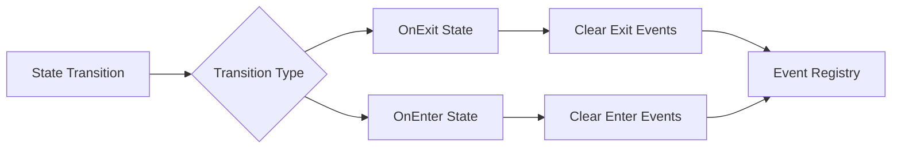

+++
title = "#19435 Refactor state scoped events to match entities"
date = "2025-05-31T00:00:00"
draft = false
template = "pull_request_page.html"
in_search_index = true

[taxonomies]
list_display = ["show"]

[extra]
current_language = "en"
available_languages = {"en" = { name = "English", url = "/pull_request/bevy/2025-05/pr-19435-en-20250531" }, "zh-cn" = { name = "中文", url = "/pull_request/bevy/2025-05/pr-19435-zh-cn-20250531" }}
labels = ["C-Usability", "D-Modest", "S-Waiting-on-Author", "A-States"]
+++

# Refactor state scoped events to match entities

## Basic Information
- **Title**: Refactor state scoped events to match entities
- **PR Link**: https://github.com/bevyengine/bevy/pull/19435
- **Author**: AlephCubed
- **Status**: MERGED
- **Labels**: C-Usability, M-Needs-Migration-Guide, X-Uncontroversial, D-Modest, S-Waiting-on-Author, A-States
- **Created**: 2025-05-29T20:21:49Z
- **Merged**: 2025-05-31T20:32:04Z
- **Merged By**: alice-i-cecile

## Description Translation
This adds support for clearing events when **entering** a state (instead of just when exiting) and updates the names to match `DespawnOnExitState`.

Before:
```rust
app.add_state_scoped_event::<MyGameEvent>(GameState::Play);
```
After:
```rust
app
  .add_event::<MyGameEvent>()
  .clear_events_on_exit_state::<MyGameEvent>(GameState::Play);
```

## The Story of This Pull Request

### The Problem and Context
The existing state-scoped events implementation only cleared events when exiting a game state. This created an inconsistency with entity despawning patterns where both `DespawnOnExitState` and `DespawnOnEnterState` were available. Developers needed symmetrical event clearing capabilities - particularly when transitioning between states where events generated in one state shouldn't carry over to the next.

The naming convention also needed alignment. The previous `add_state_scoped_event` method didn't match the more explicit `DespawnOnExitState` naming pattern established for entities, creating cognitive friction when working with both systems.

### The Solution Approach
The solution centered on three key changes:
1. Adding symmetric `on_enter` event clearing to complement existing `on_exit` functionality
2. Renaming methods to match entity despawning patterns (`clear_events_on_exit_state`/`clear_events_on_enter_state`)
3. Decoupling event registration from clearing by requiring explicit `add_event` calls

This approach maintained backward compatibility through clear migration paths while establishing consistent naming patterns across state-related cleanup operations. The implementation avoids breaking changes by introducing new methods rather than modifying existing ones.

### The Implementation
The core change refactors the `StateScopedEvents` resource to track both enter and exit transitions separately:

```rust
#[derive(Resource)]
struct StateScopedEvents<S: States> {
    /// Keeps track of which events need to be reset when the state is exited.
    on_exit: HashMap<S, Vec<fn(&mut World)>>,
    /// Keeps track of which events need to be reset when the state is entered.
    on_enter: HashMap<S, Vec<fn(&mut World)>>,
}
```

A new `TransitionType` enum distinguishes between enter and exit events:

```rust
#[derive(Copy, Clone)]
enum TransitionType {
    OnExit,
    OnEnter,
}
```

The event clearing logic was split into two dedicated systems:

```rust
fn clear_events_on_exit_state<S: States>(
    mut c: Commands,
    mut transitions: EventReader<StateTransitionEvent<S>>,
) {
    // Clears events when exiting state
}

fn clear_events_on_enter_state<S: States>(
    mut c: Commands,
    mut transitions: EventReader<StateTransitionEvent<S>>,
) {
    // Clears events when entering state
}
```

The public API was updated to provide symmetric methods:

```rust
pub trait StateScopedEventsAppExt {
    fn clear_events_on_exit_state<E: Event>(&mut self, state: impl States) -> &mut Self;
    fn clear_events_on_enter_state<E: Event>(&mut self, state: impl States) -> &mut Self;
}
```

### Technical Insights
The implementation handles state transitions efficiently by:
1. Processing only the last transition event per update cycle
2. Using command queues to defer world mutations
3. Maintaining a single resource to track all state-event mappings

The resource-scoping pattern ensures proper isolation of state-specific event data:

```rust
w.resource_scope::<StateScopedEvents<S>, ()>(|w, events| {
    events.cleanup(w, entered, TransitionType::OnEnter);
});
```

Unit tests verify both enter and exit behaviors:

```rust
#[test]
fn clear_event_on_enter_state() {
    // Tests event clearing when entering state
}

#[test]
fn clear_event_on_exit_state() {
    // Tests event clearing when exiting state
}
```

### The Impact
These changes provide:
1. Symmetrical event clearing for state transitions
2. Consistent naming with entity despawning patterns
3. Explicit control over event registration and clearing
4. Backward-compatible migration path

The migration guide clearly documents the changes:

```markdown
| Before                        | After                                      |
|-------------------------------|--------------------------------------------|
| `StateScoped`                 | `DespawnOnExitState`                       |
| `clear_state_scoped_entities` | `despawn_entities_on_exit_state`           |
| `add_state_scoped_event`      | `add_event` + `clear_events_on_exit_state` |
```

Developers now have a consistent mental model for state-scoped cleanup operations across both entities and events.

## Visual Representation



## Key Files Changed

### crates/bevy_state/src/state_scoped_events.rs
Refactored to support both enter and exit event clearing with updated naming conventions.

**Key changes:**
```rust
// Before:
#[derive(Resource)]
struct StateScopedEvents<S: States> {
    cleanup_fns: HashMap<S, Vec<fn(&mut World)>>,
}

// After:
#[derive(Resource)]
struct StateScopedEvents<S: States> {
    on_exit: HashMap<S, Vec<fn(&mut World)>>,
    on_enter: HashMap<S, Vec<fn(&mut World)>>,
}
```

```rust
// Before:
fn add_state_scoped_event_impl<E: Event, S: States>(/* ... */) {
    // Only handled exit events
}

// After:
fn clear_events_on_state_transition<E: Event, S: States>(
    /* ... */
    transition_type: TransitionType, // Added parameter
) {
    // Handles both enter and exit events
}
```

### release-content/migration-guides/rename_state_scoped.md
New migration guide documenting the changes.

**Added content:**
```markdown
---
title: Renamed state scoped entities and events
pull_requests: [18818, 19435]
---

Previously, Bevy provided the `StateScoped` component and `add_state_scoped_event` method
as a way to remove entities/events when **exiting** a state.

However, it can also be useful to have the opposite behavior,
where entities/events are removed when **entering** a state.
This is now possible with the new `DespawnOnEnterState` component and `clear_events_on_enter_state` method.

To support this addition, the previous method and component have been renamed.
Also, `clear_event_on_exit_state` no longer adds the event automatically, so you must call `App::add_event` manually.

| Before                        | After                                      |
|-------------------------------|--------------------------------------------|
| `StateScoped`                 | `DespawnOnExitState`                       |
| `clear_state_scoped_entities` | `despawn_entities_on_exit_state`           |
| `add_state_scoped_event`      | `add_event` + `clear_events_on_exit_state` |
```

### release-content/migration-guides/rename_StateScoped.md
Obsolete migration guide removed as its content was consolidated into the new guide.

## Further Reading
1. [Bevy States Documentation](https://docs.rs/bevy_state/latest/bevy_state/)
2. [Event System in Bevy](https://bevyengine.org/learn/book/getting-started/events/)
3. [State Transition Systems](https://docs.rs/bevy_ecs/latest/bevy_ecs/schedule/trait.IntoSystemConfigs.html#method.in_set)