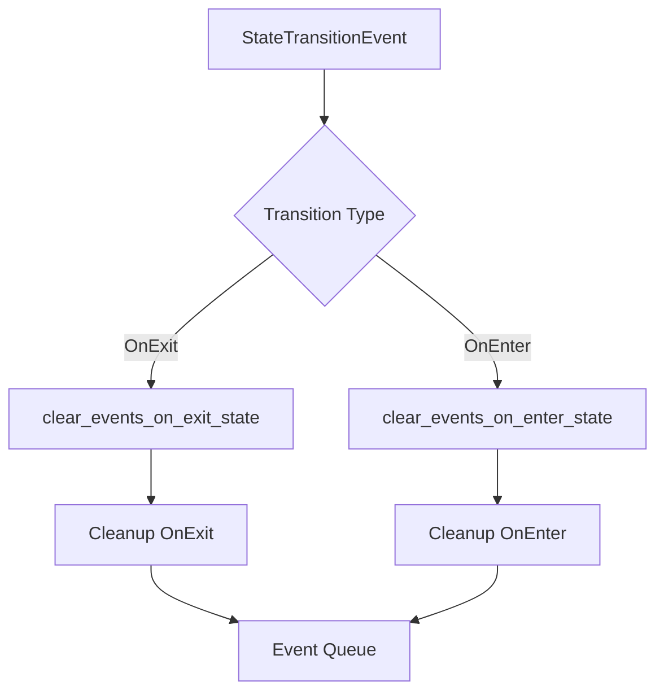

+++
title = "#19435 Refactor state scoped events to match entities."
date = "2025-05-31T00:00:00"
draft = false
template = "pull_request_page.html"
in_search_index = false

[extra]
current_language = "zh-cn"
available_languages = {"en" = { name = "English", url = "/pull_request/bevy/2025-05/pr-19435-en-20250531" }, "zh-cn" = { name = "中文", url = "/pull_request/bevy/2025-05/pr-19435-zh-cn-20250531" }}
labels = ["C-Usability", "D-Modest", "S-Waiting-on-Author", "A-States"]
+++

# Refactor state scoped events to match entities

## Basic Information
- **Title**: Refactor state scoped events to match entities.
- **PR Link**: https://github.com/bevyengine/bevy/pull/19435
- **Author**: AlephCubed
- **Status**: MERGED
- **Labels**: C-Usability, M-Needs-Migration-Guide, X-Uncontroversial, D-Modest, S-Waiting-on-Author, A-States
- **Created**: 2025-05-29T20:21:49Z
- **Merged**: 2025-05-31T20:32:04Z
- **Merged By**: alice-i-cecile

## Description Translation
此 PR 添加了对在**进入**状态时清除事件的支持（之前仅支持在退出时清除），并更新了方法名称以匹配 `DespawnOnExitState`。

Before:
```rust
app.add_state_scoped_event::<MyGameEvent>(GameState::Play);
```
After:
```rust
app
  .add_event::<MyGameEvent>()
  .clear_events_on_exit_state::<MyGameEvent>(GameState::Play);
```

## The Story of This Pull Request

### 问题与上下文
在 Bevy 的状态管理中，开发者需要一种机制在状态转换时自动清理事件。原始实现仅支持在退出状态时清理事件（`OnExit`），这限制了使用场景。同时，API 命名（`add_state_scoped_event`）与类似的实体清理机制（`DespawnOnExitState`）不一致，导致 API 表面不统一。

### 解决方案
PR 实现了两个关键改进：
1. **扩展清理时机**：增加进入状态（`OnEnter`）时的事件清理能力
2. **统一 API 命名**：重构方法名为 `clear_events_on_exit_state` 和 `clear_events_on_enter_state`，与 `DespawnOnExitState` 保持命名一致性

技术实现上：
- 引入 `TransitionType` 枚举区分进入/退出清理
- 将 `StateScopedEvents` 资源拆分为两个独立映射：
  ```rust
  struct StateScopedEvents<S: States> {
      on_exit: HashMap<S, Vec<fn(&mut World)>>,   // 退出状态时清理
      on_enter: HashMap<S, Vec<fn(&mut World)>>,  // 进入状态时清理
  }
  ```
- 添加 `clear_events_on_enter_state` 系统处理状态进入事件
- 分离事件注册与清理逻辑，要求显式调用 `add_event()`

### 实现细节
核心函数 `clear_events_on_state_transition` 根据转换类型动态注册清理系统：
```rust
fn clear_events_on_state_transition<E: Event, S: States>(
    app: &mut SubApp,
    _p: PhantomData<E>,
    state: S,
    transition_type: TransitionType,
) {
    // ...资源初始化...
    app.world_mut()
        .resource_mut::<StateScopedEvents<S>>()
        .add_event::<E>(state.clone(), transition_type);
    
    match transition_type {
        TransitionType::OnExit => app.add_systems(OnExit(state), clear_events_on_exit_state::<S>),
        TransitionType::OnEnter => app.add_systems(OnEnter(state), clear_events_on_enter_state::<S>),
    };
}
```
这种设计保持了系统注册的静态安全性，同时支持两种转换类型。

### 测试验证
添加了两个测试确保行为正确：
```rust
#[test]
fn clear_event_on_exit_state() { /* 验证退出清理 */ }

#[test]
fn clear_event_on_enter_state() { /* 验证进入清理 */ }
```
测试模拟状态转换并验证事件队列是否被正确清除。

### 迁移影响
PR 包含迁移指南更新：
- 删除旧迁移文件 `rename_StateScoped.md`
- 新增统一迁移指南 `rename_state_scoped.md`，说明变更：
  ```markdown
  | Before                        | After                                      |
  |-------------------------------|--------------------------------------------|
  | `add_state_scoped_event`      | `add_event` + `clear_events_on_exit_state` |
  ```

## Visual Representation



## Key Files Changed

### crates/bevy_state/src/state_scoped_events.rs
重构核心状态事件处理逻辑：
```rust
// Before:
#[derive(Resource)]
struct StateScopedEvents<S: States> {
    cleanup_fns: HashMap<S, Vec<fn(&mut World)>>,
}

// After:
#[derive(Resource)]
struct StateScopedEvents<S: States> {
    on_exit: HashMap<S, Vec<fn(&mut World)>>,
    on_enter: HashMap<S, Vec<fn(&mut World)>>,
}
```
新增进入状态清理系统：
```rust
fn clear_events_on_enter_state<S: States>(
    mut c: Commands,
    mut transitions: EventReader<StateTransitionEvent<S>>,
) {
    // ...状态进入检测...
    c.queue(move |w: &mut World| {
        w.resource_scope(|w, events| {
            events.cleanup(w, entered, TransitionType::OnEnter);
        });
    });
}
```

### release-content/migration-guides/rename_state_scoped.md
新增迁移指南：
```markdown
---
title: Renamed state scoped entities and events
pull_requests: [18818, 19435]
---

| Before                        | After                                      |
|-------------------------------|--------------------------------------------|
| `add_state_scoped_event`      | `add_event` + `clear_events_on_exit_state` |
```

### release-content/migration-guides/rename_StateScoped.md
删除过时的迁移文件：
```diff
- ---
- title: `StateScoped` renamed to `DespawnOnExitState`
- pull_requests: [18818]
- ---
```

## Further Reading
1. [Bevy States Documentation](https://docs.rs/bevy/latest/bevy/state/index.html)
2. [Event System Architecture](https://bevyengine.org/learn/book/events/)
3. [State Transition Lifecycle](https://github.com/bevyengine/bevy/discussions/19425)