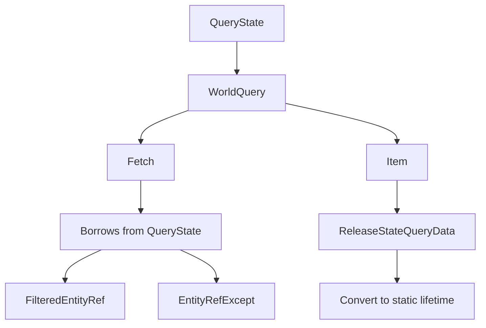

+++
title = "#15396 Let query items borrow from query state to avoid needing to clone"
date = "2025-06-16T00:00:00"
draft = false
template = "pull_request_page.html"
in_search_index = true

[taxonomies]
list_display = ["show"]

[extra]
current_language = "en"
available_languages = {"en" = { name = "English", url = "/pull_request/bevy/2025-06/pr-15396-en-20250616" }, "zh-cn" = { name = "中文", url = "/pull_request/bevy/2025-06/pr-15396-zh-cn-20250616" }}
labels = ["A-ECS", "C-Performance", "D-Complex", "X-Contentious"]
+++

# Title
Query Items Now Borrow from Query State to Avoid Cloning

## Basic Information
- **Title**: Let query items borrow from query state to avoid needing to clone
- **PR Link**: https://github.com/bevyengine/bevy/pull/15396
- **Author**: chescock
- **Status**: MERGED
- **Labels**: A-ECS, C-Performance, S-Ready-For-Final-Review, M-Needs-Migration-Guide, D-Complex, X-Contentious
- **Created**: 2024-09-23T18:27:58Z
- **Merged**: 2025-06-16T21:27:30Z
- **Merged By**: alice-i-cecile

## Description Translation
# Objective

Improve the performance of `FilteredEntity(Ref|Mut)` and `Entity(Ref|Mut)Except`.  

`FilteredEntityRef` needs an `Access<ComponentId>` to determine what components it can access.  There is one stored in the query state, but query items cannot borrow from the state, so it has to `clone()` the access for each row.  Cloning the access involves memory allocations and can be expensive.  

## Solution

Let query items borrow from their query state.  

Add an `'s` lifetime to `WorldQuery::Item` and `WorldQuery::Fetch`, similar to the one in `SystemParam`, and provide `&'s Self::State` to the fetch so that it can borrow from the state.  

Unfortunately, there are a few cases where we currently return query items from temporary query states: the sorted iteration methods create a temporary state to query the sort keys, and the `EntityRef::components<Q>()` methods create a temporary state for their query.  

To allow these to continue to work with most `QueryData` implementations, introduce a new subtrait `ReleaseStateQueryData` that converts a `QueryItem<'w, 's>` to `QueryItem<'w, 'static>`, and is implemented for everything except `FilteredEntity(Ref|Mut)` and `Entity(Ref|Mut)Except`.  

`#[derive(QueryData)]` will generate `ReleaseStateQueryData` implementations that apply when all of the subqueries implement `ReleaseStateQueryData`.

This PR does not actually change the implementation of `FilteredEntity(Ref|Mut)` or `Entity(Ref|Mut)Except`!  That will be done as a follow-up PR so that the changes are easier to review.  I have pushed the changes as chescock/bevy#5.

## Testing

I ran performance traces of many_foxes, both against main and against chescock/bevy#5, both including #15282.  These changes do appear to make generalized animation a bit faster: 

(Red is main, yellow is chescock/bevy#5)


## Migration Guide

The `WorldQuery::Item` and `WorldQuery::Fetch` associated types and the `QueryItem` and `ROQueryItem` type aliases now have an additional lifetime parameter corresponding to the `'s` lifetime in `Query`.  Manual implementations of `WorldQuery` will need to update the method signatures to include the new lifetimes.  Other uses of the types will need to be updated to include a lifetime parameter, although it can usually be passed as `'_`.  In particular, `ROQueryItem` is used when implementing `RenderCommand`.  

Before: 

```rust
fn render<'w>(
    item: &P,
    view: ROQueryItem<'w, Self::ViewQuery>,
    entity: Option<ROQueryItem<'w, Self::ItemQuery>>,
    param: SystemParamItem<'w, '_, Self::Param>,
    pass: &mut TrackedRenderPass<'w>,
) -> RenderCommandResult;
```

After: 

```rust
fn render<'w>(
    item: &P,
    view: ROQueryItem<'w, '_, Self::ViewQuery>,
    entity: Option<ROQueryItem<'w, '_, Self::ItemQuery>>,
    param: SystemParamItem<'w, '_, Self::Param>,
    pass: &mut TrackedRenderPass<'w>,
) -> RenderCommandResult;
```

---

Methods on `QueryState` that take `&mut self` may now result in conflicting borrows if the query items capture the lifetime of the mutable reference.  This affects `get()`, `iter()`, and others.  To fix the errors, first call `QueryState::update_archetypes()`, and then replace a call `state.foo(world, param)` with `state.query_manual(world).foo_inner(param)`.  Alternately, you may be able to restructure the code to call `state.query(world)` once and then make multiple calls using the `Query`.  

Before:
```rust
let mut state: QueryState<_, _> = ...;
let d1 = state.get(world, e1);
let d2 = state.get(world, e2); // Error: cannot borrow `state` as mutable more than once at a time
println!("{d1:?}");
println!("{d2:?}");
```

After: 
```rust
let mut state: QueryState<_, _> = ...;

state.update_archetypes(world);
let d1 = state.get_manual(world, e1);
let d2 = state.get_manual(world, e2);
// OR
state.update_archetypes(world);
let d1 = state.query(world).get_inner(e1);
let d2 = state.query(world).get_inner(e2);
// OR
let query = state.query(world);
let d1 = query.get_inner(e1);
let d1 = query.get_inner(e2);

println!("{d1:?}");
println!("{d2:?}");
```

## The Story of This Pull Request

### The Problem and Context
The core issue addressed by this PR was performance degradation in specific query types like `FilteredEntityRef` and `EntityRefExcept`. These types required an `Access<ComponentId>` to determine accessible components, which was stored in the query state. However, query items couldn't borrow from the query state, forcing a `clone()` of the access for each entity processed. This cloning operation involved memory allocations and became expensive, particularly in systems processing large numbers of entities. The problem was most noticeable in performance-sensitive scenarios like the `many_foxes` benchmark.

### The Solution Approach
The solution centered on allowing query items to borrow from their query state by introducing an additional `'s` lifetime to `WorldQuery::Item` and `WorldQuery::Fetch`. This approach mirrors the lifetime handling in `SystemParam`. However, this change created compatibility issues with temporary query states used in sorted iteration methods and `EntityRef::components<Q>()`. To resolve these, a new subtrait `ReleaseStateQueryData` was introduced. This trait converts a `QueryItem<'w, 's>` to `QueryItem<'w, 'static>` and is automatically implemented for most query types except those that need to borrow state (`FilteredEntityRef`, `FilteredEntityMut`, etc.).

### The Implementation
The implementation required changes across multiple areas of the codebase:

1. **Trait signatures** were updated to include the new `'s` lifetime in `WorldQuery` and `QueryData`:
   ```rust
   // Before
   type Item<'w>;
   // After
   type Item<'w, 's>;
   ```

2. The `ReleaseStateQueryData` trait was added to convert state-borrowing items to non-borrowing versions when possible:
   ```rust
   pub trait ReleaseStateQueryData: QueryData {
       fn release_state<'w>(item: Self::Item<'w, '_>) -> Self::Item<'w, 'static>;
   }
   ```

3. **Derive macros** for `QueryData` and `QueryFilter` were updated to handle the new lifetime and generate `ReleaseStateQueryData` implementations:
   ```rust
   // Updated derive macro output
   impl #user_impl_generics #path::query::ReleaseStateQueryData
   for #struct_name #user_ty_generics #user_where_clauses {
       fn release_state<'__w>(_item: Self::Item<'__w, '_>) -> Self::Item<'__w, 'static> {
           // Implementation
       }
   }
   ```

4. **Temporary query handling** was modified to use `ReleaseStateQueryData` for conversions:
   ```rust
   let item = unsafe { Q::fetch(&mut fetch, self.id(), location.table_row) };
   Some(Q::release_state(item))
   ```

5. **Render commands** were updated to accommodate the new lifetime in `ROQueryItem`:
   ```rust
   // Before
   view: ROQueryItem<'w, Self::ViewQuery>,
   // After
   view: ROQueryItem<'w, '_, Self::ViewQuery>,
   ```

### Technical Insights
The key technical insight was that most query types don't actually need to borrow from the query state. The `ReleaseStateQueryData` trait provides an escape hatch for these cases by converting the borrowed state into a static lifetime. This maintains compatibility with existing patterns while enabling performance improvements for state-borrowing queries. The implementation carefully preserved the existing safety invariants of the ECS by:
- Maintaining proper lifetime management through the `'s` parameter
- Ensuring sound conversions via `ReleaseStateQueryData`
- Updating over 50 files to handle the new lifetime parameter

### The Impact
The changes resulted in measurable performance improvements, particularly in animation systems as shown in the `many_foxes` benchmark. The PR also introduced breaking changes requiring updates to:
1. Manual `WorldQuery` implementations
2. Render command definitions using `ROQueryItem`
3. Query state usage patterns to avoid borrow conflicts

The migration path was clearly documented, providing multiple strategies for resolving borrow conflicts when working with `QueryState` methods.

## Visual Representation



## Key Files Changed

### `crates/bevy_ecs/src/query/fetch.rs` (+612/-255)
Modified the core query traits to add the `'s` lifetime and implement `ReleaseStateQueryData`.

**Key Changes:**
```rust
// Before
pub unsafe trait QueryData: WorldQuery {
    type Item<'a>;
}

// After
pub unsafe trait QueryData: WorldQuery {
    type Item<'w, 's>;
}

// New trait
pub trait ReleaseStateQueryData: QueryData {
    fn release_state<'w>(item: Self::Item<'w, '_>) -> Self::Item<'w, 'static>;
}

// Implementation for Entity
impl ReleaseStateQueryData for Entity {
    fn release_state<'w>(item: Self::Item<'w, '_>) -> Self::Item<'w, 'static> {
        item
    }
}
```

### `crates/bevy_ecs/src/query/filter.rs` (+78/-58)
Updated filter implementations to support the new lifetime parameter.

**Key Changes:**
```rust
// Before
unsafe impl<T: Component> WorldQuery for With<T> {
    type Fetch<'w> = ();
}

// After
unsafe impl<T: Component> WorldQuery for With<T> {
    type Fetch<'w, 's> = ();
}
```

### `crates/bevy_ecs/src/query/iter.rs` (+52/-48)
Adjusted iteration logic to handle the new lifetime in query items.

**Key Changes:**
```rust
// Before
impl<'w, 's, D: QueryData, F: QueryFilter> Iterator for QueryIter<'w, 's, D, F> {
    type Item = D::Item<'w>;
}

// After
impl<'w, 's, D: QueryData, F: QueryFilter> Iterator for QueryIter<'w, 's, D, F> {
    type Item = D::Item<'w, 's>;
}
```

### `crates/bevy_render/src/sync_world.rs` (+52/-36)
Updated render entity handling to support the new lifetime.

**Key Changes:**
```rust
// Before
impl ReleaseStateQueryData for RenderEntity {
    // ... existing implementation ...
}

// After (added release_state implementation)
impl ReleaseStateQueryData for RenderEntity {
    fn release_state<'w>(item: Self::Item<'w, '_>) -> Self::Item<'w, 'static> {
        item
    }
}
```

### `release-content/migration-guides/query_items_borrow_from_query_state.md` (+65/-0)
Added comprehensive migration guide.

**Key Content:**
```markdown
## Migration Guide

The `WorldQuery::Item` and `WorldQuery::Fetch` associated types now have an additional lifetime parameter. 

Before:
```rust
fn render<'w>(
    item: &P,
    view: ROQueryItem<'w, Self::ViewQuery>,
    ...
)
```

After:
```rust
fn render<'w>(
    item: &P,
    view: ROQueryItem<'w, '_, Self::ViewQuery>,
    ...
)
```

Methods on `QueryState` may require restructuring:
```rust
// Old
let d1 = state.get(world, e1);
let d2 = state.get(world, e2);

// New options
state.update_archetypes(world);
let d1 = state.get_manual(world, e1);
let d2 = state.get_manual(world, e2);

// Or
let query = state.query(world);
let d1 = query.get_inner(e1);
let d2 = query.get_inner(e2);
```

## Further Reading
- [WorldQuery Documentation](https://docs.rs/bevy-ecs/latest/bevy_ecs/query/trait.WorldQuery.html)
- [QueryData Documentation](https://docs.rs/bevy-ecs/latest/bevy_ecs/query/trait.QueryData.html)
- [Lifetimes in Rust](https://doc.rust-lang.org/book/ch10-03-lifetime-syntax.html)
- [Rust Borrowing and Lifetimes](https://doc.rust-lang.org/rust-by-example/scope/lifetime.html)
```