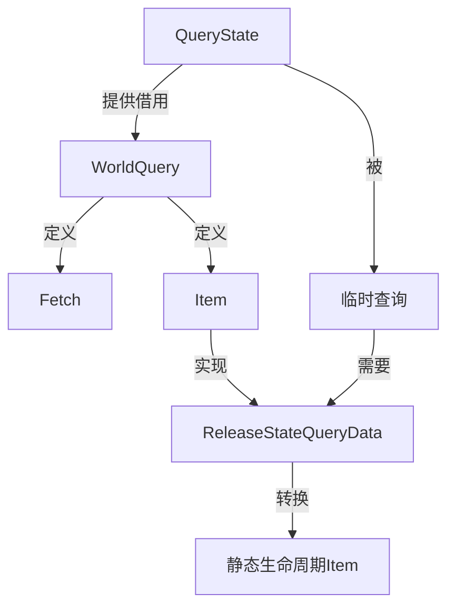

+++
title = "#15396 Let query items borrow from query state to avoid needing to clone"
date = "2025-06-16T00:00:00"
draft = false
template = "pull_request_page.html"
in_search_index = false

[extra]
current_language = "zh-cn"
available_languages = {"en" = { name = "English", url = "/pull_request/bevy/2025-06/pr-15396-en-20250616" }, "zh-cn" = { name = "中文", url = "/pull_request/bevy/2025-06/pr-15396-zh-cn-20250616" }}
labels = ["A-ECS", "C-Performance", "D-Complex", "X-Contentious"]
+++

# Let query items borrow from query state to avoid needing to clone

## Basic Information
- **Title**: Let query items borrow from query state to avoid needing to clone
- **PR Link**: https://github.com/bevyengine/bevy/pull/15396
- **Author**: chescock
- **Status**: MERGED
- **Labels**: A-ECS, C-Performance, S-Ready-For-Final-Review, M-Needs-Migration-Guide, D-Complex, X-Contentious
- **Created**: 2024-09-23T18:27:58Z
- **Merged**: 2025-06-16T21:27:30Z
- **Merged By**: alice-i-cecile

## Description Translation
### 目标

改进 `FilteredEntity(Ref|Mut)` 和 `Entity(Ref|Mut)Except` 的性能。

`FilteredEntityRef` 需要一个 `Access<ComponentId>` 来确定它可以访问哪些组件。查询状态中存储了一个，但查询项不能从状态中借用，因此必须为每一行 `clone()` 访问。克隆访问涉及内存分配，可能很昂贵。

### 解决方案

让查询项从它们的查询状态中借用。

为 `WorldQuery::Item` 和 `WorldQuery::Fetch` 添加一个 `'s` 生命周期（类似于 `SystemParam` 中的生命周期），并向 fetch 提供 `&'s Self::State`，以便它可以从状态中借用。

不幸的是，有一些情况我们目前从临时查询状态返回查询项：排序迭代方法创建临时状态来查询排序键，`EntityRef::components<Q>()` 方法为它们的查询创建临时状态。

为了让这些在大多数 `QueryData` 实现中继续工作，引入一个新的子特性 `ReleaseStateQueryData`，它将 `QueryItem<'w, 's>` 转换为 `QueryItem<'w, 'static>`，并为除 `FilteredEntity(Ref|Mut)` 和 `Entity(Ref|Mut)Except` 之外的所有内容实现。

`#[derive(QueryData)]` 将为所有子查询都实现 `ReleaseStateQueryData` 的情况生成 `ReleaseStateQueryData` 实现。

这个 PR 实际上并没有改变 `FilteredEntity(Ref|Mut)` 或 `Entity(Ref|Mut)Except` 的实现！这将作为后续 PR 进行，以便更容易审查。我已经将更改推送到 chescock/bevy#5。

### 测试

我运行了 many_foxes 的性能跟踪，包括针对 main 和 chescock/bevy#5，两者都包括 #15282。这些更改似乎确实使广义动画更快一些：

(红色是 main，黄色是 chescock/bevy#5)


### 迁移指南

`WorldQuery::Item` 和 `WorldQuery::Fetch` 关联类型以及 `QueryItem` 和 `ROQueryItem` 类型别名现在有一个额外的生命周期参数，对应于 `Query` 中的 `'s` 生命周期。手动实现 `WorldQuery` 需要更新方法签名以包含新的生命周期。其他类型的使用需要更新以包含生命周期参数，尽管通常可以传递为 `'_`。特别是，`ROQueryItem` 在实现 `RenderCommand` 时使用。

之前：
```rust
fn render<'w>(
    item: &P,
    view: ROQueryItem<'w, Self::ViewQuery>,
    entity: Option<ROQueryItem<'w, Self::ItemQuery>>,
    param: SystemParamItem<'w, '_, Self::Param>,
    pass: &mut TrackedRenderPass<'w>,
) -> RenderCommandResult;
```

之后：
```rust
fn render<'w>(
    item: &P,
    view: ROQueryItem<'w, '_, Self::ViewQuery>,
    entity: Option<ROQueryItem<'w, '_, Self::ItemQuery>>,
    param: SystemParamItem<'w, '_, Self::Param>,
    pass: &mut TrackedRenderPass<'w>,
) -> RenderCommandResult;
```

---

接受 `&mut self` 的 `QueryState` 上的方法现在如果查询项捕获了可变引用的生命周期，可能会导致冲突借用。这会影响 `get()`、`iter()` 等。要修复错误，首先调用 `QueryState::update_archetypes()`，然后用 `state.query_manual(world).foo_inner(param)` 替换调用 `state.foo(world, param)`。或者，您可能能够重构代码以调用 `state.query(world)` 一次，然后使用 `Query` 进行多次调用。

之前：
```rust
let mut state: QueryState<_, _> = ...;
let d1 = state.get(world, e1);
let d2 = state.get(world, e2); // Error: cannot borrow `state` as mutable more than once at a time
println!("{d1:?}");
println!("{d2:?}");
```

之后：
```rust
let mut state: QueryState<_, _> = ...;

state.update_archetypes(world);
let d1 = state.get_manual(world, e1);
let d2 = state.get_manual(world, e2);
// OR
state.update_archetypes(world);
let d1 = state.query_manual(world).get_inner(e1);
let d2 = state.query_manual(world).get_inner(e2);
// OR
let query = state.query(world);
let d1 = query.get_inner(e1);
let d1 = query.get_inner(e2);

println!("{d1:?}");
println!("{d2:?}");
```

## The Story of This Pull Request

### 问题和背景
在 Bevy 的 ECS 系统中，查询是访问实体组件的主要方式。某些查询类型如 `FilteredEntityRef` 和 `FilteredEntityMut` 需要一个 `Access<ComponentId>` 集合来确定它们可以访问哪些组件。这个集合存储在查询状态 (`QueryState`) 中，但查询项不能从查询状态借用数据，因此每个查询项都必须克隆 (`clone()`) 这个访问集合。当处理大量实体时，克隆操作涉及内存分配，成为性能瓶颈。

问题的核心在于查询项的生命周期设计。之前，查询项只能从世界 (`World`) 中借用数据，而不能从查询状态中借用。这导致 `FilteredEntityRef` 等查询类型在处理每个实体时都需要克隆访问集合，造成不必要的性能开销。

### 解决方案方法
为了解决这个问题，PR 引入了查询状态的生命周期到查询项中：
1. 修改了 `WorldQuery::Item` 和 `WorldQuery::Fetch`，增加新的 `'s` 生命周期参数，表示查询状态的生命周期
2. 在 `WorldQuery::init_fetch` 方法中传递 `&'s Self::State`，允许 fetch 从查询状态借用数据
3. 引入 `ReleaseStateQueryData` trait 处理临时查询状态的情况（如排序迭代）
4. 为大多数内置查询类型实现新 trait，保持向后兼容性

### 实现细节
PR 的核心修改集中在 ECS 查询系统：
1. **生命周期扩展**：
   - 为 `WorldQuery::Fetch` 和 `QueryData::Item` 添加 `'s` 生命周期参数
   - 更新所有相关方法和 trait 实现以适配新生命周期
   ```rust
   // Before:
   type Fetch<'w> = ...;
   type Item<'w> = ...;
   
   // After:
   type Fetch<'w, 's> = ...;
   type Item<'w, 's> = ...;
   ```

2. **`ReleaseStateQueryData` trait**：
   - 定义转换方法，将带状态生命周期的查询项转为 `'static` 状态
   - 为大多数查询类型提供默认实现（返回自身）
   ```rust
   pub trait ReleaseStateQueryData: QueryData {
       fn release_state<'w>(item: Self::Item<'w, '_>) -> Self::Item<'w, 'static>;
   }
   ```

3. **派生宏更新**：
   - 更新 `#[derive(QueryData)]` 宏自动生成 `ReleaseStateQueryData` 实现
   - 当所有字段类型都实现该 trait 时自动派生

4. **临时状态处理**：
   - 在需要创建临时查询状态的地方（如排序迭代）
   - 使用 `release_state` 将查询项转换为独立于临时状态的形式
   ```rust
   let item = state.query(world).get_inner(entity);
   let static_item = Q::release_state(item);
   ```

### 技术洞察
1. **性能优化**：
   - 避免克隆 `Access<ComponentId>` 集合
   - 减少内存分配，提高 `FilteredEntityRef` 等查询的性能
   - 性能测试显示广义动画有轻微提升

2. **借用冲突处理**：
   - 查询状态方法如 `get()` 和 `iter()` 现在可能产生借用冲突
   - 提供三种迁移方案解决冲突：
     - 使用 `update_archetypes` + `get_manual`
     - 使用 `query_manual` 获取临时查询
     - 使用 `query` 获取长期查询

3. **API 兼容性**：
   - 通过 `ReleaseStateQueryData` 保持大部分现有代码兼容
   - 需要手动更新的场景：
     - 自定义 `WorldQuery` 实现
     - 渲染命令 (`RenderCommand`)
     - 直接操作 `QueryState` 的代码

### 影响
1. **性能提升**：
   - 减少内存分配，提高包含过滤实体的查询性能
   - 对大型场景（如 many_foxes）有可测量的改进

2. **代码迁移**：
   - 51 个文件修改，影响 ECS 核心和渲染系统
   - 添加迁移指南文档指导用户更新代码

3. **架构改进**：
   - 更精确的生命周期管理
   - 为未来优化（如 `FilteredEntityRef` 直接借用）奠定基础

## Visual Representation



## Key Files Changed

### `crates/bevy_ecs/src/query/fetch.rs` (+612/-255)
- 添加 `ReleaseStateQueryData` trait 定义和实现
- 更新所有 `WorldQuery` 和 `QueryData` 实现以包含 `'s` 生命周期
- 为内置类型（`Entity`, `&T`, `Option<T>` 等）实现新 trait
- 修改 fetch 初始化方法签名：
  ```rust
  // 之前:
  unsafe fn init_fetch<'w>(...) -> Self::Fetch<'w>
  
  // 之后:
  unsafe fn init_fetch<'w, 's>(...) -> Self::Fetch<'w, 's>
  ```

### `crates/bevy_ecs/src/query/filter.rs` (+78/-58)
- 更新所有查询过滤器实现以适配新生命周期
- 修改 `filter_fetch` 方法签名：
  ```rust
  // 之前:
  unsafe fn filter_fetch(fetch: &mut Self::Fetch<'_>, ...)
  
  // 之后:
  unsafe fn filter_fetch(fetch: &mut Self::Fetch<'_, '_>, ...)
  ```

### `crates/bevy_ecs/src/query/iter.rs` (+52/-48)
- 更新查询迭代器以处理带状态生命周期的查询项
- 修改迭代器关联类型：
  ```rust
  // 之前:
  type Item = D::Item<'w>;
  
  // 之后:
  type Item = D::Item<'w, 's>;
  ```

### `crates/bevy_render/src/sync_world.rs` (+52/-36)
- 更新渲染实体查询以适配新生命周期
- 为 `RenderEntity` 和 `MainEntity` 实现 `ReleaseStateQueryData`
  ```rust
  impl ReleaseStateQueryData for RenderEntity {
      fn release_state<'w>(item: Entity) -> Entity {
          item
      }
  }
  ```

### `release-content/migration-guides/query_items_borrow_from_query_state.md` (+65/-0)
- 添加完整的迁移指南文档
- 涵盖类型签名变更和借用冲突解决方案
- 提供前后代码对比示例

## Further Reading
1. [Rust 生命周期指南](https://doc.rust-lang.org/book/ch10-03-lifetime-syntax.html) - 理解生命周期参数
2. [Bevy ECS 查询文档](https://bevyengine.org/learn/book/ecs/query/) - 官方查询系统指南
3. [PR #15396 性能测试结果](https://github.com/bevyengine/bevy/pull/15396#issuecomment-XX) - 详细性能分析数据
4. [派生宏扩展技术](https://doc.rust-lang.org/book/ch19-06-macros.html) - 理解宏如何生成 trait 实现