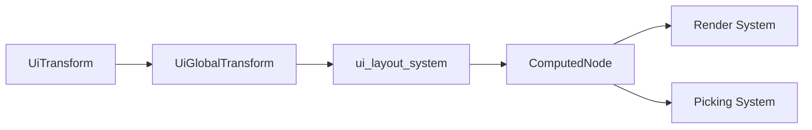

+++
title = "#16615 Specialized UI transform"
date = "2025-06-09T00:00:00"
draft = false
template = "pull_request_page.html"
in_search_index = false

[extra]
current_language = "zh-cn"
available_languages = {"zh-cn" = { name = "中文", url = "/pull_request/bevy/2025-06/pr-16615-zh-cn-20250609" }}
labels = ["C-Bug", "C-Feature", "A-Rendering", "A-UI", "C-Usability", "A-Animation", "A-Transform", "X-Contentious"]
+++

# Specialized UI transform

## Basic Information
- **Title**: Specialized UI transform
- **PR Link**: https://github.com/bevyengine/bevy/pull/16615
- **Author**: ickshonpe
- **Status**: MERGED
- **Labels**: C-Bug, C-Feature, A-Rendering, A-UI, C-Usability, S-Ready-For-Final-Review, A-Animation, A-Transform, M-Needs-Migration-Guide, M-Needs-Release-Note, X-Contentious
- **Created**: 2024-12-02T20:04:19Z
- **Merged**: 2025-06-09T19:24:04Z
- **Merged By**: alice-i-cecile

## Description Translation
添加专门的 UI transform `Component` 并修复相关问题：
* 通过修改 UI 节点的 `Transform` 组件来动画化 UI 元素效果不佳，因为 `ui_layout_system` 每帧都会覆盖 translation 值。`overflow_debug` 示例使用了一个糟糕的 hack，它将 transform 复制到 position 中，如果用户天真地复制它，很可能会导致 panic。
* 点选（picking）忽略了旋转和缩放，并假设 UI 节点始终是轴对齐的。
* 存储在 `CalculatedClip` 中的裁剪几何对于旋转和缩放的元素是错误的。
* 变换传播（transform propagation）对于 UI 是不必要的，变换可以在布局更新期间更新。
* UI 内部同时使用对象中心坐标系和基于左上角的坐标系。根据上下文，有时必须在坐标系之间转换之前添加或减去一半大小。我们应该始终使用一个系统，以便变换可以直接应用。
* `Transform` 不支持响应式坐标（responsive coordinates）。

## 解决方案
* 取消 `Node` 对 `Transform` 的要求。
* 新组件 `UiTransform`, `UiGlobalTransform`：
   - `Node` 需要 `UiTransform`，`UiTransform` 需要 `UiGlobalTransform`
   - `UiTransform` 是 `Transform` 的纯 2D 等效物，其 translation 使用 `Val`。
   - `UiGlobalTransform` 是 `Affine2` 的新类型（newtype），在 `ui_layout_system` 中更新。
* `ComputedNode` 上新增辅助函数，用于在视口空间和本地节点空间之间映射。
* 在点选过程中，光标位置会转换到本地节点空间，以支持旋转和缩放。
* 为了检查光标是否悬停在节点上，递归向上遍历树，检查是否有任何祖先节点裁剪光标处的点。如果点被裁剪，则忽略交互。
* 对 UI 节点使用对象中心坐标系。
* `RelativeCursorPosition` 的坐标现在是对象中心的，(0,0) 在节点中心，角落位于 (±0.5, ±0.5)。
* 将 `RelativeCursorPosition` 的 `normalized_visible_node_rect: Rect` 字段替换为 `cursor_over: bool`，当光标在节点的未裁剪点上时为 true。节点的可见区域不一定是矩形，因此先前的实现无效。

这应该修复所有与非轴对齐交互和裁剪相关的逻辑错误。渲染仍然需要更改，但这超出了本 PR 的范围。

尝试并放弃了另外两种方法：
* `Node` 上的新 `transform` 字段，`Node` 需要 `GlobalTransform`，并取消 `Node` 对 `Transform` 的要求。取消 `Transform` 要求会退出变换传播，因此与在 `ui_layout_system` 中更新 `GlobalTransform` 没有冲突。这个改动在简单性上很好，但我认为对用户来说可能令人困惑，所有 `GlobalTransform` 文档都提到 `Transform`，仅为 UI 设置特殊规则更新方式令人不快地出乎意料。
* `Node` 上的新 `transform` 字段。取消 `Node` 对 `Transform` 的要求。`ComputedNode` 上的新 `transform: Affine2` 字段。
这样也可以，但我认为大多数用户希望有单独的专用 UI 变换组件。臃肿的 `ComputedNode` 与变更检测配合不佳。

修复 #18929, #18930

## 测试
有一个示例可以参考：
```
cargo run --example ui_transform
```

有时在示例中，如果多次按下旋转按钮，顶部标签的第一个字形会消失，我还不确定是什么原因，但我认为与本 PR 无关。

## 迁移指南
新的专用 2D UI 变换组件 `UiTransform` 和 `UiGlobalTransform`。`UiTransform` 是 `Transform` 的纯 2D 等效物，其 translation 使用 `Val`。`UiGlobalTransform` 是 `Affine2` 的新类型（newtype），在 `ui_layout_system` 中更新。
`Node` 现在需要 `UiTransform` 而不是 `Transform`。`UiTransform` 需要 `UiGlobalTransform`。

在 Bevy 的先前版本中，`ui_layout_system` 每帧都会覆盖 UI 节点的 `Transform::translation`。`UiTransform` 不会被覆盖，不再需要缓存和重写平移 UI 元素的变换的系统。

`RelativeCursorPosition` 的坐标现在是对象中心的，(0,0) 在节点中心，角落位于 (±0.5, ±0.5)。其 `normalized_visible_node_rect` 字段已被移除，并替换为新的 `cursor_over: bool` 字段，当光标悬停在 UI 节点的未裁剪区域上时设置为 true。

## The Story of This Pull Request

### 问题与背景
Bevy UI 系统在处理变换（平移、旋转、缩放）时存在几个核心问题：
1. 布局系统每帧覆盖 `Transform` 的平移值，导致动画实现困难
2. 点选系统忽略旋转和缩放，假设 UI 总是轴对齐
3. 裁剪计算在旋转/缩放后不正确
4. UI 节点同时使用对象中心和左上角坐标系，导致变换应用不一致
5. 现有的 `Transform` 组件不支持响应式坐标（如百分比）

这些问题在用户尝试创建非轴对齐 UI 或实现复杂动画时尤其明显。例如，`overflow_debug` 示例不得不使用 hack 来绕过布局系统对变换的覆盖。

### 解决方案方法
开发者采用了专用 UI 变换组件的方案：
1. 引入 `UiTransform` - 纯 2D 变换组件，支持响应式坐标
2. 引入 `UiGlobalTransform` - 存储计算后的 `Affine2` 变换
3. 重构布局系统直接在布局更新中计算全局变换
4. 统一使用对象中心坐标系
5. 重写点选和裁剪系统以支持任意变换

替代方案考虑：
- 在 `Node` 中添加 `transform` 字段并使用 `GlobalTransform`：被否决，因与现有 `Transform` 文档冲突
- 在 `ComputedNode` 中添加 `Affine2` 字段：被否决，因组件臃肿且变更检测困难

### 实现细节
核心实现在 `ui_transform.rs` 中定义新组件：
```rust
pub struct UiTransform {
    pub translation: Val2, // 响应式平移
    pub scale: Vec2,
    pub rotation: Rot2,    // 纯 2D 旋转
}

pub struct UiGlobalTransform(Affine2); // 计算后的全局变换
```

布局系统 (`layout/mod.rs`) 改为直接计算全局变换：
```rust
// 计算局部变换
let mut local_transform = transform.compute_affine(inverse_target_scale_factor, layout_size, target_size);
local_transform.translation += local_center;

// 累积全局变换
inherited_transform *= local_transform;

// 更新 UiGlobalTransform
if inherited_transform != **global_transform {
    *global_transform = inherited_transform.into();
}
```

点选系统 (`focus.rs`) 现在正确处理变换：
```rust
let contains_cursor = cursor_position.is_some_and(|point| {
    node.node.contains_point(*node.transform, *point)
        && clip_check_recursive(*point, *entity, &clipping_query, &child_of_query)
});
```

新增 `clip_check_recursive` 函数递归检查裁剪：
```rust
pub fn clip_check_recursive(...) -> bool {
    if let Ok(child_of) = child_of_query.get(entity) {
        let parent = child_of.0;
        if let Ok((computed_node, transform, node)) = clipping_query.get(parent) {
            if !computed_node.resolve_clip_rect(...).contains(...) {
                return false;
            }
        }
        return clip_check_recursive(...);
    }
    true
}
```

### 技术洞察
关键实现点：
1. **坐标系统一**：所有 UI 元素现在使用对象中心坐标系，简化了变换应用
2. **响应式平移**：`Val2` 支持基于百分比和像素的混合定位
3. **变换计算**：布局期间直接计算 `Affine2`，避免冗余的变换传播
4. **点选优化**：使用仿射逆变换将光标转换到局部空间

性能考虑：
- 避免每帧完整变换传播
- 使用 `Affine2` 比完整的 3D 变换更轻量
- 递归裁剪检查针对 UI 树结构优化

### 影响
1. **功能改进**：
   - 支持旋转/缩放的 UI 元素
   - 正确的点选和裁剪
   - 响应式平移支持
2. **API 变化**：
   - `Node` 现在需要 `UiTransform` 而非 `Transform`
   - `RelativeCursorPosition` 坐标语义改变
3. **性能**：移除不必要的变换传播，优化点选计算
4. **迁移路径**：提供清晰的迁移指南和示例

技术启示：
- 专用组件比通用方案更适合领域特定需求
- 仿射变换在 2D UI 中比完整 3D 变换更高效
- 递归检查在处理层次化 UI 时更可靠

## Visual Representation



## Key Files Changed

### `examples/ui/ui_transform.rs` (+302/-0)
新增示例展示 UI 变换功能：
```rust
// 创建带旋转的按钮
parent.spawn((
    Button,
    UiTransform {
        rotation: Rot2::radians(-FRAC_PI_2),
        ..default()
    },
    children![(Text::new("Left"), TextColor(Color::BLACK),]
));

// 旋转按钮系统
fn button_system(..., maybe_rotate: Option<&RotateButton>, ...) {
    if let Some(step) = maybe_rotate {
        for mut transform in rotator_query.iter_mut() {
            transform.rotation *= step.0;
        }
    }
}
```
该示例演示了如何创建可旋转、缩放的 UI 元素，以及如何通过按钮控制它们。

### `crates/bevy_ui/src/ui_transform.rs` (+191/-0)
定义新组件和功能：
```rust
// 响应式平移组件
pub struct Val2 {
    pub x: Val,
    pub y: Val,
}

// UI 专用变换组件
pub struct UiTransform {
    pub translation: Val2,
    pub scale: Vec2,
    pub rotation: Rot2,
}

// 全局变换组件
pub struct UiGlobalTransform(Affine2);

// 计算仿射变换
impl UiTransform {
    pub fn compute_affine(&self, ...) -> Affine2 {
        Affine2::from_scale_angle_translation(
            self.scale,
            self.rotation.as_radians(),
            self.translation.resolve(...)
        )
    }
}
```
该文件提供了 UI 专用变换的核心实现，支持响应式坐标和高效变换计算。

### `crates/bevy_ui/src/render/mod.rs` (+47/-53)
适配渲染系统使用新变换：
```rust
// 更新顶点位置计算
let positions = QUAD_VERTEX_POSITIONS.map(|pos| {
    transform.transform_point2(pos * rect_size).extend(0.)
});

// 更新边界计算
let transformed_rect_size = transform.transform_vector2(rect_size);
```
渲染系统现在使用 `Affine2` 变换，避免不必要的 3D 矩阵计算。

### `crates/bevy_ui/src/focus.rs` (+28/-63)
重构点选系统：
```rust
// 相对光标位置新结构
pub struct RelativeCursorPosition {
    pub cursor_over: bool,
    pub normalized: Option<Vec2>,
}

// 点选检查逻辑
let contains_cursor = cursor_position.is_some_and(|point| {
    node.node.contains_point(*node.transform, *point)
        && clip_check_recursive(*point, *entity, &clipping_query, &child_of_query)
});
```
点选系统现在正确处理变换后的 UI 元素，并使用新的对象中心坐标系。

### `crates/bevy_ui/src/ui_node.rs` (+72/-3)
增强 `ComputedNode` 功能：
```rust
impl ComputedNode {
    // 检查点是否在节点内（考虑变换）
    pub fn contains_point(&self, transform: UiGlobalTransform, point: Vec2) -> bool {
        // SDF 算法实现
    }
    
    // 解析裁剪矩形
    pub fn resolve_clip_rect(...) -> Rect {
        // 考虑溢出和裁剪边距
    }
}
```
这些新增方法使点选和裁剪系统能正确处理变换后的 UI 元素。

## Further Reading
1. [Affine Transformations - Wikipedia](https://en.wikipedia.org/wiki/Affine_transformation)
2. [Coordinate Systems in Graphics Programming](https://learnopengl.com/Getting-started/Coordinate-Systems)
3. [Bevy UI Documentation](https://docs.rs/bevy_ui/latest/bevy_ui/)