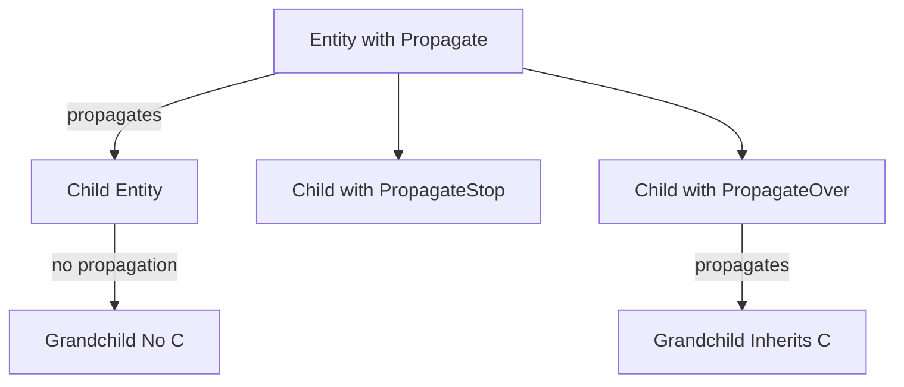

+++
title = "#17575 generic component propagation"
date = "2025-06-06T00:00:00"
draft = false
template = "pull_request_page.html"
in_search_index = true

[taxonomies]
list_display = ["show"]

[extra]
current_language = "en"
available_languages = {"en" = { name = "English", url = "/pull_request/bevy/2025-06/pr-17575-en-20250606" }, "zh-cn" = { name = "中文", url = "/pull_request/bevy/2025-06/pr-17575-zh-cn-20250606" }}
labels = ["C-Feature", "A-ECS", "C-Usability"]
+++

## generic component propagation

### Basic Information
- **Title**: generic component propagation
- **PR Link**: https://github.com/bevyengine/bevy/pull/17575
- **Author**: robtfm
- **Status**: MERGED
- **Labels**: C-Feature, A-ECS, C-Usability, S-Ready-For-Final-Review
- **Created**: 2025-01-28T13:18:49Z
- **Merged**: 2025-06-06T00:24:01Z
- **Merged By**: alice-i-cecile

### Description Translation
**Objective**  
Add functionality to allow propagating components to children. Requested originally for `RenderLayers` but can be useful more generally.

**Solution**  
- Add `HierarchyPropagatePlugin<C, F=()>` which schedules systems to propagate components through entities matching `F`  
- Add `Propagate<C: Component + Clone + PartialEq>` which will cause `C` to be added to all children  
More niche features:  
- Add `PropagateStop<C>` which stops the propagation at this entity  
- Add `PropagateOver<C>` which allows propagation to continue to children but doesn't add/remove/modify `C` on this entity  

**Testing**  
See tests inline  

**Notes**  
- Could happily be an out-of-repo plugin  
- Not sure where it lives: ideally in `bevy_ecs` but requires a `Plugin` so placed in `bevy_app`  
- Perf: This is cheap except for `update_reparented` which checks parent of every moved entity. Since entirely opt-in, acceptable but could use `(Changed<Children>, With<Inherited<C>>)` if needed  

## The Story of This Pull Request

### The Problem and Context
Bevy's ECS needed a generic way to propagate component values through entity hierarchies. The original use case was for `RenderLayers` - components that determine rendering visibility - but developers frequently need similar propagation behavior for other components. Manually managing component inheritance through hierarchies was error-prone and required custom implementations for each component type. A standardized solution was needed that could handle:
- Adding/removing components when hierarchy relationships change
- Propagating through multiple hierarchy levels
- Allowing selective propagation control at intermediate entities
- Maintaining performance in large hierarchies

### The Solution Approach
The implementation introduces a plugin-based system with three core components:
1. **`Propagate<C>`**: Marks an entity as a propagation source for component `C`
2. **`PropagateStop<C>`**: Blocks propagation at the entity
3. **`PropagateOver<C>`**: Allows propagation to children without applying `C` locally

The plugin uses five coordinated systems that run in sequence during the `Update` schedule:
1. `update_source`: Manages initial propagation from sources
2. `update_stopped`: Handles propagation blocking
3. `update_reparented`: Processes hierarchy changes
4. `propagate_inherited`: Propagates through hierarchy levels
5. `propagate_output`: Applies the final component values

Key engineering decisions:
- Uses `Inherited<C>` as an internal marker component to track propagation state
- Opt-in design ensures no overhead for unrelated entities
- Relationships are generic via `R: Relationship` parameter (default `ChildOf`)
- Optional query filter `F` restricts propagation scope

### The Implementation
The core propagation logic handles three main scenarios:

**1. Initial propagation from source entities**  
```rust
// In update_source system
for (entity, source) in &changed {
    commands.entity(entity).try_insert(Inherited(source.0.clone()));
}
```

**2. Handling hierarchy changes**  
```rust
// In update_reparented system
for (entity, relation, maybe_inherited) in &moved {
    if let Ok(inherited) = relations.get(relation.get()) {
        commands.entity(entity).try_insert(inherited.clone());
    } else if maybe_inherited.is_some() {
        commands.entity(entity).remove::<(Inherited<C>, C)>();
    }
}
```

**3. Recursive propagation through hierarchy**  
```rust
// In propagate_inherited system
while let Some((entity, maybe_inherited)) = (*to_process).pop() {
    if maybe_current == maybe_inherited.as_ref() {
        continue;
    }
    
    // Propagate to children
    if let Some(targets) = maybe_targets {
        to_process.extend(targets.iter().map(|target| (target, maybe_inherited.clone())));
    }
    
    // Update current entity
    if let Some(inherited) = maybe_inherited {
        commands.entity(entity).try_insert(inherited.clone());
    } else {
        commands.entity(entity).remove::<(Inherited<C>, C)>();
    }
}
```

The system efficiently handles additions, removals, and hierarchy modifications using Bevy's change detection and commands API.

### Technical Insights
Key implementation details:
- **Change Detection**: Uses `Changed<T>` queries to minimize work
- **Batched Operations**: Processes multiple entities per system run
- **Opt-Out Mechanism**: `PropagateStop` and `PropagateOver` provide granular control
- **Orphan Handling**: Explicitly cleans up components when entities are disconnected
- **Filter Support**: Optional `QueryFilter` restricts propagation scope (though filter changes aren't dynamically reapplied)

Performance considerations:
- The `update_reparented` system checks every moved entity's parent - O(n) complexity for hierarchy changes
- Recursive propagation uses iterative BFS instead of recursion to avoid stack overflows
- Systems are chained to minimize redundant work between passes

### The Impact
This implementation provides:
1. Reusable component propagation for any `Component + Clone + PartialEq`
2. Consistent behavior across different component types
3. Elimination of custom propagation code in downstream crates
4. Flexible control points via `PropagateStop`/`PropagateOver`
5. Near-zero overhead for non-participating entities

The comprehensive test suite validates:
- Basic propagation through multiple levels
- Reparenting scenarios
- Propagation blocking
- Orphan cleanup
- Intermediate overrides
- Filter functionality

## Visual Representation



## Key Files Changed

### crates/bevy_app/src/propagate.rs (+551/-0)
New module implementing the propagation system. Contains:
1. Plugin definition and setup
2. Core components (`Propagate`, `PropagateStop`, `PropagateOver`)
3. Five systems handling different propagation aspects
4. Comprehensive test suite

Key implementation snippet:
```rust
pub struct HierarchyPropagatePlugin<
    C: Component + Clone + PartialEq,
    F: QueryFilter = (),
    R: Relationship = ChildOf,
>(PhantomData<fn() -> (C, F, R)>);

impl<C: Component + Clone + PartialEq, F: QueryFilter + 'static, R: Relationship> Plugin
    for HierarchyPropagatePlugin<C, F, R>
{
    fn build(&self, app: &mut App) {
        app.add_systems(
            Update,
            (
                update_source::<C, F>,
                update_stopped::<C, F>,
                update_reparented::<C, F, R>,
                propagate_inherited::<C, F, R>,
                propagate_output::<C, F>,
            )
                .chain()
                .in_set(PropagateSet::<C>::default()),
        );
    }
}
```

### crates/bevy_app/src/lib.rs (+2/-0)
Registers the new module in Bevy's app infrastructure:
```rust
// Before:
pub use plugin_group::*;
// ... other exports

// After:
pub use propagate::*;
pub use plugin_group::*;
```

## Further Reading
1. [Bevy ECS Relationships Documentation](https://bevyengine.org/learn/book/ecs-relationships/)
2. [Component Change Detection Patterns](https://bevy-cheatbook.github.io/programming/change-detection.html)
3. [Entity Hierarchy Management](https://github.com/bevyengine/bevy/discussions/3971)
4. [Bevy Plugin System Guide](https://bevyengine.org/learn/book/plugins/)