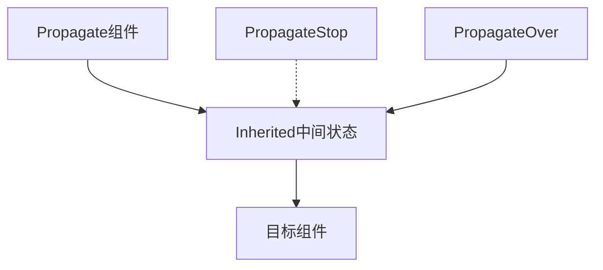

+++
title = "#17575 generic component propagation"
date = "2025-06-06T00:00:00"
draft = false
template = "pull_request_page.html"
in_search_index = false

[extra]
current_language = "zh-cn"
available_languages = {"en" = { name = "English", url = "/pull_request/bevy/2025-06/pr-17575-en-20250606" }, "zh-cn" = { name = "中文", url = "/pull_request/bevy/2025-06/pr-17575-zh-cn-20250606" }}
+++

## generic component propagation

### 基本信息
- **标题**: generic component propagation
- **PR链接**: https://github.com/bevyengine/bevy/pull/17575
- **作者**: robtfm
- **状态**: 已合并
- **标签**: C-Feature, A-ECS, C-Usability, S-Ready-For-Final-Review
- **创建时间**: 2025-01-28T13:18:49Z
- **合并时间**: 2025-06-06T00:24:01Z
- **合并者**: alice-i-cecile

### 描述翻译
添加将组件传播到子实体的功能。最初为`RenderLayers`请求，但可更广泛使用。

#### 解决方案
- 添加`HierarchyPropagatePlugin<C, F=()>`，用于调度系统通过匹配`F`的实体传播组件
- 添加`Propagate<C: Component + Clone + PartialEq>`使`C`被添加到所有子实体
特殊功能：
- `PropagateStop<C>`在该实体停止传播
- `PropagateOver<C>`允许传播继续到子实体，但不在此实体上添加/删除/修改`C`

#### 测试
参考内联测试

#### 注意事项
- 可作为外部插件实现
- 不确定最佳位置：理想在`bevy_ecs`但需要`Plugin`故放在`bevy_app`
- 性能方面：除`update_reparented`需检查每个移动实体的父实体外开销较小，整体可选故可接受

---

## PR技术分析

### 问题背景
在ECS架构中，经常需要将组件值从父实体传播到子实体（如渲染层设置）。现有方案需要手动管理这种传播关系，当实体层级变化时维护成本高且易出错。开发团队需要一种通用机制来自动化组件在实体层级间的传播，同时支持灵活的传播控制（如停止传播或跳过当前实体）。

### 解决方案
实现通用组件传播系统，核心思路是通过`Propagate`组件标记需要传播的源头，使用多个协调工作的system处理不同传播场景：
1. 传播源变更处理
2. 传播停止点处理
3. 重新设置父实体时的传播更新
4. 继承组件的实际传播
5. 输出组件的最终应用

```rust
// 核心系统配置
app.add_systems(
    Update,
    (
        update_source::<C, F>,
        update_stopped::<C, F>,
        update_reparented::<C, F, R>,
        propagate_inherited::<C, F, R>,
        propagate_output::<C, F>,
    )
        .chain()
        .in_set(PropagateSet::<C>::default()),
);
```

### 关键实现细节
1. **传播机制**：使用中间组件`Inherited<C>`跟踪传播状态，避免直接修改目标组件导致的循环依赖
```rust
#[derive(Component, Clone, PartialEq)]
pub struct Inherited<C: Component + Clone + PartialEq>(pub C);
```

2. **传播控制**：
   - `PropagateStop<C>`完全停止传播
   - `PropagateOver<C>`允许传播穿透当前实体但不修改其组件
```rust
#[derive(Component)]
pub struct PropagateStop<C>(PhantomData<fn() -> C>);

#[derive(Component)]
pub struct PropagateOver<C>(PhantomData<fn() -> C>);
```

3. **重新设置父实体处理**：当实体改变父级时，`update_reparented`系统会检测并更新继承状态
```rust
pub fn update_reparented<C: Component + Clone + PartialEq, F: QueryFilter, R: Relationship>(
    // ...检查实体关系变化并更新继承状态
}
```

4. **批量传播优化**：使用本地向量`Local<Vec>`缓存待处理实体，减少每帧迭代次数
```rust
mut to_process: Local<Vec<(Entity, Option<Inherited<C>>)>>,
```

### 技术考量
1. **性能权衡**：`update_reparented`需要检查每个移动实体的父实体，但作者认为在可选功能中可接受
2. **过滤器限制**：查询过滤器`F`的状态变更不会自动触发更新，需要手动刷新（如修改`Propagate`组件）
3. **实体状态处理**：专门处理了孤儿实体（失去父关系的实体）的组件清理

### 实际影响
1. 提供声明式组件传播机制，减少样板代码
2. 支持复杂层级传播场景：
   - 中间实体覆盖传播值
   - 特定实体停止传播链
   - 穿透实体但不修改其状态
3. 通过完整测试覆盖确保可靠性：
   - 简单传播
   - 父实体变更
   - 传播停止
   - 过滤器条件

### 组件关系图



### 关键文件变更

1. **crates/bevy_app/src/propagate.rs** (新增)
```rust
// 核心组件定义
#[derive(Component)]
pub struct PropagateStop<C>(PhantomData<fn() -> C>);

// 重新设置父实体处理系统
pub fn update_reparented<C: Component + Clone + PartialEq, F: QueryFilter, R: Relationship>(
    mut commands: Commands,
    moved: Query</*...*/>,
    relations: Query<&Inherited<C>>,
    orphaned: Query<Entity, (With<Inherited<C>>, Without<Propagate<C>>, Without<R>, F)>,
) {
    // 处理实体关系变更
    // 清理孤儿实体
}
```

2. **crates/bevy_app/src/lib.rs** (修改)
```diff
// 添加propagate模块导出
+ pub use propagate::*;
```

### 延伸阅读
1. [Bevy ECS文档](https://bevyengine.org/learn/book/ecs/)
2. [组件继承模式讨论](https://github.com/bevyengine/bevy/discussions/17531)
3. [实体层级管理](https://bevy-cheatbook.github.io/programming/hierarchy.html)