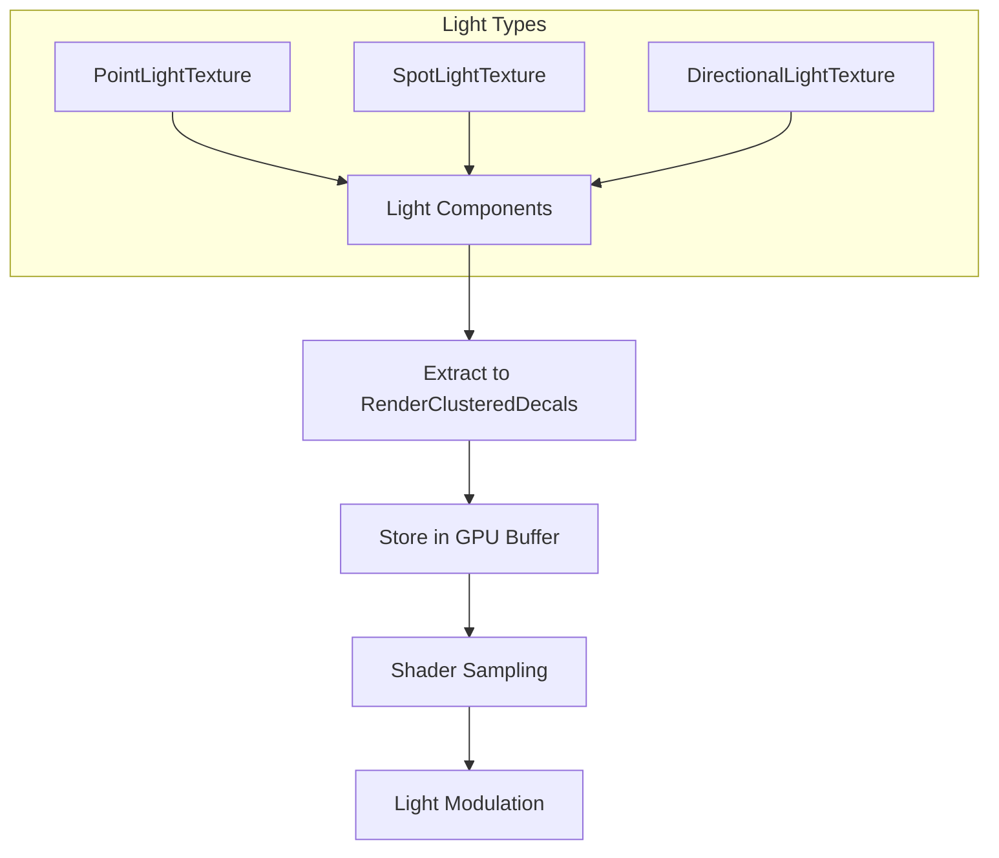

+++
title = "#18031 Light Textures"
date = "2025-06-30T00:00:00"
draft = false
template = "pull_request_page.html"
in_search_index = true

[taxonomies]
list_display = ["show"]

[extra]
current_language = "en"
available_languages = {"en" = { name = "English", url = "/pull_request/bevy/2025-06/pr-18031-en-20250630" }, "zh-cn" = { name = "中文", url = "/pull_request/bevy/2025-06/pr-18031-zh-cn-20250630" }}
labels = ["C-Feature", "A-Rendering"]
+++

## Light Textures: Technical Analysis of PR #18031

### Basic Information
- **Title**: Light Textures
- **PR Link**: https://github.com/bevyengine/bevy/pull/18031
- **Author**: robtfm
- **Status**: MERGED
- **Labels**: C-Feature, A-Rendering, S-Ready-For-Final-Review, M-Needs-Release-Note
- **Created**: 2025-02-25T14:19:50Z
- **Merged**: 2025-06-30T22:17:04Z
- **Merged By**: alice-i-cecile

### Description Translation
This PR adds support for light textures (also known as light cookies, light functions, and light projectors) to modulate light intensity.


#### Solution
- Add components:

```rs
/// Add to a [`PointLight`] to add a light texture effect.
/// A texture mask is applied to the light source to modulate its intensity,  
/// simulating patterns like window shadows, gobo/cookie effects, or soft falloffs.
pub struct PointLightTexture {
    /// The texture image. Only the R channel is read.
    pub image: Handle<Image>,
    /// The cubemap layout. The image should be a packed cubemap in one of the formats described by the [`CubemapLayout`] enum.
    pub cubemap_layout: CubemapLayout,
}

/// Add to a [`SpotLight`] to add a light texture effect.
/// A texture mask is applied to the light source to modulate its intensity,  
/// simulating patterns like window shadows, gobo/cookie effects, or soft falloffs.
pub struct SpotLightTexture {
    /// The texture image. Only the R channel is read.
    /// Note the border of the image should be entirely black to avoid leaking light.
    pub image: Handle<Image>,
}

/// Add to a [`DirectionalLight`] to add a light texture effect.
/// A texture mask is applied to the light source to modulate its intensity,  
/// simulating patterns like window shadows, gobo/cookie effects, or soft falloffs.
pub struct DirectionalLightTexture {
    /// The texture image. Only the R channel is read.
    pub image: Handle<Image>,
    /// Whether to tile the image infinitely, or use only a single tile centered at the light's translation
    pub tiled: bool,
}
```

- Store images to the `RenderClusteredDecals` buffer
- Read the image and modulate the lights
- Add `light_textures` example to showcase the new features

#### Testing
See light_textures example

---

### The Story of This Pull Request

#### The Problem and Context
Bevy's lighting system lacked the ability to modulate light intensity using texture masks, a feature commonly known as light cookies or gobos in computer graphics. This limitation prevented realistic effects like window shadows, projected patterns, or soft light falloffs. The existing clustered decals system (#17868) provided a potential foundation, but required extension to support light-specific texture projection requirements.

#### The Solution Approach
The implementation extends Bevy's rendering system with three new components:
1. `PointLightTexture` for omnidirectional lights using cubemaps
2. `SpotLightTexture` for conical projections
3. `DirectionalLightTexture` for infinite directional lights

Key engineering decisions:
- Reuse the `RenderClusteredDecals` buffer for texture storage
- Add light-specific projection logic in shaders
- Implement cubemap layouts for point lights
- Use existing decal indexing infrastructure
- Add feature flags to control compilation

#### The Implementation
Light textures are treated as specialized decals stored in the existing `RenderClusteredDecals` buffer. During extraction:

```rust
// In extract_decals system
render_decals.insert_decal(
    decal_entity,
    &texture.image.id(),
    global_transform.affine().inverse().into(),
    texture.cubemap_layout as u32, // For point lights
);
```

Shader modifications in `pbr_lighting.wgsl` handle the projection:
```wgsl
#ifdef LIGHT_TEXTURES
if (*light).decal_index != 0xFFFFFFFFu {
    // Calculate texture coordinates based on light type
    texture_sample = textureSampleLevel(...).r;
}
#endif
return color * ... * texture_sample;
```

The `GpuClusterableObject` struct was modified to include decal indices:
```rust
// Before:
pub struct GpuClusterableObject {
    ...
    pub pad_a: f32,
    pub pad_b: f32,
}

// After:
pub struct GpuClusterableObject {
    ...
    pub decal_index: u32,
    pub pad: f32,
}
```

#### Technical Insights
1. **Cubemap Handling**: Point lights require special handling for different cubemap layouts:
   ```rust
   pub enum CubemapLayout {
       CrossVertical,
       CrossHorizontal,
       SequenceVertical,
       SequenceHorizontal,
   }
   ```
   
2. **Shader Complexity**: Each light type requires distinct projection math:
   - Point lights use cubemap UV calculation
   - Spot lights use perspective projection
   - Directional lights support infinite tiling

3. **Resource Management**: Light textures share the decal texture array binding, requiring:
   ```wgsl
   @group(0) @binding(8) var clustered_decal_textures: binding_array<texture_2d<f32>>;
   ```

4. **Feature Gating**: New cargo features control compilation:
   ```toml
   pbr_clustered_decals = ["bevy_pbr?/pbr_clustered_decals"]
   pbr_light_textures = ["bevy_pbr?/pbr_clustered_decals", "bevy_pbr?/pbr_light_textures"]
   ```

#### The Impact
1. New rendering capabilities:
   - Projected textures for all light types
   - Realistic light shaping effects
   - Performance-efficient implementation

2. Codebase changes:
   +706 lines in new example
   +170/-15 in clustered decal handling
   +136/-5 in shader logic

3. Requires clustered decals support:
   ```rust
   cfg!(feature = "pbr_clustered_decals")
   ```

---

### Visual Representation



---

### Key Files Changed

1. **`examples/3d/light_textures.rs` (+706/-0)**
   - New example demonstrating light texture effects
   - Features interactive controls for different light types
   - Includes asset loading and scene setup

2. **`crates/bevy_pbr/src/decal/clustered.rs` (+170/-15)**
   - Added light texture components and cubemap layout enum
   - Modified decal extraction to handle light textures:
   ```rust
   pub fn extract_decals(
       ...
       spot_light_textures: Extract<Query<(...)>>,
       point_light_textures: Extract<Query<(...)>>,
       directional_light_textures: Extract<Query<(...)>>,
   ) {
       // Extraction logic for each light type
   }
   ```
   - Implemented cubemap UV calculation helpers

3. **`crates/bevy_pbr/src/render/pbr_lighting.wgsl` (+136/-5)**
   - Added light texture sampling to lighting calculations:
   ```wgsl
   fn point_light(..., enable_texture: bool) -> vec3<f32> {
       #ifdef LIGHT_TEXTURES
       if enable_texture && (*light).decal_index != 0xFFFFFFFFu {
           // Cubemap sampling logic
       }
       #endif
   }
   ```
   - Implemented projection math for all light types

4. **`crates/bevy_pbr/src/render/light.rs` (+18/-4)**
   - Modified GPU struct to include decal index:
   ```rust
   pub struct GpuClusterableObject {
       ...
       pub decal_index: u32,
       pub pad: f32,
   }
   ```
   - Updated light preparation to handle texture indices

5. **`Cargo.toml` (+17/-0)**
   - Added new features and example:
   ```toml
   [features]
   pbr_clustered_decals = ["bevy_internal/pbr_clustered_decals"]
   pbr_light_textures = ["bevy_internal/pbr_light_textures"]
   
   [[example]]
   name = "light_textures"
   ```

---

### Further Reading
1. [Light Cookies in Computer Graphics](https://en.wikipedia.org/wiki/Texture_mapping#Light_cookies)
2. [Bevy Clustered Decals PR](https://github.com/bevyengine/bevy/pull/17868) (Foundation for this feature)
3. [WGSL Texture Sampling](https://gpuweb.github.io/gpuweb/wgsl/#texturesamplelevel)
4. [Cubemap Texture Layouts](https://learnopengl.com/Advanced-OpenGL/Cubemaps)