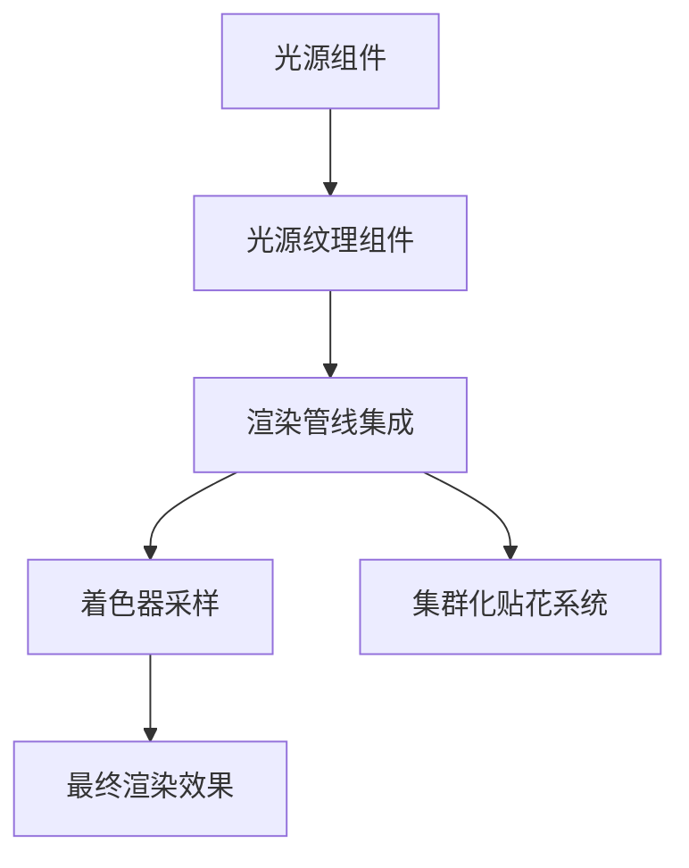

+++
title = "#18031 Light Textures"
date = "2025-06-30T00:00:00"
draft = false
template = "pull_request_page.html"
in_search_index = false

[extra]
current_language = "zh-cn"
available_languages = {"en" = { name = "English", url = "/pull_request/bevy/2025-06/pr-18031-en-20250630" }, "zh-cn" = { name = "中文", url = "/pull_request/bevy/2025-06/pr-18031-zh-cn-20250630" }}
+++

# Light Textures

## 基本信息
- **标题**: Light Textures
- **PR链接**: https://github.com/bevyengine/bevy/pull/18031
- **作者**: robtfm
- **状态**: 已合并
- **标签**: C-Feature, A-Rendering, S-Ready-For-Final-Review, M-Needs-Release-Note
- **创建时间**: 2025-02-25T14:19:50Z
- **合并时间**: 2025-06-30T22:17:04Z
- **合并者**: alice-i-cecile

## 描述翻译
### 目标

添加对光源纹理（也称为light cookies、light functions和light projectors）的支持


### 解决方案

- 添加组件：

```rs
/// 添加到 [`PointLight`] 以添加光源纹理效果。
/// 纹理遮罩应用于光源以调制其强度，
/// 模拟如窗户阴影、gobo/cookie效果或软衰减等模式。
pub struct PointLightTexture {
    /// 纹理图像。仅读取R通道。
    pub image: Handle<Image>,
    /// 立方体贴图布局。图像应为[`CubemapLayout`]枚举描述的格式之一。
    pub cubemap_layout: CubemapLayout,
}

/// 添加到 [`SpotLight`] 以添加光源纹理效果。
/// 纹理遮罩应用于光源以调制其强度，
/// 模拟如窗户阴影、gobo/cookie效果或软衰减等模式。
pub struct SpotLightTexture {
    /// 纹理图像。仅读取R通道。
    /// 注意：图像边界应为纯黑色以避免漏光。
    pub image: Handle<Image>,
}

/// 添加到 [`DirectionalLight`] 以添加光源纹理效果。
/// 纹理遮罩应用于光源以调制其强度，
/// 模拟如窗户阴影、gobo/cookie效果或软衰减等模式。
pub struct DirectionalLightTexture {
    /// 纹理图像。仅读取R通道。
    pub image: Handle<Image>,
    /// 是否无限平铺图像，或仅使用以光源位置为中心的单块
    pub tiled: bool,
}
```

- 将图像存储到`RenderClusteredDecals`缓冲区
- 读取图像并调制光源
- 添加`light_textures`示例以展示新功能

### 测试

见light_textures示例

## 本PR的技术实现分析

### 问题背景
在计算机图形学中，光源纹理（light textures）用于调制光源强度，创建如窗户阴影、gobo/cookie效果或软衰减等视觉效果。在实现此功能前，Bevy引擎缺乏对光源纹理的支持。主要技术挑战包括：

1. 需要支持不同类型光源（点光源、聚光灯、方向光）的不同纹理映射方式
2. 需要将纹理数据集成到现有的集群化渲染管线
3. 需要高效地在着色器中采样和应用纹理

### 解决方案与实现
PR通过以下方式实现了光源纹理功能：

#### 1. 新增光源纹理组件
为三种光源类型添加了专门的纹理组件：
- `PointLightTexture`：点光源纹理，使用立方体贴图布局
- `SpotLightTexture`：聚光灯纹理，使用2D投影
- `DirectionalLightTexture`：方向光纹理，支持平铺选项

这些组件被设计为可选附加组件，与现有光源组件协同工作。

#### 2. 扩展集群化贴花系统
复用现有的`RenderClusteredDecals`系统来存储光源纹理数据：
```rust
pub fn insert_decal(
    &mut self,
    entity: Entity,
    image: &AssetId<Image>,
    local_from_world: Mat4,
    tag: u32,
) {
    let image_index = self.get_or_insert_image(image);
    let decal_index = self.decals.len();
    self.decals.push(RenderClusteredDecal {
        local_from_world,
        image_index,
        tag,
        pad_a: 0,
        pad_b: 0,
    });
    self.entity_to_decal_index.insert(entity, decal_index);
}
```
在提取阶段，系统现在会处理所有类型的光源纹理：
```rust
for (decal_entity, texture, global_transform, view_visibility) in &spot_light_textures {
    // 提取聚光灯纹理...
}
```

#### 3. 着色器实现
在`pbr_lighting.wgsl`中实现了核心纹理采样逻辑：
- **点光源**：使用立方体贴图采样
```wgsl
let decal_uv = cubemap_uv(relative_position, cubemap_type);
texture_sample = textureSampleLevel(...).r;
```
- **聚光灯**：使用投影坐标采样
```wgsl
let decal_uv = (local_position.xy / (local_position.z * (*light).spot_light_tan_angle)) 
    * vec2(-0.5, 0.5) + 0.5;
```
- **方向光**：支持平铺和单次贴图
```wgsl
let decal_uv = local_position.xy * vec2(-0.5, 0.5) + 0.5;
if (tiled) || within_tile {
    texture_sample = textureSampleLevel(...).r;                    
}
```

#### 4. 管线集成
在光源准备阶段，将纹理索引关联到光源：
```rust
decal_index: decals
    .as_ref()
    .and_then(|decals| decals.get(entity))
    .and_then(|index| index.try_into().ok())
    .unwrap_or(u32::MAX)
```
在网格管线中，当启用了`pbr_light_textures`特性时添加`LIGHT_TEXTURES`着色器定义：
```rust
if cfg!(feature = "pbr_light_textures") {
    shader_defs.push("LIGHT_TEXTURES".into());
}
```

#### 5. 新增示例
添加了`light_textures`示例，展示三种光源纹理的应用：
- 点光源：使用立方体贴图纹理
- 聚光灯：使用投影纹理
- 方向光：使用平铺纹理

### 技术考量
1. **性能优化**：复用集群化贴花系统避免了额外存储开销
2. **兼容性**：通过特性标志(`pbr_light_textures`)控制功能启用
3. **灵活性**：支持多种立方体贴图布局格式
4. **资源管理**：使用现有资源处理机制加载和绑定纹理
5. **渲染质量**：在着色器中实现精确的纹理坐标计算

### 影响与改进
1. **功能增强**：为Bevy添加了专业级渲染功能
2. **API扩展**：引入了三个新组件和配置选项
3. **文档完善**：更新了特性文档和示例
4. **未来扩展**：为更复杂的光源效果奠定了基础

## 视觉表示



## 关键文件变更

### `examples/3d/light_textures.rs` (+706/-0)
新增示例展示光源纹理效果：
```rust
// 点光源纹理设置
commands.spawn((
    PointLight { ... },
    PointLightTexture {
        image: asset_server.load("lightmaps/faces_pointlight_texture_blurred.png"),
        cubemap_layout: decal::clustered::CubemapLayout::CrossVertical,
    },
));

// 聚光灯纹理设置
commands.spawn((
    SpotLight { ... },
    SpotLightTexture {
        image: asset_server.load("lightmaps/torch_spotlight_texture.png"),
    },
));
```

### `crates/bevy_pbr/src/decal/clustered.rs` (+170/-15)
扩展集群化贴花系统以支持光源纹理：
```rust
// 新增光源纹理组件
pub struct PointLightTexture { ... }
pub struct SpotLightTexture { ... }
pub struct DirectionalLightTexture { ... }

// 修改提取逻辑
pub fn extract_decals(
    clustered_decals: Extract<...>,
    spot_light_textures: Extract<...>, // 新增
    point_light_textures: Extract<...>, // 新增
    directional_light_textures: Extract<...>, // 新增
    mut render_decals: ResMut<RenderClusteredDecals>,
) {
    // 处理聚光灯纹理
    for (decal_entity, texture, global_transform, view_visibility) in &spot_light_textures {
        render_decals.insert_decal(...);
    }
    // 类似处理其他光源类型...
}
```

### `crates/bevy_pbr/src/render/pbr_lighting.wgsl` (+136/-5)
实现光源纹理采样：
```wgsl
fn point_light(..., enable_texture: bool) -> vec3<f32> {
    var texture_sample = 1f;
#ifdef LIGHT_TEXTURES
    if enable_texture && (*light).decal_index != 0xFFFFFFFFu {
        // 计算立方体贴图UV
        let decal_uv = cubemap_uv(relative_position, cubemap_type);
        texture_sample = textureSampleLevel(...).r;
    }
#endif
    return color * ... * texture_sample; // 应用纹理调制
}
```

### `crates/bevy_pbr/src/render/light.rs` (+18/-4)
在光源准备阶段关联纹理索引：
```rust
// 修改前:
// pad_a: 0.0,
// pad_b: 0.0,

// 修改后:
decal_index: decals
    .as_ref()
    .and_then(|decals| decals.get(entity))
    .and_then(|index| index.try_into().ok())
    .unwrap_or(u32::MAX),
pad: 0.0,
```

### `Cargo.toml` (+17/-0)
添加特性标志和示例配置：
```toml
# 启用集群化贴花
pbr_clustered_decals = ["bevy_internal/pbr_clustered_decals"]

# 启用光源纹理
pbr_light_textures = [
  "bevy_internal/pbr_clustered_decals",
  "bevy_internal/pbr_light_textures",
]

# 注册light_textures示例
[[example]]
name = "light_textures"
path = "examples/3d/light_textures.rs"
```

## 延伸阅读
1. [Bevy渲染管线文档](https://bevyengine.org/learn/book/rendering)
2. [WGSL着色语言规范](https://gpuweb.github.io/gpuweb/wgsl/)
3. [光源纹理技术详解](https://developer.nvidia.com/gpugems/gpugems/part-iii-materials/chapter-19-texturing-lights)
4. [集群化渲染技术](https://community.arm.com/developer/tools-software/graphics-blog/posts/clustered-shading-forward)