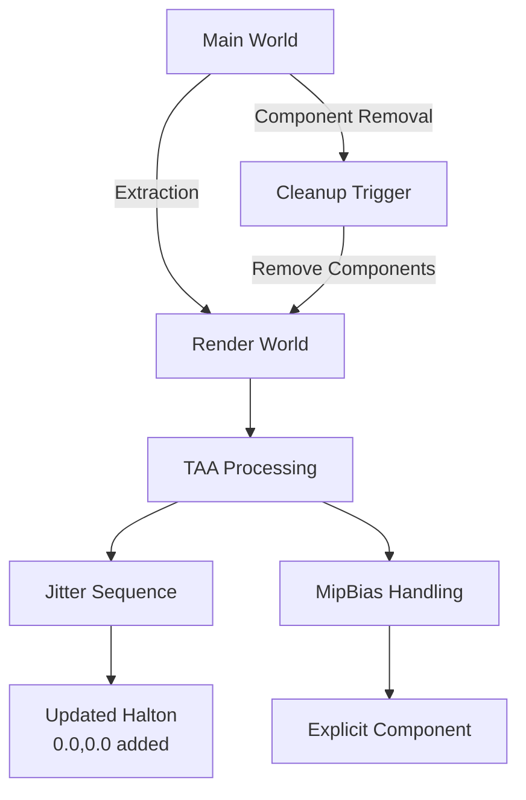

+++
title = "#18349 Make TAA non-experimental, fixes"
date = "2025-06-02T00:00:00"
draft = false
template = "pull_request_page.html"
in_search_index = true

[taxonomies]
list_display = ["show"]

[extra]
current_language = "en"
available_languages = {"en" = { name = "English", url = "/pull_request/bevy/2025-06/pr-18349-en-20250602" }, "zh-cn" = { name = "中文", url = "/pull_request/bevy/2025-06/pr-18349-zh-cn-20250602" }}
labels = ["C-Bug", "A-Rendering", "C-Usability", "X-Contentious", "D-Modest"]
+++

# Analysis of PR #18349: Make TAA non-experimental, fixes

## Basic Information
- **Title**: Make TAA non-experimental, fixes
- **PR Link**: https://github.com/bevyengine/bevy/pull/18349
- **Author**: JMS55
- **Status**: MERGED
- **Labels**: C-Bug, A-Rendering, C-Usability, S-Ready-For-Final-Review, M-Needs-Migration-Guide, X-Contentious, D-Modest
- **Created**: 2025-03-17T02:06:42Z
- **Merged**: 2025-06-02T16:23:43Z
- **Merged By**: alice-i-cecile

## Description Translation
The first 4 commits are designed to be reviewed independently.

- Mark TAA non-experimental now that motion vectors are written for skinned and morphed meshes, along with skyboxes, and add it to DefaultPlugins
- Adjust halton sequence to match what DLSS is going to use, doesn't really affect anything, but may as well
- Make MipBias a required component on TAA instead of inserting it in the render world
- Remove MipBias, TemporalJitter, RenderLayers, etc from the render world if they're removed from the main world (fixes a retained render world bug)
- Remove TAA components from the render world properly if TemporalAntiAliasing is removed from the main world (fixes a retained render world bug)
  - extract_taa_settings() now has to query over `Option<&mut TemporalAntiAliasing>`, which will match every single camera, in order to cover cameras that had TemporalAntiAliasing removed this frame. This kind of sucks, but I can't think of anything better.
  - We probably have the same bug with every other rendering feature component we have.

## The Story of This Pull Request

### The Problem and Context
Temporal Anti-Aliasing (TAA) was previously an experimental feature in Bevy's rendering pipeline. This meant it required explicit plugin registration (`TemporalAntiAliasPlugin`) and had limited integration with the core rendering systems. Additionally, there were two significant technical issues:

1. **Component retention bugs**: When rendering components like `MipBias`, `TemporalJitter`, or `RenderLayers` were removed from the main world, they weren't properly cleaned up in the render world. This led to stale state persisting in the render world.

2. **Automatic component insertion**: TAA would automatically insert a `MipBias(-1.0)` component in the render world if none existed, creating an implicit dependency that wasn't clearly visible in the component requirements.

3. **Inconsistent Halton sequence**: The jitter sequence used didn't match industry standards like DLSS, potentially causing compatibility issues.

### The Solution Approach
The PR solves these problems through several coordinated changes:

1. **Promote TAA to core feature**: Move TAA out of experimental status and include it in `AntiAliasingPlugin`/`DefaultPlugins`.
2. **Require explicit components**: Make `MipBias` a required component for TAA instead of implicitly adding it.
3. **Fix component cleanup**: Ensure rendering components are properly removed from the render world when removed from main world.
4. **Standardize Halton sequence**: Update the jitter sequence to match DLSS standards.

### The Implementation
The implementation required changes across multiple systems:

**Component cleanup logic** was overhauled in the camera extraction system. Previously, components were only added to the render world. Now, they're explicitly removed when missing from main world:

```rust
// In camera extraction system
if let Some(temporal_jitter) = temporal_jitter {
    commands.insert(temporal_jitter.clone());
} else {
    commands.remove::<TemporalJitter>();  // New cleanup logic
}
```

**TAA extraction** was modified to handle optional components. The system now queries for `Option<&mut TemporalAntiAliasing>` to detect when TAA has been removed:

```rust
let mut cameras_3d = main_world.query::<(
    RenderEntity,
    &Camera,
    &Projection,
    Option<&mut TemporalAntiAliasing>,  // Now optional
)>();
```

**MipBias handling** was simplified by making it a required component with a default value:

```rust
#[derive(Component, Reflect, Clone)]
#[reflect(Default, Component)]
pub struct MipBias(pub f32);

impl Default for MipBias {
    fn default() -> Self {
        Self(-1.0)  // Default value established
    }
}
```

**Jitter sequence** was updated to match DLSS standards by adding a (0,0) entry and removing the last point:

```rust
let halton_sequence = [
    vec2(0.0, 0.0),  // New first entry
    vec2(0.0, -0.16666666),
    // ... other entries ...
    // vec2(-0.4375, 0.3888889),  // Removed entry
];
```

### Technical Insights
Key technical decisions include:

1. **Render world synchronization**: The solution addresses a fundamental problem in ECS rendering - components removed from main world must be explicitly removed from render world. This pattern will likely need to be applied to other rendering features.

2. **Query efficiency tradeoff**: Using `Option<&mut TemporalAntiAliasing>` in the extraction query ensures all cameras are checked for TAA removal, but has performance implications since it matches every camera. The author notes this is not ideal but necessary for correctness.

3. **Explicit component requirements**: Changing TAA to require `MipBias` makes dependencies clearer and eliminates "magic" behavior where components were automatically added.

### The Impact
1. **Usability improvement**: TAA is now included in DefaultPlugins, making it accessible without experimental flags.
2. **Bug fixes**: Critical rendering world synchronization bugs are resolved.
3. **Standardization**: Jitter sequence alignment with DLSS improves compatibility.
4. **Migration requirements**: 
   - Projects using experimental TAA must remove explicit plugin registration
   - Cameras using TAA must now include `MipBias` component

## Visual Representation



## Key Files Changed

1. `crates/bevy_anti_aliasing/src/experimental/mod.rs`
   - **Change**: Entire file removed
   - **Why**: TAA is no longer experimental
   - **Impact**: Eliminates experimental namespace

2. `crates/bevy_anti_aliasing/src/lib.rs`
   - **Change**: Added TAA to default plugins
   - **Code**:
```diff
 impl Plugin for AntiAliasingPlugin {
     fn build(&self, app: &mut bevy_app::App) {
-        app.add_plugins((FxaaPlugin, CasPlugin, SmaaPlugin));
+        app.add_plugins((FxaaPlugin, SmaaPlugin, TemporalAntiAliasPlugin, CasPlugin));
     }
 }
```

3. `crates/bevy_anti_aliasing/src/taa/mod.rs`
   - **Changes**:
     - Made MipBias required
     - Fixed TAA component cleanup
     - Updated Halton sequence
   - **Key Code**:
```diff
-#[require(TemporalJitter, DepthPrepass, MotionVectorPrepass)]
+#[require(TemporalJitter, MipBias, DepthPrepass, MotionVectorPrepass)]
```

```diff
-        let mut cameras_3d = main_world.query_filtered::<(
+        let mut cameras_3d = main_world.query::<(
             RenderEntity,
             &Camera,
             &Projection,
-            &mut TemporalAntiAliasing,
-        ), (
-            With<Camera3d>,
-            With<TemporalJitter>,
-            With<DepthPrepass>,
-            With<MotionVectorPrepass>,
+            Option<&mut TemporalAntiAliasing>,
         )>();
```

4. `crates/bevy_render/src/camera/camera.rs`
   - **Change**: Added component cleanup logic
   - **Code**:
```diff
             if let Some(temporal_jitter) = temporal_jitter {
                 commands.insert(temporal_jitter.clone());
+            } else {
+                commands.remove::<TemporalJitter>();
             }
```

5. `examples/3d/transmission.rs`
   - **Change**: Updated TAA usage pattern
   - **Code**:
```diff
-    app.add_plugins(TemporalAntiAliasPlugin);
+    // TAA now part of DefaultPlugins
```

6. `release-content/migration-guides/taa_non_experimental.md`
   - **Change**: New migration guide added
   - **Content**:
```md
TAA is no longer experimental.

`TemporalAntiAliasPlugin` no longer needs to be added to your app to use TAA. It is now part of DefaultPlugins/AntiAliasingPlugin.

`TemporalAntiAliasing` now uses `MipBias` as a required component in the main world, instead of overriding it manually in the render world.
```

## Further Reading
1. [Temporal Anti-Aliasing Explained](https://en.wikipedia.org/wiki/Temporal_anti-aliasing)
2. [Halton Sequence in Rendering](https://www.pbr-book.org/3ed-2018/Sampling_and_Reconstruction/The_Halton_Sampler)
3. [Bevy Render Pipeline Architecture](https://bevyengine.org/learn/book/migration-guides/0.14-to-0.15/#pipelined-rendering)
4. [ECS Render World Pattern](https://github.com/bevyengine/bevy/blob/main/docs/plugins_guidelines.md#rendering-plugins)