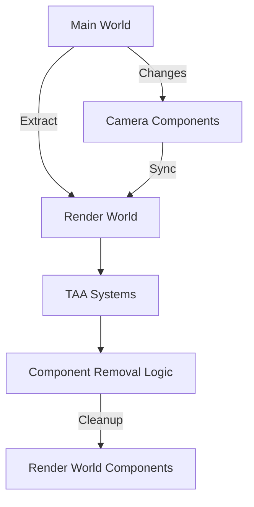

+++
title = "#18349 Make TAA non-experimental, fixes"
date = "2025-06-02T00:00:00"
draft = false
template = "pull_request_page.html"
in_search_index = false

[extra]
current_language = "zh-cn"
available_languages = {"en" = { name = "English", url = "/pull_request/bevy/2025-06/pr-18349-en-20250602" }, "zh-cn" = { name = "中文", url = "/pull_request/bevy/2025-06/pr-18349-zh-cn-20250602" }}
+++

# 技术分析报告：Make TAA non-experimental, fixes

## 基本信息
- **标题**: Make TAA non-experimental, fixes
- **PR链接**: https://github.com/bevyengine/bevy/pull/18349
- **作者**: JMS55
- **状态**: MERGED
- **标签**: C-Bug, A-Rendering, C-Usability, S-Ready-For-Final-Review, M-Needs-Migration-Guide, X-Contentious, D-Modest
- **创建时间**: 2025-03-17T02:06:42Z
- **合并时间**: 2025-06-02T16:23:43Z
- **合并者**: alice-i-cecile

## 描述翻译
前4个提交设计为可独立评审。

- 标记TAA为非实验性功能，因为运动向量现在已为蒙皮网格、变形网格和天空盒写入，并将其加入DefaultPlugins
- 调整halton序列以匹配DLSS将要使用的序列，虽然不影响实质，但保持一致更好
- 使MipBias成为TAA的必需组件，而不是在渲染世界（render world）中插入
- 如果主世界（main world）中移除了MipBias、TemporalJitter、RenderLayers等组件，则同时从渲染世界中移除（修复了一个残留渲染世界的bug）
- 如果主世界中移除了TemporalAntiAliasing组件，则正确地从渲染世界中移除TAA相关组件（修复了另一个残留渲染世界的bug）
  - 现在，extract_taa_settings()必须查询`Option<&mut TemporalAntiAliasing>`，以覆盖那些本帧移除了TemporalAntiAliasing的相机。虽然这样不太理想，但目前没有更好的办法。
  - 我们可能在其他渲染特性组件上也存在同样的bug。

## 这个PR的故事

### 问题和背景
TAA（Temporal Anti-Aliasing，时间性抗锯齿）是Bevy引擎中的一种抗锯齿技术，但之前被标记为实验性功能。这主要因为其依赖的运动向量（motion vectors）没有在所有必要的地方（如蒙皮网格、变形网格和天空盒）正确写入。随着这些问题的解决，TAA可以升级为稳定功能。

此外，PR还暴露了两个关键问题：
1. **组件残留问题**：当主世界中的组件（如MipBias、TemporalJitter等）被移除时，渲染世界中的对应组件没有被移除，导致状态不一致
2. **TAA组件清理问题**：当TAA被禁用时，其相关组件没有从渲染世界中正确移除

### 解决方案
1. **将TAA移出实验性状态**：
   - 删除实验性模块，将TAA插件直接整合到AntiAliasingPlugin中
   - 将TAA加入DefaultPlugins，使其默认启用

2. **修复残留组件问题**：
   - 修改相机组件提取系统，确保当主世界组件被移除时，渲染世界对应组件也被移除
   - 为MipBias组件添加默认实现，简化使用

3. **优化TAA实现**：
   - 调整Halton序列以匹配行业标准（DLSS使用的序列）
   - 重构TAA系统，不再自动插入MipBias组件

### 实现细节
核心变化发生在相机系统和TAA模块中。在`bevy_render/src/camera/camera.rs`中，重构了组件提取逻辑：

```rust
// 处理TemporalJitter组件
if let Some(temporal_jitter) = temporal_jitter {
    commands.insert(temporal_jitter.clone());
} else {
    commands.remove::<TemporalJitter>(); // 新增的清理逻辑
}

// 处理MipBias组件
if let Some(mip_bias) = mip_bias {
    commands.insert(mip_bias.clone());
} else {
    commands.remove::<MipBias>();
}
```

在TAA模块中，主要修改了设置提取和抖动准备系统：

```rust
// 新的TAA设置查询方式
let mut cameras_3d = main_world.query::<(
    RenderEntity,
    &Camera,
    &Projection,
    Option<&mut TemporalAntiAliasing>, // 使用Option处理移除情况
)>();

// 更新后的Halton序列
let halton_sequence = [
    vec2(0.0, 0.0),          // 新增的初始点
    vec2(0.0, -0.16666666),
    vec2(-0.25, 0.16666669),
    // ...其他点
    vec2(0.375, 0.055555582), // 移除了最后一个点
];
```

### 技术洞察
1. **组件生命周期管理**：
   - 解决了渲染世界组件残留的关键问题
   - 实现模式：通过检查主世界的组件存在性，同步管理渲染世界的组件状态

2. **API设计改进**：
   - 将MipBias设为必需组件而非自动插入，提高API明确性
   - 为MipBias提供默认值(-1.0)，简化使用

3. **性能考量**：
   - 使用Option查询虽然增加开销，但解决了更重要的状态一致性问题
   - Halton序列调整不影响性能，但提高与行业标准的一致性

### 影响
1. **功能提升**：
   - TAA成为默认启用的稳定功能
   - 修复了组件残留导致的潜在渲染错误

2. **用户影响**：
   - 用户不再需要手动添加TAA插件
   - 需要确保相机包含MipBias组件（可通过默认实现简化）

3. **代码健康度**：
   - 删除实验性模块，简化代码结构
   - 改进的组件生命周期管理模型可推广到其他渲染功能

## 可视化表示



## 关键文件变更

### 1. `crates/bevy_anti_aliasing/src/taa/mod.rs` (+21/-27)
**变更描述**：重构TAA核心逻辑，解决组件残留问题，优化Halton序列
**关键代码**：
```rust
// 修改后的设置提取查询
let mut cameras_3d = main_world.query::<(
    RenderEntity,
    &Camera,
    &Projection,
    Option<&mut TemporalAntiAliasing>, // 使用Option处理组件移除
)>();

// 更新后的Halton序列
let halton_sequence = [
    vec2(0.0, 0.0),          // 新增
    vec2(0.0, -0.16666666),
    vec2(-0.25, 0.16666669),
    vec2(0.25, -0.3888889),
    vec2(-0.375, -0.055555582),
    vec2(0.125, 0.2777778),
    vec2(-0.125, -0.2777778),
    vec2(0.375, 0.055555582), // 移除了最后一个点
];
```

### 2. `crates/bevy_render/src/camera/camera.rs` (+24/-1)
**变更描述**：增强组件同步逻辑，修复残留组件问题
**关键代码**：
```rust
// 添加组件移除逻辑
if let Some(temporal_jitter) = temporal_jitter {
    commands.insert(temporal_jitter.clone());
} else {
    commands.remove::<TemporalJitter>(); // 新增
}

// 为MipBias添加默认实现
impl Default for MipBias {
    fn default() -> Self {
        Self(-1.0)
    }
}
```

### 3. `examples/3d/transmission.rs` (+9/-13)
**变更描述**：更新示例反映TAA非实验性状态
**关键代码**：
```rust
// 之前：显式添加TAA插件
#[cfg(any(feature = "webgpu", not(target_arch = "wasm32"))]
app.add_plugins(TemporalAntiAliasPlugin);

// 之后：依赖DefaultPlugins中的TAA
App::new()
    .add_plugins(DefaultPlugins) // TAA现在包含在此
```

### 4. `release-content/migration-guides/taa_non_experimental.md` (+10/-0)
**变更描述**：添加迁移指南
**关键内容**：
```markdown
TAA is no longer experimental.

`TemporalAntiAliasPlugin` no longer needs to be added to your app. It is now part of DefaultPlugins/AntiAliasingPlugin.

`TemporalAntiAliasing` now uses `MipBias` as a required component in the main world, instead of overriding it manually in the render world.
```

### 5. `crates/bevy_anti_aliasing/src/experimental/mod.rs` (+0/-9)
**变更描述**：删除实验性模块
**关键变更**：完全移除文件

## 进一步阅读
1. [时间性抗锯齿技术原理](https://en.wikipedia.org/wiki/Temporal_anti-aliasing)
2. [Halton序列在图形学中的应用](https://en.wikipedia.org/wiki/Halton_sequence)
3. [Bevy引擎渲染架构文档](https://bevyengine.org/learn/book/rendering/architecture/)
4. [ECS系统中组件生命周期管理最佳实践](https://github.com/SanderMertens/ecs-faq#component-lifecycle)