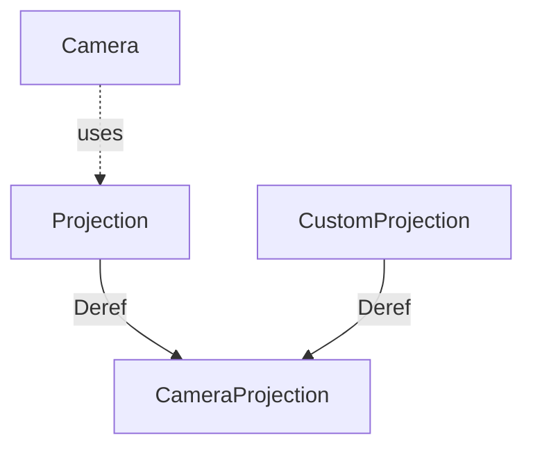

+++
title = "#18458 `Projection` Improvements"
date = "2025-06-24T00:00:00"
draft = false
template = "pull_request_page.html"
in_search_index = true

[taxonomies]
list_display = ["show"]

[extra]
current_language = "en"
available_languages = {"en" = { name = "English", url = "/pull_request/bevy/2025-06/pr-18458-en-20250624" }, "zh-cn" = { name = "中文", url = "/pull_request/bevy/2025-06/pr-18458-zh-cn-20250624" }}
labels = ["A-Rendering", "C-Code-Quality", "C-Usability", "D-Straightforward"]
+++

### Projection Improvements

#### Basic Information
- **Title**: `Projection` Improvements
- **PR Link**: https://github.com/bevyengine/bevy/pull/18458
- **Author**: aevyrie
- **Status**: MERGED
- **Labels**: A-Rendering, C-Code-Quality, C-Usability, S-Ready-For-Final-Review, D-Straightforward
- **Created**: 2025-03-21T05:42:44Z
- **Merged**: 2025-06-24T03:50:30Z
- **Merged By**: alice-i-cecile

#### Description Translation
# Objective

- Remove a component impl footgun
- Make projection code slightly nicer, and remove the need to import the projection trait when using the methods on `Projection`.

## Solution

- Do the things.

#### The Story of This Pull Request

The PR addresses two main issues in Bevy's camera projection system. First, there was a potential footgun in how `CustomProjection` implemented `Deref`, which could lead to accidental bypassing of wrapper functionality. Second, using projection methods required explicitly importing the `CameraProjection` trait, creating unnecessary friction in the API.

The core problem stemmed from the previous implementation of the `Projection` enum and `CustomProjection` struct. `CustomProjection` used derive macros for `Deref` and `DerefMut`, which automatically delegated to the inner `dyn_projection`. While convenient, this approach risked users accidentally dereferencing through the wrapper when implementing their own types, potentially bypassing important functionality. Additionally, the `Projection` enum manually implemented `CameraProjection` through exhaustive pattern matching, which required users to import the trait to call projection methods.

The solution replaces the derive-based `Deref` implementations with manual implementations for both `CustomProjection` and `Projection`. For `CustomProjection`, this means explicitly defining how dereferencing works rather than relying on macro-generated code:

```rust
// Before (using derive):
#[derive(Component, Debug, Reflect, Deref, DerefMut)]
pub struct CustomProjection {
    dyn_projection: Box<dyn sealed::DynCameraProjection>,
}

// After (manual implementation):
pub struct CustomProjection {
    dyn_projection: Box<dyn sealed::DynCameraProjection>,
}

impl Deref for CustomProjection {
    type Target = dyn CameraProjection;

    fn deref(&self) -> &Self::Target {
        self.dyn_projection.as_ref()
    }
}
```

Similarly, the `Projection` enum now implements `Deref` and `DerefMut` to delegate to its inner projection type:

```rust
impl Deref for Projection {
    type Target = dyn CameraProjection;

    fn deref(&self) -> &Self::Target {
        match self {
            Projection::Perspective(projection) => projection,
            Projection::Orthographic(projection) => projection,
            Projection::Custom(projection) => projection.deref(),
        }
    }
}
```

This change eliminates the previous `CameraProjection` trait implementation for `Projection` that used pattern matching. The key technical insight is that by using `Deref` delegation, we maintain the same method call syntax while removing the need for trait imports. When users call `projection.get_clip_from_view()`, it automatically dispatches to the underlying projection through deref coercion.

The impact is twofold: 
1. The footgun is removed because `CustomProjection` no longer uses automatic derive macros, forcing explicit implementation decisions
2. Users no longer need to import `CameraProjection` to use projection methods, reducing cognitive load and import clutter

This change required updating documentation comments throughout the codebase to reference `Projection` instead of `CameraProjection`, and removing unnecessary trait imports in multiple files. The implementation maintains backward compatibility while improving ergonomics.

#### Visual Representation



#### Key Files Changed

1. **crates/bevy_render/src/camera/projection.rs** (+29/-36)  
   Core changes to projection delegation:
   ```rust
   // Before:
   #[derive(Component, Debug, Reflect, Deref, DerefMut)]
   pub struct CustomProjection {
       #[reflect(ignore)]
       #[deref]
       dyn_projection: Box<dyn sealed::DynCameraProjection>,
   }
   
   impl CameraProjection for Projection {
       fn get_clip_from_view(&self) -> Mat4 {
           match self {
               Projection::Perspective(p) => p.get_clip_from_view(),
               // ... other variants
           }
       }
       // ... other trait methods
   }
   
   // After:
   #[derive(Debug, Reflect)]
   pub struct CustomProjection {
       #[reflect(ignore)]
       dyn_projection: Box<dyn sealed::DynCameraProjection>,
   }
   
   impl Deref for CustomProjection {
       type Target = dyn CameraProjection;
       fn deref(&self) -> &Self::Target {
           self.dyn_projection.as_ref()
       }
   }
   
   impl Deref for Projection {
       type Target = dyn CameraProjection;
       fn deref(&self) -> &Self::Target {
           match self {
               Projection::Perspective(p) => p,
               // ... other variants
           }
       }
   }
   ```

2. **crates/bevy_render/src/camera/camera.rs** (+6/-6)  
   Updated documentation to reference `Projection`:
   ```rust
   // Before:
   /// ... projection matrix defined by [`CameraProjection`]
   
   // After:
   /// ... projection matrix defined by [`Projection`]
   ```

3. **crates/bevy_pbr/src/light/mod.rs** (+1/-1)  
   Removed unnecessary trait import:
   ```rust
   // Before:
   use bevy_render::camera::{Camera, CameraProjection, Projection};
   
   // After:
   use bevy_render::camera::{Camera, Projection};
   ```

4. **crates/bevy_render/src/view/visibility/mod.rs** (+1/-1)  
   Removed unused trait import:
   ```rust
   // Before:
   use camera::{Camera, CameraProjection, Projection};
   
   // After:
   use camera::{Camera, Projection};
   ```

#### Further Reading
- [Rust Deref trait documentation](https://doc.rust-lang.org/std/ops/trait.Deref.html)
- [Bevy Camera Projection Documentation](https://docs.rs/bevy_render/latest/bevy_render/camera/projection/index.html)
- [Trait Object Usage Patterns](https://doc.rust-lang.org/book/ch17-02-trait-objects.html)