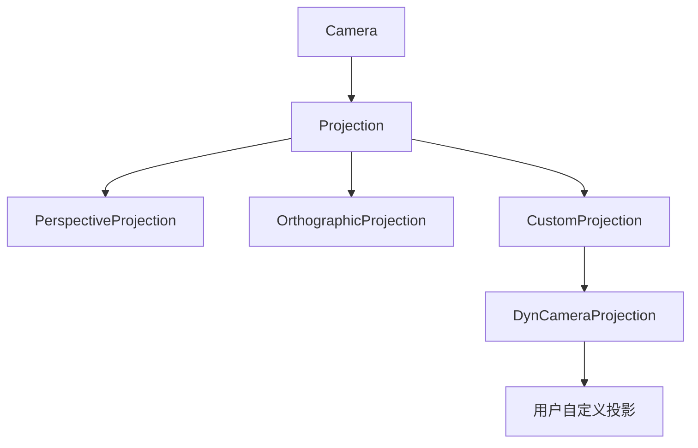

+++
title = "#18458 `Projection` Improvements"
date = "2025-06-24T00:00:00"
draft = false
template = "pull_request_page.html"
in_search_index = false

[extra]
current_language = "zh-cn"
available_languages = {"en" = { name = "English", url = "/pull_request/bevy/2025-06/pr-18458-en-20250624" }, "zh-cn" = { name = "中文", url = "/pull_request/bevy/2025-06/pr-18458-zh-cn-20250624" }}
labels = ["A-Rendering", "C-Code-Quality", "C-Usability", "D-Straightforward"]
+++

# Projection Improvements

## Basic Information
- **Title**: `Projection` Improvements
- **PR Link**: https://github.com/bevyengine/bevy/pull/18458
- **Author**: aevyrie
- **Status**: MERGED
- **Labels**: A-Rendering, C-Code-Quality, C-Usability, S-Ready-For-Final-Review, D-Straightforward
- **Created**: 2025-03-21T05:42:44Z
- **Merged**: 2025-06-24T03:50:30Z
- **Merged By**: alice-i-cecile

## Description Translation
### 目标
- 移除一个组件实现的隐患(footgun)
- 改进投影代码，消除使用`Projection`方法时需要导入投影特性的需求

### 解决方案
- 执行相应修改

## The Story of This Pull Request

这个PR主要解决Bevy渲染系统中投影处理的几个问题。在原始实现中，`Projection`枚举通过手动委托模式实现`CameraProjection`特性(trait)。这意味着对于`Projection`的每个变体(Perspective/Orthographic/Custom)，都需要重复实现所有`CameraProjection`的方法：

```rust
impl CameraProjection for Projection {
    fn get_clip_from_view(&self) -> Mat4 {
        match self {
            Projection::Perspective(projection) => projection.get_clip_from_view(),
            // ...其他变体的重复实现...
        }
    }
    // ...其他方法的重复实现...
}
```

这种方法有两个主要问题：
1. **维护成本高**：每次为`CameraProjection`添加新方法时，都需要在所有投影变体中添加匹配逻辑
2. **潜在错误**：容易遗漏某些方法的实现或委托

更严重的是`CustomProjection`结构体使用了`#[derive(Deref, DerefMut)]`来自动委托到内部`dyn_projection`。这种自动派生存在隐患：
- 暴露了内部实现的`dyn_projection`字段
- 可能意外覆盖或干扰目标特性(trait)的方法
- 调试信息可能泄露内部类型细节

解决方案的核心是重构`Projection`和`CustomProjection`，使用手动实现的`Deref`和`DerefMut`特性进行委托：
1. 为`Projection`枚举实现`Deref`和`DerefMut`，直接委托到具体的投影类型
2. 为`CustomProjection`手动实现`Deref`和`DerefMut`（而不是自动派生）
3. 移除`Projection`上手动实现的`CameraProjection`方法

这种委托模式实现了两个关键改进：
1. **API简化**：用户可以直接在`Projection`上调用`CameraProjection`的方法，无需导入特性或匹配具体类型
2. **安全性提升**：消除了自动派生`Deref`可能导致的封装破坏问题

技术实现上，手动`Deref`实现确保：
- 只暴露`CameraProjection`的方法
- 保持内部实现的封装性
- 避免意外的方法覆盖

```rust
// 手动实现Deref而不是自动派生
impl Deref for CustomProjection {
    type Target = dyn CameraProjection;

    fn deref(&self) -> &Self::Target {
        self.dyn_projection.as_ref()
    }
}
```

在性能方面，这种委托模式没有额外开销，因为编译器会内联这些简单委托。架构上，这保持了投影系统的扩展性，自定义投影仍然可以通过`CustomProjection`实现。

## Visual Representation



## Key Files Changed

### crates/bevy_render/src/camera/projection.rs (+29/-36)
重构了`Projection`和`CustomProjection`的实现，使用手动委托模式替代自动派生和手动匹配。

**关键变更:**
```rust
// Before:
#[derive(Component, Debug, Reflect, Deref, DerefMut)]
pub struct CustomProjection {
    #[reflect(ignore)]
    #[deref]
    dyn_projection: Box<dyn sealed::DynCameraProjection>,
}

// After:
#[derive(Debug, Reflect)]
pub struct CustomProjection {
    #[reflect(ignore)]
    dyn_projection: Box<dyn sealed::DynCameraProjection>,
}

impl Deref for CustomProjection {
    type Target = dyn CameraProjection;

    fn deref(&self) -> &Self::Target {
        self.dyn_projection.as_ref()
    }
}
```

```rust
// Before:
impl CameraProjection for Projection {
    fn get_clip_from_view(&self) -> Mat4 {
        match self {
            Projection::Perspective(projection) => projection.get_clip_from_view(),
            // ...重复实现...
        }
    }
    // ...其他方法...
}

// After:
impl Deref for Projection {
    type Target = dyn CameraProjection;

    fn deref(&self) -> &Self::Target {
        match self {
            Projection::Perspective(projection) => projection,
            Projection::Orthographic(projection) => projection,
            Projection::Custom(projection) => projection.deref(),
        }
    }
}
```

### crates/bevy_render/src/camera/camera.rs (+6/-6)
更新文档注释以反映投影API的变化。

**关键变更:**
```rust
// Before:
/// The projection matrix computed using this camera's [`CameraProjection`].
#[inline]
pub fn clip_from_view(&self) -> Mat4 {
    self.computed.clip_from_view
}

// After:
/// The projection matrix computed using this camera's [`Projection`].
#[inline]
pub fn clip_from_view(&self) -> Mat4 {
    self.computed.clip_from_view
}
```

### crates/bevy_pbr/src/light/mod.rs (+1/-1) 和 crates/bevy_render/src/view/visibility/mod.rs (+1/-1)
清理不再需要的导入。

**关键变更:**
```rust
// Before:
use bevy_render::camera::{Camera, CameraProjection, Projection};

// After:
use bevy_render::camera::{Camera, Projection};
```

## Further Reading
1. [Rust Deref 特性文档](https://doc.rust-lang.org/std/ops/trait.Deref.html)
2. [Bevy 相机和投影系统](https://bevyengine.org/learn/book/features/3d#camera)
3. [Rust 中的委托模式](https://rust-unofficial.github.io/patterns/patterns/behavioural/delegation.html)
4. [特性对象与动态分发](https://doc.rust-lang.org/book/ch17-02-trait-objects.html)