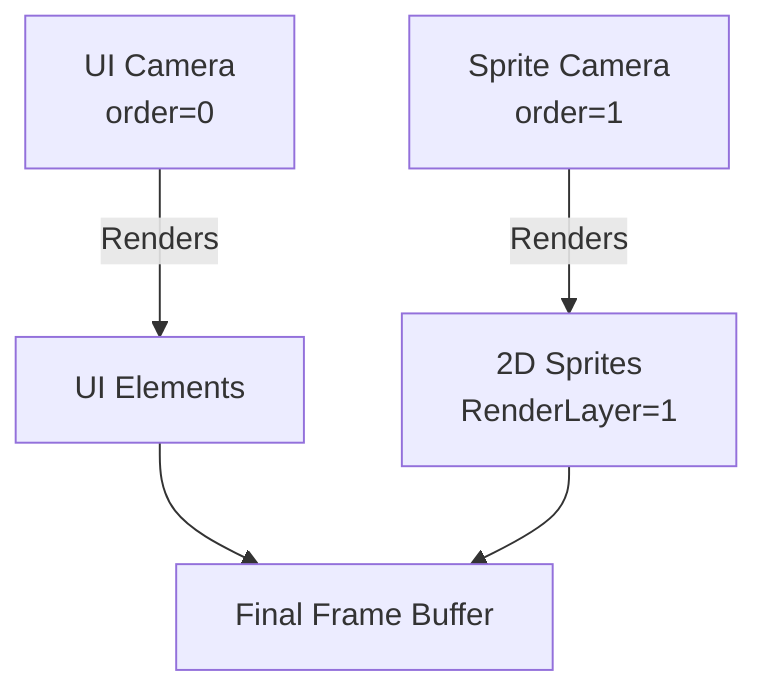

+++
title = "#18513 add 2d_on_ui example"
date = "2025-06-02T00:00:00"
draft = false
template = "pull_request_page.html"
in_search_index = true

[taxonomies]
list_display = ["show"]

[extra]
current_language = "en"
available_languages = {"en" = { name = "English", url = "/pull_request/bevy/2025-06/pr-18513-en-20250602" }, "zh-cn" = { name = "中文", url = "/pull_request/bevy/2025-06/pr-18513-zh-cn-20250602" }}
labels = ["A-Rendering", "C-Examples", "A-UI"]
+++

# Technical Analysis: PR #18513 - "add 2d_on_ui example"

## Basic Information
- **Title**: add 2d_on_ui example
- **PR Link**: https://github.com/bevyengine/bevy/pull/18513
- **Author**: mirsella
- **Status**: MERGED
- **Labels**: A-Rendering, C-Examples, A-UI, S-Ready-For-Final-Review
- **Created**: 2025-03-24T12:35:28Z
- **Merged**: 2025-06-02T22:30:45Z
- **Merged By**: alice-i-cecile

## Description Translation
hello ! im not english native, don't hesitate to correct my code comments.

# Objective

a simple example for new users. This is a question asked a lot, and i struggled to do it at first too.
see https://github.com/bevyengine/bevy/discussions/11223

## Showcase


## The Story of This Pull Request

### The Problem and Context
New Bevy users frequently struggle with rendering 2D objects on top of UI elements, as evidenced by community discussions like [bevyengine/bevy#11223](https://github.com/bevyengine/bevy/discussions/11223). The core challenge arises from Bevy's camera ordering system where UI typically renders last by default, making it difficult to position 2D content above UI elements. This gap in documentation and examples created friction for newcomers trying to implement this common pattern.

### The Solution Approach
The solution leverages Bevy's camera ordering and render layers systems. By creating two cameras with explicit render orders and associating entities with specific render layers, we can control the rendering sequence:
1. A primary camera handles UI rendering (`order: 0`)
2. A secondary camera renders 2D content on a higher layer (`order: 1`)
3. Entities are assigned to specific render layers to control visibility

This approach avoids complex workarounds and demonstrates proper use of Bevy's built-in rendering pipeline. The implementation maintains Bevy's ECS patterns while solving a specific, common problem.

### The Implementation
The example creates two cameras with different rendering orders. The UI camera (`IsDefaultUiCamera`) renders first, followed by a secondary camera configured with:
- Higher render order (`order: 1`)
- Disabled background clearing (`clear_color: ClearColorConfig::None`)
- Dedicated render layer (`RenderLayers::layer(1)`)

```rust
// Secondary camera setup
commands.spawn((
    Camera2d,
    Camera {
        order: 1,
        clear_color: ClearColorConfig::None,
        ..default()
    },
    RenderLayers::layer(1),
));
```

UI elements are rendered to the default camera, while 2D objects are explicitly assigned to the secondary camera's render layer:

```rust
// 2D object assigned to render layer 1
commands.spawn((
    Sprite {
        image: asset_server.load("textures/rpg/chars/sensei/sensei.png"),
        custom_size: Some(Vec2::new(100., 100.)),
        ..default()
    },
    RenderLayers::layer(1),
));
```

A rotation system demonstrates that standard 2D transformations work as expected on these layered entities:

```rust
fn rotate_sprite(time: Res<Time>, mut sprite: Single<&mut Transform, With<Sprite>>) {
    sprite.rotation *=
        Quat::from_rotation_z(time.delta_secs() * 0.5) * Quat::from_rotation_y(time.delta_secs());
}
```

### Technical Insights
Key technical points demonstrated:
- **Camera ordering**: Explicit `order` values control rendering sequence
- **Render layers**: Entities are filtered to specific cameras using `RenderLayers`
- **Background handling**: `ClearColorConfig::None` preserves previous renders
- **UI targeting**: `IsDefaultUiCamera` marker simplifies UI rendering setup

The implementation correctly handles the render graph execution order without modifying core systems, making it a safe addition to the examples.

### The Impact
This example:
1. Solves a common beginner pain point
2. Demonstrates proper use of Bevy's camera and rendering systems
3. Provides reference implementation for layered rendering
4. Reduces support burden by addressing frequent community questions
5. Maintains Bevy's example quality standards with concise, runnable code

The solution is efficient as it uses existing Bevy systems without introducing new abstractions or performance overhead.

## Visual Representation



## Key Files Changed

### `examples/camera/2d_on_ui.rs` (new file)
Added a complete working example demonstrating 2D rendering over UI.

```rust
//! This example shows how to render 2D objects on top of Bevy UI, by using a second camera with a higher `order` than the UI camera.

use bevy::{color::palettes::tailwind, prelude::*, render::view::RenderLayers};

fn main() {
    App::new()
        .add_plugins(DefaultPlugins)
        .add_systems(Startup, setup)
        .add_systems(Update, rotate_sprite)
        .run();
}

fn setup(mut commands: Commands, asset_server: Res<AssetServer>) {
    // The default camera. `IsDefaultUiCamera` makes this the default camera to render UI elements to. Alternatively, you can add the `UiTargetCamera` component to root UI nodes to define which camera they should be rendered to.
    commands.spawn((Camera2d, IsDefaultUiCamera));

    // The second camera. The higher order means that this camera will be rendered after the first camera. We will render to this camera to draw on top of the UI.
    commands.spawn((
        Camera2d,
        Camera {
            order: 1,
            // Don't draw anything in the background, to see the previous camera.
            clear_color: ClearColorConfig::None,
            ..default()
        },
        // This camera will only render entities which are on the same render layer.
        RenderLayers::layer(1),
    ));

    commands.spawn((
        // We could also use a `UiTargetCamera` component here instead of the general `IsDefaultUiCamera`.
        Node {
            width: Val::Percent(100.),
            height: Val::Percent(100.),
            display: Display::Flex,
            justify_content: JustifyContent::Center,
            align_items: AlignItems::Center,
            ..default()
        },
        BackgroundColor(tailwind::ROSE_400.into()),
        children![(
            Node {
                height: Val::Percent(30.),
                width: Val::Percent(20.),
                min_height: Val::Px(150.),
                min_width: Val::Px(150.),
                border: UiRect::all(Val::Px(2.)),
                ..default()
            },
            BorderRadius::all(Val::Percent(25.0)),
            BorderColor::all(Color::WHITE),
        )],
    ));

    // This 2D object will be rendered on the second camera, on top of the default camera where the UI is rendered.
    commands.spawn((
        Sprite {
            image: asset_server.load("textures/rpg/chars/sensei/sensei.png"),
            custom_size: Some(Vec2::new(100., 100.)),
            ..default()
        },
        RenderLayers::layer(1),
    ));
}

fn rotate_sprite(time: Res<Time>, mut sprite: Single<&mut Transform, With<Sprite>>) {
    // Use any of the regular 2D rendering features, for example rotating a sprite via its `Transform`.
    sprite.rotation *=
        Quat::from_rotation_z(time.delta_secs() * 0.5) * Quat::from_rotation_y(time.delta_secs());
}
```

### `Cargo.toml`
Added metadata for the new example.

```diff
[[example]]
name = "2d_on_ui"
path = "examples/camera/2d_on_ui.rs"
doc-scrape-examples = true

[package.metadata.example.2d_on_ui]
name = "2D on Bevy UI"
description = "Shows how to render 2D objects on top of Bevy UI"
category = "Camera"
wasm = true
```

### `examples/README.md`
Added documentation reference for the new example.

```diff
Example | Description
 --- | ---
+[2D on Bevy UI](../examples/camera/2d_on_ui.rs) | Shows how to render 2D objects on top of Bevy UI
```

## Further Reading
1. [Bevy Camera Documentation](https://bevyengine.org/learn/book/getting-started/camera/)
2. [Render Layers Explanation](https://github.com/bevyengine/bevy/blob/main/examples/3d/render_to_texture.rs)
3. [Original Discussion Thread](https://github.com/bevyengine/bevy/discussions/11223)
4. [Bevy UI Rendering System](https://github.com/bevyengine/bevy/blob/main/crates/bevy_ui/src/render/mod.rs)