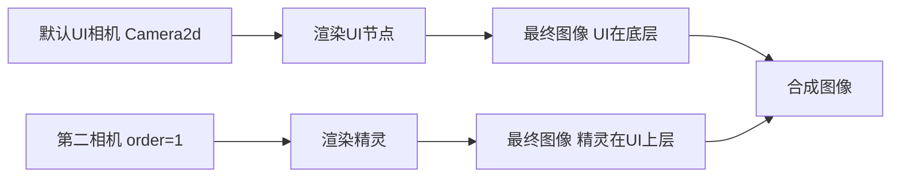

+++
title = "#18513 add 2d_on_ui example"
date = "2025-06-02T00:00:00"
draft = false
template = "pull_request_page.html"
in_search_index = false

[extra]
current_language = "zh-cn"
available_languages = {"en" = { name = "English", url = "/pull_request/bevy/2025-06/pr-18513-en-20250602" }, "zh-cn" = { name = "中文", url = "/pull_request/bevy/2025-06/pr-18513-zh-cn-20250602" }}
+++

# PR 分析报告: add 2d_on_ui example

## 基本信息
- **标题**: add 2d_on_ui example
- **PR 链接**: https://github.com/bevyengine/bevy/pull/18513
- **作者**: mirsella
- **状态**: 已合并
- **标签**: A-Rendering, C-Examples, A-UI, S-Ready-For-Final-Review
- **创建时间**: 2025-03-24T12:35:28Z
- **合并时间**: 2025-06-02T22:30:45Z
- **合并者**: alice-i-cecile

## 描述翻译
hello ! 我不是英语母语者，如有代码注释问题请随时指正。

# 目标

为新手提供一个简单示例。这是经常被问到的问题，我最初实现时也遇到困难。
参考 https://github.com/bevyengine/bevy/discussions/11223

## 效果展示


## 技术实现分析

这个 PR 解决了 Bevy 用户常见的需求：如何在 UI 元素上方渲染 2D 对象。从社区讨论中可见，许多用户（包括作者本人）在实现此功能时遇到困难。核心问题在于理解 Bevy 的相机渲染顺序和渲染层机制。

解决方案的核心是使用两个相机：
1. **默认 UI 相机**：用于渲染基础 UI 元素
2. **第二相机**：配置更高渲染顺序(order=1)，仅渲染特定渲染层(RenderLayer)的实体

关键实现点在于：
1. 第二相机设置 `clear_color: ClearColorConfig::None` 避免覆盖第一相机内容
2. 需要叠加渲染的实体标记为 `RenderLayers::layer(1)`
3. 第二相机也添加相同渲染层，确保只渲染标记实体

示例中创建了一个旋转的精灵(sprite)，始终显示在 UI 元素之上。通过 `rotate_sprite` 系统持续旋转精灵，演示了在 UI 上叠加动态 2D 内容的可行性：

```rust
fn rotate_sprite(time: Res<Time>, mut sprite: Single<&mut Transform, With<Sprite>>) {
    sprite.rotation *=
        Quat::from_rotation_z(time.delta_secs() * 0.5) * Quat::from_rotation_y(time.delta_secs());
}
```

这种实现方式充分利用了 Bevy 现有的渲染管线，无需修改引擎核心代码。通过相机排序(order)和渲染层(RenderLayers)的组合，实现了灵活的渲染层级控制。

## 组件关系图



## 关键文件变更

### 1. `examples/camera/2d_on_ui.rs` (新增文件)
**目的**：实现2D对象在UI上渲染的示例

```rust
//! This example shows how to render 2D objects on top of Bevy UI, by using a second camera with a higher `order` than the UI camera.

use bevy::{color::palettes::tailwind, prelude::*, render::view::RenderLayers};

fn main() {
    App::new()
        .add_plugins(DefaultPlugins)
        .add_systems(Startup, setup)
        .add_systems(Update, rotate_sprite)
        .run();
}

fn setup(mut commands: Commands, asset_server: Res<AssetServer>) {
    // 默认相机，用于渲染UI
    commands.spawn((Camera2d, IsDefaultUiCamera));

    // 第二相机：更高order值使其后渲染
    commands.spawn((
        Camera2d,
        Camera {
            order: 1,
            // 不清除背景以显示前一相机内容
            clear_color: ClearColorConfig::None,
            ..default()
        },
        // 仅渲染相同渲染层的实体
        RenderLayers::layer(1),
    ));

    commands.spawn((
        Node {
            width: Val::Percent(100.),
            height: Val::Percent(100.),
            display: Display::Flex,
            justify_content: JustifyContent::Center,
            align_items: AlignItems::Center,
            ..default()
        },
        BackgroundColor(tailwind::ROSE_400.into()),
        children![(
            Node {
                height: Val::Percent(30.),
                width: Val::Percent(20.),
                min_height: Val::Px(150.),
                min_width: Val::Px(150.),
                border: UiRect::all(Val::Px(2.)),
                ..default()
            },
            BorderRadius::all(Val::Percent(25.0)),
            BorderColor::all(Color::WHITE),
        )],
    ));

    // 此2D对象将在第二相机渲染，位于UI上方
    commands.spawn((
        Sprite {
            image: asset_server.load("textures/rpg/chars/sensei/sensei.png"),
            custom_size: Some(Vec2::new(100., 100.)),
            ..default()
        },
        RenderLayers::layer(1), // 关键：指定渲染层
    ));
}

fn rotate_sprite(time: Res<Time>, mut sprite: Single<&mut Transform, With<Sprite>>) {
    sprite.rotation *=
        Quat::from_rotation_z(time.delta_secs() * 0.5) * Quat::from_rotation_y(time.delta_secs());
}
```

### 2. `Cargo.toml`
**目的**：注册新示例到构建系统

```toml
[[example]]
name = "2d_on_ui"
path = "examples/camera/2d_on_ui.rs"
doc-scrape-examples = true

[package.metadata.example.2d_on_ui]
name = "2D on Bevy UI"
description = "Shows how to render 2D objects on top of Bevy UI"
category = "Camera"
wasm = true
```

### 3. `examples/README.md`
**目的**：在示例目录中添加新示例的文档链接

```markdown
Example | Description
--- | ---
[2D on Bevy UI](../examples/camera/2d_on_ui.rs) | Shows how to render 2D objects on top of Bevy UI
```

## 延伸阅读
1. [Bevy 相机系统文档](https://docs.rs/bevy/latest/bevy/core_pipeline/core_2d/struct.Camera2d.html)
2. [渲染层(RenderLayers)工作原理](https://docs.rs/bevy/latest/bevy/render/view/struct.RenderLayers.html)
3. [UI 渲染排序机制](https://docs.rs/bevy/latest/bevy/ui/entity/struct.UiStack.html)
4. [原始讨论线程](https://github.com/bevyengine/bevy/discussions/11223)