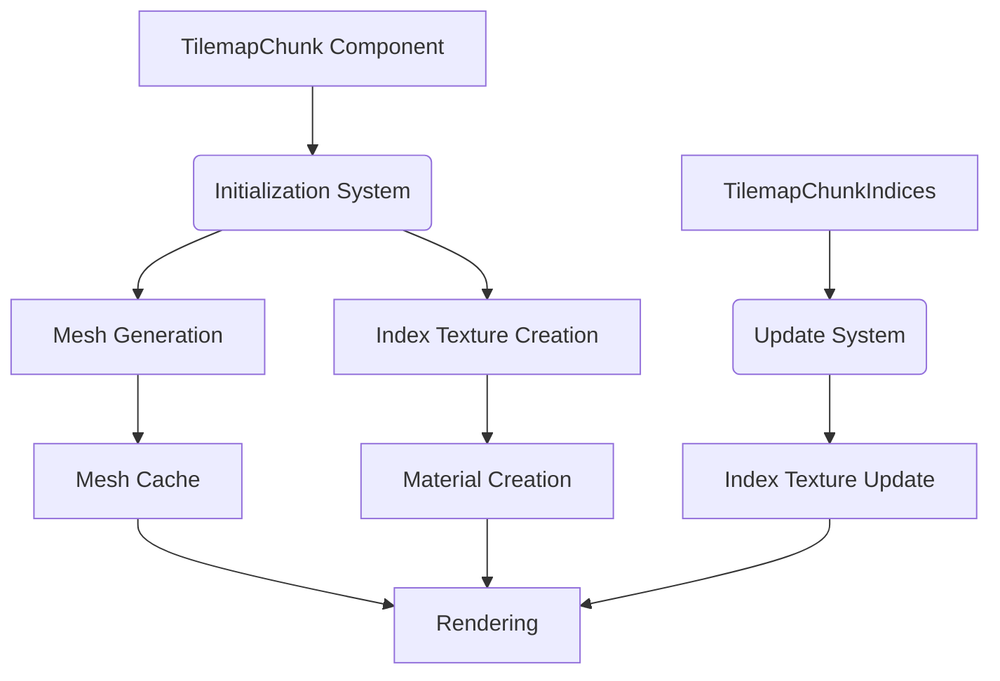

+++
title = "#18866 Add TilemapChunk rendering"
date = "2025-06-24T00:00:00"
draft = false
template = "pull_request_page.html"
in_search_index = true

[taxonomies]
list_display = ["show"]

[extra]
current_language = "en"
available_languages = {"en" = { name = "English", url = "/pull_request/bevy/2025-06/pr-18866-en-20250624" }, "zh-cn" = { name = "中文", url = "/pull_request/bevy/2025-06/pr-18866-zh-cn-20250624" }}
labels = ["C-Feature", "A-Rendering"]
+++

# Technical Analysis of PR #18866: Add TilemapChunk rendering

## Basic Information
- **Title**: Add TilemapChunk rendering
- **PR Link**: https://github.com/bevyengine/bevy/pull/18866
- **Author**: ConnerPetzold
- **Status**: MERGED
- **Labels**: C-Feature, A-Rendering, S-Ready-For-Final-Review, M-Needs-Release-Note
- **Created**: 2025-04-17T05:03:10Z
- **Merged**: 2025-06-24T00:16:01Z
- **Merged By**: alice-i-cecile

## Description Translation
# Objective

An attempt to start building a base for first-party tilemaps (#13782).

The objective is to create a very simple tilemap chunk rendering plugin that can be used as a building block for 3rd-party tilemap crates, and eventually a first-party tilemap implementation.

## Solution

- Introduces two user-facing components, `TilemapChunk` and `TilemapChunkIndices`, and a new material `TilemapChunkMaterial`.
- `TilemapChunk` holds the chunk and tile sizes, and the tileset image
  - The tileset image is expected to be a layered image for use with `texture_2d_array`, with the assumption that atlases or multiple images would go through an asset loader/processor. Not sure if that should be part of this PR or not..
- `TilemapChunkIndices` holds a 1d representation of all of the tile's Option<u32> index into the tileset image.
  - Indices are fixed to the size of tiles in a chunk (though maybe this should just be an assertion instead?)
  - Indices are cloned and sent to the shader through a u32 texture.

## Testing

- Initial testing done with the `tilemap_chunk` example, though I need to include some way to update indices as part of it.
- Tested wasm with webgl2 and webgpu
- I'm thinking it would probably be good to do some basic perf testing.

---

## Showcase

```rust
let chunk_size = UVec2::splat(64);
let tile_size = UVec2::splat(16);
let indices: Vec<Option<u32>> = (0..chunk_size.x * chunk_size.y)
    .map(|_| rng.gen_range(0..5))
    .map(|i| if i == 0 { None } else { Some(i - 1) })
    .collect();

commands.spawn((
    TilemapChunk {
        chunk_size,
        tile_size,
        tileset,
    },
    TilemapChunkIndices(indices),
));
```


## The Story of This Pull Request

### The Problem
Bevy lacked efficient tilemap rendering capabilities. Rendering individual tiles as separate entities would create significant performance overhead due to draw call overhead. This PR addresses the need for a foundational tilemap rendering system that can efficiently render large grids of tiles with minimal draw calls.

### The Solution Approach
The implementation introduces a chunk-based rendering approach where a rectangular group of tiles (a chunk) is rendered as a single mesh. Key engineering decisions:

1. **Chunk Components**: Created two core components:
   - `TilemapChunk` defines chunk properties (size, tile dimensions, tileset)
   - `TilemapChunkIndices` stores tile data as a flat vector of optional indices

2. **Material System**: Developed a custom material (`TilemapChunkMaterial`) that:
   - Samples from a tileset texture array
   - Uses a separate indices texture for tile lookup
   - Handles alpha blending and transparency

3. **Performance Optimization**: 
   - Mesh caching avoids rebuilding geometry for identical chunk configurations
   - Efficient texture updates modify only index data when tiles change
   - Single draw call per chunk regardless of tile count

### Implementation Details
The system works through several coordinated mechanisms:

1. **Initialization** (on_add_tilemap_chunk):
   - Creates a mesh with vertices positioned to form a grid of quads
   - Generates an indices texture from the tile data
   - Sets up material with tileset and indices references

```rust
commands.entity(chunk_entity).insert((
    Mesh2d(mesh.clone()),
    MeshMaterial2d(materials.add(TilemapChunkMaterial {
        tileset: tileset.clone(),
        indices: images.add(indices_image),
        alpha_mode: *alpha_mode,
    })),
));
```

2. **Runtime Updates** (update_tilemap_chunk_indices):
   - When tile indices change, only updates the texture data
   - Avoids expensive mesh regeneration
   - Handles partial updates efficiently

```rust
data.extend(
    indices
        .iter()
        .copied()
        .flat_map(|i| u16::to_ne_bytes(i.unwrap_or(u16::MAX))),
);
```

3. **Shader Implementation**:
   - Vertex shader computes positions and passes tile index
   - Fragment shader samples tileset using index texture
   - Efficiently discards empty tiles (index 0xFFFF)

```wgsl
@fragment
fn fragment(in: VertexOutput) -> @location(0) vec4<f32> {
    let chunk_size = textureDimensions(tile_indices, 0);
    let tile_xy = vec2<u32>(
        in.tile_index % chunk_size.x,
        in.tile_index / chunk_size.x
    );
    let tile_id = textureLoad(tile_indices, tile_xy, 0).r;
    
    if tile_id == 0xffffu {
        discard;
    }
    // ... sample tileset
}
```

### Technical Insights
1. **Texture Handling**: 
   - Uses R16Uint format for index texture (16-bit unsigned integers)
   - Maps `None` values to 0xFFFF (max u16) for efficient discarding
   - Assumes tileset is a texture array for efficient sampling

2. **Mesh Generation**:
   - Creates a single mesh with multiple quads (one per tile)
   - UVs are normalized [0,1] for each tile
   - Anchor point allows flexible positioning

3. **Memory Efficiency**:
   - 16-bit indices reduce memory footprint compared to 32-bit
   - Flat vector storage matches GPU texture layout
   - Option<u16> uses sentinel value instead of separate existence flag

### Impact
This implementation provides:
1. **Performance**: Drastically reduces draw calls (1 per chunk vs 1 per tile)
2. **Flexibility**: Serves as foundation for higher-level tilemap systems
3. **Web Compatibility**: Works with both WebGL2 and WebGPU backends
4. **Ease of Use**: Simple component-based API for spawning tilemap chunks

The example demonstrates updating 50 random tiles per frame with minimal performance impact, showing the efficiency of the texture update mechanism.

## Visual Representation



## Key Files Changed

### crates/bevy_sprite/src/tilemap_chunk/mod.rs
Added core functionality for tilemap chunks:
- Components (`TilemapChunk`, `TilemapChunkIndices`)
- Mesh caching resource (`TilemapChunkMeshCache`)
- Systems for initialization and updates
- Mesh and texture generation utilities

```rust
#[derive(Component, Clone, Debug, Default)]
#[require(Mesh2d, MeshMaterial2d<TilemapChunkMaterial>, TilemapChunkIndices, Anchor)]
pub struct TilemapChunk {
    pub chunk_size: UVec2,
    pub tile_display_size: UVec2,
    pub tileset: Handle<Image>,
    pub alpha_mode: AlphaMode2d,
}

fn make_chunk_image(size: &UVec2, indices: &[Option<u16>]) -> Image {
    Image {
        data: Some(
            indices
                .iter()
                .copied()
                .flat_map(|i| u16::to_ne_bytes(i.unwrap_or(u16::MAX)))
                .collect(),
        ),
        texture_descriptor: TextureDescriptor {
            format: TextureFormat::R16Uint,
            // ...
        },
        // ...
    }
}
```

### crates/bevy_sprite/src/tilemap_chunk/tilemap_chunk_material.rs
Implemented the custom material:
- Defines material properties and bindings
- Specifies shader paths
- Handles specialization for vertex layout

```rust
#[derive(Asset, TypePath, AsBindGroup, Debug, Clone)]
pub struct TilemapChunkMaterial {
    pub alpha_mode: AlphaMode2d,
    
    #[texture(0, dimension = "2d_array")]
    #[sampler(1)]
    pub tileset: Handle<Image>,
    
    #[texture(2, sample_type = "u_int")]
    pub indices: Handle<Image>,
}

impl Material2d for TilemapChunkMaterial {
    fn fragment_shader() -> ShaderRef {
        ShaderRef::Path(/* embedded shader path */)
    }
    // ...
}
```

### crates/bevy_sprite/src/tilemap_chunk/tilemap_chunk_material.wgsl
Added the custom shader:
- Vertex shader computes positions and tile indices
- Fragment shader samples tileset using index texture
- Efficiently discards empty tiles

```wgsl
@fragment
fn fragment(in: VertexOutput) -> @location(0) vec4<f32> {
    let tile_id = textureLoad(tile_indices, tile_xy, 0).r;
    if tile_id == 0xffffu {
        discard;
    }
    // ...
}
```

### examples/2d/tilemap_chunk.rs
Created demonstration example:
- Spawns 64x64 tile chunk
- Periodically updates random tiles
- Shows texture array handling

```rust
commands.spawn((
    TilemapChunk {
        chunk_size: UVec2::splat(64),
        tile_display_size: UVec2::splat(8),
        tileset: assets.load("textures/array_texture.png"),
        ..default()
    },
    TilemapChunkIndices(indices),
    UpdateTimer(Timer::from_seconds(0.1, TimerMode::Repeating)),
));
```

### release-content/release-notes/tilemap-chunk-rendering.md
Added release documentation:
- Explains the new feature
- Provides usage example
- Notes contributors

```markdown
---
title: Tilemap Chunk Rendering
authors: ["@ConnerPetzold", "@grind086", "@IceSentry"]
pull_requests: [18866]
---

A performant way to render tilemap chunks has been added...
```

## Further Reading
1. [Bevy Rendering Architecture](https://bevyengine.org/learn/book/rendering)
2. [WebGPU Shading Language](https://www.w3.org/TR/WGSL/)
3. [Texture Arrays in Graphics Programming](https://learnopengl.com/Advanced-OpenGL/Texture)
4. [Entity Component System Pattern](https://en.wikipedia.org/wiki/Entity_component_system)