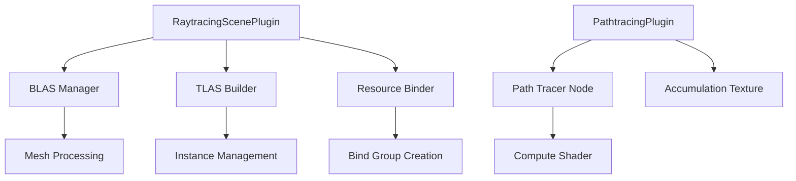

+++
title = "#19058 Initial raytraced lighting progress (bevy_solari)"
date = "2025-06-12T00:00:00"
draft = false
template = "pull_request_page.html"
in_search_index = true

[taxonomies]
list_display = ["show"]

[extra]
current_language = "en"
available_languages = {"en" = { name = "English", url = "/pull_request/bevy/2025-06/pr-19058-en-20250612" }, "zh-cn" = { name = "中文", url = "/pull_request/bevy/2025-06/pr-19058-zh-cn-20250612" }}
labels = ["C-Feature", "A-Rendering", "D-Complex", "X-Contentious"]
+++

# Analysis of PR #19058: Initial raytraced lighting progress (bevy_solari)

## Basic Information
- **Title**: Initial raytraced lighting progress (bevy_solari)
- **PR Link**: https://github.com/bevyengine/bevy/pull/19058
- **Author**: JMS55
- **Status**: MERGED
- **Labels**: C-Feature, A-Rendering, S-Ready-For-Final-Review, D-Complex, M-Needs-Release-Note, X-Contentious
- **Created**: 2025-05-04T16:56:14Z
- **Merged**: 2025-06-12T21:43:13Z
- **Merged By**: cart

## Description Translation
# Bevy Solari 


## Preface
- See release notes.
- Please talk to me in #rendering-dev on discord or open a github discussion if you have questions about the long term plan, and keep discussion in this PR limited to the contents of the PR :)

## Connections
- Works towards #639, #16408.
- Spawned https://github.com/bevyengine/bevy/issues/18993.
- Need to fix RT stuff in naga_oil first https://github.com/bevyengine/naga_oil/pull/116.

## This PR

After nearly two years, I've revived the raytraced lighting effort I first started in https://github.com/bevyengine/bevy/pull/10000.

Unlike that PR, which has realtime techniques, I've limited this PR to:
* `RaytracingScenePlugin` - BLAS and TLAS building, geometry and texture binding, sampling functions.
* `PathtracingPlugin` - A non-realtime path tracer intended to serve as a testbed and reference.

## What's implemented?


* BLAS building on mesh load
* Emissive lights
* Directional lights with soft shadows
* Diffuse (lambert, not Bevy's diffuse BRDF) and emissive materials
* A reference path tracer with:
  * Antialiasing
  * Direct light sampling (next event estimation) with 0/1 MIS weights
  * Importance-sampled BRDF bounces
  * Russian roulette 

## What's _not_ implemented?
* Anything realtime, including a real-time denoiser
* Integration with Bevy's rasterized gbuffer
* Specular materials
* Non-opaque geometry
* Any sort of CPU or GPU optimizations
  * BLAS compaction, proper bindless, and further RT APIs are things that we need wgpu to add
* PointLights, SpotLights, or skyboxes / environment lighting 
* Support for materials other than StandardMaterial (and only a subset of properties are supported)
* Skinned/morphed or otherwise animating/deformed meshes
* Mipmaps
* Adaptive self-intersection ray bias
* A good way for developers to detect whether the user's GPU supports RT or not, and fallback to baked lighting.
* Documentation and actual finalized APIs (literally everything is subject to change)

## End-user Usage
* Have a GPU that supports RT with inline ray queries
* Add `SolariPlugin` to your app
* Ensure any `Mesh` asset you want to use for raytracing has `enable_raytracing: true` (defaults to true), and that it uses the standard uncompressed position/normal/uv_0/tangent vertex attribute set, triangle list topology, and 32-bit indices.
  * If you don't want to build a BLAS and use the mesh for RT, set enable_raytracing to false.
* Add the `RaytracingMesh3d` component to your entity (separate from `Mesh3d` or `MeshletMesh3d`).

## Testing

- Did you test these changes? If so, how? 
  - Ran the solari example.
- Are there any parts that need more testing?
  - Other test scenes probably. Normal mapping would be good to test.
- How can other people (reviewers) test your changes? Is there anything specific they need to know?
  - See the solari.rs example for how to setup raytracing.
- If relevant, what platforms did you test these changes on, and are there any important ones you can't test?
  - Windows 11, NVIDIA RTX 3080.

## The Story of This Pull Request

This PR introduces the foundation for raytraced lighting in Bevy through the new `bevy_solari` crate. The implementation focuses on building the necessary infrastructure for acceleration structures and provides a non-realtime path tracer as a reference implementation.

### Problem and Context
Bevy's existing lighting solutions rely on rasterization techniques, which have inherent limitations in handling complex lighting scenarios like global illumination. Raytraced lighting can provide more realistic results but requires significant GPU capabilities and specialized data structures. The challenge was to create a foundation for raytracing in Bevy that could be built upon in future iterations.

### Solution Approach
The implementation is structured around two main plugins:
1. `RaytracingScenePlugin`: Handles Bottom-Level Acceleration Structure (BLAS) and Top-Level Acceleration Structure (TLAS) creation
2. `PathtracingPlugin`: Provides a reference path tracer for validation

The solution uses inline ray queries via WGSL's ray query API, avoiding full ray tracing pipelines for wider hardware compatibility. Key engineering decisions include:
- Using acceleration structures compatible with current wgpu capabilities
- Implementing a mesh flag (`enable_raytracing`) to control BLAS creation
- Creating separate components (`RaytracingMesh3d`) for raytracing-specific data

### Implementation Details
The implementation adds:
1. BLAS management that builds acceleration structures when meshes are loaded
2. TLAS construction that aggregates scene instances
3. Bind group management for GPU resource access
4. A path tracer compute shader for reference rendering

Mesh compatibility is enforced through vertex attribute checks:
```rust
fn is_mesh_raytracing_compatible(mesh: &Mesh) -> bool {
    let triangle_list = mesh.primitive_topology() == PrimitiveTopology::TriangleList;
    let vertex_attributes = mesh.attributes().map(|(attribute, _)| attribute.id).eq([
        Mesh::ATTRIBUTE_POSITION.id,
        Mesh::ATTRIBUTE_NORMAL.id,
        Mesh::ATTRIBUTE_UV_0.id,
        Mesh::ATTRIBUTE_TANGENT.id,
    ]);
    let indexed_32 = matches!(mesh.indices(), Some(Indices::U32(..)));
    mesh.enable_raytracing && triangle_list && vertex_attributes && indexed_32
}
```

The path tracer implements core rendering techniques:
```wgsl
fn pathtrace(@builtin(global_invocation_id) global_id: vec3<u32>) {
    // ... setup RNG, shoot primary ray ...
    
    // Path tracing loop
    var radiance = vec3(0.0);
    var throughput = vec3(1.0);
    loop {
        let ray_hit = trace_ray(ray_origin, ray_direction, ray_t_min, RAY_T_MAX, RAY_FLAG_NONE);
        if ray_hit.kind != RAY_QUERY_INTERSECTION_NONE {
            // ... evaluate material, sample lighting ...
            
            // Russian roulette termination
            let p = luminance(throughput);
            if rand_f(&rng) > p { break; }
            throughput /= p;
        } else { break; }
    }
    
    // ... accumulate results ...
}
```

### Technical Insights
Key technical aspects include:
1. **Acceleration Structures**: Uses BLAS for mesh geometry and TLAS for scene instances
2. **Resource Binding**: Creates large bind groups for textures, buffers, and acceleration structures
3. **Sampling Techniques**: Implements cosine-weighted hemisphere sampling and light source sampling
4. **Material System**: Supports a subset of StandardMaterial properties for raytracing

The implementation requires specific GPU features enabled through wgpu:
```rust
impl SolariPlugin {
    pub fn required_wgpu_features() -> WgpuFeatures {
        WgpuFeatures::EXPERIMENTAL_RAY_TRACING_ACCELERATION_STRUCTURE
            | WgpuFeatures::EXPERIMENTAL_RAY_QUERY
            | WgpuFeatures::BUFFER_BINDING_ARRAY
            | WgpuFeatures::TEXTURE_BINDING_ARRAY
            // ... additional features ...
    }
}
```

### Impact
This PR:
1. Adds foundational infrastructure for future raytraced lighting solutions
2. Provides a reference path tracer for validation and testing
3. Introduces new components and APIs for raytracing-specific data
4. Sets the stage for future realtime global illumination solutions

The implementation is explicitly not optimized for realtime use yet, serving instead as a testbed for future development. Key limitations around performance, material support, and hardware compatibility will be addressed in subsequent PRs.

## Visual Representation



## Key Files Changed

1. `crates/bevy_solari/src/scene/binder.rs` (+366/-0)
   - Manages GPU resource binding for raytracing
   - Creates bind groups for acceleration structures, buffers, and textures
   - Implements material processing for raytracing

```rust
pub fn prepare_raytracing_scene_bindings(
    // ... query parameters ...
) {
    // ... resource binding logic ...
    let bind_group = render_device.create_bind_group(
        "raytracing_scene_bind_group",
        &layout,
        &BindGroupEntries::sequential((
            vertex_buffers.as_slice(),
            index_buffers.as_slice(),
            textures.as_slice(),
            // ... additional resources ...
        )),
    ));
}
```

2. `crates/bevy_solari/src/scene/blas.rs` (New File)
   - Manages Bottom-Level Acceleration Structures (BLAS)
   - Processes meshes for raytracing compatibility
   - Handles BLAS creation and updates

```rust
fn prepare_raytracing_blas(
    mut blas_manager: ResMut<BlasManager>,
    extracted_meshes: Res<ExtractedAssets<RenderMesh>>,
    // ... other resources ...
) {
    // ... BLAS management logic ...
    let blas = render_device.wgpu_device().create_blas(
        &CreateBlasDescriptor { /* ... */ },
        BlasGeometrySizeDescriptors::Triangles { /* ... */ },
    );
}
```

3. `crates/bevy_solari/src/pathtracer/node.rs` (+134/-0)
   - Implements the path tracer compute node
   - Manages the accumulation texture
   - Dispatches the path tracing compute shader

```rust
pub fn run(
    &self,
    _graph: &mut RenderGraphContext,
    render_context: &mut RenderContext,
    // ... query items ...
    world: &World,
) -> Result<(), NodeRunError> {
    // ... path tracing implementation ...
    let mut pass = command_encoder.begin_compute_pass(&ComputePassDescriptor {
        label: Some("pathtracer"),
    });
    pass.set_pipeline(pipeline);
    pass.set_bind_group(0, scene_bindings, &[]);
    pass.dispatch_workgroups(/* ... */);
}
```

4. `crates/bevy_mesh/src/mesh.rs` (Modification)
   - Adds `enable_raytracing` flag to Mesh
   - Controls whether BLAS is built for a mesh

```rust
pub struct Mesh {
    // ... existing fields ...
    pub enable_raytracing: bool,
}
```

5. `crates/bevy_solari/src/lib.rs` (New File)
   - Main crate entry point
   - Defines plugin structure and required features

```rust
pub struct SolariPlugin;

impl Plugin for SolariPlugin {
    fn build(&self, app: &mut App) {
        app.add_plugins((RaytracingScenePlugin, PathtracingPlugin));
    }
}
```

## Further Reading
1. [WGSL Ray Query Specification](https://www.w3.org/TR/WGSL/#ray-query)
2. [Ray Tracing Gems](http://raytracinggems.com/)
3. [Bevy Rendering Architecture](https://bevyengine.org/learn/book/rendering/)
4. [WGPU Acceleration Structure API](https://gpuweb.github.io/gpuweb/#acceleration-structure)

This PR establishes the architectural foundation for raytraced lighting in Bevy while explicitly limiting scope to non-realtime applications initially. The implementation provides valuable infrastructure that will enable more advanced realtime solutions in future iterations.