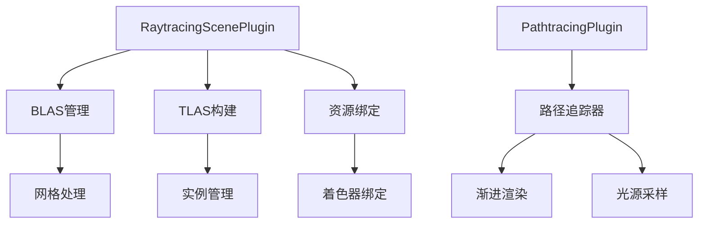

+++
title = "#19058 Initial raytraced lighting progress (bevy_solari)"
date = "2025-06-12T00:00:00"
draft = false
template = "pull_request_page.html"
in_search_index = false

[extra]
current_language = "zh-cn"
available_languages = {"en" = { name = "English", url = "/pull_request/bevy/2025-06/pr-19058-en-20250612" }, "zh-cn" = { name = "中文", url = "/pull_request/bevy/2025-06/pr-19058-zh-cn-20250612" }}
+++

# 初始光线追踪光照进展（bevy_solari）

## 基本信息
- **标题**: Initial raytraced lighting progress (bevy_solari)
- **PR 链接**: https://github.com/bevyengine/bevy/pull/19058
- **作者**: JMS55
- **状态**: MERGED
- **标签**: C-Feature, A-Rendering, S-Ready-For-Final-Review, D-Complex, M-Needs-Release-Note, X-Contentious
- **创建时间**: 2025-05-04T16:56:14Z
- **合并时间**: 2025-06-12T21:43:13Z
- **合并者**: cart

## 描述翻译
# Bevy Solari 


## 前言
- 参见发布说明。
- 如有关于长期计划的问题，请在 Discord 的 #rendering-dev 频道与我讨论，或开启 GitHub 讨论，请将本 PR 的讨论限制在 PR 内容范围内 :)

## 关联
- 推进 #639, #16408。
- 衍生 https://github.com/bevyengine/bevy/issues/18993。
- 需要先在 naga_oil 修复 RT 相关内容 https://github.com/bevyengine/naga_oil/pull/116。

## 本 PR

经过近两年时间，我重启了最初在 https://github.com/bevyengine/bevy/pull/10000 开始的光线追踪工作。

与包含实时技术的前一个 PR 不同，本 PR 限定于：
* `RaytracingScenePlugin` - BLAS 和 TLAS 构建、几何和纹理绑定、采样函数。
* `PathtracingPlugin` - 非实时路径追踪器，用作测试平台和参考。

## 实现了什么？


* 在网格加载时构建 BLAS
* 自发光光源
* 带软阴影的定向光
* 漫反射材质（Lambert，非 Bevy 的漫反射 BRDF）和自发光材质
* 参考路径追踪器包含：
  * 抗锯齿
  * 直接光采样（next event estimation）带 0/1 MIS 权重
  * 重要性采样 BRDF 反弹
  * Russian roulette 终止

## 未实现的内容？
* 任何实时功能，包括实时降噪器
* 与 Bevy 的光栅化 G-buffer 集成
* 镜面反射材质
* 非透明几何体
* CPU 或 GPU 优化
  * BLAS 压缩、合适的无绑定和进一步 RT API 需要 wgpu 支持
* 点光源、聚光灯或天空盒/环境光照
* 除 StandardMaterial 外的其他材质支持（仅支持部分属性）
* 蒙皮/变形或其他动画/变形网格
* Mipmaps
* 自适应自相交光线偏移
* 开发者检测用户 GPU 是否支持 RT 并回退到烘焙光照的方案
* 文档和最终确定的 API（所有内容都可能更改）

## 终端用户用法
* 拥有支持内联光线查询 RT 的 GPU
* 在应用中添加 `SolariPlugin`
* 确保用于光线追踪的 `Mesh` 资源设置 `enable_raytracing: true`（默认为 true），并使用标准未压缩的位置/法线/uv_0/切线顶点属性集、三角形列表拓扑和 32 位索引。
  * 若不想为网格构建 BLAS 用于 RT，设置 enable_raytracing 为 false。
* 在实体上添加 `RaytracingMesh3d` 组件（独立于 `Mesh3d` 或 `MeshletMesh3d`）。

## 测试
- 是否测试了这些更改？如何测试的？
  - 运行了 solari 示例。
- 是否有部分需要更多测试？
  - 可能需要其他测试场景。法线贴图值得测试。
- 其他人（评审者）如何测试你的更改？他们需要了解什么特定信息？
  - 参考 solari.rs 示例了解如何设置光线追踪。
- 若相关，你在哪些平台上测试了这些更改，有哪些重要平台无法测试？
  - Windows 11, NVIDIA RTX 3080。

## PR 技术分析

### 问题背景
Bevy 引擎需要现代光线追踪解决方案来解决传统光栅化渲染的局限性。现有光照方案（如阴影贴图和环境光遮蔽）在动态场景和全局光照方面存在质量和性能限制。开发者需要一种利用现代 GPU 硬件能力的方案，支持动态场景的实时全局光照、软阴影和精确反射。

技术挑战包括：
- 缺乏加速结构管理（BLAS/TLAS）
- 缺少材质/光照的统一绑定接口
- 无路径追踪参考实现
- 需要与 Bevy 的 ECS 和渲染管线集成

### 解决方案
本 PR 引入 `bevy_solari` 模块作为光线追踪基础，分为两个核心插件：
1. `RaytracingScenePlugin`：处理底层加速结构（BLAS/TLAS）、资源绑定和采样函数
2. `PathtracingPlugin`：提供非实时路径追踪器作为参考实现

关键工程决策：
- 使用 WGSL 编写核心光线追踪着色器
- 通过 `RaytracingMesh3d` 组件将光线追踪网格与光栅化网格分离
- 新增 `enable_raytracing` 网格属性控制 BLAS 构建
- 利用 wgpu 的实验性光线追踪扩展（`RAY_QUERY`, `RAY_TRACING_ACCELERATION_STRUCTURE`）

### 实现细节
#### 加速结构管理
```rust
// 文件: crates/bevy_solari/src/scene/blas.rs
fn prepare_raytracing_blas(...) {
    // 为兼容网格创建 BLAS
    let blas_size = BlasTriangleGeometrySizeDescriptor {
        vertex_format: Mesh::ATTRIBUTE_POSITION.format,
        vertex_count: vertex_slice.range.len() as u32,
        index_format: Some(IndexFormat::Uint32),
        // ...
    };
    let blas = render_device.create_blas(...);
}
```
- 网格需满足特定条件：三角形列表拓扑、完整顶点属性、32位索引
- BLAS 在网格加载时构建，通过 `enable_raytracing` 控制

#### 场景绑定
```rust
// 文件: crates/bevy_solari/src/scene/binder.rs
fn prepare_raytracing_scene_bindings(...) {
    // 收集所有光线追踪实例
    for (mesh, material, transform) in &instances_query {
        // 转换矩阵处理
        *tlas.get_mut_single(instance_id).unwrap() = Some(TlasInstance::new(...));
        
        // 存储几何和材质ID
        geometry_ids.get_mut().push(GpuInstanceGeometryIds { ... });
        material_ids.get_mut().push(material_id);
    }
    
    // 创建统一绑定组
    let bind_group = render_device.create_bind_group(
        "raytracing_scene_bind_group",
        &bind_group_layout,
        &BindGroupEntries::sequential((...))
    );
}
```
- 使用存储缓冲区管理实例数据（变换矩阵、材质ID等）
- 通过绑定数组处理纹理和采样器
- 为光源（自发光网格、定向光）创建统一数据结构

#### 路径追踪实现
```wgsl
// 文件: crates/bevy_solari/src/pathtracer/pathtracer.wgsl
@compute @workgroup_size(8, 8, 1)
fn pathtrace(...) {
    // 相机光线生成
    let primary_ray_target = view.world_from_clip * vec4(pixel_ndc, 1.0);
    var ray_direction = normalize(primary_ray_target.xyz - ray_origin);
    
    // 路径追踪循环
    loop {
        let ray_hit = trace_ray(ray_origin, ray_direction, ...);
        if ray_hit.kind != RAY_QUERY_INTERSECTION_NONE {
            // 材质评估
            let diffuse_brdf = ray_hit.material.base_color / PI;
            
            // 直接光采样
            radiance += throughput * diffuse_brdf * sample_random_light(...);
            
            // 俄罗斯轮盘终止
            let p = luminance(throughput);
            if rand_f(&rng) > p { break; }
        }
    }
}
```
- 实现核心路径追踪算法（光线生成、相交测试、BRDF 采样、NEE）
- 包含 Russian roulette 终止和重要性采样
- 累积式渐进渲染

### 技术洞察
1. **硬件要求**：依赖 wgpu 的 `RAY_QUERY` 和 `RAY_TRACING_ACCELERATION_STRUCTURE` 扩展
2. **资源绑定**：通过动态绑定数组管理纹理/缓冲区
   ```rust
   struct CachedBindingArray<T, I: Eq + Hash> {
       map: HashMap<I, u32>,
       vec: Vec<T>,
   }
   ```
3. **性能考量**：当前未优化，未来需 BLAS 压缩和无绑定改进
4. **材质系统**：仅支持 StandardMaterial 子集，通过纹理 ID 映射处理

### 影响
1. **架构基础**：建立光线追踪核心基础设施
2. **功能扩展**：为实时全局光照奠定基础
3. **开发者体验**：通过示例展示用法（examples/3d/solari.rs）
4. **未来方向**：为实时降噪器和混合渲染铺平道路

## 组件关系图



## 关键文件变更

### crates/bevy_solari/src/scene/binder.rs (+366/-0)
负责场景资源的绑定和加速结构管理。关键功能包括：
- 创建 TLAS 和实例数据
- 管理材质/纹理绑定
- 准备光源数据结构

```rust
fn prepare_raytracing_scene_bindings(...) {
    // 处理材质纹理
    let mut process_texture = |texture_handle: &Option<Handle<_>>| -> Option<u32> {
        // 纹理绑定逻辑
    };
    
    // 创建TLAS实例
    *tlas.get_mut_single(instance_id).unwrap() = Some(TlasInstance::new(
        blas,
        tlas_transform(&transform),
        Default::default(),
        0xFF,
    ));
}
```

### crates/bevy_solari/src/scene/sampling.wgsl (+169/-0)
包含光线追踪的核心采样函数：
- 光源采样（`sample_random_light`）
- 半球采样（`sample_cosine_hemisphere`）
- 可见性测试（`trace_light_visibility`）

```wgsl
fn sample_random_light(...) -> vec3<f32> {
    let light_sample = generate_random_light_sample(rng);
    let light_contribution = calculate_light_contribution(...);
    let visibility = trace_light_visibility(...);
    return light_contribution.radiance * visibility * light_contribution.inverse_pdf;
}
```

### crates/bevy_solari/src/scene/raytracing_scene_bindings.wgsl (+164/-0)
定义着色器绑定和数据结构：
- 加速结构访问
- 统一缓冲区布局
- 光线追踪工具函数

```wgsl
@group(0) @binding(5) var tlas: acceleration_structure;

fn trace_ray(...) -> RayIntersection {
    let ray = RayDesc(...);
    var rq: ray_query;
    rayQueryInitialize(&rq, tlas, ray);
    // ...
}
```

### crates/bevy_solari/src/pathtracer/node.rs (+134/-0)
实现路径追踪计算节点：
- 管理累积纹理
- 调度计算着色器
- 处理渐进渲染

```rust
fn run(...) {
    // 设置计算管线
    pass.set_pipeline(pipeline);
    pass.set_bind_group(0, scene_bindings, &[]);
    
    // 分派计算任务
    pass.dispatch_workgroups(viewport.x.div_ceil(8), viewport.y.div_ceil(8), 1);
}
```

### crates/bevy_mesh/src/mesh.rs
添加光线追踪控制字段：

```rust
pub struct Mesh {
    // ...
    pub enable_raytracing: bool,
}
```

## 扩展阅读
1. [Ray Tracing Gems](https://www.realtimerendering.com/raytracinggems/)：光线追踪技术权威指南
2. [WGSL Ray Query Specification](https://gpuweb.github.io/gpuweb/wgsl/#ray-query)：WGSL 光线查询规范
3. [Bevy 渲染架构](https://github.com/bevyengine/bevy/blob/main/docs/plugins/bevy_pbr)：了解 Bevy 的 PBR 实现
4. [路径追踪算法](https://pbr-book.org/)：Physically Based Rendering 书籍

此 PR 为 Bevy 的光线追踪功能奠定基础，后续工作将聚焦实时降噪和性能优化。开发者可通过示例了解基础用法，但生产环境使用需等待功能完善。