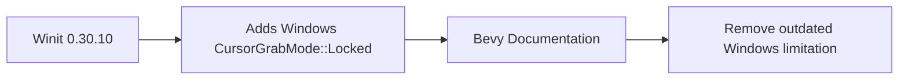

+++
title = "#19192 Update doc about Windows CursorGrabMode support"
date = "2025-06-24T00:00:00"
draft = false
template = "pull_request_page.html"
in_search_index = true

[taxonomies]
list_display = ["show"]

[extra]
current_language = "en"
available_languages = {"en" = { name = "English", url = "/pull_request/bevy/2025-06/pr-19192-en-20250624" }, "zh-cn" = { name = "中文", url = "/pull_request/bevy/2025-06/pr-19192-zh-cn-20250624" }}
labels = ["C-Docs", "A-Windowing"]
+++

# Update doc about Windows CursorGrabMode support

## Basic Information
- **Title**: Update doc about Windows CursorGrabMode support
- **PR Link**: https://github.com/bevyengine/bevy/pull/19192
- **Author**: jf908
- **Status**: MERGED
- **Labels**: C-Docs, A-Windowing, S-Ready-For-Final-Review
- **Created**: 2025-05-12T19:33:40Z
- **Merged**: 2025-06-24T00:17:44Z
- **Merged By**: alice-i-cecile

## Description Translation
# Objective

- Windows now supports `CursorGrabMode::Locked` in [Winit 0.30.10](https://github.com/rust-windowing/winit/releases/tag/v0.30.10) which is automatically pulled in by cargo.

## Solution

- Remove the doc that says its unsupported.

## The Story of This Pull Request

The PR addresses outdated documentation regarding cursor grab mode support on Windows. Previously, Bevy's window documentation incorrectly stated that Windows didn't support `CursorGrabMode::Locked`. This was a historical limitation that became inaccurate when Winit (Bevy's underlying windowing library) added Windows support for locked cursor mode in version 0.30.10.

The problem stemmed from documentation that hadn't been updated to reflect improvements in Bevy's dependencies. Since Winit's cursor grab implementation is automatically pulled in via Cargo, Bevy inherited this new capability without requiring code changes. However, the outdated documentation could mislead developers into thinking Windows still lacked this feature, potentially causing them to avoid using `CursorGrabMode::Locked` unnecessarily or implement workarounds.

The solution was straightforward: remove the incorrect platform-specific note about Windows lacking `CursorGrabMode::Locked` support. The implementation involved updating documentation comments in two locations within the `window.rs` file. Both locations contained identical platform-specific documentation blocks that needed correction.

The developer also updated the accompanying explanation text to reflect that only macOS now has partial cursor grab mode support. The sentence was changed from "Since `Windows` and `macOS` have different support" to "Since `macOS` doesn't have full support" to accurately represent the current platform capabilities.

This change demonstrates the importance of keeping documentation synchronized with dependency updates. Even when functional code doesn't require modification, documentation must evolve to reflect new capabilities provided by updated dependencies. The fix ensures developers have accurate information about platform capabilities when implementing cursor interaction features.

## Visual Representation



## Key Files Changed

### crates/bevy_window/src/window.rs
1. Updated documentation to remove outdated information about Windows cursor grab limitations

**Key Changes:**
```rust
// Before:
/// ## Platform-specific
///
/// - **`Windows`** doesn't support [`CursorGrabMode::Locked`]
/// - **`macOS`** doesn't support [`CursorGrabMode::Confined`]
/// - **`iOS/Android`** don't have cursors.
///
/// Since `Windows` and `macOS` have different [`CursorGrabMode`] support, we first try to set the grab mode that was asked for. If it doesn't work then use the alternate grab mode.

// After:
/// ## Platform-specific
///
/// - **`macOS`** doesn't support [`CursorGrabMode::Confined`]
/// - **`iOS/Android`** don't have cursors.
///
/// Since `macOS` doesn't have full [`CursorGrabMode`] support, we first try to set the grab mode that was asked for. If it doesn't work then use the alternate grab mode.
```

## Further Reading
- [Winit v0.30.10 Release Notes](https://github.com/rust-windowing/winit/releases/tag/v0.30.10)
- [Bevy Window Documentation](https://docs.rs/bevy_window/latest/bevy_window/)
- [CursorGrabMode Enum Reference](https://docs.rs/bevy_window/latest/bevy_window/enum.CursorGrabMode.html)

# Full Code Diff
```diff
diff --git a/crates/bevy_window/src/window.rs b/crates/bevy_window/src/window.rs
index 403801e9d0478..77728543e72f2 100644
--- a/crates/bevy_window/src/window.rs
+++ b/crates/bevy_window/src/window.rs
@@ -751,11 +751,10 @@ pub struct CursorOptions {
     ///
     /// ## Platform-specific
     ///
-    /// - **`Windows`** doesn't support [`CursorGrabMode::Locked`]
     /// - **`macOS`** doesn't support [`CursorGrabMode::Confined`]
     /// - **`iOS/Android`** don't have cursors.
     ///
-    /// Since `Windows` and `macOS` have different [`CursorGrabMode`] support, we first try to set the grab mode that was asked for. If it doesn't work then use the alternate grab mode.
+    /// Since `macOS` doesn't have full [`CursorGrabMode`] support, we first try to set the grab mode that was asked for. If it doesn't work then use the alternate grab mode.
     pub grab_mode: CursorGrabMode,
 
     /// Set whether or not mouse events within *this* window are captured or fall through to the Window below.
@@ -1064,11 +1063,10 @@ impl From<DVec2> for WindowResolution {
 ///
 /// ## Platform-specific
 ///
-/// - **`Windows`** doesn't support [`CursorGrabMode::Locked`]
 /// - **`macOS`** doesn't support [`CursorGrabMode::Confined`]
 /// - **`iOS/Android`** don't have cursors.
 ///
-/// Since `Windows` and `macOS` have different [`CursorGrabMode`] support, we first try to set the grab mode that was asked for. If it doesn't work then use the alternate grab mode.
+/// Since `macOS` doesn't have full [`CursorGrabMode`] support, we first try to set the grab mode that was asked for. If it doesn't work then use the alternate grab mode.
 #[derive(Default, Debug, Clone, Copy, PartialEq, Eq)]
 #[cfg_attr(
     feature = "bevy_reflect",
```