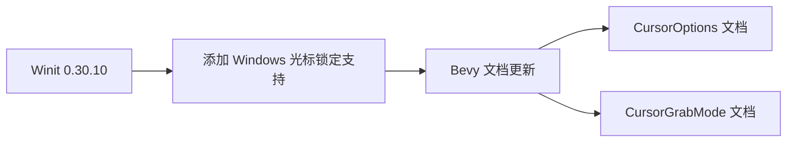

+++
title = "#19192 Update doc about Windows CursorGrabMode support"
date = "2025-06-24T00:00:00"
draft = false
template = "pull_request_page.html"
in_search_index = false

[extra]
current_language = "zh-cn"
available_languages = {"en" = { name = "English", url = "/pull_request/bevy/2025-06/pr-19192-en-20250624" }, "zh-cn" = { name = "中文", url = "/pull_request/bevy/2025-06/pr-19192-zh-cn-20250624" }}
+++

# PR 分析报告：更新关于 Windows 平台 CursorGrabMode 支持的文档

## 基本信息
- **标题**: Update doc about Windows CursorGrabMode support
- **PR 链接**: https://github.com/bevyengine/bevy/pull/19192
- **作者**: jf908
- **状态**: 已合并
- **标签**: C-Docs, A-Windowing, S-Ready-For-Final-Review
- **创建时间**: 2025-05-12T19:33:40Z
- **合并时间**: 2025-06-24T00:17:44Z
- **合并人**: alice-i-cecile

## 描述翻译
### 目标
- 在 [Winit 0.30.10](https://github.com/rust-windowing/winit/releases/tag/v0.30.10) 中，Windows 平台现已支持 `CursorGrabMode::Locked` 模式，该版本已通过 cargo 自动引入。

### 解决方案
- 删除文档中关于 Windows 不支持此功能的说明。

## PR 技术分析

### 问题背景与上下文
在 Bevy 游戏引擎的窗口系统文档中，存在关于 `CursorGrabMode::Locked` 模式平台兼容性的不准确描述。原始文档明确指出 Windows 平台不支持 `CursorGrabMode::Locked` 光标锁定模式。这种限制源于底层窗口管理库 Winit 的历史实现约束。

随着 Winit 0.30.10 版本的发布，该库添加了对 Windows 平台 `CursorGrabMode::Locked` 的完整支持。由于 Bevy 通过 Cargo 自动获取 Winit 依赖更新，该功能改进已自动对 Bevy 用户生效，但相关文档仍未同步更新。这导致文档与实际功能存在差异，可能误导开发者认为该功能在 Windows 上仍不可用。

### 解决方案实现
此 PR 采用最小化变更策略，仅修改文档注释以反映当前实际平台支持情况。主要修改包含两个部分：

1. 从 `CursorOptions` 结构体的文档中移除 Windows 不支持 `Locked` 模式的说明
2. 从 `CursorGrabMode` 枚举的文档中移除相同说明
3. 更新平台兼容性描述逻辑，将原先关于 Windows 和 macOS 差异的说明简化为仅针对 macOS 的说明

关键修改位于 `crates/bevy_window/src/window.rs` 文件：

```rust
// 文件: crates/bevy_window/src/window.rs
// 修改前:
/// ## Platform-specific
///
/// - **`Windows`** doesn't support [`CursorGrabMode::Locked`]
/// - **`macOS`** doesn't support [`CursorGrabMode::Confined`]
/// - **`iOS/Android`** don't have cursors.
///
/// Since `Windows` and `macOS` have different [`CursorGrabMode`] support...

// 修改后:
/// ## Platform-specific
///
/// - **`macOS`** doesn't support [`CursorGrabMode::Confined`]
/// - **`iOS/Android`** don't have cursors.
///
/// Since `macOS` doesn't have full [`CursorGrabMode`] support...
```

### 技术洞察
此变更展示了依赖管理中的重要实践：
1. **向下兼容性处理**：Winit 的 API 改进以向后兼容方式实现，允许 Bevy 无痛获取功能更新
2. **文档同步必要性**：依赖更新后，相关文档必须及时验证更新
3. **平台特性标注规范**：平台特定说明应保持简洁准确，避免冗余信息

### 影响与改进
1. **用户体验提升**：Windows 开发者现在能正确了解可用的光标锁定选项
2. **文档准确性**：消除文档与实际功能的不一致
3. **维护成本降低**：简化后的平台说明更易维护

### 视觉表示


## 关键文件变更

### `crates/bevy_window/src/window.rs`
**变更说明**：更新光标抓取模式文档以反映 Windows 平台最新支持情况  
**相关代码**：
```diff
@@ -751,11 +751,10 @@ pub struct CursorOptions {
     ///
     /// ## Platform-specific
     ///
-    /// - **`Windows`** doesn't support [`CursorGrabMode::Locked`]
     /// - **`macOS`** doesn't support [`CursorGrabMode::Confined`]
     /// - **`iOS/Android`** don't have cursors.
     ///
-    /// Since `Windows` and `macOS` have different [`CursorGrabMode`] support, we first try to set the grab mode that was asked for. If it doesn't work then use the alternate grab mode.
+    /// Since `macOS` doesn't have full [`CursorGrabMode`] support, we first try to set the grab mode that was asked for. If it doesn't work then use the alternate grab mode.
     pub grab_mode: CursorGrabMode,
 
     /// Set whether or not mouse events within *this* window are captured or fall through to the Window below.
@@ -1064,11 +1063,10 @@ impl From<DVec2> for WindowResolution {
 ///
 /// ## Platform-specific
 ///
-/// - **`Windows`** doesn't support [`CursorGrabMode::Locked`]
 /// - **`macOS`** doesn't support [`CursorGrabMode::Confined`]
 /// - **`iOS/Android`** don't have cursors.
 ///
-/// Since `Windows` and `macOS` have different [`CursorGrabMode`] support, we first try to set the grab mode that was asked for. If it doesn't work then use the alternate grab mode.
+/// Since `macOS` doesn't have full [`CursorGrabMode`] support, we first try to set the grab mode that was asked for. If it doesn't work then use the alternate grab mode.
 #[derive(Default, Debug, Clone, Copy, PartialEq, Eq)]
 #[cfg_attr(
     feature = "bevy_reflect",
```

## 延伸阅读
1. [Winit v0.30.10 发布说明](https://github.com/rust-windowing/winit/releases/tag/v0.30.10)
2. [Bevy 窗口系统文档](https://docs.rs/bevy_window/latest/bevy_window/)
3. [跨平台输入处理最佳实践](https://github.com/bevyengine/bevy/blob/main/docs/plugins_guidelines.md#input-handling)

## 完整代码变更
```diff
diff --git a/crates/bevy_window/src/window.rs b/crates/bevy_window/src/window.rs
index 403801e9d0478..77728543e72f2 100644
--- a/crates/bevy_window/src/window.rs
+++ b/crates/bevy_window/src/window.rs
@@ -751,11 +751,10 @@ pub struct CursorOptions {
     ///
     /// ## Platform-specific
     ///
-    /// - **`Windows`** doesn't support [`CursorGrabMode::Locked`]
     /// - **`macOS`** doesn't support [`CursorGrabMode::Confined`]
     /// - **`iOS/Android`** don't have cursors.
     ///
-    /// Since `Windows` and `macOS` have different [`CursorGrabMode`] support, we first try to set the grab mode that was asked for. If it doesn't work then use the alternate grab mode.
+    /// Since `macOS` doesn't have full [`CursorGrabMode`] support, we first try to set the grab mode that was asked for. If it doesn't work then use the alternate grab mode.
     pub grab_mode: CursorGrabMode,
 
     /// Set whether or not mouse events within *this* window are captured or fall through to the Window below.
@@ -1064,11 +1063,10 @@ impl From<DVec2> for WindowResolution {
 ///
 /// ## Platform-specific
 ///
-/// - **`Windows`** doesn't support [`CursorGrabMode::Locked`]
 /// - **`macOS`** doesn't support [`CursorGrabMode::Confined`]
 /// - **`iOS/Android`** don't have cursors.
 ///
-/// Since `Windows` and `macOS` have different [`CursorGrabMode`] support, we first try to set the grab mode that was asked for. If it doesn't work then use the alternate grab mode.
+/// Since `macOS` doesn't have full [`CursorGrabMode`] support, we first try to set the grab mode that was asked for. If it doesn't work then use the alternate grab mode.
 #[derive(Default, Debug, Clone, Copy, PartialEq, Eq)]
 #[cfg_attr(
     feature = "bevy_reflect",
```