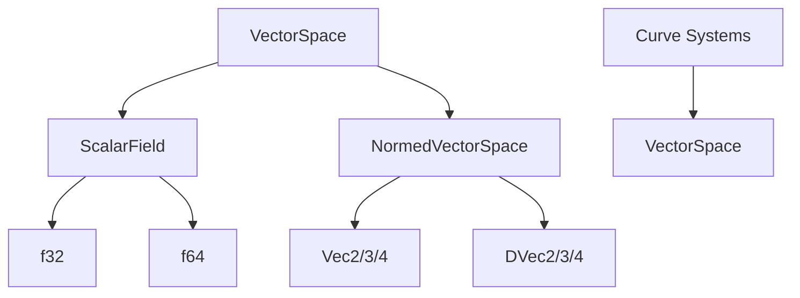

+++
title = "#19194 Improve Bevy's double-precision story for third-party crates"
date = "2025-06-08T00:00:00"
draft = false
template = "pull_request_page.html"
in_search_index = true

[taxonomies]
list_display = ["show"]

[extra]
current_language = "en"
available_languages = {"en" = { name = "English", url = "/pull_request/bevy/2025-06/pr-19194-en-20250608" }, "zh-cn" = { name = "中文", url = "/pull_request/bevy/2025-06/pr-19194-zh-cn-20250608" }}
labels = ["A-Math", "D-Modest"]
+++

# Analysis of PR #19194: Improve Bevy's double-precision story for third-party crates

## Basic Information
- **Title**: Improve Bevy's double-precision story for third-party crates
- **PR Link**: https://github.com/bevyengine/bevy/pull/19194
- **Author**: jnhyatt
- **Status**: MERGED
- **Labels**: S-Ready-For-Final-Review, A-Math, M-Needs-Migration-Guide, D-Modest
- **Created**: 2025-05-12T20:06:18Z
- **Merged**: 2025-06-08T02:20:25Z
- **Merged By**: alice-i-cecile

## Description Translation
**Objective**

Certain classes of games, usually those with enormous worlds, require some amount of support for double-precision. Libraries like `big_space` exist to allow for large worlds while integrating cleanly with Bevy's primarily single-precision ecosystem, but even then, games will often still work directly in double-precision throughout the part of the pipeline that feeds into the Bevy interface.

Currently, working with double-precision types in Bevy is a pain. `glam` provides types like `DVec3`, but Bevy doesn't provide double-precision analogs for `glam` wrappers like `Dir3`. This is mostly because doing so involves one of:
- code duplication
- generics
- templates (like `glam` uses)
- macros

Each of these has issues that are enough to be deal-breakers as far as maintainability, usability or readability. To work around this, I'm putting together `bevy_dmath`, a crate that duplicates `bevy_math` types and functionality to allow downstream users to enjoy the ergonomics and power of `bevy_math` in double-precision. For the most part, it's a smooth process, but in order to fully integrate, there are some necessary changes that can only be made in `bevy_math`.

**Solution**

This PR addresses the first and easiest issue with downstream double-precision math support: `VectorSpace` currently can only represent vector spaces over `f32`. This automatically closes the door to double-precision curves, among other things. This restriction can be easily lifted by allowing vector spaces to specify the underlying scalar field. This PR adds a new trait `ScalarField` that satisfies the properties of a scalar field (the ones that can be upheld statically) and adds a new associated type `type Scalar: ScalarField` to `VectorSpace`. It's mostly an unintrusive change. The biggest annoyances are:
- it touches a lot of curve code
- `bevy_math::ops` doesn't support `f64`, so there are some annoying workarounds

As far as curves code, I wanted to make this change unintrusive and bite-sized, so I'm trying to touch as little code as possible. To prove to myself it can be done, I went ahead and (*not* in this PR) migrated most of the curves API to support different `ScalarField`s and it went really smoothly! The ugliest thing was adding `P::Scalar: From<usize>` in several places. There's an argument to be made here that we should be using `num-traits`, but that's not immediately relevant. The point is that for now, the smallest change I could make was to go into every curve impl and make them generic over `VectorSpace<Scalar = f32>`. Curves work exactly like before and don't change the user API at all.

**Follow-up**
- **Extend `bevy_math::ops` to work with `f64`.** `bevy_math::ops` is used all over, and if curves are ever going to support different `ScalarField` types, we'll need to be able to use the correct `std` or `libm` ops for `f64` types as well. Adding an `ops64` mod turned out to be really ugly, but I'll point out the maintenance burden is low because we're not going to be adding new floating-point ops anytime soon. Another solution is to build a floating-point trait that calls the right op variant and impl it for `f32` and `f64`. This reduces maintenance burden because on the off chance we ever *do* want to go modify it, it's all tied together: you can't change the interface on one without changing the trait, which forces you to update the other. A third option is to use `num-traits`, which is basically option 2 but someone else did the work for us. They already support `no_std` using `libm`, so it would be more or less a drop-in replacement. They're missing a couple floating-point ops like `floor` and `ceil`, but we could make our own floating-point traits for those (there's even the potential for upstreaming them into `num-traits`).
- **Tweak curves to accept vector spaces over any `ScalarField`.** Curves are ready to support custom scalar types as soon as the bullet above is addressed. I will admit that the code is not as fun to look at: `P::Scalar` instead of `f32` everywhere. We could consider an alternate design where we use `f32` even to interpolate something like a `DVec3`, but personally I think that's a worse solution than parameterizing curves over the vector space's scalar type. At the end of the day, it's not really bad to deal with in my opinion... `ScalarType` supports enough operations that working with them is almost like working with raw float types, and it unlocks a whole ecosystem for games that want to use double-precision.

## The Story of This Pull Request

### The Problem and Context
Bevy's math system was designed primarily for single-precision (`f32`) operations. While this works well for most games, titles with extremely large worlds (e.g., space exploration games) often require double-precision (`f64`) coordinates to prevent floating-point precision artifacts. Third-party crates like `big_space` attempted to bridge this gap but faced limitations because Bevy's `VectorSpace` trait was hardcoded to `f32`. This made it impossible to use double-precision vectors with Bevy's curve systems or other math utilities without significant workarounds.

The core issue was that `VectorSpace` operations like `lerp` and `norm` were tied to `f32` scalars. For example, the `VectorSpace` trait defined multiplication and division exclusively with `f32`:
```rust
pub trait VectorSpace:
    Mul<f32, Output = Self>
    + Div<f32, Output = Self>
    ...
```

This prevented types like `DVec3` from implementing `VectorSpace` properly since they require `f64` operations. The only solutions available were code duplication or complex generics, both of which introduced maintenance overhead and reduced ergonomics.

### The Solution Approach
The solution introduces a generic scalar type to `VectorSpace` through an associated type and a new `ScalarField` trait. The key changes are:
1. Added `type Scalar: ScalarField` to `VectorSpace`
2. Created `ScalarField` trait with basic arithmetic operations
3. Implemented `ScalarField` for `f32` and `f64`
4. Updated all existing `VectorSpace` implementations to specify their scalar type
5. Added new `VectorSpace` implementations for `DVec2`, `DVec3`, and `DVec4`

The `ScalarField` trait encapsulates the properties of a mathematical scalar field:
```rust
pub trait ScalarField:
    Mul<Self, Output = Self>
    + Div<Self, Output = Self>
    ...
{
    const ZERO: Self;
    const ONE: Self;
    fn recip(self) -> Self { ... }
}
```

This abstraction allows vector operations to work with any scalar type while maintaining static guarantees about supported operations. The `lerp` method was updated to use the associated scalar type:
```rust
fn lerp(self, rhs: Self, t: Self::Scalar) -> Self {
    self * (Self::Scalar::ONE - t) + rhs * t
}
```

To minimize disruption, curve implementations were constrained to `VectorSpace<Scalar = f32>` for now. This maintains backward compatibility while laying the groundwork for future double-precision support in curves.

### The Implementation
The changes required updates throughout Bevy's math system. The `NormedVectorSpace` trait was extended to return the associated scalar type for norm calculations:
```rust
pub trait NormedVectorSpace: VectorSpace {
    fn norm(self) -> Self::Scalar;
    ...
}
```

Implementations for `DVec` types were straightforward since they already had length methods:
```rust
impl NormedVectorSpace for DVec3 {
    fn norm(self) -> f64 {
        self.length()
    }
    ...
}
```

The curve systems required the most changes due to their heavy use of `VectorSpace`. Each curve implementation was updated to require `VectorSpace<Scalar = f32>`:
```rust
// Before:
impl<P: VectorSpace> Curve<P> for CubicSegment<P>

// After:
impl<P: VectorSpace<Scalar = f32>> Curve<P> for CubicSegment<P>
```

This constraint ensures existing code continues to work while explicitly stating that curves currently only support `f32`. The sampling system also needed updates to handle the new scalar types in boundary cases.

### Technical Insights
The design maintains zero-cost abstractions for single-precision use cases. When `Scalar = f32`, the compiler generates the same machine code as before. For double-precision, the scalar operations naturally map to `f64` instructions.

A notable challenge was handling scalar operations in `no_std` environments. The implementation uses conditional compilation to select between `std` and `libm` for `f64` operations:
```rust
impl NormedVectorSpace for f64 {
    #[cfg(feature = "std")]
    fn norm(self) -> f64 { ... }
    
    #[cfg(all(any(feature = "libm", feature = "nostd-libm"), not(feature = "std"))]
    fn norm(self) -> f64 { ... }
}
```

The PR intentionally avoids migrating curves to full scalar genericity since that would require solving the `f64` operations problem first. The author notes this as a follow-up task.

### The Impact
These changes significantly improve Bevy's compatibility with double-precision workflows:
1. Third-party crates can now implement `VectorSpace` for double-precision types
2. `DVec` types gain full `VectorSpace` and `NormedVectorSpace` implementations
3. The curve system is prepared for future double-precision support
4. Existing code remains unchanged due to the `Scalar = f32` constraint on curves

For users, this means:
- Double-precision vectors now work with Bevy's math traits
- No changes required for existing single-precision code
- A migration path exists for custom `VectorSpace` implementations (add `type Scalar = f32`)

## Visual Representation



## Key Files Changed

### `crates/bevy_math/src/common_traits.rs` (+154/-32)
Added `ScalarField` trait and associated scalar type to `VectorSpace`. Implemented traits for `f32`, `f64`, and `DVec` types.

**Key changes:**
```rust
pub trait VectorSpace:
    Mul<Self::Scalar, Output = Self>
    + Div<Self::Scalar, Output = Self>
    ...
{
    type Scalar: ScalarField;
    ...
}

pub trait ScalarField: ... {
    const ZERO: Self;
    const ONE: Self;
    ...
}

// Implementation for Vec3
impl VectorSpace for Vec3 {
    type Scalar = f32;
    ...
}

// Implementation for DVec3
impl VectorSpace for DVec3 {
    type Scalar = f64;
    ...
}
```

### `crates/bevy_math/src/curve/derivatives/adaptor_impls.rs` (+28/-18)
Updated curve adaptors to work with `VectorSpace<Scalar = f32>`.

**Key change:**
```rust
impl<U, V, S, T, C, D> SampleDerivative<(S, T)> for ZipCurve<S, T, C, D>
where
    U: VectorSpace<Scalar = f32>,
    V: VectorSpace<Scalar = f32>,
    ...
{
    ...
}
```

### `crates/bevy_math/src/sampling/shape_sampling.rs` (+20/-15)
Made triangle sampling generic over scalar types.

**Key change:**
```rust
fn sample_triangle_interior<P, R>(vertices: [P; 3], rng: &mut R) -> P
where
    P: NormedVectorSpace,
    P::Scalar: SampleUniform + PartialOrd,
    ...
{
    ...
    let u = rng.gen_range(P::Scalar::ZERO..=P::Scalar::ONE);
    ...
}
```

### `crates/bevy_math/src/cubic_splines/mod.rs` (+13/-13)
Constrained curve generators to `VectorSpace<Scalar = f32>`.

**Key change:**
```rust
impl<P: VectorSpace<Scalar = f32>> CubicGenerator<P> for CubicBezier<P> {
    ...
}
```

### `crates/bevy_math/src/cubic_splines/curve_impls.rs` (+12/-12)
Constrained curve segments to `VectorSpace<Scalar = f32>`.

**Key change:**
```rust
impl<P: VectorSpace<Scalar = f32>> Curve<P> for CubicSegment<P> {
    ...
}
```

## Further Reading
1. [Scalar Field (Mathematics)](https://en.wikipedia.org/wiki/Scalar_field)
2. [Vector Space Fundamentals](https://en.wikipedia.org/wiki/Vector_space)
3. [Floating-Point Precision Considerations](https://randomascii.wordpress.com/2012/02/13/dont-store-that-in-a-float/)
4. [`glam` Double-Precision Vectors](https://docs.rs/glam/latest/glam/f64/index.html)