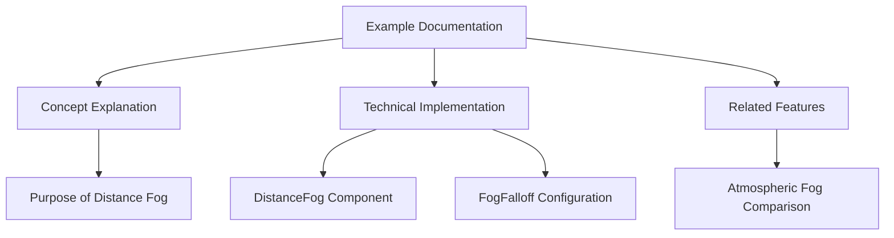

+++
title = "#19196 Explanation for the 'classic' fog example"
date = "2025-06-23T00:00:00"
draft = false
template = "pull_request_page.html"
in_search_index = true

[taxonomies]
list_display = ["show"]

[extra]
current_language = "en"
available_languages = {"en" = { name = "English", url = "/pull_request/bevy/2025-06/pr-19196-en-20250623" }, "zh-cn" = { name = "中文", url = "/pull_request/bevy/2025-06/pr-19196-zh-cn-20250623" }}
labels = ["A-Rendering", "C-Examples", "D-Straightforward"]
+++

# Explanation for the 'classic' fog example

## Basic Information
- **Title**: Explanation for the 'classic' fog example
- **PR Link**: https://github.com/bevyengine/bevy/pull/19196
- **Author**: fallible-algebra
- **Status**: MERGED
- **Labels**: A-Rendering, C-Examples, S-Ready-For-Final-Review, D-Straightforward
- **Created**: 2025-05-12T21:25:55Z
- **Merged**: 2025-06-23T21:14:58Z
- **Merged By**: alice-i-cecile

## Description Translation
This is a bit of a test case in writing the [explanation](https://bevyengine.org/learn/contribute/helping-out/explaining-examples/) for an example whose subject (`DistanceFog` as a component on cameras) is the focus, but isn't that complicated either. Not certain if this could be an exception or something more common.

Putting the controls below the explanation, as they're more of a fall-back for the on-screen info (also that's where they were before).

## The Story of This Pull Request

The fog example in Bevy's 3D examples directory needed clearer documentation. While functional, its original explanation was brief and didn't adequately convey the purpose and implementation details of distance-based fog effects. The author recognized that users might struggle to understand both the conceptual foundation and practical implementation of fog in Bevy without more comprehensive documentation.

The solution involved rewriting the example's documentation to provide a thorough technical explanation while maintaining the existing functionality. The approach focused on:
1. Explaining the purpose and benefits of distance fog in game development
2. Demonstrating Bevy's specific implementation using the `DistanceFog` component
3. Clarifying how different `FogFalloff` variants control fog behavior
4. Distinguishing this "classic" fog from atmospheric fog effects
5. Maintaining the interactive controls section but repositioning it

The implementation centered on modifying the top-level documentation comment in `fog.rs`. The new documentation provides a complete conceptual overview before diving into implementation specifics. Key technical points covered include:

1. The fundamental behavior of distance fog: "The further away something in a 3D world is from the camera, the more it's mixed or completely overwritten by a given color."
   
2. The minimal setup required: "add the `DistanceFog` component to the same entity as our `Camera3d`"

3. Configuration parameters: "It has fields for color, directional light parameters, and how the fog falls off over distance."

4. Detailed explanation of `FogFalloff` variants:
```rust
//! [`FogFalloff::Linear`] lets us define a start and end distance where...
//! [`FogFalloff::Exponential`] on the other hand uses an exponential curve...
```

5. Clear distinction from atmospheric fog: "[Atmospheric fog](https://bevyengine.org/examples/3d-rendering/atmospheric-fog/)... isn't covered here"

The author made a deliberate structural decision to move the controls section below the explanation. This reflects the relative importance of conceptual understanding versus interactive experimentation in this example. The controls remain available but are positioned as supplementary to the core documentation.

From a technical perspective, this change demonstrates effective example documentation practices:
- It explains both the "why" and "how" of the feature
- It links related concepts (like atmospheric fog) without duplicating content
- It maintains technical precision while being accessible
- It references Bevy components and enums directly with correct markdown syntax

The impact is improved clarity for developers learning about Bevy's fog system. Users encountering this example now gain:
- Clear understanding of when to use distance fog
- Immediate knowledge of implementation requirements
- Awareness of configuration options and their effects
- Context about how this feature relates to other fog techniques

This change also serves as a reference for future example documentation efforts, demonstrating how to balance conceptual explanation with technical implementation details for moderately complex rendering features.

## Visual Representation



## Key Files Changed

### examples/3d/fog.rs
**Changes**: Complete rewrite of documentation comment to provide comprehensive explanation of distance fog concepts and implementation. Repositioned controls section.

**Reason**: To improve educational value of the example by clearly explaining both the purpose and implementation of distance fog in Bevy.

**Code Changes**:
```rust
// Before:
//! This interactive example shows how to use distance fog,
//! and allows playing around with different fog settings.
//!
//! ## Controls
//!

// After:
//! Distance-based fog visual effects are used in many games to give a soft falloff of visibility to the player for performance and/or visual design reasons. The further away something in a 3D world is from the camera, the more it's mixed or completely overwritten by a given color.
//!
//! In Bevy we can add the [`DistanceFog`] component to the same entity as our [`Camera3d`] to apply a distance fog effect. It has fields for color, directional light parameters, and how the fog falls off over distance. And that's it! The distance fog is now applied to the camera.
//!
//! The [`FogFalloff`] field controls most of the behavior of the fog through different descriptions of fog "curves". I.e. [`FogFalloff::Linear`] lets us define a start and end distance where up until the start distance none of the fog color is mixed in and by the end distance the fog color is as mixed in as it can be. [`FogFalloff::Exponential`] on the other hand uses an exponential curve to drive how "visible" things are with a density value.
//!
//! [Atmospheric fog](https://bevyengine.org/examples/3d-rendering/atmospheric-fog/) is another fog type that uses this same method of setup, but isn't covered here as it is a kind of fog that is most often used to imply distance and size in clear weather, while the ones shown off here are much more "dense".
//!
//! The bulk of this example is spent building a scene that suites showing off that the fog is working as intended by creating a pyramid (a 3D structure with clear delineations), a light source, input handling to modify fog settings, and UI to show what the current fog settings are.
//!
//! ## Controls
//!
```

## Further Reading
1. [Bevy Fog Documentation](https://docs.rs/bevy/latest/bevy/core_pipeline/fog/index.html) - Official API docs for Bevy's fog system
2. [Atmospheric Fog Example](https://github.com/bevyengine/bevy/blob/main/examples/3d/atmospheric_fog.rs) - Complementary fog implementation
3. [Bevy Examples Contribution Guide](https://bevyengine.org/learn/contribute/helping-out/explaining-examples/) - Guidelines for documenting examples
4. [Distance Fog in Game Development](https://en.wikipedia.org/wiki/Fog_(video_games)) - General concepts of fog in 3D rendering