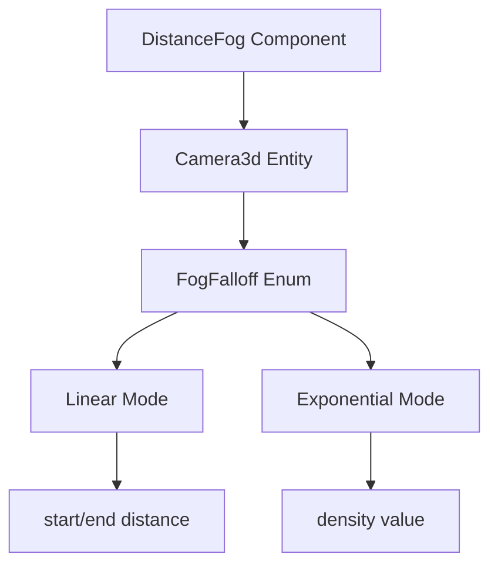

+++
title = "#19196 Explanation for the 'classic' fog example"
date = "2025-06-23T00:00:00"
draft = false
template = "pull_request_page.html"
in_search_index = false

[extra]
current_language = "zh-cn"
available_languages = {"en" = { name = "English", url = "/pull_request/bevy/2025-06/pr-19196-en-20250623" }, "zh-cn" = { name = "中文", url = "/pull_request/bevy/2025-06/pr-19196-zh-cn-20250623" }}
labels = ["A-Rendering", "C-Examples", "D-Straightforward"]
+++

# Explanation for the 'classic' fog example

## Basic Information
- **Title**: Explanation for the 'classic' fog example
- **PR Link**: https://github.com/bevyengine/bevy/pull/19196
- **Author**: fallible-algebra
- **Status**: MERGED
- **Labels**: A-Rendering, C-Examples, S-Ready-For-Final-Review, D-Straightforward
- **Created**: 2025-05-12T21:25:55Z
- **Merged**: 2025-06-23T21:14:58Z
- **Merged By**: alice-i-cecile

## Description Translation
这是一个测试案例，用于为示例编写[说明文档](https://bevyengine.org/learn/contribute/helping-out/explaining-examples/)，该示例的核心主题（在摄像机上的`DistanceFog`组件）是焦点，但本身并不复杂。不确定这是否可以成为例外或更常见的做法。

将控制说明放在解释下方，因为它们更像是屏幕信息的备用方案（这也是它们之前的位置）。

## The Story of This Pull Request

该PR专注于改进Bevy引擎中3D雾效示例的文档说明。主要目标是提升开发者对距离雾效功能的理解和使用体验。原示例的文档较为简短，仅简单提及这是交互式示例并列出控制操作，没有充分解释距离雾效的核心概念和实现机制。

修改方案采用分层说明结构：首先解释距离雾效的基本原理和实现方式，随后详细说明`FogFalloff`枚举的不同雾效衰减模式，最后保留原有的控制说明作为补充参考。这种结构使开发者能先理解核心概念，再查看具体操作方式。

技术实现上，PR完全重构了示例文件的文档注释部分。主要新增内容包括：
1. 明确距离雾效的核心目的：通过颜色混合实现远距离物体的视觉衰减
2. 说明基本使用方法：将`DistanceFog`组件添加到`Camera3d`实体
3. 解释`FogFalloff`枚举的关键参数：
   - `Linear`模式使用起止距离控制雾效范围
   - `Exponential`模式使用密度值控制衰减曲线
4. 区分经典雾效与大气雾效的不同应用场景

PR特意将控制说明移至文档末尾，因为这些操作细节更多作为屏幕显示的补充信息，而非核心概念。这种结构调整使文档层次更清晰，开发者能快速定位核心概念说明。

修改后的文档注释保持了Bevy示例文档的标准格式，使用Markdown语法确保在生成的文档网站中正确渲染。所有代码引用都使用正确的Rustdoc链接语法，如[`DistanceFog`]和[`Camera3d`]，确保文档网站能正确生成API链接。

这些修改显著提升了示例的教育价值：
1. 开发者能更快理解距离雾效的核心机制
2. 明确不同雾效衰减模式的适用场景
3. 保持与Bevy文档风格的一致性
4. 提供足够技术细节而不影响可读性

该PR展示了良好的示例文档实践：优先解释核心概念和技术实现，再提供操作细节。这种模式值得在其它示例文档中复用。

## Visual Representation



## Key Files Changed

### examples/3d/fog.rs (+9/-2)

该文件是3D雾效示例的主要实现，修改聚焦于改进文档说明而非功能逻辑。

**变更说明：**
1. 重写文档注释，添加距离雾效的技术说明
2. 将控制说明移至文档末尾
3. 添加大气雾效的对比参考

**关键代码变更：**

```rust
// Before:
//! This interactive example shows how to use distance fog,
//! and allows playing around with different fog settings.
//!
//! ## Controls
//!

// After:
//! Distance-based fog visual effects are used in many games to give a soft falloff of visibility to the player for performance and/or visual design reasons. The further away something in a 3D world is from the camera, the more it's mixed or completely overwritten by a given color.
//!
//! In Bevy we can add the [`DistanceFog`] component to the same entity as our [`Camera3d`] to apply a distance fog effect. It has fields for color, directional light parameters, and how the fog falls off over distance. And that's it! The distance fog is now applied to the camera.
//!
//! The [`FogFalloff`] field controls most of the behavior of the fog through different descriptions of fog "curves". I.e. [`FogFalloff::Linear`] lets us define a start and end distance where up until the start distance none of the fog color is mixed in and by the end distance the fog color is as mixed in as it can be. [`FogFalloff::Exponential`] on the other hand uses an exponential curve to drive how "visible" things are with a density value.
//!
//! [Atmospheric fog](https://bevyengine.org/examples/3d-rendering/atmospheric-fog/) is another fog type that uses this same method of setup, but isn't covered here as it is a kind of fog that is most often used to imply distance and size in clear weather, while the ones shown off here are much more "dense".
//!
//! The bulk of this example is spent building a scene that suites showing off that the fog is working as intended by creating a pyramid (a 3D structure with clear delineations), a light source, input handling to modify fog settings, and UI to show what the current fog settings are.
//!
//! ## Controls
//!
```

## Further Reading
1. [Bevy Fog 官方文档](https://docs.rs/bevy/latest/bevy/core_pipeline/fog/index.html)
2. [Bevy 大气雾效示例](https://bevyengine.org/examples/3d-rendering/atmospheric-fog/)
3. [Bevy 示例文档指南](https://bevyengine.org/learn/contribute/helping-out/explaining-examples/)
4. [距离雾效技术解析](https://lettier.github.io/3d-game-shaders-for-beginners/fog.html)