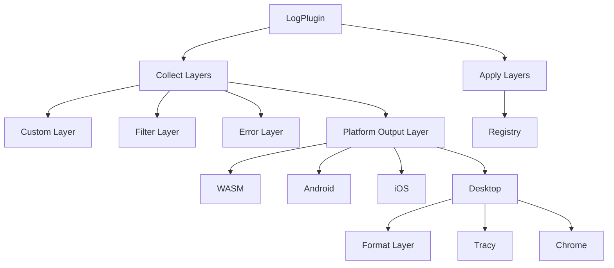

+++
title = "#19248"
date = "2025-06-16T00:00:00"
draft = false
template = "pull_request_page.html"
in_search_index = true

[taxonomies]
list_display = ["show"]

[extra]
current_language = "en"
available_languages = {"en" = { name = "English", url = "/pull_request/bevy/2025-06/pr-19248-en-20250616" }, "zh-cn" = { name = "中文", url = "/pull_request/bevy/2025-06/pr-19248-zh-cn-20250616" }}
+++

## Technical Analysis of PR #19248: bevy_log: refactor how log layers are wired together

### The Problem and Context
The existing implementation for wiring logging layers in Bevy's logging system used a chaining approach with `layer.with(new_layer)`. This created complex type dependencies where each new layer's type depended on the previous layer's type. As noted in issue #17722, this made advanced logging configurations difficult to implement and maintain. The type system constraints prevented flexible layer composition, which was particularly problematic for features like conditional logging layers and complex filtering. This rigidity also made it harder to address future logging enhancements like #19085.

### The Solution Approach
The solution replaces the chained `with()` approach with a vector of boxed layers (`Vec<BoxedLayer>`). This is the recommended pattern from `tracing_subscriber` for complex layer configurations. The key advantages are:
1. Type complexity is contained through boxing
2. Layers can be conditionally added without type complications
3. The implementation becomes more maintainable and extensible

The refactor maintains functional equivalence while enabling:
- Clearer separation of concerns
- Better error handling
- More straightforward platform-specific implementations
- Easier customization through unified layer types

### The Implementation
The core change replaces the subscriber construction with a layered approach:

```rust
// Before: Chained layers
let subscriber = Registry::default();
let subscriber = subscriber.with((self.custom_layer)(app));
let subscriber = subscriber.with(filter_layer);

// After: Vector of boxed layers
let mut layers: Vec<BoxedLayer> = Vec::new();
if let Some(layer) = (self.custom_layer)(app) {
    layers.push(layer);
}
layers.push(Self::build_filter_layer(self.level, &self.filter));
let subscriber = Registry::default().with(layers);
```

Key improvements include:
1. **Unified layer handling** - Both custom and format layers now use the same `BoxedLayer` type:
```rust
// Before:
pub fmt_layer: fn(app: &mut App) -> Option<BoxedFmtLayer>

// After:
pub fmt_layer: fn(app: &mut App) -> Option<BoxedLayer>
```

2. **Modular construction** - Platform-specific output layers are now handled in dedicated functions:
```rust
fn build_system_output_layer(custom_format_layer: Option<BoxedLayer>) -> BoxedLayer {
    #[cfg(target_arch = "wasm32")]
    {
        tracing_wasm::WASMLayer::new(...).boxed()
    }
    // Other platform implementations...
}
```

3. **Improved error handling** - Initialization errors are now properly checked and reported:
```rust
let logger_already_set = LogTracer::init().is_err();
let subscriber_already_set = tracing::subscriber::...is_err();
match (logger_already_set, subscriber_already_set) {
    (true, true) => error!("Could not set global logger and tracing subscriber..."),
    // Other cases handled...
}
```

### Technical Insights
The PR demonstrates several important patterns:
1. **Trait Object Composition** - Using `Box<dyn Layer<Registry>>` avoids complex type dependencies while maintaining flexibility
2. **Platform Abstraction** - The `build_system_output_layer` function cleanly handles platform differences
3. **Feature Flag Management** - Tracing features (`tracing-chrome`, `tracing-tracy`) are cleanly isolated with cfg attributes
4. **Error Propagation** - The solution properly handles and reports initialization errors rather than panicking

A notable trade-off is the slight performance overhead from dynamic dispatch, which is acceptable given the logging system's non-critical path nature.

### The Impact
These changes provide:
1. **Enhanced Flexibility** - Enables complex logging configurations previously impossible due to type constraints
2. **Improved Maintainability** - Reduces code complexity and separates concerns
3. **Better Platform Support** - Creates a consistent approach across WASM, Android, and iOS
4. **Cleaner API** - Unifies layer types and simplifies customization

The example update demonstrates the simplified customization pattern:
```rust
// Updated example
fn fmt_layer(_app: &mut App) -> Option<BoxedLayer> {
    Some(
        tracing_subscriber::fmt::Layer::default()
            .without_time()
            .with_writer(std::io::stderr)
            .boxed()
    )
}
```

## Visual Representation



## Key Files Changed

### crates/bevy_log/src/lib.rs
**Changes**: Major refactor of layer composition and platform handling  
**Why**: To enable flexible layer wiring and simplify platform-specific implementations

Key modifications:
```rust
// Before: Complex type aliases
#[cfg(feature = "trace")]
type PreFmtSubscriber = Layered<tracing_error::ErrorLayer<BaseSubscriber>, BaseSubscriber>;

// After: Simplified layer handling
let mut layers: Vec<BoxedLayer> = Vec::new();
layers.push(Self::build_filter_layer(self.level, &self.filter));

// New modular functions
fn build_filter_layer(level: Level, filter: &str) -> BoxedLayer { ... }
fn build_system_output_layer(custom_format_layer: Option<BoxedLayer>) -> BoxedLayer { ... }
```

### examples/app/log_layers.rs
**Changes**: Updated example to match new API  
**Why**: Demonstrate simplified customization pattern

```rust
// Before:
fn fmt_layer(_app: &mut App) -> Option<BoxedFmtLayer> {
    Some(Box::new(
        Layer::default().without_time().with_writer(std::io::stderr)
    )
}

// After:
fn fmt_layer(_app: &mut App) -> Option<BoxedLayer> {
    Some(
        Layer::default()
            .without_time()
            .with_writer(std::io::stderr)
            .boxed()
    )
}
```

## Further Reading
1. [tracing_subscriber Layer documentation](https://docs.rs/tracing-subscriber/latest/tracing_subscriber/layer/index.html)
2. [Runtime Configuration with Layers](https://docs.rs/tracing-subscriber/latest/tracing_subscriber/layer/index.html#runtime-configuration-with-layers)
3. [Bevy Logging Architecture](https://bevyengine.org/learn/book/getting-started/resources/#logging)
4. [Tracing Chrome Format](https://crates.io/crates/tracing-chrome)