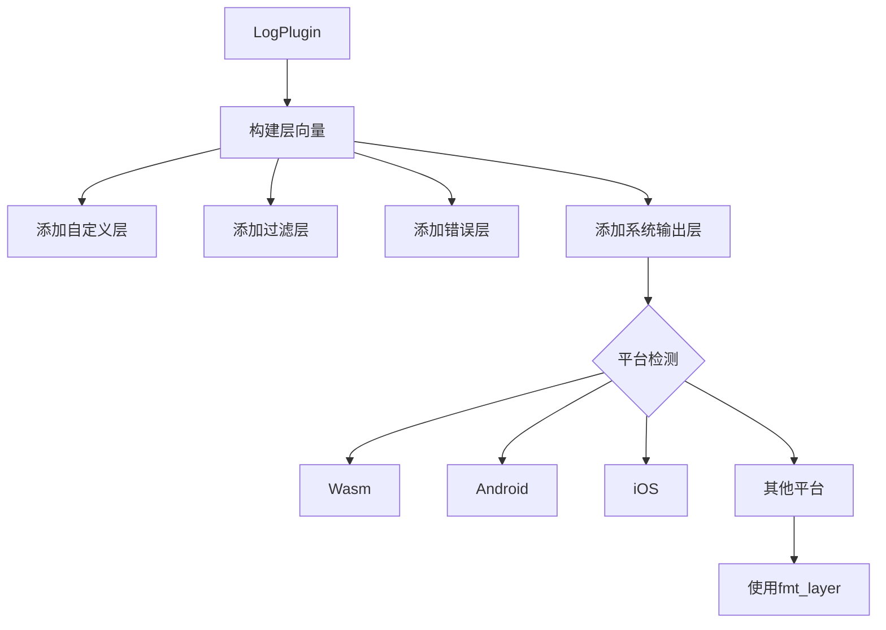

+++
title = "#19248 bevy_log: refactor how log layers are wired together"
date = "2025-06-16T00:00:00"
draft = false
template = "pull_request_page.html"
in_search_index = false

[extra]
current_language = "zh-cn"
available_languages = {"en" = { name = "English", url = "/pull_request/bevy/2025-06/pr-19248-en-20250616" }, "zh-cn" = { name = "中文", url = "/pull_request/bevy/2025-06/pr-19248-zh-cn-20250616" }}
+++

# bevy_log: refactor how log layers are wired together

## 基本信息
- **标题**: bevy_log: refactor how log layers are wired together
- **PR 链接**: https://github.com/bevyengine/bevy/pull/19248
- **作者**: SilentSpaceTraveller
- **状态**: MERGED
- **标签**: C-Usability, S-Ready-For-Final-Review, A-Diagnostics, D-Modest
- **创建时间**: 2025-05-17T03:46:25Z
- **合并时间**: 2025-06-16T21:50:02Z
- **合并者**: alice-i-cecile

## 描述翻译
### 目标

当前在 `bevy_log` 插件中使用 `layer.with(new_layer)` 连接 `Layer` 的方式脆弱且不够灵活。如 #17722 所示，当前方案使高级连接变得非常困难，因为 `tracing::Subscriber` 的类型系统很快成为障碍（每个新层的类型取决于前一个层的类型）。我们需要让复杂 `Layer` 连接更容易实现。如果不解决这个问题，将很难实现 #19085。

### 解决方案
旨在保持功能等效：
- 替换使用 `layer.with(new_layer)` 的方式。现在我们将 `layer.boxed()` 添加到 `Vec<BoxedLayer>` 中。这是 `tracing_subscriber::Layer` 为复杂连接场景推荐的解决方案（参见 https://docs.rs/tracing-subscriber/latest/tracing_subscriber/layer/index.html#runtime-configuration-with-layers）
- 进行一些重构和清理，这些工作现在因新方案而成为可能

### 测试
- 在 Linux 上本地运行了 CI
- 运行了日志示例
- 需要熟悉 `trace`、`tracing-chrome`、`tracing-tracy` 功能的人员检查是否按预期工作
- 需要能访问 `ios`、`android` 和 `wasm` 平台的人员进行检查

## 这个 PR 的故事

### 问题和背景
`bevy_log` 插件原有的日志层连接机制使用 `layer.with(new_layer)` 链式调用构建日志系统。这种方式导致类型系统问题：每个新层的具体类型依赖于前一个层的类型，形成深层嵌套的类型签名（如 `Layered<Layer1, Layered<Layer2, ...>>`）。这在 #17722 中暴露了问题，当需要添加条件层或实现复杂连接时，类型系统成为主要障碍。这种设计限制了日志系统的灵活性，特别是对于 #19085 等需要动态层配置的用例。

问题核心在于类型系统的刚性：添加或修改层需要改变整个链的类型签名，使代码难以维护和扩展。同时，支持多种平台（Android、iOS、Wasm）和可选功能（如 tracing-chrome/tracing-tracy）使情况更复杂。

### 解决方案方法
采用 `tracing_subscriber` 官方推荐的模式：使用 `Vec<Box<dyn Layer>>` 收集所有层，然后一次性应用到注册表。这种方法通过类型擦除（装箱）避免复杂的类型嵌套。主要决策点包括：
1. 用动态层向量替换链式类型连接
2. 将平台特定处理封装到独立方法中
3. 保持公共 API 不变以确保向后兼容
4. 重构代码以提升可读性和可维护性

### 实现细节
核心变化是将层连接方式从链式调用改为向量收集：

```rust
// 旧方法：链式连接
let subscriber = Registry::default().with(layer1).with(layer2);

// 新方法：收集到向量
let mut layers: Vec<BoxedLayer> = Vec::new();
layers.push(layer1.boxed());
layers.push(layer2.boxed());
let subscriber = Registry::default().with(layers);
```

具体实现包括三个关键部分：

1. **构建层向量**：
```rust
let mut layers: Vec<BoxedLayer> = Vec::new();
if let Some(layer) = (self.custom_layer)(app) {
    layers.push(layer);
}
layers.push(Self::build_filter_layer(self.level, &self.filter));
```

2. **封装过滤层构建**：
```rust
fn build_filter_layer(level: Level, filter: &str) -> BoxedLayer {
    let default_filter = format!("{},{}", level, filter);
    EnvFilter::try_from_default_env()
        .unwrap_or_else(|_| EnvFilter::new(&default_filter))
        .boxed()
}
```

3. **统一处理系统输出层**：
```rust
fn build_system_output_layer(custom_format_layer: Option<BoxedLayer>) -> BoxedLayer {
    #[cfg(target_arch = "wasm32")]
    { tracing_wasm::WASMLayer::new(...).boxed() }
    
    #[cfg(target_os = "android")]
    { android_tracing::AndroidLayer::default().boxed() }
    
    #[cfg(all(not(wasm), not(android), not(ios)))]
    {
        let fmt_layer = custom_format_layer.unwrap_or_else(|| {
            tracing_subscriber::fmt::Layer::default()
                .with_writer(std::io::stderr)
                .boxed()
        });
        fmt_layer
    }
}
```

### 技术洞察
1. **类型擦除**：通过 `Box<dyn Layer>` 统一处理不同层类型，避免复杂类型依赖
2. **平台抽象**：`build_system_output_layer` 封装平台差异，简化核心逻辑
3. **错误处理**：初始化时显式检查日志系统是否已设置：
```rust
match (logger_already_set, subscriber_already_set) {
    (true, true) => error!("Could not set global logger and subscriber..."),
    // ...其他情况处理
}
```
4. **API 兼容性**：保持 `LogPlugin` 结构不变，用户代码无需修改

### 影响
1. **灵活性提升**：支持任意数量和顺序的层，为动态配置铺平道路
2. **代码简化**：移除复杂类型别名（PreFmtSubscriber 等），减少95行代码
3. **可维护性增强**：模块化设计使添加新平台/功能更简单
4. **跨平台一致性**：统一处理 Wasm、Android、iOS 和桌面平台

## 可视化表示


## 关键文件变更

### `crates/bevy_log/src/lib.rs` (+132/-95)
**变更描述**：重构日志层连接机制，用向量收集替代链式连接

**核心修改**：
```rust
// 旧类型定义（已移除）
#[cfg(feature = "trace")]
type PreFmtSubscriber = Layered<tracing_error::ErrorLayer<BaseSubscriber>, BaseSubscriber>;

// 新实现：使用层向量
let mut layers: Vec<BoxedLayer> = Vec::new();
if let Some(layer) = (self.custom_layer)(app) {
    layers.push(layer);
}
layers.push(Self::build_filter_layer(self.level, &self.filter));

#[cfg(feature = "trace")]
layers.push(tracing_error::ErrorLayer::default().boxed());

layers.push(Self::build_system_output_layer((self.fmt_layer)(app)));

let subscriber = Registry::default().with(layers);
```

### `examples/app/log_layers.rs` (+6/-5)
**变更描述**：更新示例以适应 API 变化

**核心修改**：
```rust
// 修改前：
fn fmt_layer(_app: &mut App) -> Option<BoxedFmtLayer> {
    Some(Box::new(
        tracing_subscriber::fmt::Layer::default()
            .without_time()
            .with_writer(std::io::stderr),
    ))
}

// 修改后：
fn fmt_layer(_app: &mut App) -> Option<BoxedLayer> {
    Some(
        tracing_subscriber::fmt::Layer::default()
            .without_time()
            .with_writer(std::io::stderr)
            .boxed(),
    )
}
```

## 扩展阅读
1. [tracing_subscriber 层文档](https://docs.rs/tracing-subscriber/latest/tracing_subscriber/layer/index.html)
2. [Rust 中的 trait 对象](https://doc.rust-lang.org/book/ch17-02-trait-objects.html)
3. [Bevy 日志系统架构](https://github.com/bevyengine/bevy/tree/main/crates/bevy_log)