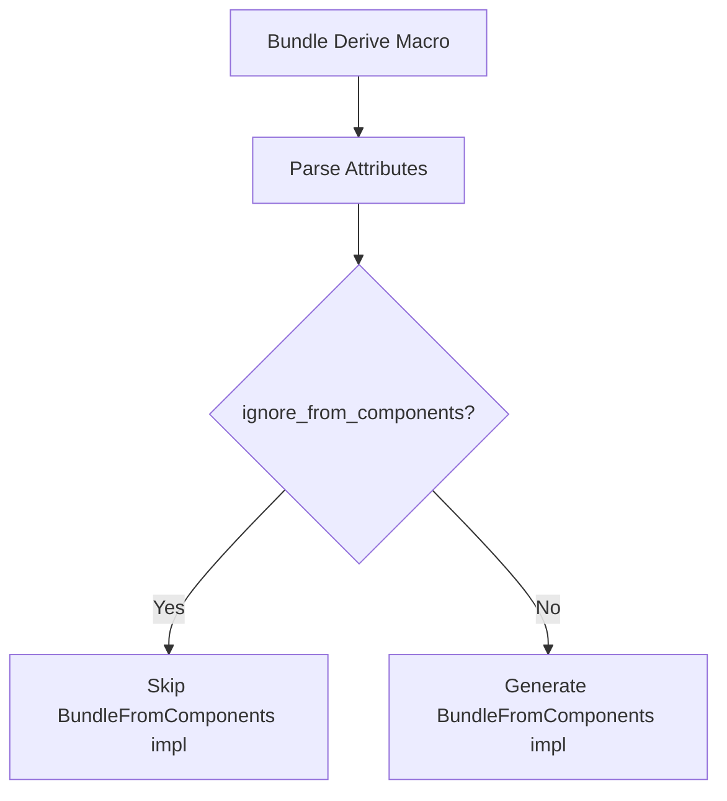

+++
title = "#19249 Allow not emitting `BundleFromComponents` with `Bundle` derive macro"
date = "2025-06-09T00:00:00"
draft = false
template = "pull_request_page.html"
in_search_index = true

[taxonomies]
list_display = ["show"]

[extra]
current_language = "en"
available_languages = {"en" = { name = "English", url = "/pull_request/bevy/2025-06/pr-19249-en-20250609" }, "zh-cn" = { name = "中文", url = "/pull_request/bevy/2025-06/pr-19249-zh-cn-20250609" }}
labels = ["A-ECS", "C-Usability", "D-Modest", "D-Macros"]
+++

## Allow not emitting `BundleFromComponents` with `Bundle` derive macro

### Basic Information
- **Title**: Allow not emitting `BundleFromComponents` with `Bundle` derive macro
- **PR Link**: https://github.com/bevyengine/bevy/pull/19249
- **Author**: TheNeikos
- **Status**: MERGED
- **Labels**: A-ECS, C-Usability, S-Ready-For-Final-Review, X-Uncontroversial, D-Modest, D-Macros
- **Created**: 2025-05-17T07:33:05Z
- **Merged**: 2025-06-09T20:36:04Z
- **Merged By**: alice-i-cecile

### Description Translation
# Objective

Fixes #19136

## Solution

- Add a new container attribute which when set does not emit `BundleFromComponents`

## Testing

- Did you test these changes?

Yes, a new test was added.

- Are there any parts that need more testing?

Since `BundleFromComponents` is unsafe I made extra sure that I did not misunderstand its purpose. As far as I can tell, _not_ implementing it is ok.

- How can other people (reviewers) test your changes? Is there anything specific they need to know?

Nope

- If relevant, what platforms did you test these changes on, and are there any important ones you can't test?

I don't think the platform is relevant

---

One thing I am not sure about is how to document this? I'll gladly add it

### The Story of This Pull Request

#### The Problem and Context
The Bevy ECS system requires bundles to implement `BundleFromComponents`, an unsafe trait used for extracting components from bundles during entity spawning. However, some specialized bundles like `SpawnRelatedBundle` couldn't reasonably implement this trait because they don't represent standard component collections. This limitation prevented developers from using these bundles in structs with the `#[derive(Bundle)]` macro, forcing awkward workarounds.

#### The Solution Approach
The solution introduces an opt-out mechanism for `BundleFromComponents` implementation in the `Bundle` derive macro. By adding a new container attribute `ignore_from_components`, developers can explicitly indicate when a bundle shouldn't implement this trait. This maintains backward compatibility while solving the specific limitation for non-standard bundles.

#### The Implementation
The core changes occur in the derive macro implementation. A new `BundleAttributes` struct tracks whether to implement `BundleFromComponents`, defaulting to `true` for backward compatibility:

```rust
// File: crates/bevy_ecs/macros/src/lib.rs
#[derive(Debug)]
struct BundleAttributes {
    impl_from_components: bool,
}

impl Default for BundleAttributes {
    fn default() -> Self {
        Self {
            impl_from_components: true,
        }
    }
}
```

Attribute parsing was added to detect `ignore_from_components`:

```rust
for attr in &ast.attrs {
    if attr.path().is_ident(BUNDLE_ATTRIBUTE_NAME) {
        let parsing = attr.parse_nested_meta(|meta| {
            if meta.path.is_ident(BUNDLE_ATTRIBUTE_NO_FROM_COMPONENTS) {
                attributes.impl_from_components = false;
                return Ok(());
            }
            // Error handling omitted
        });
    }
}
```

The trait implementation is now conditionally generated:

```rust
let from_components = attributes.impl_from_components.then(|| quote! {
    // SAFETY: ... (existing safety comments preserved)
    unsafe impl ... {
        // Implementation body unchanged
    }
});
```

Documentation was added explaining the new attribute with concrete examples:

```rust
// File: crates/bevy_ecs/src/bundle.rs
/// Derive the [`Bundle`] trait
///
/// ... (existing docs)
///
/// ## Attributes
///
/// ... (attribute explanation)
///
/// ```rust
/// #[derive(Bundle)]
/// #[bundle(ignore_from_components)]
/// struct HitpointMarker {
///     hitpoints: Hitpoint,
///     related_spawner: SpawnRelatedBundle<ChildOf, Spawn<Marker>>,
/// }
/// ```
```

A test case validates the new functionality:

```rust
// File: crates/bevy_ecs/src/bundle.rs
#[derive(Bundle)]
#[bundle(ignore_from_components)]
struct BundleNoExtract {
    b: B,
    no_from_comp: crate::spawn::SpawnRelatedBundle<ChildOf, Spawn<C>>,
}

#[test]
fn can_spawn_bundle_without_extract() {
    // Test implementation
}
```

#### Technical Insights
- **Safety**: `BundleFromComponents` is unsafe because it handles raw memory operations. The PR maintains all existing safety invariants by preserving the same implementation when the attribute isn't used
- **Backward Compatibility**: Default behavior remains unchanged through the `Default` impl on `BundleAttributes`
- **Attribute Design**: The solution follows Bevy's existing attribute pattern (`#[bundle(ignore)]`) for consistency
- **Error Handling**: Attribute parsing errors are properly collected and emitted as compiler errors

#### The Impact
- Enables using `SpawnRelatedBundle` and similar non-standard bundles with `#[derive(Bundle)]`
- Maintains full backward compatibility
- Provides clear documentation and examples for the new functionality
- Adds test coverage to prevent regressions

### Visual Representation



### Key Files Changed

1. **crates/bevy_ecs/macros/src/lib.rs**
   - Added attribute parsing for `ignore_from_components`
   - Implemented conditional generation of `BundleFromComponents`
   - Maintained all safety invariants

```rust
// Before: Always generated BundleFromComponents
unsafe impl ... BundleFromComponents for ... {
    // Implementation
}

// After: Conditional generation
let from_components = attributes.impl_from_components.then(|| quote! {
    unsafe impl ... { /* Implementation */ }
});
```

2. **crates/bevy_ecs/src/bundle.rs**
   - Added comprehensive documentation for the new attribute
   - Included practical usage examples
   - Implemented test case for the new functionality

```rust
// Before: No documentation for attribute
pub use bevy_ecs_macros::Bundle;

// After: Detailed attribute documentation
/// Derive the [`Bundle`] trait
///
/// ... (explains ignore_from_components)
/// 
/// ## Attributes
/// ... (examples)
```

### Further Reading
1. [Bevy ECS Bundles Documentation](https://bevyengine.org/learn/book/ecs/bundles/)
2. [Rust Attribute Reference](https://doc.rust-lang.org/reference/attributes.html)
3. [Procedural Macros Guide](https://doc.rust-lang.org/reference/procedural-macros.html)