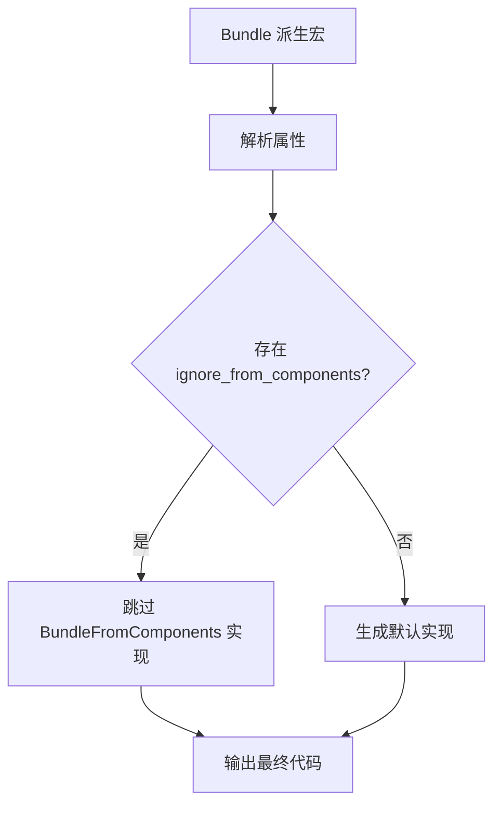

+++
title = "#19249 Allow not emitting `BundleFromComponents` with `Bundle` derive macro"
date = "2025-06-09T00:00:00"
draft = false
template = "pull_request_page.html"
in_search_index = false

[extra]
current_language = "zh-cn"
available_languages = {"en" = { name = "English", url = "/pull_request/bevy/2025-06/pr-19249-en-20250609" }, "zh-cn" = { name = "中文", url = "/pull_request/bevy/2025-06/pr-19249-zh-cn-20250609" }}
+++

## 标题：允许在 Bundle 派生宏中不生成 `BundleFromComponents`

## 基本信息
- **标题**: Allow not emitting `BundleFromComponents` with `Bundle` derive macro
- **PR 链接**: https://github.com/bevyengine/bevy/pull/19249
- **作者**: TheNeikos
- **状态**: 已合并
- **标签**: A-ECS, C-Usability, S-Ready-For-Final-Review, X-Uncontroversial, D-Modest, D-Macros
- **创建时间**: 2025-05-17T07:33:05Z
- **合并时间**: 2025-06-09T20:36:04Z
- **合并人**: alice-i-cecile

## 描述翻译
### 目标
修复 #19136

### 解决方案
- 添加新的容器属性，设置后不生成 `BundleFromComponents`

### 测试
- 是否测试了这些变更？
是，添加了新测试

- 是否有部分需要更多测试？
由于 `BundleFromComponents` 是 unsafe 的，我已额外确认没有误解其用途。据我所知，不实现它是可以的

- 其他人（审阅者）如何测试你的变更？有什么需要特别注意的吗？
不需要

- 如果相关，你在哪些平台上测试了这些变更？是否有无法测试的重要平台？
我认为平台无关紧要

---

我不确定如何编写文档？如有需要我会添加

## 本次 PR 的技术背景

### 问题背景
在 Bevy ECS 中，`Bundle` 派生宏会自动为结构体生成 `BundleFromComponents` trait 的实现。这个 trait 用于从组件数据重建 bundle 实例，是 unsafe 操作。但某些特殊 bundle（如 `SpawnRelatedBundle`）无法安全实现该 trait，导致编译错误（#19136）。这限制了 bundle 的灵活性，特别是对于组合了特殊类型的 bundle。

### 解决方案
核心思路是添加控制开关，允许开发者显式跳过 `BundleFromComponents` 的生成：
1. 在 `Bundle` 派生宏中新增 `ignore_from_components` 容器属性
2. 解析属性时设置标志位
3. 根据标志位条件化生成 trait 实现

### 实现细节
#### 属性解析机制（crates/bevy_ecs/macros/src/lib.rs）
新增属性处理逻辑，通过 `BundleAttributes` 结构体存储状态：

```rust
#[derive(Debug)]
struct BundleAttributes {
    impl_from_components: bool,  // 控制是否生成 trait
}

// 默认生成 trait 实现
impl Default for BundleAttributes {
    fn default() -> Self {
        Self {
            impl_from_components: true,
        }
    }
}
```

在宏展开过程中解析 `#[bundle(ignore_from_components)]` 属性：

```rust
for attr in &ast.attrs {
    if attr.path().is_ident(BUNDLE_ATTRIBUTE_NAME) {
        let parsing = attr.parse_nested_meta(|meta| {
            // 检测目标属性
            if meta.path.is_ident(BUNDLE_ATTRIBUTE_NO_FROM_COMPONENTS) {
                attributes.impl_from_components = false;  // 设置标志位
                return Ok(());
            }
            // 错误处理...
        });
        // ...
    }
}
```

#### 条件化代码生成
使用 `then()` 方法按需生成 `BundleFromComponents` 实现：

```rust
let from_components = attributes.impl_from_components.then(|| quote! {
    // SAFETY: 条件化生成的 unsafe 实现
    #[allow(deprecated)]
    unsafe impl #impl_generics #ecs_path::bundle::BundleFromComponents for #struct_name #ty_generics #where_clause {
        // ... 原始实现代码
    }
});
```

最终输出时动态插入：

```rust
TokenStream::from(quote! {
    #(#attribute_errors)*  // 可能的错误
    // 其他必须生成的代码...
    #from_components  // 条件化插入点
    // ...剩余实现
})
```

#### 文档与测试（crates/bevy_ecs/src/bundle.rs）
添加完整的使用说明到 `Bundle` 派生宏的文档：

```rust
/// 有时字段可能是未实现[`BundleFromComponents`]的bundle
/// 例如[`SpawnRelatedBundle`](bevy_ecs::spawn::SpawnRelatedBundle)
/// 此时可使用 `#[bundle(ignore_from_components)]` 跳过整个结构体
#[derive(Bundle)]
#[bundle(ignore_from_components)]
struct HitpointMarker {
    hitpoints: Hitpoint,
    related_spawner: SpawnRelatedBundle<ChildOf, Spawn<Marker>>,
}
```

新增集成测试验证功能：

```rust
#[derive(Bundle)]
#[bundle(ignore_from_components)]
struct BundleNoExtract {
    b: B,
    no_from_comp: crate::spawn::SpawnRelatedBundle<ChildOf, Spawn<C>>,
}

#[test]
fn can_spawn_bundle_without_extract() {
    // 验证跳过实现后仍能正常生成实体
    let mut world = World::new();
    let id = world.spawn(BundleNoExtract {
        b: B,
        no_from_comp: Children::spawn(Spawn(C)),
    }).id();
    assert!(world.entity(id).get::<Children>().is_some());
}
```

### 技术影响
1. **向后兼容**：默认行为保持不变，现有代码不受影响
2. **安全性**：显式跳过 unsafe trait 实现，避免强制实现导致的内存安全问题
3. **扩展性**：支持了 `SpawnRelatedBundle` 等特殊类型的组合使用
4. **错误处理**：添加了属性解析的错误反馈机制

### 关键决策点
- 采用容器级属性而非字段级：因为 `BundleFromComponents` 是 bundle 整体特性
- 保持默认生成行为：最小化现有代码迁移成本
- 精确的错误提示：明确列出允许的属性名称

## 可视化关系


## 关键文件变更

### `crates/bevy_ecs/macros/src/lib.rs`
**变更原因**：实现属性解析和条件化代码生成  
**核心修改**：
```diff
+ const BUNDLE_ATTRIBUTE_NO_FROM_COMPONENTS: &str = "ignore_from_components";
+
+ #[derive(Debug)]
+ struct BundleAttributes {
+     impl_from_components: bool,
+ }
+
+ impl Default for BundleAttributes {
+     fn default() -> Self {
+         Self {
+             impl_from_components: true,
+         }
+     }
+ }
  
  for attr in &ast.attrs {
      if attr.path().is_ident(BUNDLE_ATTRIBUTE_NAME) {
          let parsing = attr.parse_nested_meta(|meta| {
+             if meta.path.is_ident(BUNDLE_ATTRIBUTE_NO_FROM_COMPONENTS) {
+                 attributes.impl_from_components = false;
+                 return Ok(());
+             }
          });
      }
  }
  
+ let from_components = attributes.impl_from_components.then(|| {
+     // SAFETY: ... 原始实现代码
+ });
  
  TokenStream::from(quote! {
+     #(#attribute_errors)*
      // ... 其他代码
-     // 原始 BundleFromComponents 实现
+     #from_components
  })
```

### `crates/bevy_ecs/src/bundle.rs`
**变更原因**：添加文档说明和测试用例  
**核心修改**：
```diff
+ /// 有时字段可能是未实现[`BundleFromComponents`]的bundle
+ /// 例如[`SpawnRelatedBundle`](bevy_ecs::spawn::SpawnRelatedBundle)
+ /// 此时可使用 `#[bundle(ignore_from_components)]` 跳过整个结构体
  pub use bevy_ecs_macros::Bundle;
  
+ #[derive(Bundle)]
+ #[bundle(ignore_from_components)]
+ struct BundleNoExtract {
+     b: B,
+     no_from_comp: crate::spawn::SpawnRelatedBundle<ChildOf, Spawn<C>>,
+ }
+
+ #[test]
+ fn can_spawn_bundle_without_extract() {
+     // 测试逻辑...
+ }
```

## 延伸阅读
1. [Bevy ECS Bundle 文档](https://docs.rs/bevy_ecs/latest/bevy_ecs/bundle/trait.Bundle.html)
2. [Rust 属性宏开发指南](https://doc.rust-lang.org/reference/procedural-macros.html#attribute-macros)
3. [条件化代码生成技巧](https://veykril.github.io/tlborm/decl-macros/minutiae/conditional-compilation.html)