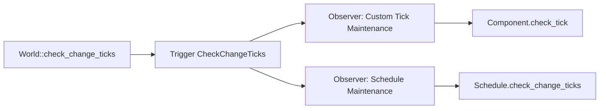

+++
title = "#19274 Introduce `CheckChangeTicks` event that is triggered by `World::check_change_ticks`"
date = "2025-06-09T00:00:00"
draft = false
template = "pull_request_page.html"
in_search_index = true

[taxonomies]
list_display = ["show"]

[extra]
current_language = "en"
available_languages = {"en" = { name = "English", url = "/pull_request/bevy/2025-06/pr-19274-en-20250609" }, "zh-cn" = { name = "中文", url = "/pull_request/bevy/2025-06/pr-19274-zh-cn-20250609" }}
labels = ["A-ECS", "A-Time", "A-Networking", "D-Straightforward"]
+++

## Analysis of PR #19274: Introduce `CheckChangeTicks` event

### Basic Information
- **Title**: Introduce `CheckChangeTicks` event that is triggered by `World::check_change_ticks`
- **PR Link**: https://github.com/bevyengine/bevy/pull/19274
- **Author**: urben1680
- **Status**: MERGED
- **Labels**: A-ECS, S-Ready-For-Final-Review, A-Time, A-Networking, D-Straightforward
- **Created**: 2025-05-18T10:41:24Z
- **Merged**: 2025-06-09T21:07:05Z
- **Merged By**: alice-i-cecile

### Description Translation
**Objective**

In the past I had custom data structures containing `Tick`s. I learned that these need to be regularly checked to clamp them. But there was no way to hook into that logic so I abandoned storing ticks since then.

Another motivation to open this up some more is to be more able to do a correct implementation of `System::check_ticks`.

**Solution**

Add `CheckChangeTicks` and trigger it in `World::check_change_ticks`.
Make `Tick::check_tick` public.

This event makes it possible to store ticks in components or resources and have them checked.

I also made `Schedules::check_change_ticks` public so users can store schedules in custom resources/components for whatever reasons.

**Testing**

The logic boils down to a single `World::trigger` call and I don't think this needs more tests.

**Alternatives**

Making this obsolete like with #15683.

---

**Showcase**

From the added docs:

```rs
use bevy_ecs::prelude::*;
use bevy_ecs::component::CheckChangeTicks;

#[derive(Resource)]
struct CustomSchedule(Schedule);

let mut world = World::new();
world.add_observer(|tick: Trigger<CheckChangeTicks>, mut schedule: ResMut<CustomSchedule>| {
    schedule.0.check_change_ticks(tick.get());
});
```

### The Story of This Pull Request

**The Problem and Context**  
Bevy's ECS uses `Tick` values for change detection, which must be periodically clamped to prevent overflow. Previously, this clamping only occurred internally for Bevy-managed components and systems. Developers couldn't extend this protection to custom data structures containing `Tick` values, leading to potential bugs and abandonment of tick-based solutions. This limitation was particularly problematic for custom schedule implementations stored in resources, which didn't benefit from automatic tick maintenance.

**The Solution Approach**  
The solution introduces an event-based mechanism that exposes Bevy's internal tick clamping logic. By adding a `CheckChangeTicks` event and triggering it during `World::check_change_ticks`, developers can now maintain tick validity in their own data structures. Two key changes enable this:
1. Making `Tick::check_tick` public allows manual tick validation
2. Making `Schedule::check_change_ticks` public enables custom schedule maintenance

This approach maintains Bevy's existing change detection architecture while providing extension points without significant overhead.

**The Implementation**  
The implementation adds the `CheckChangeTicks` event and triggers it in the world's tick update loop:

```rust
// crates/bevy_ecs/src/world/mod.rs
impl World {
    pub fn check_change_ticks(&mut self) {
        let change_tick = self.change_tick();
        // ... existing logic ...
        self.trigger(CheckChangeTicks(change_tick)); // New event trigger
        self.last_check_tick = change_tick;
    }
}
```

The new event provides access to the current change tick:
```rust
// crates/bevy_ecs/src/component.rs
#[derive(Debug, Clone, Copy, Event)]
pub struct CheckChangeTicks(pub(crate) Tick);

impl CheckChangeTicks {
    pub fn get(self) -> Tick {
        self.0
    }
}
```

Visibility changes enable external tick maintenance:
```rust
// crates/bevy_ecs/src/component.rs
impl Tick {
    pub fn check_tick(&mut self, tick: Tick) -> bool { /* ... */ }
}

// crates/bevy_ecs/src/schedule/schedule.rs
impl Schedule {
    pub fn check_change_ticks(&mut self, change_tick: Tick) { /* ... */ }
}
```

**Technical Insights**  
This solution addresses a specific gap in Bevy's change detection API. The event-based approach keeps concerns separated while providing necessary extension points. Performance impact is minimal since the event triggers unconditionally but only actual observers will process it. The implementation avoids breaking changes while solving a real-world problem encountered by the author and others in the community.

**The Impact**  
This change enables several new patterns:
1. Custom components/resources with tick-based change detection
2. External schedule management (e.g., for modding systems)
3. Safer long-running applications by preventing tick overflow
4. More robust implementations of `System::check_ticks`

Developers no longer need to abandon tick-based solutions due to maintenance concerns. The solution also provides a pattern for extending other internal ECS processes through events.

### Visual Representation



### Key Files Changed

1. **crates/bevy_ecs/src/component.rs** (+37/-1)  
   Added the `CheckChangeTicks` event and made `Tick::check_tick` public:

```rust
// Before:
impl Tick {
    pub(crate) fn check_tick(&mut self, tick: Tick) -> bool { ... }
}

// After:
impl Tick {
    pub fn check_tick(&mut self, tick: Tick) -> bool { ... }
}

#[derive(Debug, Clone, Copy, Event)]
pub struct CheckChangeTicks(pub(crate) Tick);

impl CheckChangeTicks {
    pub fn get(self) -> Tick {
        self.0
    }
}
```

2. **crates/bevy_ecs/src/schedule/schedule.rs** (+1/-1)  
   Made schedule tick checking public:

```rust
// Before:
impl Schedule {
    pub(crate) fn check_change_ticks(&mut self, change_tick: Tick) { ... }
}

// After:
impl Schedule {
    pub fn check_change_ticks(&mut self, change_tick: Tick) { ... }
}
```

3. **crates/bevy_ecs/src/world/mod.rs** (+5/-3)  
   Added event triggering to the world's tick update:

```rust
// Before:
impl World {
    pub fn check_change_ticks(&mut self) {
        // ...existing logic...
        self.last_check_tick = change_tick;
    }
}

// After:
impl World {
    pub fn check_change_ticks(&mut self) {
        // ...existing logic...
        self.trigger(CheckChangeTicks(change_tick)); // New
        self.last_check_tick = change_tick;
    }
}
```

### Further Reading
1. [Bevy Change Detection Documentation](https://bevyengine.org/learn/book/change-detection/)
2. [Entity Component System Pattern](https://en.wikipedia.org/wiki/Entity_component_system)
3. [Event-Driven Architecture](https://learn.microsoft.com/en-us/azure/architecture/guide/architecture-styles/event-driven)