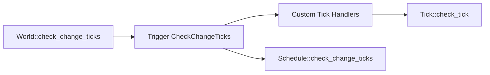

+++
title = "#19274 Introduce `CheckChangeTicks` event that is triggered by `World::check_change_ticks`"
date = "2025-06-09T00:00:00"
draft = false
template = "pull_request_page.html"
in_search_index = false

[extra]
current_language = "zh-cn"
available_languages = {"en" = { name = "English", url = "/pull_request/bevy/2025-06/pr-19274-en-20250609" }, "zh-cn" = { name = "中文", url = "/pull_request/bevy/2025-06/pr-19274-zh-cn-20250609" }}
labels = ["A-ECS", "A-Time", "A-Networking", "D-Straightforward"]
+++

# 分析报告：PR #19274 - Introduce `CheckChangeTicks` event that is triggered by `World::check_change_ticks`

## Basic Information
- **Title**: Introduce `CheckChangeTicks` event that is triggered by `World::check_change_ticks`
- **PR Link**: https://github.com/bevyengine/bevy/pull/19274
- **Author**: urben1680
- **Status**: MERGED
- **Labels**: A-ECS, S-Ready-For-Final-Review, A-Time, A-Networking, D-Straightforward
- **Created**: 2025-05-18T10:41:24Z
- **Merged**: 2025-06-09T21:07:05Z
- **Merged By**: alice-i-cecile

## Description Translation
# Objective

过去我使用过包含 `Tick` 的自定义数据结构。我了解到这些需要定期检查并进行 clamp 操作。但由于没有钩子机制接入该逻辑，我后来放弃了存储 ticks。

另一个更重要的动机是希望更完善地实现 `System::check_ticks`。

## Solution

添加 `CheckChangeTicks` 并在 `World::check_change_ticks` 中触发它。
将 `Tick::check_tick` 改为 public。

该事件使在组件或资源中存储 ticks 并检查它们成为可能。

我还将 `Schedules::check_change_ticks` 改为 public，以便用户因各种原因在自定义资源/组件中存储 schedules。

## Testing

核心逻辑简化为单个 `World::trigger` 调用，我认为不需要更多测试。

## Alternatives

通过 #15683 使此功能过时。

---

## Showcase

从添加的文档中：

```rs
use bevy_ecs::prelude::*;
use bevy_ecs::component::CheckChangeTicks;

#[derive(Resource)]
struct CustomSchedule(Schedule);

let mut world = World::new();
world.add_observer(|tick: Trigger<CheckChangeTicks>, mut schedule: ResMut<CustomSchedule>| {
    schedule.0.check_change_ticks(tick.get());
});
```

## The Story of This Pull Request

### 问题背景
在 Bevy 的 ECS 架构中，`Tick` 用于追踪变化检测。每个组件和资源都有关联的 `Tick` 记录其变更时间。为防止 tick 计数溢出（因为 tick 值单调递增），Bevy 需要定期执行 "clamp" 操作：将过旧的 tick 值重置到当前 tick 的安全范围内。此操作通过 `World::check_change_ticks` 方法实现。

开发者有时需要在自定义数据结构中存储 `Tick`（例如在自定义资源或组件中）。但之前没有机制让这些自定义 tick 参与定期 clamp 操作。这导致长期运行的应用中，自定义 tick 可能溢出，使 `Tick::is_newer_than` 等方法返回错误结果。

### 解决方案
该 PR 引入 `CheckChangeTicks` 事件，在 `World::check_change_ticks` 中触发。同时：
1. 将 `Tick::check_tick` 方法从私有(`pub(crate)`)改为公有(`pub`)
2. 将 `Schedule::check_change_ticks` 方法改为公有

这样开发者可以：
- 在自定义数据结构中存储 `Tick`
- 监听 `CheckChangeTicks` 事件，触发时调用 `Tick::check_tick` 处理自己的 tick
- 当 `Schedule` 存储在自定义资源中时，能手动调用其 `check_change_ticks`

### 实现细节
核心实现在三个文件中：

**1. `component.rs` 中新增事件类型**
```diff
+#[derive(Debug, Clone, Copy, Event)]
+pub struct CheckChangeTicks(pub(crate) Tick);
+
+impl CheckChangeTicks {
+    /// Get the `Tick` that can be used as the parameter of [`Tick::check_tick`].
+    pub fn get(self) -> Tick {
+        self.0
+    }
+}
```

**2. 公开 `Tick::check_tick` 方法**
```diff
-    pub(crate) fn check_tick(&mut self, tick: Tick) -> bool {
+    pub fn check_tick(&mut self, tick: Tick) -> bool {
```

**3. 在 `World::check_change_ticks` 中触发事件**
```diff
         if let Some(schedules) = self.get_mut::<Schedules>() {
             schedules.check_change_ticks(change_tick);
         }
 
+        self.trigger(CheckChangeTicks(change_tick));
+
         self.last_check_tick = change_tick;
     }
```

**4. 公开 `Schedule::check_change_ticks`**
```diff
-    pub(crate) fn check_change_ticks(&mut self, change_tick: Tick) {
+    pub fn check_change_ticks(&mut self, change_tick: Tick) {
```

### 技术考量
1. **事件驱动设计**：通过事件机制扩展功能而非修改核心逻辑，保持系统解耦
2. **Tick 安全**：防止自定义 tick 因长期不更新导致溢出，确保 `is_newer_than` 等方法的正确性
3. **最小侵入**：主要改动是添加事件触发点和调整方法可见性，不影响现有逻辑
4. **用例支持**：文档示例展示如何在自定义资源中存储 Schedule 并保持其 tick 更新

### 影响
1. **功能扩展**：开发者可在自定义结构中安全使用 `Tick`
2. **网络应用**：对需要精确追踪变更的网络同步场景特别有用
3. **向后兼容**：纯增量添加，不影响现有代码

## Visual Representation



## Key Files Changed

### 1. `crates/bevy_ecs/src/component.rs` (+37/-1)
- 将 `Tick::check_tick` 改为公有方法
- 添加 `CheckChangeTicks` 事件及文档

```diff
@@ -2616,7 +2617,7 @@ impl Tick {
     ///
     /// Returns `true` if wrapping was performed. Otherwise, returns `false`.
     #[inline]
-    pub(crate) fn check_tick(&mut self, tick: Tick) -> bool {
+    pub fn check_tick(&mut self, tick: Tick) -> bool {
         let age = tick.relative_to(*self);
         // This comparison assumes that `age` has not overflowed `u32::MAX` before, which will be true
         // so long as this check always runs before that can happen.
@@ -2629,6 +2630,41 @@ impl Tick {
     }
 }
 
+/// An observer [`Event`] that can be used to maintain [`Tick`]s in custom data structures...
+#[derive(Debug, Clone, Copy, Event)]
+pub struct CheckChangeTicks(pub(crate) Tick);
+
+impl CheckChangeTicks {
+    /// Get the `Tick` that can be used as the parameter of [`Tick::check_tick`].
+    pub fn get(self) -> Tick {
+        self.0
+    }
+}
```

### 2. `crates/bevy_ecs/src/world/mod.rs` (+5/-3)
- 在 `World::check_change_ticks` 中触发新事件

```diff
@@ -2981,6 +2981,8 @@ impl World {
             schedules.check_change_ticks(change_tick);
         }
 
+        self.trigger(CheckChangeTicks(change_tick));
+
         self.last_check_tick = change_tick;
     }
```

### 3. `crates/bevy_ecs/src/schedule/schedule.rs` (+1/-1)
- 将 `Schedule::check_change_ticks` 改为公有方法

```diff
@@ -511,7 +511,7 @@ impl Schedule {
     /// Iterates the change ticks of all systems in the schedule and clamps any older than
     /// [`MAX_CHANGE_AGE`](crate::change_detection::MAX_CHANGE_AGE).
     /// This prevents overflow and thus prevents false positives.
-    pub(crate) fn check_change_ticks(&mut self, change_tick: Tick) {
+    pub fn check_change_ticks(&mut self, change_tick: Tick) {
         for system in &mut self.executable.systems {
             if !is_apply_deferred(system) {
                 system.check_change_tick(change_tick);
```

## Further Reading
1. [Bevy 变更检测文档](https://bevyengine.org/learn/book/change-detection/)
2. [实体组件系统模式](https://en.wikipedia.org/wiki/Entity_component_system)
3. [事件驱动架构模式](https://martinfowler.com/articles/201701-event-driven.html)