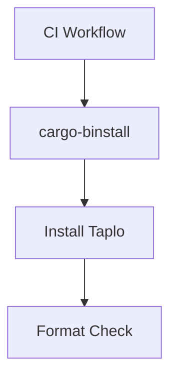

+++
title = "#19289 Bump cargo-bins/cargo-binstall from 1.12.3 to 1.12.5"
date = "2025-06-24T00:00:00"
draft = false
template = "pull_request_page.html"
in_search_index = true

[taxonomies]
list_display = ["show"]

[extra]
current_language = "en"
available_languages = {"en" = { name = "English", url = "/pull_request/bevy/2025-06/pr-19289-en-20250624" }, "zh-cn" = { name = "中文", url = "/pull_request/bevy/2025-06/pr-19289-zh-cn-20250624" }}
labels = ["D-Trivial", "C-Dependencies"]
+++

# Analysis of PR #19289: Bump cargo-bins/cargo-binstall from 1.12.3 to 1.12.5

## Basic Information
- **Title**: Bump cargo-bins/cargo-binstall from 1.12.3 to 1.12.5
- **PR Link**: https://github.com/bevyengine/bevy/pull/19289
- **Author**: app/dependabot
- **Status**: MERGED
- **Labels**: D-Trivial, C-Dependencies, S-Ready-For-Final-Review
- **Created**: 2025-05-19T06:06:54Z
- **Merged**: 2025-06-24T11:29:11Z
- **Merged By**: mockersf

## Description Translation
Bumps [cargo-bins/cargo-binstall](https://github.com/cargo-bins/cargo-binstall) from 1.12.3 to 1.12.5.
<details>
<summary>Release notes</summary>
<p><em>Sourced from <a href="https://github.com/cargo-bins/cargo-binstall/releases">cargo-bins/cargo-binstall's releases</a>.</em></p>
<blockquote>
<h2>v1.12.5</h2>
<p><em>Binstall is a tool to fetch and install Rust-based executables as binaries. It aims to be a drop-in replacement for <code>cargo install</code> in most cases. Install it today with <code>cargo install cargo-binstall</code>, from the binaries below, or if you already have it, upgrade with <code>cargo binstall cargo-binstall</code>.</em></p>
<h4>In this release:</h4>
<ul>
<li>Upgrade dependencies</li>
</ul>
<h2>v1.12.4</h2>
<p><em>Binstall is a tool to fetch and install Rust-based executables as binaries. It aims to be a drop-in replacement for <code>cargo install</code> in most cases. Install it today with <code>cargo install cargo-binstall</code>, from the binaries below, or if you already have it, upgrade with <code>cargo binstall cargo-binstall</code>.</em></p>
<h4>In this release:</h4>
<ul>
<li>Fix glibc detection on ubuntu 24.02 (<a href="https://redirect.github.com/cargo-bins/cargo-binstall/issues/2141">#2141</a> <a href="https://redirect.github.com/cargo-bins/cargo-binstall/issues/2143">#2143</a>)</li>
</ul>
</blockquote>
</details>
<details>
<summary>Commits</summary>
<ul>
<li><a href="https://github.com/cargo-bins/cargo-binstall/commit/5cbf019d8cb9b9d5b086218c41458ea35d817691"><code>5cbf019</code></a> release: cargo-binstall v1.12.5 (<a href="https://redirect.github.com/cargo-bins/cargo-binstall/issues/2156">#2156</a>)</li>
<li><a href="https://github.com/cargo-bins/cargo-binstall/commit/205aaa5a4fc552ecdbfdbc0ef48c2d9b5cc52725"><code>205aaa5</code></a> chore: release (<a href="https://redirect.github.com/cargo-bins/cargo-binstall/issues/2155">#2155</a>)</li>
<li><a href="https://github.com/cargo-bins/cargo-binstall/commit/8d438736eb1c92a5039cefac98948367ca8be77f"><code>8d43873</code></a> dep: Upgrade transitive dependencies (<a href="https://redirect.github.com/cargo-bins/cargo-binstall/issues/2154">#2154</a>)</li>
<li><a href="https://github.com/cargo-bins/cargo-binstall/commit/277269fc8e4ebd8cf30d06174714419e0c1e438e"><code>277269f</code></a> build(deps): bump file-format from 0.26.0 to 0.27.0 in the deps group (<a href="https://redirect.github.com/cargo-bins/cargo-binstall/issues/2149">#2149</a>)</li>
<li><a href="https://github.com/cargo-bins/cargo-binstall/commit/45abf0e8273028b529919845ebaf796856a19c2f"><code>45abf0e</code></a> dep: Upgrade transitive dependencies (<a href="https://redirect.github.com/cargo-bins/cargo-binstall/issues/2148">#2148</a>)</li>
<li><a href="https://github.com/cargo-bins/cargo-binstall/commit/13f9d60d5358393bf14644dba56d9f123bc5d595"><code>13f9d60</code></a> release: cargo-binstall v1.12.4 (<a href="https://redirect.github.com/cargo-bins/cargo-binstall/issues/2146">#2146</a>)</li>
<li><a href="https://github.com/cargo-bins/cargo-binstall/commit/f95e90d82c5fa4bf4f283f8e99569ae5bcc6d127"><code>f95e90d</code></a> chore: release (<a href="https://redirect.github.com/cargo-bins/cargo-binstall/issues/2123">#2123</a>)</li>
<li><a href="https://github.com/cargo-bins/cargo-binstall/commit/15dc05f12b65c47f1ac9a653128ee597c7544a43"><code>15dc05f</code></a> dep: Upgrade transitive dependencies (<a href="https://redirect.github.com/cargo-bins/cargo-binstall/issues/2145">#2145</a>)</li>
<li><a href="https://github.com/cargo-bins/cargo-binstall/commit/1394d1bbda09c88a6668ff9749f935bb58505417"><code>1394d1b</code></a> Fix glibc detection on ubuntu 24.02 (<a href="https://redirect.github.com/cargo-bins/cargo-binstall/issues/2143">#2143</a>)</li>
<li><a href="https://github.com/cargo-bins/cargo-binstall/commit/20e9b259131d8950a206d6a46bf8643ef3c9a739"><code>20e9b25</code></a> dep: Upgrade transitive dependencies (<a href="https://redirect.github.com/cargo-bins/cargo-binstall/issues/2142">#2142</a>)</li>
<li>Additional commits viewable in <a href="https://github.com/cargo-bins/cargo-binstall/compare/v1.12.3...v1.12.5">compare view</a></li>
</ul>
</details>
<br />

[](https://docs.github.com/en/github/managing-security-vulnerabilities/about-dependabot-security-updates#about-compatibility-scores)

You can trigger a rebase of this PR by commenting `@dependabot rebase`.

[//]: # (dependabot-automerge-start)
[//]: # (dependabot-automerge-end)

---

<details>
<summary>Dependabot commands and options</summary>
<br />

You can trigger Dependabot actions by commenting on this PR:
- `@dependabot rebase` will rebase this PR
- `@dependabot recreate` will recreate this PR, overwriting any edits that have been made to it
- `@dependabot merge` will merge this PR after your CI passes on it
- `@dependabot squash and merge` will squash and merge this PR after your CI passes on it
- `@dependabot cancel merge` will cancel a previously requested merge and block automerging
- `@dependabot reopen` will reopen this PR if it is closed
- `@dependabot close` will close this PR and stop Dependabot recreating it. You can achieve the same result by closing it manually
- `@dependabot show <dependency name> ignore conditions` will show all of the ignore conditions of the specified dependency
- `@dependabot ignore this major version` will close this PR and stop Dependabot creating any more for this major version (unless you reopen the PR or upgrade to it yourself)
- `@dependabot ignore this minor version` will close this PR and stop Dependabot creating any more for this minor version (unless you reopen the PR or upgrade to it yourself)
- `@dependabot ignore this dependency` will close this PR and stop Dependabot creating any more for this dependency (unless you reopen the PR or upgrade to it yourself)

</details>

> **Note**
> Automatic rebases have been disabled on this pull request as it has been open for over 30 days.

## The Story of This Pull Request

This dependency update PR addresses a specific compatibility issue in Bevy's CI pipeline. The core problem was that the existing version of cargo-binstall (1.12.3) contained a bug in its glibc detection logic that would cause failures on Ubuntu 24.02 systems. Since GitHub's CI runners periodically update their underlying OS images, this created a risk of CI failures as Ubuntu 24.02 becomes more prevalent.

The solution approach was straightforward: upgrade to cargo-binstall version 1.12.5 which includes the necessary fix. The upgrade path was clear since the dependency had already been pinned to a specific version in the CI configuration. The implementation required only two simple changes in the GitHub Actions workflow file to update the version references.

The key technical insight here is that dependency management in CI systems requires proactive maintenance. While cargo-binstall is not a direct build dependency of Bevy itself, it's a critical tool in the project's CI pipeline for installing required utilities. The glibc detection fix in v1.12.4 specifically addresses compatibility with newer Linux distributions, preventing future CI failures when GitHub updates their runner images.

The impact of this change is maintaining reliable CI execution across different environments. Without this update, Bevy's CI could start failing intermittently as GitHub rolls out updated Ubuntu versions to their runners. The compatibility score of 96 indicates low risk, making this a safe upgrade.

## Visual Representation



## Key Files Changed

### `.github/workflows/ci.yml`

**What changed**: Updated the version of cargo-binstall used in CI from 1.12.3 to 1.12.5

**Why changed**: To incorporate bug fixes and maintain compatibility with newer Ubuntu versions

**Code diff**:
```diff
diff --git a/.github/workflows/ci.yml b/.github/workflows/ci.yml
index 2a0610cf032a8..47e2574cda183 100644
--- a/.github/workflows/ci.yml
+++ b/.github/workflows/ci.yml
@@ -15,7 +15,7 @@ env:
   # If nightly is breaking CI, modify this variable to target a specific nightly version.
   NIGHTLY_TOOLCHAIN: nightly-2025-05-16 # pinned until a fix for https://github.com/rust-lang/miri/issues/4323 is released
   RUSTFLAGS: "-D warnings"
-  BINSTALL_VERSION: "v1.12.3"
+  BINSTALL_VERSION: "v1.12.5"
 
 concurrency:
   group: ${{github.workflow}}-${{github.ref}}
@@ -272,7 +272,7 @@ jobs:
     timeout-minutes: 30
     steps:
       - uses: actions/checkout@v4
-      - uses: cargo-bins/cargo-binstall@v1.12.3
+      - uses: cargo-bins/cargo-binstall@v1.12.5
       - name: Install taplo
         run: cargo binstall taplo-cli@0.9.3 --locked
       - name: Run Taplo
```

**Relation to PR purpose**: This is the only change in the PR, directly implementing the dependency version bump

## Further Reading
1. [cargo-binstall documentation](https://github.com/cargo-bins/cargo-binstall)
2. [GitHub Actions workflow syntax](https://docs.github.com/en/actions/using-workflows/workflow-syntax-for-github-actions)
3. [Dependabot version updates](https://docs.github.com/en/code-security/dependabot/dependabot-version-updates/about-dependabot-version-updates)

# Full Code Diff
```diff
diff --git a/.github/workflows/ci.yml b/.github/workflows/ci.yml
index 2a0610cf032a8..47e2574cda183 100644
--- a/.github/workflows/ci.yml
+++ b/.github/workflows/ci.yml
@@ -15,7 +15,7 @@ env:
   # If nightly is breaking CI, modify this variable to target a specific nightly version.
   NIGHTLY_TOOLCHAIN: nightly-2025-05-16 # pinned until a fix for https://github.com/rust-lang/miri/issues/4323 is released
   RUSTFLAGS: "-D warnings"
-  BINSTALL_VERSION: "v1.12.3"
+  BINSTALL_VERSION: "v1.12.5"
 
 concurrency:
   group: ${{github.workflow}}-${{github.ref}}
@@ -272,7 +272,7 @@ jobs:
     timeout-minutes: 30
     steps:
       - uses: actions/checkout@v4
-      - uses: cargo-bins/cargo-binstall@v1.12.3
+      - uses: cargo-bins/cargo-binstall@v1.12.5
       - name: Install taplo
         run: cargo binstall taplo-cli@0.9.3 --locked
       - name: Run Taplo
```