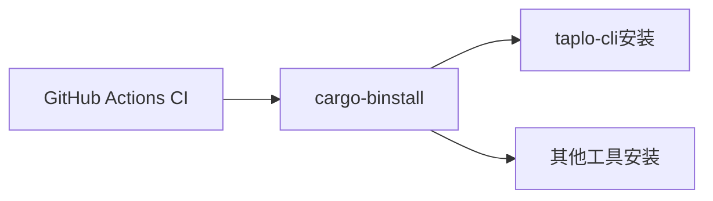

+++
title = "#19289 Bump cargo-bins/cargo-binstall from 1.12.3 to 1.12.5"
date = "2025-06-24T00:00:00"
draft = false
template = "pull_request_page.html"
in_search_index = false

[extra]
current_language = "zh-cn"
available_languages = {"en" = { name = "English", url = "/pull_request/bevy/2025-06/pr-19289-en-20250624" }, "zh-cn" = { name = "中文", url = "/pull_request/bevy/2025-06/pr-19289-zh-cn-20250624" }}
labels = ["D-Trivial", "C-Dependencies"]
+++

# Bump cargo-bins/cargo-binstall from 1.12.3 to 1.12.5

## Basic Information
- **Title**: Bump cargo-bins/cargo-binstall from 1.12.3 to 1.12.5
- **PR Link**: https://github.com/bevyengine/bevy/pull/19289
- **Author**: app/dependabot
- **Status**: MERGED
- **Labels**: D-Trivial, C-Dependencies, S-Ready-For-Final-Review
- **Created**: 2025-05-19T06:06:54Z
- **Merged**: 2025-06-24T11:29:11Z
- **Merged By**: mockersf

## Description Translation
更新 [cargo-bins/cargo-binstall](https://github.com/cargo-bins/cargo-binstall) 从 1.12.3 到 1.12.5。
<details>
<summary>Release notes</summary>
<p><em>来源自 <a href="https://github.com/cargo-bins/cargo-binstall/releases">cargo-bins/cargo-binstall's releases</a>。</em></p>
<blockquote>
<h2>v1.12.5</h2>
<p><em>Binstall 是一个工具，用于获取并安装基于 Rust 的可执行文件二进制文件。它旨在在大多数情况下作为 <code>cargo install</code> 的直接替代品。立即使用 <code>cargo install cargo-binstall</code> 安装它，或从下面的二进制文件安装，如果已经安装，则使用 <code>cargo binstall cargo-binstall</code> 升级。</em></p>
<h4>此版本包含：</h4>
<ul>
<li>升级依赖项</li>
</ul>
<h2>v1.12.4</h2>
<p><em>Binstall 是一个工具，用于获取并安装基于 Rust 的可执行文件二进制文件。它旨在在大多数情况下作为 <code>cargo install</code> 的直接替代品。立即使用 <code>cargo install cargo-binstall</code> 安装它，或从下面的二进制文件安装，如果已经安装，则使用 <code>cargo binstall cargo-binstall</code> 升级。</em></p>
<h4>此版本包含：</h4>
<ul>
<li>修复 Ubuntu 24.02 上的 glibc 检测 (<a href="https://redirect.github.com/cargo-bins/cargo-binstall/issues/2141">#2141</a> <a href="https://redirect.github.com/cargo-bins/cargo-binstall/issues/2143">#2143</a>)</li>
</ul>
</blockquote>
</details>
<details>
<summary>Commits</summary>
<ul>
<li><a href="https://github.com/cargo-bins/cargo-binstall/commit/5cbf019d8cb9b9d5b086218c41458ea35d817691"><code>5cbf019</code></a> release: cargo-binstall v1.12.5 (<a href="https://redirect.github.com/cargo-bins/cargo-binstall/issues/2156">#2156</a>)</li>
<li><a href="https://github.com/cargo-bins/cargo-binstall/commit/205aaa5a4fc552ecdbfdbc0ef48c2d9b5cc52725"><code>205aaa5</code></a> chore: release (<a href="https://redirect.github.com/cargo-bins/cargo-binstall/issues/2155">#2155</a>)</li>
<li><a href="https://github.com/cargo-bins/cargo-binstall/commit/8d438736eb1c92a5039cefac98948367ca8be77f"><code>8d43873</code></a> dep: Upgrade transitive dependencies (<a href="https://redirect.github.com/cargo-bins/cargo-binstall/issues/2154">#2154</a>)</li>
<li><a href="https://github.com/cargo-bins/cargo-binstall/commit/277269fc8e4ebd8cf30d06174714419e0c1e438e"><code>277269f</code></a> build(deps): bump file-format from 0.26.0 to 0.27.0 in the deps group (<a href="https://redirect.github.com/cargo-bins/cargo-binstall/issues/2149">#2149</a>)</li>
<li><a href="https://github.com/cargo-bins/cargo-binstall/commit/45abf0e8273028b529919845ebaf796856a19c2f"><code>45abf0e</code></a> dep: Upgrade transitive dependencies (<a href="https://redirect.github.com/cargo-bins/cargo-binstall/issues/2148">#2148</a>)</li>
<li><a href="https://github.com/cargo-bins/cargo-binstall/commit/13f9d60d5358393bf14644dba56d9f123bc5d595"><code>13f9d60</code></a> release: cargo-binstall v1.12.4 (<a href="https://redirect.github.com/cargo-bins/cargo-binstall/issues/2146">#2146</a>)</li>
<li><a href="https://github.com/cargo-bins/cargo-binstall/commit/f95e90d82c5fa4bf4f283f8e99569ae5bcc6d127"><code>f95e90d</code></a> chore: release (<a href="https://redirect.github.com/cargo-bins/cargo-binstall/issues/2123">#2123</a>)</li>
<li><a href="https://github.com/cargo-bins/cargo-binstall/commit/15dc05f12b65c47f1ac9a653128ee597c7544a43"><code>15dc05f</code></a> dep: Upgrade transitive dependencies (<a href="https://redirect.github.com/cargo-bins/cargo-binstall/issues/2145">#2145</a>)</li>
<li><a href="https://github.com/cargo-bins/cargo-binstall/commit/1394d1bbda09c88a6668ff9749f935bb58505417"><code>1394d1b</code></a> Fix glibc detection on ubuntu 24.02 (<a href="https://redirect.github.com/cargo-bins/cargo-binstall/issues/2143">#2143</a>)</li>
<li><a href="https://github.com/cargo-bins/cargo-binstall/commit/20e9b259131d8950a206d6a46bf8643ef3c9a739"><code>20e9b25</code></a> dep: Upgrade transitive dependencies (<a href="https://redirect.github.com/cargo-bins/cargo-binstall/issues/2142">#2142</a>)</li>
<li>更多提交请查看 <a href="https://github.com/cargo-bins/cargo-binstall/compare/v1.12.3...v1.12.5">compare view</a></li>
</ul>
</details>
<br />


[](https://docs.github.com/en/github/managing-security-vulnerabilities/about-dependabot-security-updates#about-compatibility-scores)

你可以通过评论 `@dependabot rebase` 来触发此 PR 的 rebase。

[//]: # (dependabot-automerge-start)
[//]: # (dependabot-automerge-end)

---

<details>
<summary>Dependabot 命令和选项</summary>
<br />

你可以通过在 PR 上评论来触发 Dependabot 操作：
- `@dependabot rebase` 将 rebase 此 PR
- `@dependabot recreate` 将重新创建此 PR，覆盖对其进行的任何编辑
- `@dependabot merge` 将在 CI 通过后合并此 PR
- `@dependabot squash and merge` 将在 CI 通过后 squash 并合并此 PR
- `@dependabot cancel merge` 将取消之前请求的合并并阻止自动合并
- `@dependabot reopen` 如果已关闭，将重新打开此 PR
- `@dependabot close` 将关闭此 PR 并停止 Dependabot 重新创建它。您可以通过手动关闭它来达到相同的结果
- `@dependabot show <dependency name> ignore conditions` 将显示指定依赖项的所有忽略条件
- `@dependabot ignore this major version` 将关闭此 PR 并停止 Dependabot 为此主要版本创建任何更多版本（除非您重新打开 PR 或自行升级）
- `@dependabot ignore this minor version` 将关闭此 PR 并停止 Dependabot 为此次要版本创建任何更多版本（除非您重新打开 PR 或自行升级）
- `@dependabot ignore this dependency` 将关闭此 PR 并停止 Dependabot 为此依赖项创建任何更多版本（除非您重新打开 PR 或自行升级）


</details>

> **注意**
> 由于此 pull request 已打开超过 30 天，自动 rebase 已被禁用。


## The Story of This Pull Request

这个 PR 的核心目标是更新 CI 工作流中使用的 `cargo-binstall` 工具版本。`cargo-binstall` 是一个 Rust 工具，用于高效安装预编译的二进制文件，而不是从源代码构建，这可以显著加速 CI 流程。

### 问题背景
在 GitHub Actions CI 配置中，项目使用 `cargo-binstall` 来安装 `taplo-cli`（一个 TOML 格式化工具）。原始配置使用的是 `cargo-binstall@v1.12.3`，但新版本 `v1.12.5` 包含了重要的修复和改进：
1. **glibc 检测修复**：在 Ubuntu 24.02 上修复了 glibc 检测问题（#2141, #2143）
2. **依赖升级**：更新了多个底层依赖项，可能包含安全补丁和性能改进

### 解决方案
Dependabot 自动检测到版本更新并创建了这个 PR。解决方案很简单：将 CI 配置文件中所有引用 `cargo-binstall@v1.12.3` 的地方更新为 `v1.12.5`。这个变更：
- 确保 CI 使用最新的工具版本
- 修复了在新版 Ubuntu 上的潜在兼容性问题
- 继承了上游依赖项的安全更新

### 技术实现
整个变更只涉及 CI 配置文件中两个位置的修改：
1. 更新环境变量 `BINSTALL_VERSION` 的值
2. 更新 GitHub Action 的 `uses` 字段版本

```diff
# .github/workflows/ci.yml
-  BINSTALL_VERSION: "v1.12.3"
+  BINSTALL_VERSION: "v1.12.5"
...
-      - uses: cargo-bins/cargo-binstall@v1.12.3
+      - uses: cargo-bins/cargo-binstall@v1.12.5
```

这个最小变更确保了：
- CI 工作流继续使用相同的工具链
- 所有依赖安装步骤保持原样
- 仅工具版本升级，不影响其他 CI 逻辑

### 影响和考量
这个更新带来了：
1. **兼容性改进**：修复了在新版 Ubuntu 上的 glibc 检测问题
2. **潜在性能提升**：依赖更新可能包含性能优化
3. **维护性**：保持工具链最新，减少技术债务

风险几乎为零，因为：
- 变更只影响 CI 工具链，不涉及核心代码
- 新版本保持向后兼容
- Dependabot 的兼容性评分确认了升级安全性

## Visual Representation



## Key Files Changed

### `.github/workflows/ci.yml`
**变更描述**：更新 cargo-binstall 的版本引用  
**变更原因**：使用最新版本修复兼容性问题并获取依赖更新  

**变更前**：
```yaml
env:
  BINSTALL_VERSION: "v1.12.3"

jobs:
  taplo:
    steps:
      - uses: cargo-bins/cargo-binstall@v1.12.3
```

**变更后**：
```yaml
env:
  BINSTALL_VERSION: "v1.12.5"

jobs:
  taplo:
    steps:
      - uses: cargo-bins/cargo-binstall@v1.12.5
```

**影响**：确保 CI 使用最新稳定的 cargo-binstall 版本

## Further Reading
1. [cargo-binstall 官方文档](https://github.com/cargo-bins/cargo-binstall)
2. [GitHub Actions 依赖管理最佳实践](https://docs.github.com/en/actions/security-guides/security-hardening-for-github-actions#using-third-party-actions)
3. [Dependabot 版本更新文档](https://docs.github.com/en/code-security/dependabot/dependabot-version-updates/about-dependabot-version-updates)

# Full Code Diff
```diff
diff --git a/.github/workflows/ci.yml b/.github/workflows/ci.yml
index 2a0610cf032a8..47e2574cda183 100644
--- a/.github/workflows/ci.yml
+++ b/.github/workflows/ci.yml
@@ -15,7 +15,7 @@ env:
   # If nightly is breaking CI, modify this variable to target a specific nightly version.
   NIGHTLY_TOOLCHAIN: nightly-2025-05-16 # pinned until a fix for https://github.com/rust-lang/miri/issues/4323 is released
   RUSTFLAGS: "-D warnings"
-  BINSTALL_VERSION: "v1.12.3"
+  BINSTALL_VERSION: "v1.12.5"
 
 concurrency:
   group: ${{github.workflow}}-${{github.ref}}
@@ -272,7 +272,7 @@ jobs:
     timeout-minutes: 30
     steps:
       - uses: actions/checkout@v4
-      - uses: cargo-bins/cargo-binstall@v1.12.3
+      - uses: cargo-bins/cargo-binstall@v1.12.5
       - name: Install taplo
         run: cargo binstall taplo-cli@0.9.3 --locked
       - name: Run Taplo
```