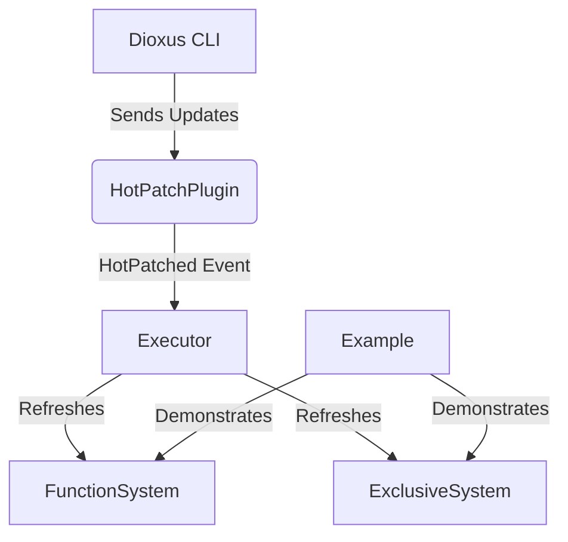

+++
title = "#19309 Hot patching systems with subsecond"
date = "2025-06-03T00:00:00"
draft = false
template = "pull_request_page.html"
in_search_index = true

[taxonomies]
list_display = ["show"]

[extra]
current_language = "en"
available_languages = {"en" = { name = "English", url = "/pull_request/bevy/2025-06/pr-19309-en-20250603" }, "zh-cn" = { name = "中文", url = "/pull_request/bevy/2025-06/pr-19309-zh-cn-20250603" }}
labels = ["X-Controversial", "A-Dev-Tools"]
+++

## Hot patching systems with subsecond

### Basic Information
- **Title**: Hot patching systems with subsecond
- **PR Link**: https://github.com/bevyengine/bevy/pull/19309
- **Author**: mockersf
- **Status**: MERGED
- **Labels**: X-Controversial, M-Needs-Release-Note, A-Dev-Tools, S-Needs-Review
- **Created**: 2025-05-20T10:50:01Z
- **Merged**: 2025-06-03T21:30:06Z
- **Merged By**: cart

### The Story of This Pull Request

#### The Problem and Context
Developers working with Bevy faced a significant limitation: modifying systems required restarting the entire application. This disrupted workflows during rapid iteration cycles, especially when testing small logic changes. The core challenge was enabling runtime system updates without compromising performance or introducing overhead when the feature wasn't used. The solution needed to be opt-in and maintain Bevy's execution efficiency.

#### The Solution Approach
The implementation leverages the `subsecond` library from Dioxus for function pointer redirection. The approach centers on:
1. Adding a feature-gated `hotpatching` mechanism
2. Storing and comparing function pointers in systems
3. Triggering updates through a `HotPatched` event
4. Minimizing checks to only when hotpatches occur

Key engineering decisions:
- Feature-gating ensures zero overhead when disabled
- Function pointer comparison avoids unnecessary refreshes
- Event-driven updates prevent per-frame checks
- Integration at the executor level handles all system types uniformly

#### The Implementation
The core changes introduce:
1. A new `HotPatched` event signaling available updates
2. Function pointer storage in systems
3. Refresh logic in system executors
4. Example demonstrating live text/color updates

For regular systems, we store and check function pointers:

```rust
// crates/bevy_ecs/src/system/function_system.rs
#[cfg(feature = "hotpatching")]
current_ptr: subsecond::HotFnPtr,

fn refresh_hotpatch(&mut self) {
    let new = subsecond::HotFn::current(F::run).ptr_address();
    if new != self.current_ptr {
        log::debug!("system {} hotpatched", self.name());
    }
    self.current_ptr = new;
}
```

Executors conditionally refresh systems when hotpatches occur:

```rust
// crates/bevy_ecs/src/schedule/executor/simple.rs
#[cfg(feature = "hotpatching")]
let should_update_hotpatch = !world
    .get_resource::<Events<HotPatched>>()
    .map(Events::is_empty)
    .unwrap_or(true);

// Later in system execution loop:
#[cfg(feature = "hotpatching")]
if should_update_hotpatch {
    system.refresh_hotpatch();
}
```

The plugin establishes the Dioxus connection:

```rust
// crates/bevy_app/src/hotpatch.rs
subsecond::register_handler(Arc::new(move || {
    sender.send(HotPatched).unwrap();
}));
```

#### Technical Insights
The solution uses several key techniques:
1. **Jump Tables**: `subsecond` maintains function pointer tables
2. **Pointer Comparison**: Systems compare stored vs current pointers
3. **Event-Driven**: `HotPatched` events signal available updates
4. **Executor Integration**: All executors handle hotpatching consistently

Performance considerations:
- No overhead when feature disabled (compiles out)
- Single pointer comparison per system when enabled
- Events minimize refresh checks to necessary frames

Limitations:
- Requires Dioxus CLI for rebuilds (`dx serve --hot-patch`)
- Not supported in WASM targets
- System signature changes still require restarts

#### The Impact
These changes enable:
1. Live system updates without app restarts
2. Faster iteration cycles during development
3. Visualized in the new `hotpatching_systems` example
4. Optional integration via `hotpatching` feature

The implementation demonstrates how to integrate low-level function patching with Bevy's ECS architecture while maintaining performance characteristics. The pattern could extend to other hot-reloadable components in the future.

### Visual Representation



### Key Files Changed

1. `examples/ecs/hotpatching_systems.rs` (+94/-0)
   - New example demonstrating live text/color updates
   - Shows both system hotpatching and manual `call()` usage
```rust
fn update_text(mut text: Single<&mut Text>) {
    text.0 = "before".to_string(); // Editable at runtime
}

fn on_click(_click: Trigger<Pointer<Click>>, ...) {
    color.0 = palettes::tailwind::RED_600.into(); // Editable at runtime
}
```

2. `crates/bevy_app/src/hotpatch.rs` (+42/-0)
   - New plugin connecting to Dioxus CLI
   - Bridges subsecond updates to ECS events
```rust
subsecond::register_handler(Arc::new(move || {
    sender.send(HotPatched).unwrap();
}));
```

3. `crates/bevy_ecs/src/system/function_system.rs` (+35/-0)
   - Adds function pointer storage to systems
   - Implements hotpatch refresh logic
```rust
#[cfg(feature = "hotpatching")]
current_ptr: subsecond::HotFnPtr,

#[cfg(feature = "hotpatching")]
fn refresh_hotpatch(&mut self) { ... }
```

4. `crates/bevy_ecs/src/system/exclusive_function_system.rs` (+32/-0)
   - Similar changes for exclusive systems
```rust
#[cfg(feature = "hotpatching")]
current_ptr: subsecond::HotFnPtr,
```

5. `crates/bevy_ecs/src/schedule/executor/simple.rs` (+23/-0)
   - Adds conditional hotpatch refreshing
```rust
#[cfg(feature = "hotpatching")]
let should_update_hotpatch = ...;
...
if should_update_hotpatch {
    system.refresh_hotpatch();
}
```

### Further Reading
1. [Subsecond Documentation](https://docs.rs/subsecond/latest/subsecond/)
2. [Hot Reloading in Rust](https://fasterthanli.me/articles/hot-reloading-in-rust)
3. [Bevy ECS System Documentation](https://bevyengine.org/learn/book/ecs/system/)
4. [Dioxus Hot Reloading Guide](https://dioxuslabs.com/learn/0.5/advanced/hot-reloading)