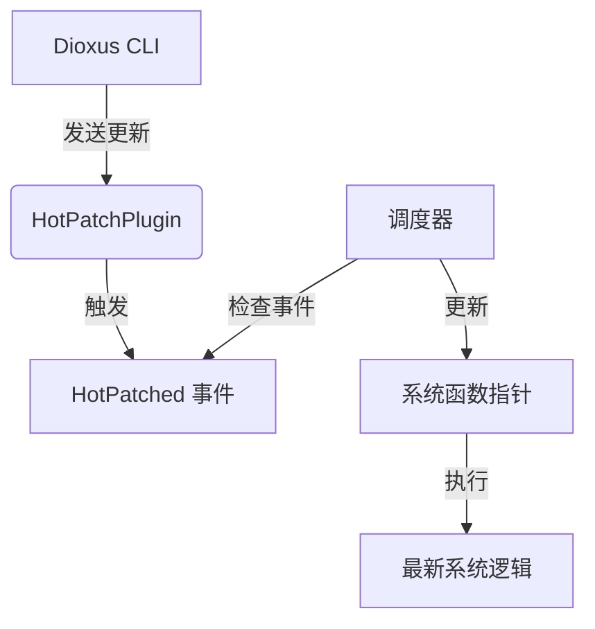

+++
title = "#19309 Hot patching systems with subsecond"
date = "2025-06-03T00:00:00"
draft = false
template = "pull_request_page.html"
in_search_index = false

[extra]
current_language = "zh-cn"
available_languages = {"en" = { name = "English", url = "/pull_request/bevy/2025-06/pr-19309-en-20250603" }, "zh-cn" = { name = "中文", url = "/pull_request/bevy/2025-06/pr-19309-zh-cn-20250603" }}
+++

### Hot patching systems with subsecond

## Basic Information
- **标题**: Hot patching systems with subsecond
- **PR链接**: https://github.com/bevyengine/bevy/pull/19309
- **作者**: mockersf
- **状态**: 已合并 (MERGED)
- **标签**: X-Controversial, M-Needs-Release-Note, A-Dev-Tools, S-Needs-Review
- **创建时间**: 2025-05-20T10:50:01Z
- **合并时间**: 2025-06-03T21:30:06Z
- **合并者**: cart

## 描述翻译
### 目标
- 通过 subsecond 实现系统热修补
- 修复 #19296

### 解决方案
- 第一个提交实现简单的薄层封装
- 第二个提交仅在代码被热修补时检查跳转表，而不是每次系统执行都检查
- 依赖 https://github.com/DioxusLabs/dioxus/pull/4153 提供更好的 API，但也可以独立实现
- 第二个提交的所有内容都是特性门控的，未启用特性时没有影响

### 测试
- 未启用特性时检查依赖：代码库中没有 dioxus 相关依赖
- 运行新示例：文本和颜色可以被修改

## 这个 PR 的故事

### 问题和背景
开发者在迭代游戏逻辑时需要频繁重启应用来验证系统修改，这显著降低了开发效率。特别是在大型项目中，启动时间可能长达数分钟。现有的热重载方案要么需要特殊工具链支持，要么无法无缝集成到 ECS 架构中。问题 #19296 明确指出需要在不重启应用的情况下更新系统逻辑。

技术限制包括：
1. 需要兼容 Bevy 现有的 ECS 调度和执行架构
2. 必须支持各种系统类型（普通系统、独占系统、观察者系统等）
3. 需要最小化运行时开销
4. 必须保持跨平台兼容性（特别是 WASM 支持）

### 解决方案方法
开发者采用 subsecond 库（来自 Dioxus 项目）作为底层热修补基础设施。核心思路是将系统函数指针替换为最新编译版本，关键决策包括：

1. **特性门控实现**：通过 `hotpatching` 特性控制所有相关代码
2. **事件驱动更新**：引入 `HotPatched` 事件通知系统更新
3. **跳转表检查优化**：仅在热修补发生后检查函数指针
4. **统一更新点**：在调度器执行阶段集中刷新系统

替代方案考虑：
- 完全自定义热修补机制（维护成本高）
- 基于 WASM 的动态加载（平台限制大）
- 每帧检查跳转表（性能开销不可接受）

### 具体实现
#### 1. 热修补基础设施 (`crates/bevy_app/src/hotpatch.rs`)
```rust
// 连接到处理重建的 dioxus CLI
#[cfg(not(target_family = "wasm"))]
connect_subsecond();
subsecond::register_handler(Arc::new(move || {
    sender.send(HotPatched).unwrap();
}));

// 添加系统读取通道并转发 HotPatched 事件
app.add_event::<HotPatched>().add_systems(
    Last,
    move |mut events: EventWriter<HotPatched>| {
        if receiver.try_recv().is_ok() {
            events.write_default();
        }
    },
);
```
这段代码创建了与 Dioxus CLI 的通信通道，当检测到代码更新时发送 `HotPatched` 事件。

#### 2. 系统函数指针更新 (`crates/bevy_ecs/src/system/function_system.rs`)
```rust
// 修改前:
struct FunctionSystem {
    func: F,
    state: Option<FunctionSystemState<F::Param>>,
    ...
}

// 修改后:
struct FunctionSystem {
    func: F,
    #[cfg(feature = "hotpatching")]
    current_ptr: subsecond::HotFnPtr, // 存储当前函数指针
    ...
}

// 添加刷新方法
#[cfg(feature = "hotpatching")]
fn refresh_hotpatch(&mut self) {
    let new = subsecond::HotFn::current(F::run).ptr_address();
    if new != self.current_ptr {
        log::debug!("system {} hotpatched", self.name());
    }
    self.current_ptr = new;
}
```
每个系统现在存储当前函数指针，并在热修补时更新。

#### 3. 调度器集成 (`crates/bevy_ecs/src/schedule/executor/simple.rs`)
```rust
#[cfg(feature = "hotpatching")]
let should_update_hotpatch = !world
    .get_resource::<Events<HotPatched>>()
    .map(Events::is_empty)
    .unwrap_or(true);

// 在系统执行前检查热修补
#[cfg(feature = "hotpatching")]
if should_update_hotpatch {
    system.refresh_hotpatch();
}
```
调度器在执行系统前检查 `HotPatched` 事件，并触发函数指针刷新。

#### 4. 示例实现 (`examples/ecs/hotpatching_systems.rs`)
```rust
// 可热修补的系统
fn update_text(mut text: Single<&mut Text>) {
    text.0 = "before".to_string(); // 修改此字符串会立即生效
}

// 可热修补的观察者系统
fn on_click(
    _click: Trigger<Pointer<Click>>,
    mut color: Single<&mut TextColor>,
) {
    color.0 = palettes::tailwind::RED_600.into(); // 修改颜色值会立即生效
}

// 通用函数热修补
bevy::app::hotpatch::call(|| Duration::from_secs(2));
```
示例展示了系统内代码和独立函数的热修补能力。

### 技术洞察
1. **函数指针切换**：核心机制是通过 `subsecond::HotFn` 获取最新编译版本的函数地址
2. **安全更新点**：选择在系统执行前更新指针，确保不会在函数执行中途切换
3. **最小化开销**：
   - 未启用特性时零开销
   - 启用特性后仅当热修补发生时才有指针比较操作
4. **架构兼容性**：
   - 通过 trait 统一接口：为所有系统类型实现 `refresh_hotpatch` 方法
   - 事件驱动更新：避免轮询检查

已知限制：
- 不支持系统签名变更（参数类型/数量变化）
- WASM 环境暂不支持
- 需要 Dioxus CLI 配合使用

### 影响
1. **开发效率提升**：修改系统逻辑后无需重启应用
2. **无侵入式集成**：现有系统代码无需修改即可支持热修补
3. **可控运行时开销**：特性门控确保生产环境无额外开销
4. **扩展性**：为未来更多热重载功能奠定基础

主要技术收获：
- 函数指针是实现本地代码热更新的可行方案
- 事件驱动优于轮询的更新检查机制
- 特性门控是管理实验性功能的有效方式

## 可视化关系


## 关键文件变更

### `examples/ecs/hotpatching_systems.rs` (+94/-0)
**作用**：演示系统热修补功能的示例  
**关键代码**：
```rust
// 可热修改的系统
fn update_text(mut text: Single<&mut Text>) {
    text.0 = "before".to_string(); // 修改此处实时生效
}

// 通用函数热修补
bevy::app::hotpatch::call(|| Duration::from_secs(2));
```

### `crates/bevy_app/src/hotpatch.rs` (+42/-0)
**作用**：热修补插件实现  
**关键代码**：
```rust
// 建立与 Dioxus CLI 的连接
#[cfg(not(target_family = "wasm"))]
connect_subsecond();

// 转发热修补事件到 ECS
app.add_event::<HotPatched>().add_systems(
    Last,
    move |mut events: EventWriter<HotPatched>| {
        if receiver.try_recv().is_ok() {
            events.write_default();
        }
    },
);
```

### `crates/bevy_ecs/src/system/function_system.rs` (+35/-0)
**作用**：普通系统的热修补支持  
**关键代码**：
```rust
// 存储当前函数指针
#[cfg(feature = "hotpatching")]
current_ptr: subsecond::HotFnPtr,

// 刷新函数指针
#[cfg(feature = "hotpatching")]
fn refresh_hotpatch(&mut self) {
    let new = subsecond::HotFn::current(F::run).ptr_address();
    self.current_ptr = new;
}
```

### `crates/bevy_ecs/src/system/exclusive_function_system.rs` (+32/-0)
**作用**：独占系统的热修补支持  
**关键代码**：
```rust
// 在独占系统中执行热修补函数
#[cfg(feature = "hotpatching")]
let out = {
    let mut hot_fn = subsecond::HotFn::current(F::run);
    unsafe {
        hot_fn.try_call_with_ptr(...)
    }
};
```

### `crates/bevy_ecs/src/schedule/executor/simple.rs` (+23/-0)
**作用**：简单执行器的热修补集成  
**关键代码**：
```rust
// 检查是否需要热更新
#[cfg(feature = "hotpatching")]
let should_update_hotpatch = ...;

// 执行系统前刷新
#[cfg(feature = "hotpatching")]
if should_update_hotpatch {
    system.refresh_hotpatch();
}
```

## 扩展阅读
1. [Subsecond 技术原理](https://github.com/DioxusLabs/dioxus/blob/master/packages/subsecond/README.md)
2. [函数指针与热更新](https://en.wikipedia.org/wiki/Hot_swapping)
3. [Bevy 系统执行模型](https://bevyengine.org/learn/book/next/programming/systems/)
4. [动态代码加载技术比较](https://llvm.org/docs/DynamicLibrary.html)