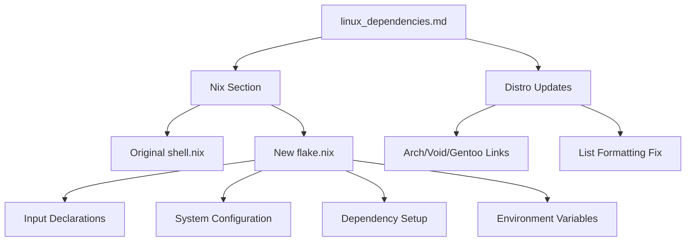

+++
title = "#19321 Adding NixOS flake.nix Example to Bevy Documentation"
date = "2025-06-08T00:00:00"
draft = false
template = "pull_request_page.html"
in_search_index = true

[taxonomies]
list_display = ["show"]

[extra]
current_language = "en"
available_languages = {"en" = { name = "English", url = "/pull_request/bevy/2025-06/pr-19321-en-20250608" }, "zh-cn" = { name = "中文", url = "/pull_request/bevy/2025-06/pr-19321-zh-cn-20250608" }}
labels = ["C-Docs", "O-Linux"]
+++

## Title: Adding NixOS flake.nix Example to Bevy Documentation

## Basic Information
- **Title**: Update add flake.nix example
- **PR Link**: https://github.com/bevyengine/bevy/pull/19321
- **Author**: Myxogastria0808
- **Status**: MERGED
- **Labels**: C-Docs, O-Linux, S-Ready-For-Final-Review
- **Created**: 2025-05-21T13:44:40Z
- **Merged**: 2025-06-08T02:33:15Z
- **Merged By**: alice-i-cecile

## Description Translation
### Objective

I can't build a project using bevy under the environment of NixOS, so I have to create flake.nix file.

### Solution

I add flake.nix example to `linux_dependencies.md`.

### Testing

I checked my NixOS environment in a project using bevy and booted the project's game successfully.

---

### Showcase

<details>
  <summary>Click to view showcase</summary>

1. Create a GitHub project using bevy.
2. Add a flake.nix file.
3.  Commit to add this file to the GitHub repository.
4. Run `nix develop`

</details>

## The Story of This Pull Request

The author encountered a practical issue while trying to build Bevy projects on NixOS. The existing Linux dependencies documentation provided a `shell.nix` example but lacked a modern `flake.nix` configuration that would properly integrate with Nix's flake system. This gap prevented successful project builds in pure NixOS environments.

To solve this, the author created a comprehensive `flake.nix` template that includes:
1. Input declarations for nixpkgs, rust-overlay, and flake-utils
2. System-specific configuration for Linux dependencies
3. Proper environment variables for Rust toolchain integration
4. Vulkan graphics library setup
5. Cross-platform compatibility for both Linux and macOS

The implementation adds this example directly to the Linux dependencies documentation under the Nix section. The author validated the solution by successfully building and running a Bevy project using this configuration on NixOS. Additionally, the PR includes several minor documentation improvements:
- Added hyperlinks to distribution names
- Updated list formatting for consistency
- Fixed a broken URL reference

The changes maintain backward compatibility by preserving the existing `shell.nix` example while adding the new `flake.nix` alternative. This approach ensures users can choose between traditional Nix and flake-based workflows based on their preferences.

## Visual Representation



## Key Files Changed

### `docs/linux_dependencies.md`

**What changed**: Added a comprehensive flake.nix example for NixOS users and updated documentation formatting.

**Why changed**: To enable Bevy development on NixOS systems using modern Nix flakes.

**Key modifications**:

```markdown
## [Nix](https://nixos.org)

### flake.nix

Add a `flake.nix` file to the root of your GitHub repository containing:

```nix
{
  description = "bevy flake";

  inputs = {
    nixpkgs.url = "github:NixOS/nixpkgs/nixos-unstable";
    rust-overlay.url = "github:oxalica/rust-overlay";
    flake-utils.url = "github:numtide/flake-utils";
  };

  outputs =
    {
      nixpkgs,
      rust-overlay,
      flake-utils,
      ...
    }:
    flake-utils.lib.eachDefaultSystem (
      system:
      let
        overlays = [ (import rust-overlay) ];
        pkgs = import nixpkgs {
          inherit system overlays;
        };
      in
      {
        devShells.default =
          with pkgs;
          mkShell {
            buildInputs =
              [
                # Rust dependencies
                (rust-bin.stable.latest.default.override { extensions = [ "rust-src" ]; })
                pkg-config
              ]
              ++ lib.optionals (lib.strings.hasInfix "linux" system) [
                # for Linux
                # Audio (Linux only)
                alsa-lib
                # Cross Platform 3D Graphics API
                vulkan-loader
                # For debugging around vulkan
                vulkan-tools
                # Other dependencies
                libudev-zero
                xorg.libX11
                xorg.libXcursor
                xorg.libXi
                xorg.libXrandr
                libxkbcommon
              ];
            RUST_SRC_PATH = "${pkgs.rust.packages.stable.rustPlatform.rustLibSrc}";
            LD_LIBRARY_PATH = lib.makeLibraryPath [
              vulkan-loader
              xorg.libX11
              xorg.libXi
              xorg.libXcursor
              libxkbcommon
            ];
          };
      }
    );
}
```

> [!TIP]
> We have confirmed that this flake.nix can be used successfully on NixOS and MacOS with Rust's edition set to 2021.

### shell.nix

[Existing shell.nix remains unchanged]
```

**Additional improvements**:
```markdown
- Updated distro names to hyperlinks:
  ## [Arch](https://archlinux.org/) / [Manjaro](https://manjaro.org/)
  ## [Void](https://voidlinux.org/)
  ## [Gentoo](https://www.gentoo.org/)

- Fixed list formatting:
  - If you're running a nvidia GPU choose `nixVulkanNvidia`.
  - Otherwise, choose another wrapper appropriate for your system.

- Corrected URL reference:
  [Here](https://github.com/NixOS/nixpkgs/blob/master/pkgs/by-name/ju/jumpy/package.nix)
```

## Further Reading
1. [Nix Flakes - Official Documentation](https://nixos.wiki/wiki/Flakes)
2. [Rust Overlay for Nix](https://github.com/oxalica/rust-overlay)
3. [Bevy on NixOS - Community Discussion](https://github.com/bevyengine/bevy/discussions/3423)
4. [NixGL - OpenGL Support for Nix](https://github.com/nix-community/nixGL)