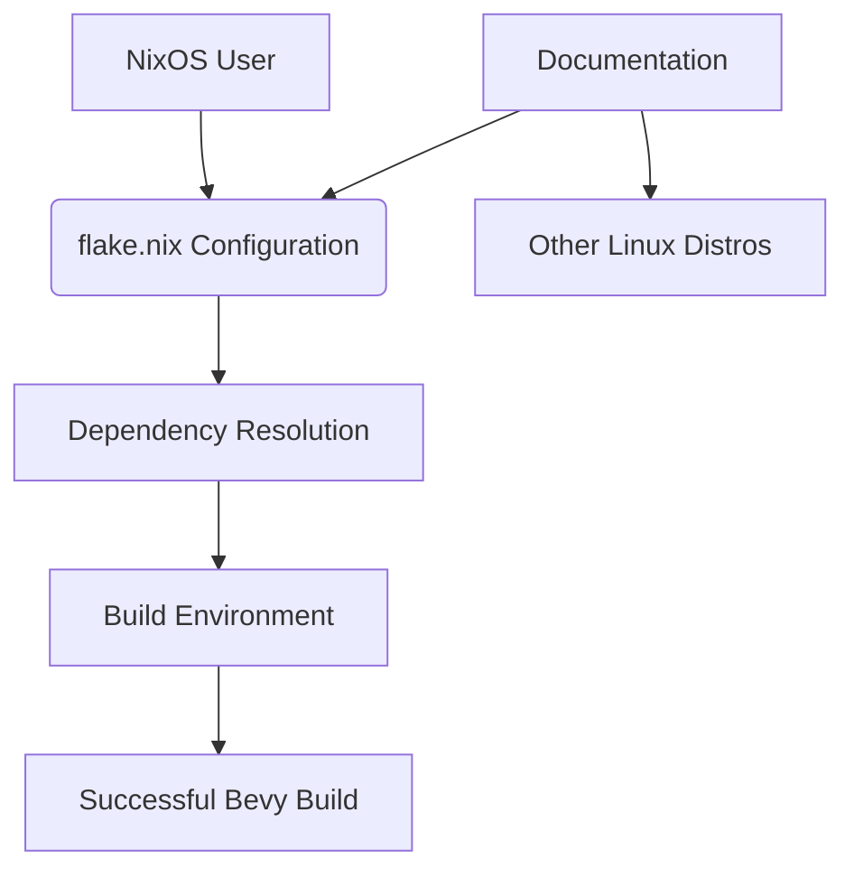

+++
title = "#19321 Update add flake.nix example"
date = "2025-06-08T00:00:00"
draft = false
template = "pull_request_page.html"
in_search_index = false

[extra]
current_language = "zh-cn"
available_languages = {"en" = { name = "English", url = "/pull_request/bevy/2025-06/pr-19321-en-20250608" }, "zh-cn" = { name = "中文", url = "/pull_request/bevy/2025-06/pr-19321-zh-cn-20250608" }}
labels = ["C-Docs", "O-Linux"]
+++

# Update add flake.nix example

## Basic Information
- **Title**: Update add flake.nix example
- **PR Link**: https://github.com/bevyengine/bevy/pull/19321
- **Author**: Myxogastria0808
- **Status**: MERGED
- **Labels**: C-Docs, O-Linux, S-Ready-For-Final-Review
- **Created**: 2025-05-21T13:44:40Z
- **Merged**: 2025-06-08T02:33:15Z
- **Merged By**: alice-i-cecile

## Description Translation
### 目标

我无法在 NixOS 环境下构建使用 Bevy 的项目，因此需要创建 flake.nix 文件。

### 解决方案

我在 `linux_dependencies.md` 中添加了 flake.nix 示例。

### 测试

我在使用 Bevy 的项目中检查了 NixOS 环境，并成功启动了项目的游戏。

---

### 展示

<details>
  <summary>点击查看展示</summary>

1. 创建使用 Bevy 的 GitHub 项目。
2. 添加 flake.nix 文件。
3. 提交该文件到 GitHub 仓库。
4. 运行 `nix develop`

</details>

## The Story of This Pull Request

### 问题背景
NixOS 用户在使用 Bevy 引擎时遇到构建问题。由于 NixOS 独特的包管理机制，标准 Linux 依赖安装方法无效。开发者需要专门配置 flake.nix 文件来定义开发环境依赖，但官方文档缺少相关示例。这导致 NixOS 用户必须自行摸索解决方案，增加了使用门槛。

### 解决方案设计
作者采用直接文档增强方案：在现有 Linux 依赖文档中添加完整的 flake.nix 配置示例。此方案选择基于：
1. 最小侵入性：仅修改文档不影响代码库
2. 即时价值：提供开箱即用的配置
3. 可维护性：集中放置同类系统文档

配置设计考虑关键因素：
- 支持多系统架构（包括 macOS）
- 包含 Vulkan 图形依赖
- 设置必要的环境变量（RUST_SRC_PATH, LD_LIBRARY_PATH）
- 明确区分 Linux 专属依赖

### 实现细节
核心实现是添加完整 flake.nix 配置块到文档中。配置包含：
- Rust 工具链定义
- 跨平台基础依赖
- Linux 专属音频/图形依赖
- 环境变量预设

```nix
devShells.default =
  with pkgs;
  mkShell {
    buildInputs =
      [
        (rust-bin.stable.latest.default.override { extensions = [ "rust-src" ]; })
        pkg-config
      ]
      ++ lib.optionals (lib.strings.hasInfix "linux" system) [
        alsa-lib
        vulkan-loader
        vulkan-tools
        libudev-zero
        xorg.libX11
        xorg.libXcursor
        xorg.libXi
        xorg.libXrandr
        libxkbcommon
      ];
    RUST_SRC_PATH = "${pkgs.rust.packages.stable.rustPlatform.rustLibSrc}";
    LD_LIBRARY_PATH = lib.makeLibraryPath [
      vulkan-loader
      xorg.libX11
      xorg.libXi
      xorg.libXcursor
      libxkbcommon
    ];
  };
```

关键工程决策：
1. 使用 `lib.optionals` 条件引入 Linux 专属依赖
2. 显式设置 `LD_LIBRARY_PATH` 解决运行时链接问题
3. 包含 `vulkan-tools` 辅助调试
4. 指定 `rust-src` 组件支持 Rust Analyzer

### 文档优化
除核心配置外，PR 还包含配套改进：
- 添加使用提示（确认支持 NixOS/macOS 和 Rust 2021）
- 修复失效的示例链接
- 统一列表标记格式（`-` 替代 `*`）
- 为发行版名称添加官方链接

```markdown
## [Arch](https://archlinux.org/) / [Manjaro](https://manjaro.org/)
## [Void](https://voidlinux.org/)
## [Gentoo](https://www.gentoo.org/)
```

### 验证与影响
作者在 NixOS 环境实测验证：
1. 创建含 flake.nix 的 Bevy 项目
2. 执行 `nix develop` 进入开发环境
3. 成功编译并运行 Bevy 应用

该方案直接解决 NixOS 用户的构建障碍，同时为其他 Nix 用户提供参考模板。文档改进使 Linux 依赖说明更完整一致，提升跨发行版用户体验。

## Visual Representation



## Key Files Changed

### `docs/linux_dependencies.md`
添加完整的 flake.nix 配置示例，修复链接，统一格式

```markdown
## [Nix](https://nixos.org)

### flake.nix

Add a `flake.nix` file to the root of your GitHub repository containing:

```nix
{
  description = "bevy flake";
  ...
  outputs =
    ...
    {
        devShells.default =
          with pkgs;
          mkShell {
            buildInputs =
              [
                (rust-bin.stable.latest.default.override { extensions = [ "rust-src" ]; })
                pkg-config
              ]
              ++ lib.optionals (lib.strings.hasInfix "linux" system) [
                alsa-lib
                vulkan-loader
                ...
              ];
            RUST_SRC_PATH = "...";
            LD_LIBRARY_PATH = ...;
          };
    };
}
```

> [!TIP]
> We have confirmed that this flake.nix can be used successfully on NixOS and MacOS...

### shell.nix

Add a `shell.nix` file to the root of the project containing:

...

### Other improvements:

- Fixed link:  
  [Here](https://github.com/NixOS/nixpkgs/blob/master/pkgs/by-name/ju/jumpy/package.nix)
- Standardized list format:
  - If you're running a nvidia GPU...
  - Otherwise...
```

## Further Reading
1. [Nix Flakes Official Documentation](https://nixos.org/manual/nix/unstable/command-ref/new-cli/nix3-flake.html)
2. [Bevy on NixOS Community Discussion](https://github.com/bevyengine/bevy/discussions/11462)
3. [NixGL for Non-NixOS Systems](https://github.com/nix-community/nixGL)